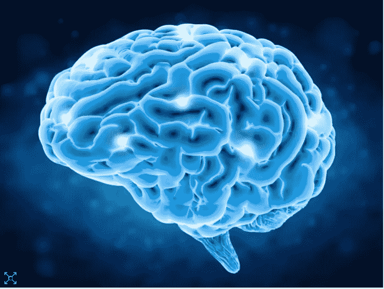

# 神经网络中逻辑门的实现及异或的一种解决方案

> 原文：<https://medium.com/analytics-vidhya/implementing-logic-gates-in-neural-nets-and-a-solution-for-xor-ebf68cf8109b?source=collection_archive---------18----------------------->

大脑是所有神经网络的基础

近年来，神经网络已经成为科技领域最强大的机器学习技术(和过度使用的流行词汇)之一。在这篇文章中，我将给初学者一个简单易懂的概述，介绍神经网络是如何工作的，以及如何用它们来解决一个简单而基本的问题:表示逻辑门。这篇博文基于《神经网络和学习…