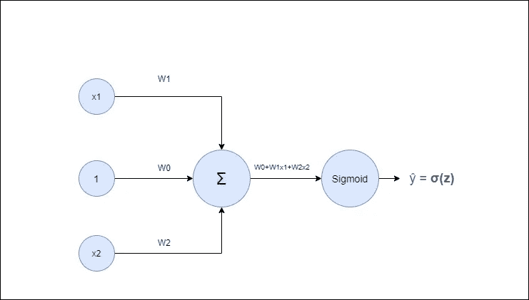
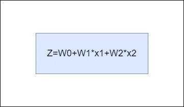
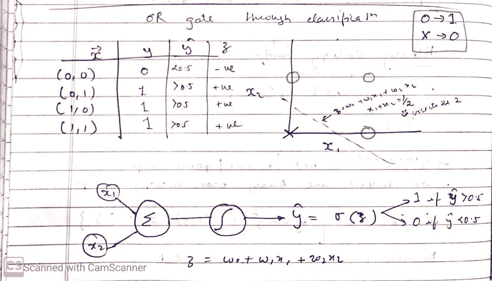
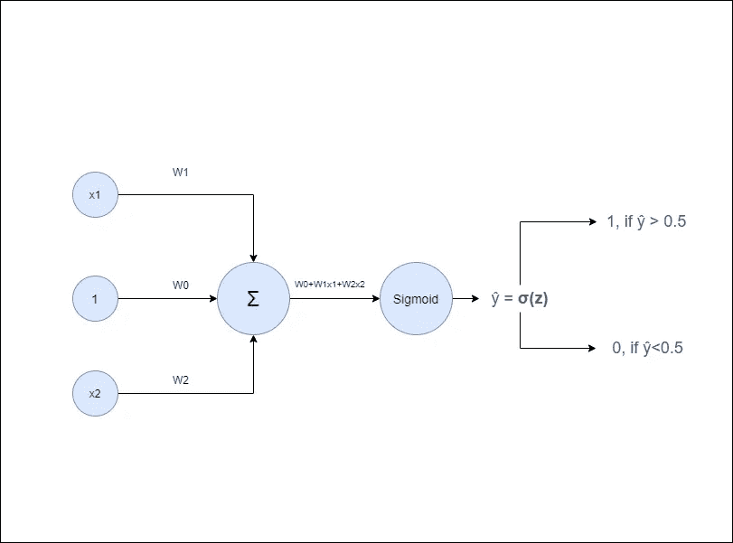
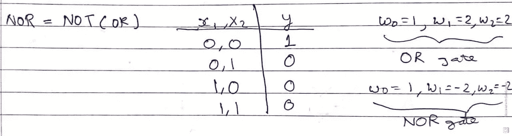

# 用神经网络实现逻辑门(上)

> 原文：<https://medium.com/analytics-vidhya/implementing-logic-gates-using-neural-networks-part-1-f8c0d3c48332?source=collection_archive---------1----------------------->

## 或和或非门

今天，我将讨论神经网络的应用以及如何将它们用作逻辑门。逻辑门是我们进行任何复杂计算的基础，从加法到减法，再到积分，甚至是求导。“或”、“或非”、“与”、“与非”和“异或”等逻辑门非常普遍，我们中的许多人在生活中的某个时候都遇到过它们各自的真值表。

# 从神经网络开始

**神经网络**

上图是一个简单的神经网络。这里，我们有 2 个输入神经元或值为 x1 和 x2 的 x 向量。值为 1 的输入神经元用于偏置权重。输入值，即 x1、x2 和 1，分别乘以它们各自的权重矩阵 W1、W2 和 W0。相应的值然后被馈送到求和神经元，在那里我们得到求和值，即

**供给乙状结肠神经元**

如此获得的值被馈送到神经元，该神经元具有非线性函数(在我们的情况下为 sigmoid ),用于将输出缩放到期望的范围。如果输出小于 0.5，则 sigmoid 的输出范围为 0，如果输出大于 0.5，则为 1。

# 实现或门

或门的真值表如下

**或门实现**

左边的表格描绘了 OR 门的真值表。对于给定的两个输入，如果任一输入为 1，则输出或 ***y*** 为 1。右图显示了所有四对输入(即(0，0)、(0，1)、(1，0)和(1，1))的绘图。下面的网络是作为或门的神经网络的实现。

sigmoid 方程的输入是 Z。现在，如果 Z 的值小于 0，则输出将小于 0.5，因此将被归类为 0。如果输入的值大于 0，则输出将大于 0.5，因此将被归类为 1。所有这些归结为一个问题，即给定输入向量 x，权重向量的值应该是多少才能完成这个任务？

来源:维基百科，**乙状结肠函数**

# (0，0)案例

考虑输入或 x 向量为(0，0)的情况。在这种情况下，Z 的值就是 W0。现在，W0 必须小于 0，这样输出或ŷ为 0，或门的定义成立。因此，我们可以说，对于分辨率，W0 必须是负值。

# (0，1)案例

现在，考虑输入或 x 向量为(0，1)的情况。这里 Z 的值将是 W0+0+W2*1。这是 sigmoid 函数的输入，应该具有大于 0 的值，使得输出大于 0.5 并被分类为 1。从今以后，W0+W2>0。如果我们将 W0 的值取为-1(记住 W0 的值必须为负),将 W2 的值取为+2，则结果为-1+2，即 1，这似乎满足上述不等式。

# (1，0)案例

类似地，对于(1，0)的情况，W0 的值将是-1，W1 的值可以是+2。

# 最后一个音符

因此，分隔上述四点的直线是一个等式 W0+W1*x1+W2*x2=0，其中 W0 是-1，W1 和 W2 都是+2。因此，四点分隔线的方程式为 x1+x2=1/2。因此，或非门的实现将类似于将权重改变为 W0 等于 1，以及 W1 和 W2 等于-2。

**或非门实现**

即将到来的博客将遵循其余逻辑门(与、与非和异或)的实现。