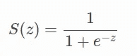
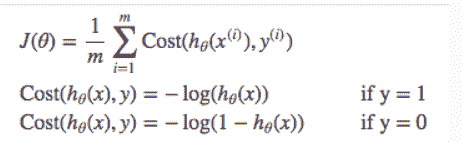
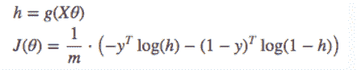
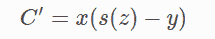
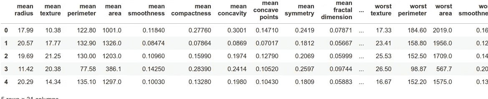
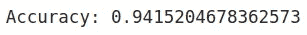

# 使用 Python 从头开始实现逻辑回归

> 原文：<https://medium.com/analytics-vidhya/implementing-logistic-regression-from-scratch-using-python-d684f116334f?source=collection_archive---------9----------------------->


在这篇博客中，我们将重点关注从零开始实现逻辑回归。我们不会深究其背后的数学，而是专注于自己编写代码和实现模型的过程。

顾名思义，逻辑回归是一种分类算法，即它用于分类任务。出于这个博客的目的，我们将只考虑二元分类。

为了将每个预测分配到一个类别，我们需要将预测转换为概率(即在 0，1 之间)。为了实现这一点，我们将使用 sigmoid 函数，它将每个实数值映射到 0 和 1 之间的另一个值。



Sigmoid 函数

# 价值函数

我们不能使用均方误差，因为它将导致非凸函数(由于 sigmoid 函数引起的非线性),从而导致具有许多局部最小值的函数，这将使得难以找到最优的全局最小值

相反，我们使用一个叫做交叉熵的成本函数，也就是对数损失



我们可以把它合并成一个单一的矢量方程



其中，如果 y=1，则仅保留第一部分，而对于 y=0，则保留第二部分

找到上述函数的梯度将导致以下成本函数导数



其中 s(z)是模型预测，x 是特征向量(模型的输入), y 是实际类别标签

一个观察点是成本函数的梯度与使用均方误差的线性回归的梯度相同(即线性和逻辑回归对于它们的权重具有相同的更新规则。)

# Python 实现

现在，我们已经有了足够的知识来开始构建模型架构。

对于训练和测试，我们将使用来自 sklearn 的乳腺癌数据集，其中我们必须发现给定的特征指示肿瘤是恶性的还是良性的

```
#importing all the libraries required
import sklearn.datasets
import numpy as np
import pandas as pd
from sklearn.model_selection import train_test_split
from sklearn.preprocessing import MinMaxScalercancer=sklearn.datasets.load_breast_cancer()#convering the data to a pandas dataframe object
data = pd.DataFrame(cancer.data, columns = cancer.feature_names)
data["label"] = cancer.target
data.head()
```



接下来，我们将分离要素和标注，使用最小最大归一化对要素进行归一化，然后将数据集分为训练集和测试集

```
X=data.iloc[:,:-1] #all rows, all columns except the last
y=data.iloc[:,-1] # all rows, only the last columnX=MinMaxScaler().fit_transform(X)
X_train, X_test, Y_train, Y_test = train_test_split(X,y, test_size = 0.30, random_state = 1)
```

现在，我们将从头开始构建主函数。(类似于 sklearn 使用的 fit 函数)

```
def sigmoid(x):
 return 1/(1+np.exp(-x))
```

sigmoid 函数是不言自明的，它接受一个值(在我们的例子中是一个 numpy 数组),并对它应用 sigmoid 函数。

```
def logistic_regression(features,target,epoch,lr):

    weights=np.zeros(features.shape[1]) 
    #features.shape[1]=number of columns

    for i in range(epoch):
        scores=np.dot(features,weights)
        predictions=sigmoid(scores)

        gradient=np.dot(features.T,(predictions-target))
        weights-=lr*gradient

    return weights
```

这个函数的目标是计算每个特征(列)的权重。我们传递我们的训练特征、训练标签(目标)、时期数以及用于在每个时期更新权重的学习率。

我们用 0 初始化我们的权重，然后在每个时期，使用权重矩阵，计算分数(训练数据与权重的点积),并将其传递到我们的 sigmoid 函数中，以生成我们的预测。

接下来，我们计算梯度(使用前面描述的公式)，并使用它来更新我们的权重。

```
weights = logistic_regression(X_train, Y_train,
                     epoch = 10000, lr = 0.1)
```

现在，我们已经使用训练数据计算了每个特征的权重。视结果而定，可以更改周期数和学习率的值。

使用这些权重，我们将计算测试数据的预测，并检查预测的准确性。

```
test_scores=np.dot(X_test,weights)
preds=np.round(sigmoid(test_scores)) #convert score to 0 or 1from sklearn.metrics import accuracy_score
print("Accuracy: "+str(accuracy_score(preds, Y_test)))
```



因此，使用我们的逻辑回归实现，我们在这个数据集上获得了 94%的准确率。