# 在 Avocado 数据集上实现机器学习

> 原文：<https://medium.com/analytics-vidhya/implementing-machine-learning-on-avocado-data-set-7217943cd7fd?source=collection_archive---------4----------------------->

图一

这些数据于 2018 年 5 月从 Hass Avocado Board 网站下载，并编译成一个 CSV 文件。以下是哈斯鳄梨委员会在其网站上对数据的描述:

下表显示了 2018 年全国零售量(单位)和价格的每周零售扫描数据。零售扫描数据直接来自零售商的收银机，基于哈斯鳄梨的实际零售销售。从 2013 年开始，下表反映了一个扩展的多渠道零售数据集。多渠道报告包括以下渠道的集合:杂货、大众、俱乐部、毒品、美元和军事。表中(鳄梨)的平均价格反映了单位(每个鳄梨)成本，即使当多个单位(鳄梨)袋装销售时也是如此。表中的产品查找代码(PLU 的)仅适用于哈斯鳄梨。其他品种的鳄梨(如青皮)不包括在此表中。

鳄梨，一种可能起源于墨西哥中南部的树，被归类为樟科开花植物的一员。这种植物的果实，也被称为鳄梨，在植物学上是一种包含一个大种子的大浆果。

> **您可以从这个** [**链接**](https://github.com/MayankkYogi/Avocado) 下载数据集和代码

**工作流程:**

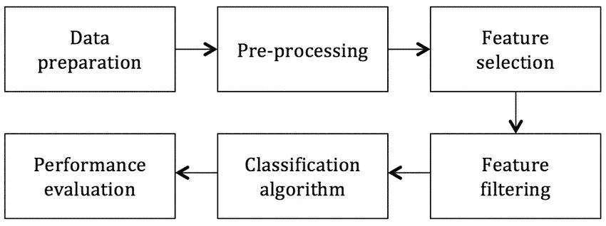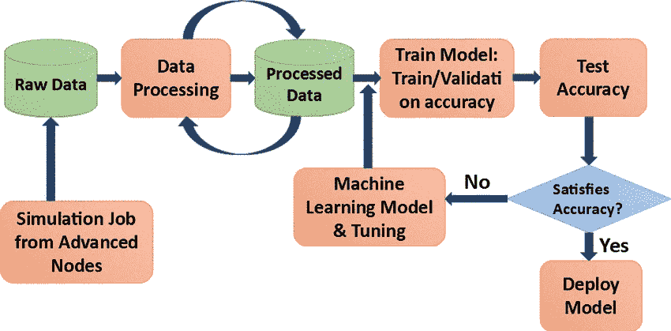

**灵感/标签**

数据集可以从两个角度看，找到城市或地区，找到均价。所以，我会用两种方法来预测这个数据集。

**字段/列:**

*   日期—观察的日期
*   平均价格——一个鳄梨的平均价格
*   类型—常规或有机
*   年份—年份
*   区域-观察的城市或区域
*   总量—售出的鳄梨总数
*   4046 —出售的 PLU 4046 鳄梨总数
*   4225 —出售的 PLU 4225 鳄梨总数
*   4770 —出售的 PLU 4770 鳄梨总数

**问题描述:**

目标是预测不同类型鳄梨的连续平均价格，并使用它们所在的区域。

**导入库:**

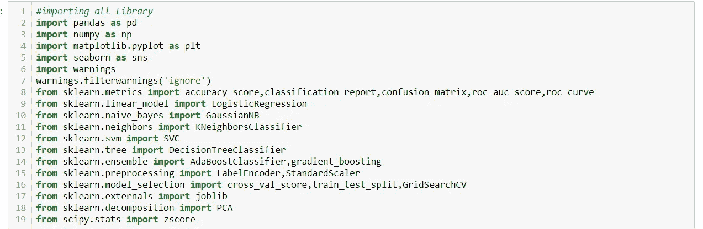

图一

我正在导入我需要的 EDA，可视化，预测和寻找所有矩阵的所有库。这样做的原因是一次性使用所有的导入语句变得更容易，并且我们不需要在每个点再次导入语句。我们可以在一个地方找到所有的导入语句，而不用在整个笔记本上找到，并且还可以更新。

**将数据集加载到变量:**

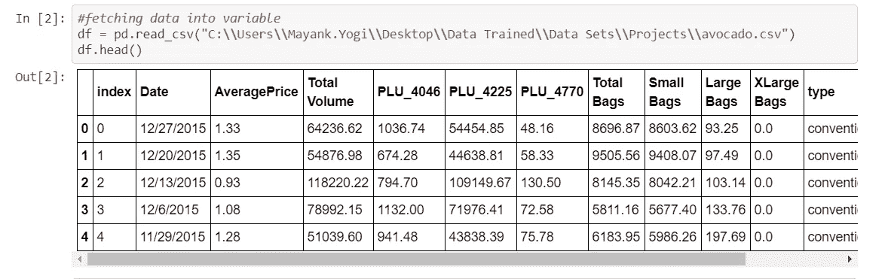

图一

在这里，我将数据集加载到一个变量中，即“df ”,并处理前 5 行。因为在这个数据集中，大多数列在性质上是浮动的，并且类型和性别是分类值。

**探索性数据分析:**

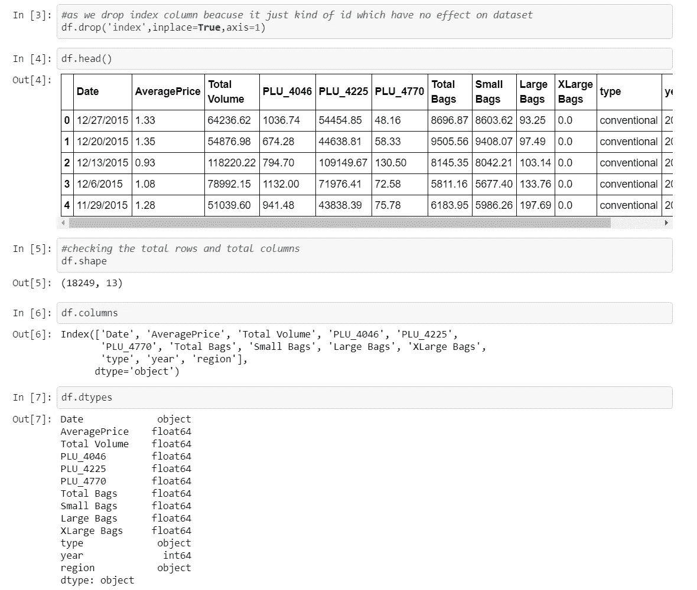

图 4

正如在数据集中看到的，有一个索引列在预测鳄梨价格时没有起到任何重要作用，所以我删除了该列。

此外，我正在检查数据集的形状，因为在删除索引列后有 18249 行和 13 列。

此外，大多数列都是相同的数据类型，即 float，而 Date、type 和 region 是 object 数据类型。

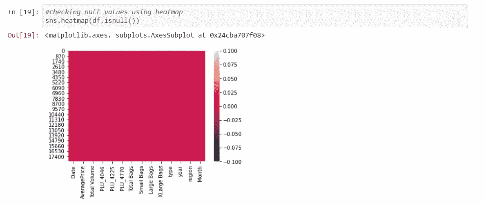

图 5

上面我检查了空值，因为发现数据集中没有空值，因为红色平均分布在每一列。

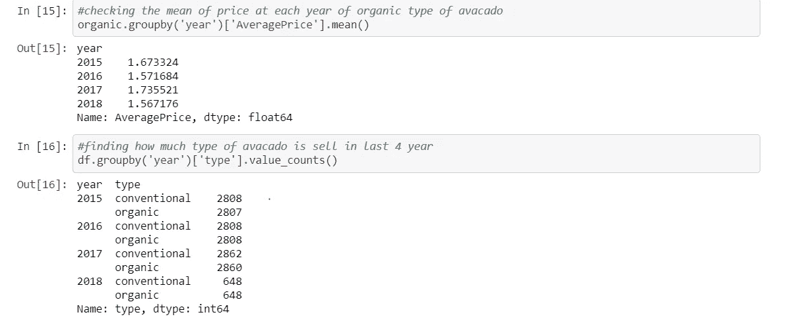

图 6

在上文中，我发现 2017 年是牛油果价格较其他年份更高的积极年份，2015 年位居第二。

此外，我发现在数据集中出现的每一年，哪种类型的鳄梨有总计数，所以两种类型的鳄梨在数据集中出现的数量几乎相同。

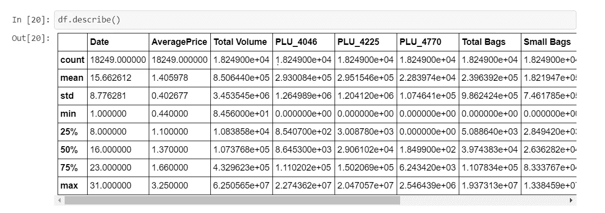

图 7

上述统计数据显示，他们的多个异常值大多在 XLargeBags 中，在一些用于更好预测的列中，平均值和 50%值之间也有差异

*   此外，每列中的行数相同，这意味着数据集中没有空值。
*   此外，大多数列的平均值和 50%值是相同的，标准差和平均值彼此非常接近。
*   大多数列统计数据接近 0 值。
*   通过检查 75%和最大值之间的差异，在一些列中有异常值，我将很快检查它。

**数据可视化:**

在这一部分中，我们可以使用不同的列绘制不同的图形，并尝试使用 matplotlib 和 seaborn 库来可视化数据。

我们使用不同的图表包括:

*   条形图
*   计数图
*   线形图
*   直方图和配对图

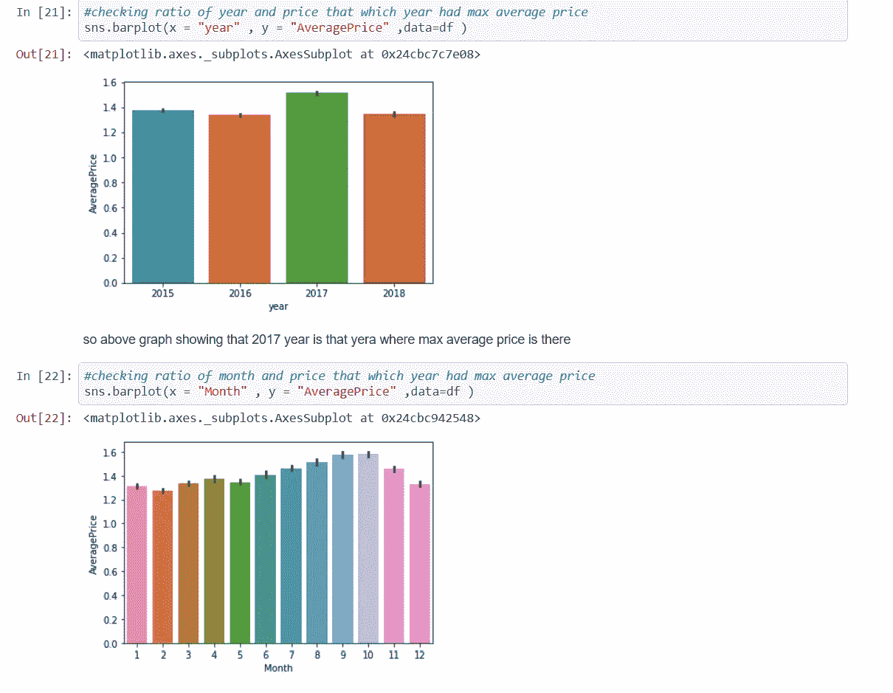

图 8

从上面我们了解到:

*   与其他年份相比，2017 年是价格最高一年，而其他年份之间的差异较小。
*   9 月和 10 月是平均价格最高的月份，但事实是，鳄梨的价格几乎全年都是一样的，这证明了鳄梨比印度更受欢迎。

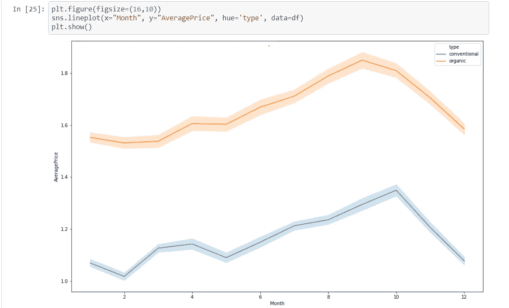

从上图可以看出:

*   传统型和有机型鳄梨在第 8-10 个月之间都有涨价。
*   此外，传统类型的鳄梨在价格方面是变化的，如线图所示，因为开始时价格很高，但随后价格下降，等等。

**绘制直方图:**

*   一个**直方图**在垂直轴上显示频率，水平轴是另一维度。通常它有多个箱，每个箱都有一个最小值和最大值。每个仓也具有在 x 和无穷大之间的频率
*   因此，在这种情况下，我们还可以检查图形是右斜、左斜还是正态分布图形

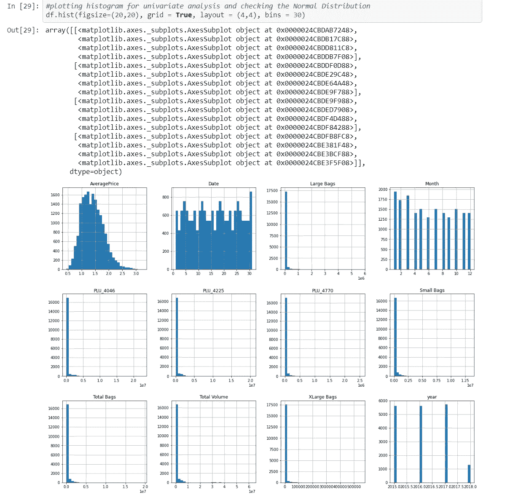

图 9

从绘制这个直方图，我使用的 bin 大小为 30，我们可以采取任何 bin 大小(适合每个 as 数据)。

*   平均价格柱通常分布在直方图上。
*   其余的数据在数量上变化不大，所以它们几乎是左偏数据
*   要使列呈正态分布，我们可以使用不同的方法，但是我使用 numPy log 来使偏斜值呈正态分布。

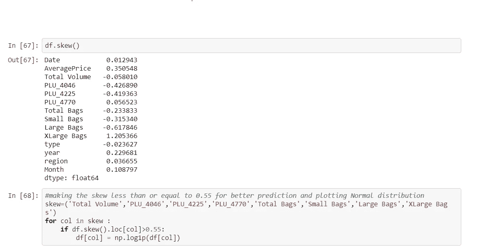

图 10

在上图中，我们首先计算倾斜值，一些列倾斜值远不为零。

*   正态分布的最佳偏斜值非常接近零，因此我们使用“log1p”方法使偏斜值接近零
*   在最后一个单元格中，我再次检查偏斜度值，第一个偏斜度值和第二个偏斜度值之间存在差异，现在每列的偏斜度值都接近于零。

注意:使偏斜值接近零将有助于获得更好的分数。

**标签编码:**

Sklearn 提供了一个非常有效的工具，用于**将分类特征的级别编码为数值。**标签编码器用 0 和 n_classes-1 之间的值对标签**进行编码，其中 n 是不同**标签**的数量。如果一个**标签**重复，它将分配与先前分配相同的值**

使用编码器将区域和类型转换成数值。

**异常值:**

**异常值**是数据集中远离所有其他观察值的数据点。位于数据集总体分布之外的数据点。

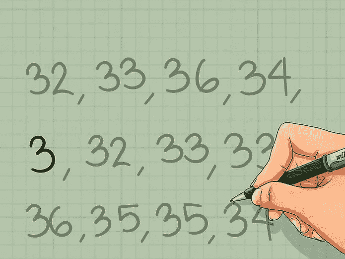

图 11

让我们通过上图中的例子来理解，我们可以清楚地看到，数列中的数字 3 与数列的本质相去甚远，所以这里的“3”是一个异常值。

现在我们知道异常值可能是一个错误或者仅仅是一个方差，你将如何决定它们是否重要。很简单，如果它们是错误的结果，那么我们可以忽略它们，但是如果它只是数据中的差异，我们就需要想得更远一些。

对于鳄梨问题，首先检查每一列的异常值。

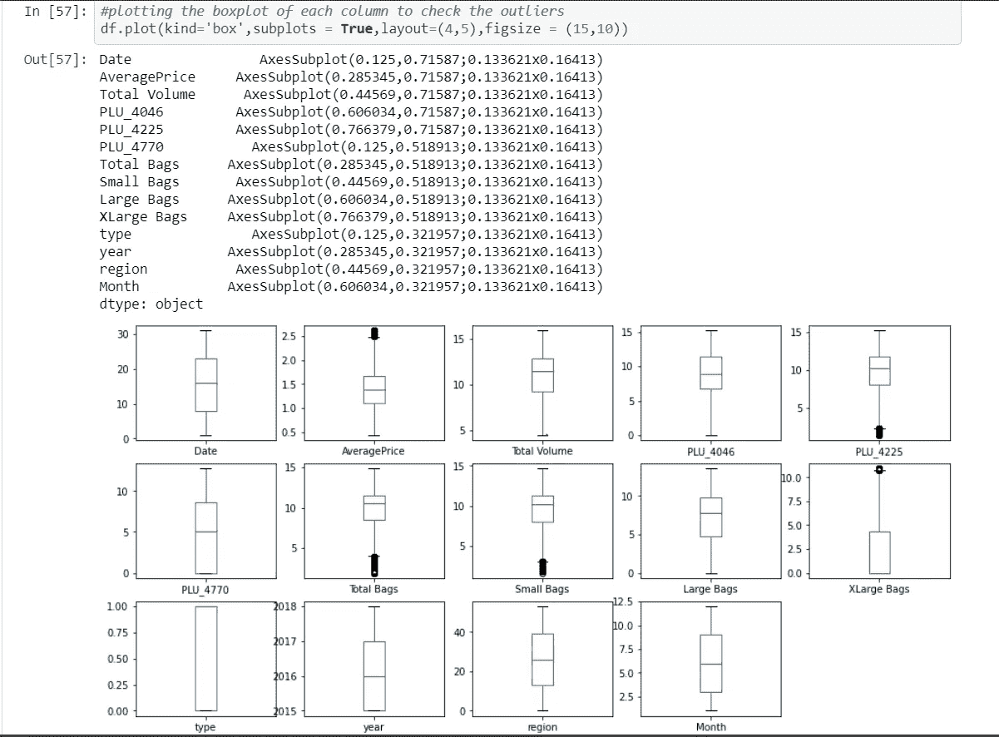

图 12

从上面的图像中，我们可以清楚地看到，在大部分列中有一些黑点是指异常值，所以这意味着大部分数据在分布之外。

现在我们检测异常值，第二步是去除异常值，有不同的方法可以去除异常值，即找到 IQR、zscore 值。

我使用两个 zscore 值，然后我再次检查是否有一些异常值，然后我将通过用该列的平均值替换异常值来删除它。

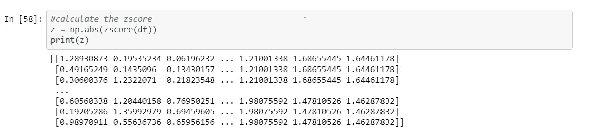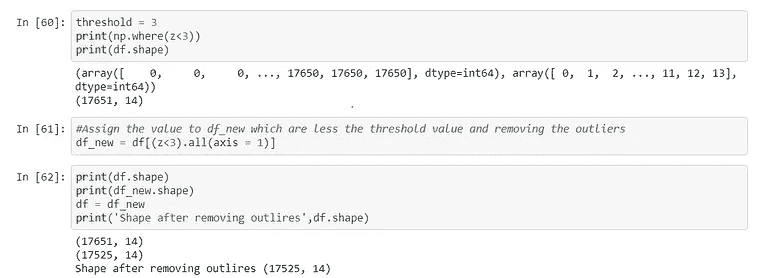

图 13

因此，我首先找到 zscore 值，然后我决定将一个阈值设为 3，这是行业推荐值的标准，然后我移除所有 zscore 值大于 3 的异常值。

在去除异常值后，最终有 17525 和 14 列出现在数据集中。

**相关矩阵:**

**相关性**矩阵基本上是一个协方差矩阵。一个被称为**相关性**的综合指标描述了线性关联的强度。**相关性**总结了两个定量变量之间线性(直线)关联的强度和方向。用 r 表示，它取-1 到+1 之间的值。

现在，我正在查找每列的相关值，该值主要分为两部分:

-正相关值

-负相关值

最大值为正意味着列非常相关，反之亦然。

我使用 seaborn heatmap 绘制相关矩阵，并在 heatmap 图中绘制 corr 值

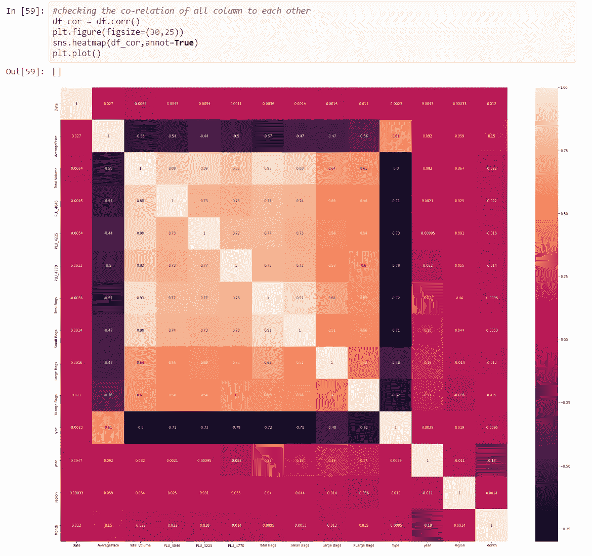

图 14

**下降和标准定标器:**

这里我制作了两个变量 x 和 y，其中 x 包含除平均价格和日期之外的所有列，我们也可以删除日期列，但我保留它是为了 EDA 的目的，而 y 只包含环列。

另外，我在 x 变量上使用了标准的缩放方法

**平均价格预测:**

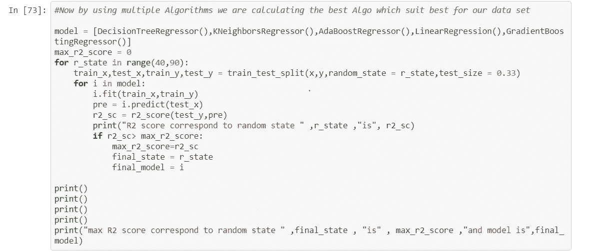

图 15

上面我使用了 for 循环，它帮助我提供每个随机状态的 R2 分数，而 R2 分数最大的最佳状态作为输出值。

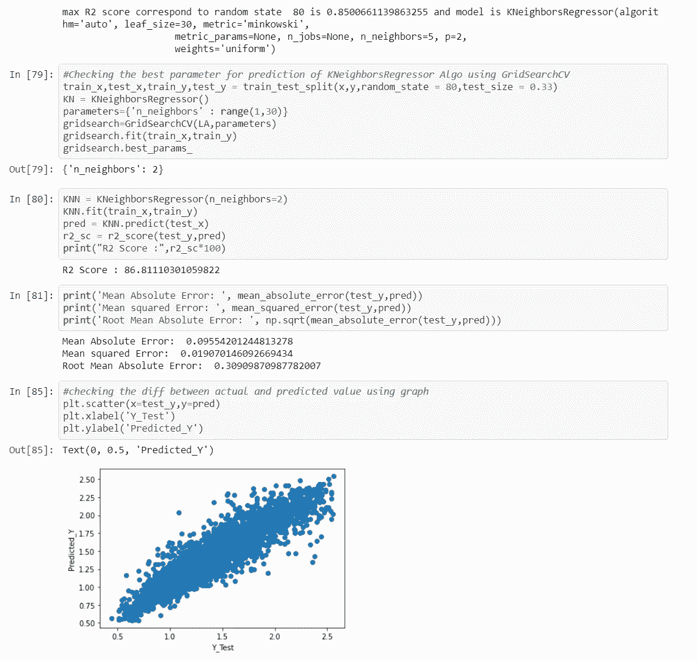

图 16

在预测中:

*   我是通过把平均价格作为一个输出变量来做这个预测的，这个变量在本质上是连续的，所以我使用了回归技术
*   在计算最佳随机状态时，80 是为该模型提供最高 R2 分数值的最佳状态。
*   使用 GridSeachCV 后，我可以找到最佳参数，然后我将这些参数用于该模型。
*   使用最佳参数后，我可以得到最佳的 R2 分数，模型是 KNeighboursRegressor。
*   我找到了以下矩阵，它们提供了最好的分数。
*   我还绘制了散点图，我们可以看到实际值和预测值非常接近，所以这条线是最佳拟合线。

现在，我通过将区域作为 y 值来查找分数，我使用分类方法，因为区域数据本质上是分类的，所以我导入分类模型及其矩阵。

**带区域预测:**

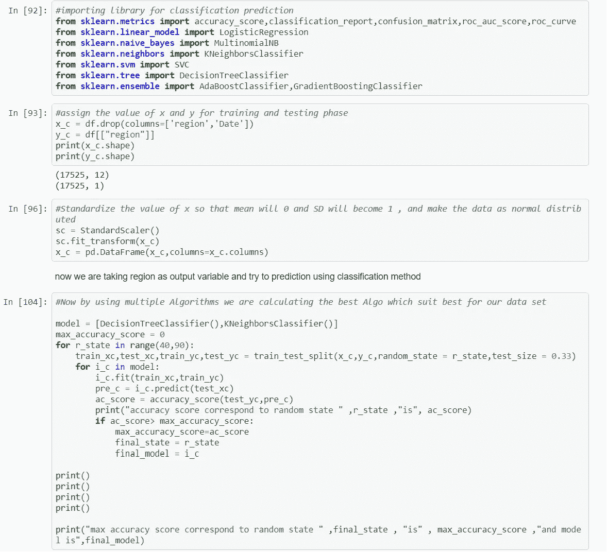

图 17

在这里，我再次进行了标准缩放，并使用相同的 for 循环模型，该模型提供了最佳状态，给出了最佳的准确度分数。

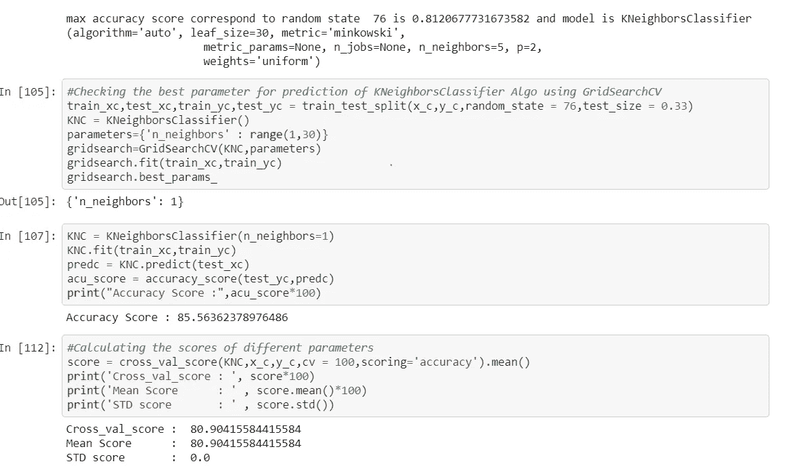

图 18

在预测中:

*   这里，发生的随机状态是 76，这为模型提供了 81%的最佳准确度分数。
*   此外，通过使用 GridSeachCV，我能够找到最佳参数，然后找到 85%的最佳准确度分数

**Roc 曲线:**

预测二元结果的概率时，一个有用的工具是[接收器操作特性曲线](https://en.wikipedia.org/wiki/Receiver_operating_characteristic)，或 ROC 曲线。

它是针对 0.0 和 1.0 之间的多个不同候选阈值的假阳性率(x 轴)与真阳性率(y 轴)的关系图。换句话说，它绘制了虚警率与命中率的关系图。

真阳性率计算为真阳性的数量除以真阳性的数量和假阴性的数量之和。它描述了当实际结果是肯定的时，模型在预测肯定类别方面有多好。

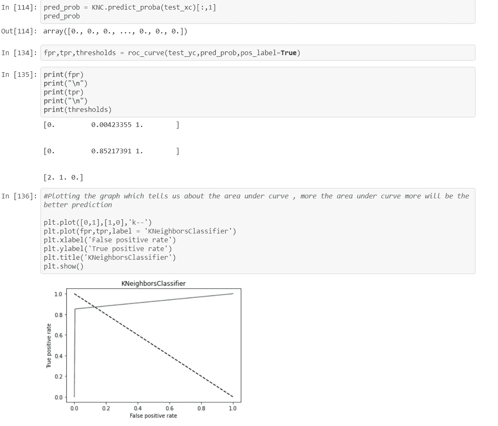

图 19

**观察:**

*   与地区相比，以价格为 y 变量的模型预测效果更好
*   此外，我使用标签编码器将分类数据转换成数字数据，即地区和性别
*   此外，R2 分值也大于准确度分值
*   平均价格、总袋数和总体积在所有其他列中是正态分布数据
*   通过平均值替换后，数据集中没有异常值
*   因为年份是所有列中最负的 co 相关列
*   八月到十月间，鳄梨的价格比其他月份要高得多
*   日期 28、29 和 30 鳄梨的价格很高
*   与其他地区相比，哈特福德斯普林菲尔德、旧金山和纽约的平均价格更高
*   两种类型鳄梨在第 8-10 个月之间都有涨价
*   因为有机鳄梨的单位价格比传统的要高
*   我用地区和价格做了预测，但是用价格预测的分数比地区高
*   所以在这个数据集中，我使用回归和分类技术来制作这个模型