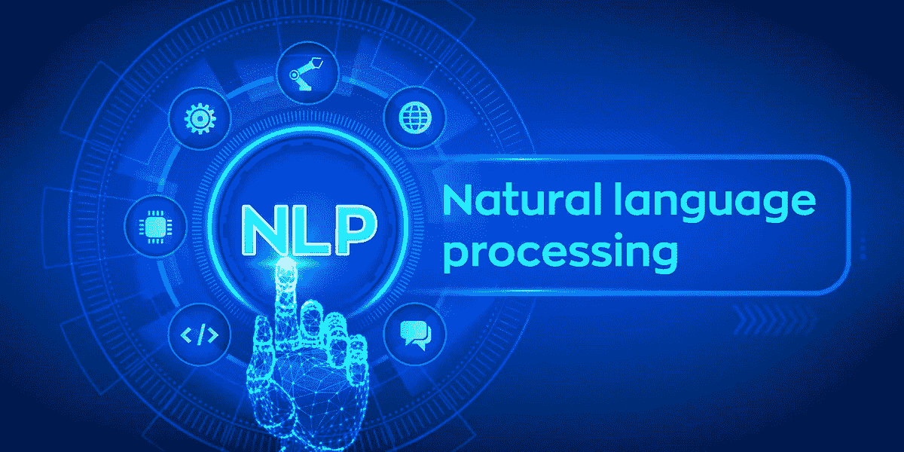
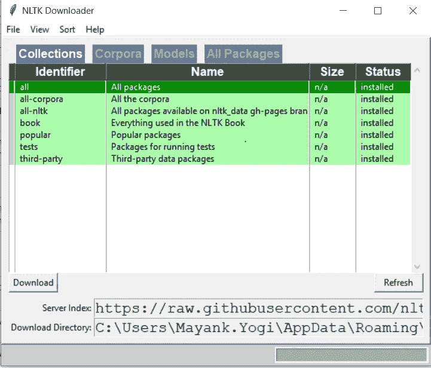
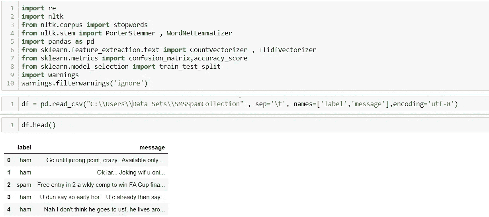
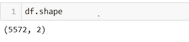
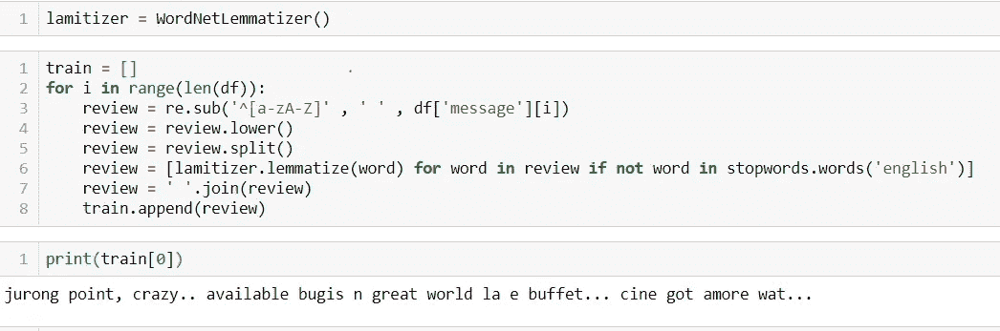
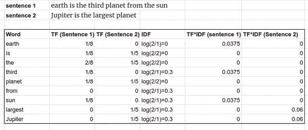
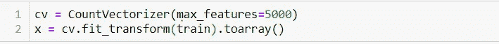
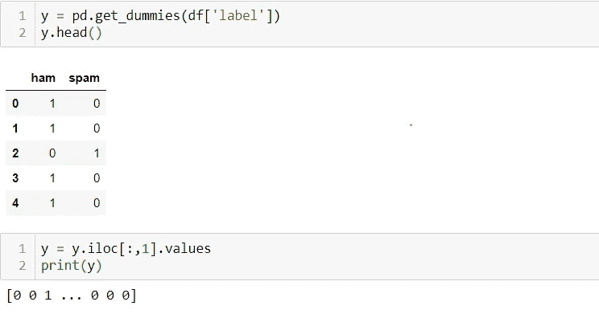
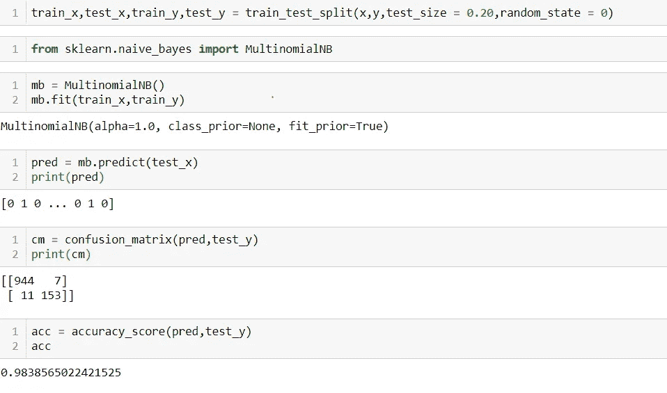

# 在垃圾邮件分类器上实现自然语言处理

> 原文：<https://medium.com/analytics-vidhya/implementing-nlp-on-spam-classifier-8135e2762a6a?source=collection_archive---------24----------------------->

Lifewire 提供的图片

# 什么是垃圾邮件？

垃圾电子邮件也称为垃圾电子邮件，是通过电子邮件批量发送的未经请求的消息。这个名字来自于 Monty Python sketch，其中垃圾邮件无处不在，不可避免，并且重复出现。自 20 世纪 90 年代初以来，垃圾电子邮件一直在稳步增长，到 2014 年，估计占总电子邮件流量的 90%左右

图片由 CanopyLAB 提供

**自然语言处理** ( **NLP** )是语言学、计算机科学、信息工程和人工智能的一个子领域，涉及计算机和人类(自然)语言之间的交互，特别是如何编写计算机程序来处理和分析大量自然语言数据。

> **你可以从这个** [***链接***](https://github.com/MayankkYogi/SpamClassifier) 下载数据集和代码

# 主要字段/列:

因为数据集中没有列，所以我指定了列名，即

*   标签—邮件是垃圾邮件还是 ham(非垃圾邮件)
*   消息—实际的邮件正文

**问题描述:**

在这个模型中，主要任务是通过使用 NLP 和各种其他库来预测邮件是否是垃圾邮件。

**注:**

使用命令 nltk.download()下载所有相应的库

作者图片

上面的弹出窗口将在命令执行后出现，然后选择“全部”列并点击下载按钮，这将下载实现 NLP 所需的所有库

**导入库:**

作者图片

我正在导入所有需要的库。这样做的原因是一次性使用所有的导入语句变得更容易，并且我们不需要在每个点再次导入语句。我们可以在一个地方找到所有的导入语句，而不用在整个笔记本上找到，并且还可以更新。

在这里，我将数据集加载到一个变量中，即“df ”,并处理前 5 行。

在数据集中，我们可以看到有两列标签和消息，其中标签是我们的目标/输出/因变量，消息是输入/自变量

我使用“sep = \t”的原因是第一列和第二列之间存在制表符差异

作者图片

所以在这个数据集中总共有 5572 行和 2 列

作者图片

这里我使用 tf-idf 而不是单词包，因为 TF-IDF 将根据单词的重要性唯一地给每个单词赋值

**什么是 TF-IDF**

在信息检索中，**TF**–**IDF**或 **TFIDF** ，是词频——逆文档频率的缩写，是一种数字统计，旨在反映一个词对集合或语料库中的文档有多重要。

图片由 Quora 提供

让我们通过例子来理解，在上面的图像中有两个句子，即句子 1 和句子 2，然后我们从两个句子中取出每个单词，在上表中制作一个名为“单词”的列。

列“TF(句子 1)”计算该特定单词的总出现次数除以相应句子中的总单词数，对于“TF(句子 2)”也是如此

列 IDF 现在取由下式给出的对数:log(句子的数量/包含单词的句子的数量),因此通过使用该公式，我们可以计算每个单词的 IDF

然后我们可以简单地将 IDF 与特定的句子相乘并得到输出。

在最后 2 列中，我们可以看到一些值是 0，一些是大于 0 的十进制值，因此大于 0 的值被赋予更大的重要性，而具有值 0 的单词意味着这些单词对于预测邮件是否是垃圾邮件是有用的或唯一的

我希望你们现在能理解 tf-idf..

所以我使用 WordNetLemmatizer()库来使用 tf-idf

我将所有多余的标点符号(可能是特殊字符)替换为空格，之后我将所有的句子降级，然后使用停用词删除所有多余的无用词，如“is，a，the，them，for”等，然后应用 tf-idf

作者图片

在这里，我将字符串转换为向量，并将最大特征数取为 5000，这意味着在数据集中有 5572 个特征，因此我只随机取 5000 个特征(您可以指定任何特征)

作者图片

此外，在输出变量中有 2 个类别是垃圾邮件或火腿，所以我把它转换成 1 和 0，为此我使用了 get dummies(你也可以尝试使用标签编码器)

作者图片

现在，我将数据分为训练和测试，对于预测，我使用朴素贝叶斯算法，因为它为文本处理语言提供了最好的结果

最后，为了检查预测分数，我使用了混淆矩阵和准确度分数，结果非常好，准确度达到 98%，大多数值都在 TP 和 TN 之下，这意味着该模型能够将邮件分类为垃圾邮件或 ham。

> **如需进一步查询，您可以在我的**[***LinkedIn***](https://www.linkedin.com/in/mayank-yogi-806ba9156/)上联系我