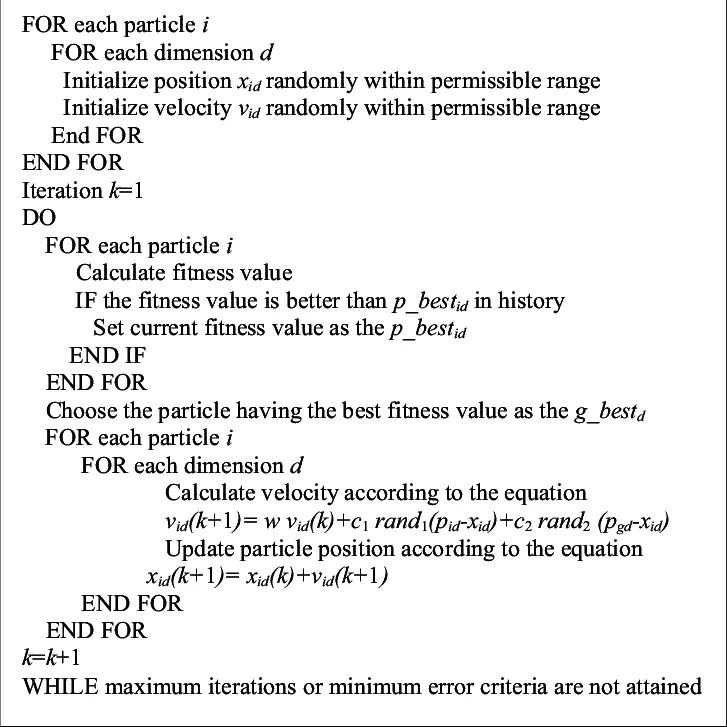
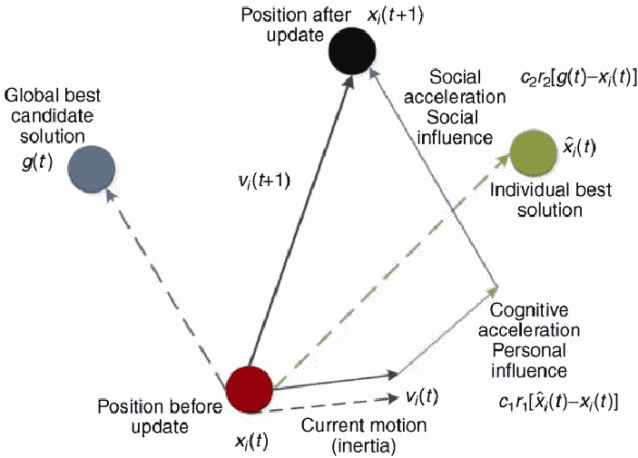
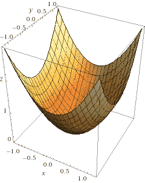
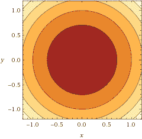
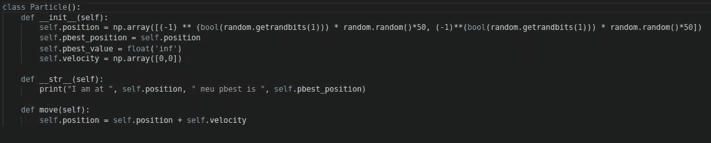
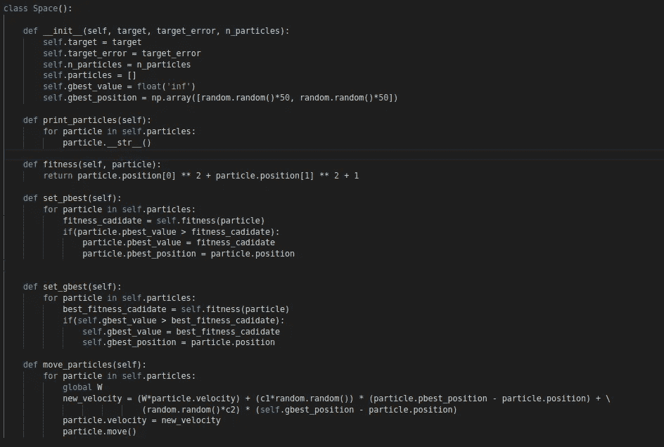
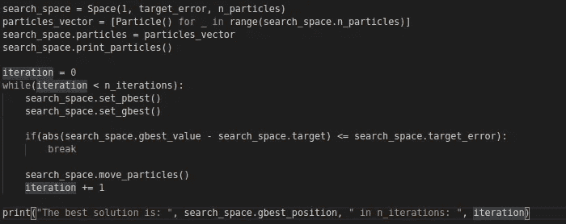
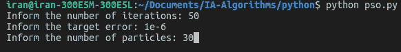

# 用 Python 实现粒子群优化算法

> 原文：<https://medium.com/analytics-vidhya/implementing-particle-swarm-optimization-pso-algorithm-in-python-9efc2eb179a6?source=collection_archive---------0----------------------->


[陈焕昌](https://unsplash.com/@johnnyafrica?utm_source=medium&utm_medium=referral)在 [Unsplash](https://unsplash.com?utm_source=medium&utm_medium=referral) 上拍照

人工智能有很多定义。根据[韦氏词典](https://www.merriam-webster.com/dictionary/artificial%20intelligence)的说法，人工智能是计算机科学的一个大领域，它在计算机中模拟智能行为。基于此，一种基于[元启发式](https://en.wikipedia.org/wiki/Metaheuristic)的算法实现被称为**粒子群优化**(最初是为了模拟鸟类寻找食物、鱼群移动等而提出的。)能够模拟群体的行为，以便迭代地优化数值问题。例如，它可以被分类为像蚁群算法、人工蜂群算法和细菌觅食一样的群体智能算法。

由 J. Kennedy an R.Eberhart 在 1995 年提出的文章“粒子群优化”变得非常流行，因为他的持续优化过程允许多目标和更多的变化。该方法在于不断搜索最佳解，在每次迭代中以计算出的一定速度移动粒子(在这种情况下表示为(x，y)位置)。每个粒子的运动都有他自己的最佳已知位置的影响，也是空间搜索中的最佳已知位置。预期的最终结果是粒子群收敛到最优解。值得一提的是，PSO 不使用梯度下降，所以一旦它不要求问题必须是可微的，它就可以用于非线性问题。

# 算法

让我们观察伪算法:



上传者[加内什·k·维纳亚加莫瑞](https://www.researchgate.net/profile/Ganesh_Venayagamoorthy)

首先，在 2 for 循环中，它在所有维度的允许范围内用随机均匀分布初始化粒子的位置(有些问题需要处理到几个维度)。之后，对于每个粒子，它计算其适应值并与他自己的最佳位置进行比较(p_best 值是该特定粒子曾经的最佳位置)然后它选择 g_best 中所有粒子的最佳位置。

让我们仔细看看定义粒子维度下一次迭代速度的方程:

*   Vᵢ(k+1)是下一个迭代速度
*   w 是惯性参数。此参数影响由最后一个速度值给出的运动传播。
*   C₁和 C₂是加速度系数。C₁价值强调个人最佳价值，C₂强调社会最佳价值。
*   Pᵢ是最佳个人位置，Pg 是所有粒子的最佳位置。在该方程中，测量了这些参数中的每一个到粒子实际位置的距离。
*   rand₁和 rand₂是随机数，其中 0 ≤ rand ≤ 1，它们控制每个值的影响:社会和个人，如下所示。



谷歌图片

之后，计算新粒子的位置，直到指定的迭代次数或达到误差标准。

# 履行

我们的目标是找到某个函数的极小点。在这种情况下，函数是 *f(x，y) = x + y + 1。*因此，该算法将与二维位置数组一起工作，并且适合度值将是 Z 坐标。同样，我们知道我们的目标是找到坐标[0，0]，它是 *f(x，y)的最小值。*

为了用 python 实现该算法，使用了 OOP(在这一点上，它被认为是你知道它的基础)来帮助我们实现和理解代码中的所有步骤。在这里，它使用 numpy 库(查看更多信息[这里](http://www.numpy.org/))来处理数组操作，一旦我们与多维空间合作。



x +y 的 3D 图形(Wolframalpha)



x + y 的等高线图(Wolframalpha)

让我们从粒子课开始。

## 颗粒



粒子类别

当一个粒子自动启动时，我们对 2 个位置进行排序，限制在-50 到+50 的范围内。 **pbest_position** (该粒子的最佳个体位置)以初始位置开始，同样，当我们寻找最小值时， **pbest_value** 以+inf(可以是任何更大的值)开始。它还定义了一个方法 **__str__** ()来打印实际位置和最佳的单个值。 **move** ()方法添加了位置向量和在搜索中计算的尺寸速度，我们将在前面看到。

## 搜索空间

搜索空间是控制算法程序的实体。在该实现中，它负责保持所有粒子，识别和设置所有粒子的个体最佳位置值，管理目标误差标准，计算最佳全局值和设置最佳全局位置。在简历中，它包含了所有主要步骤。



空间状态类

方法 **set_pbset** 和 **set_gbest** 有相似的实现方式。首先，它遍历所有粒子，计算粒子位置的适应值，并与最佳个体位置(在 **set_pbest** 处)和最佳全局位置(在 **set_gbest** 处)进行比较。

方法 move_particles 计算每个维度中每个粒子的新矢量速度，如前所述。

## 主循环



主循环

首先，它启动了一个目标为 1 的搜索空间。该目标代表目标的适应值，这意味着目标是 *f(x，y) = 1* 。然后，该算法将找到 *x* 和 *y* 的哪个值给出等于 1 的结果，如之前在我们想要找到最小值的函数形状处所示。等高线图也告诉我们，我们要找出的值是[0，0]。目标误差和粒子数(n_particles)将由用户设置。然后用一个列表生成器启动所有的粒子，然后开始迭代。

在所有迭代中，首先找到最佳个体位置和最佳全局位置来评估目标误差准则。如果这个标准没有达到最小误差，粒子将计算移动的速度，然后在新的位置停止，直到达到迭代次数或最小误差标准。最后一行只是打印出找到的最佳结果。

查看下面的完整代码

w、C₁和 C₂的值是手动选择的，所以要小心使用，因为它们可能会变得更长。

# 结果

使用 python 解释器，我们输入迭代次数的值、目标误差标准和进入群体的粒子数。



然后，它打印出找到的最佳结果:

```
The best solution is: [ 5.06237850e-04 -1.14851873e-05] in n_iterations: 22
```

这是一个易于实现和使用的算法。希望你们都喜欢！

任何批评，提示或暗示也将受到欢迎:)