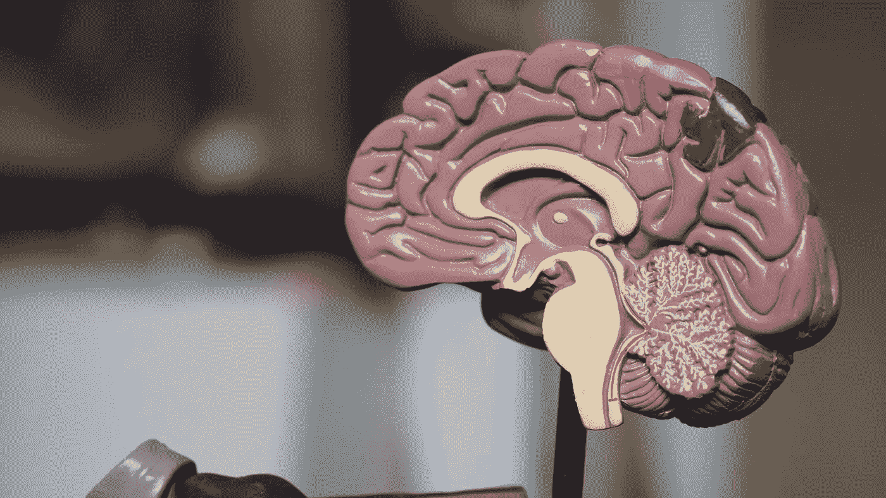

# 用 sklearn 在 Python 中实现 PCA

> 原文：<https://medium.com/analytics-vidhya/implementing-pca-in-python-with-sklearn-4f757fb4429e?source=collection_archive---------1----------------------->

[Robina Weermeijer 拍摄的 Unsplash 图像](https://unsplash.com/photos/3KGF9R_0oHs)

主成分分析(PCA)是一种常用的降维技术，用于具有大量变量的数据集。由于许多机器学习算法遭受维数灾难，在存在许多特征的情况下，PCA 可以是有用的数据处理步骤。

## 主成分分析