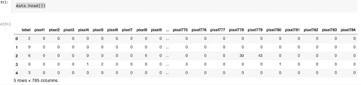
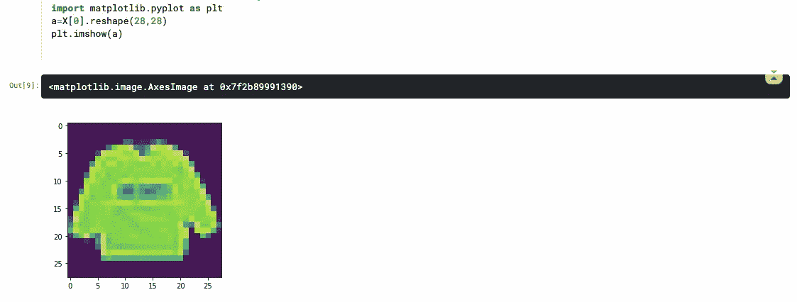
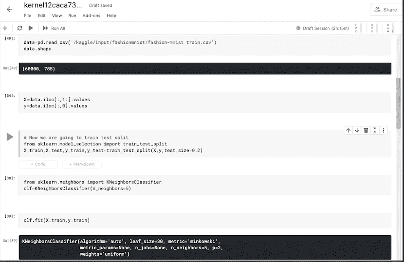
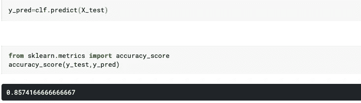
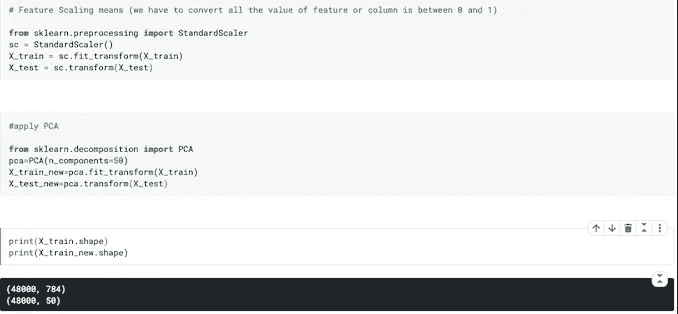
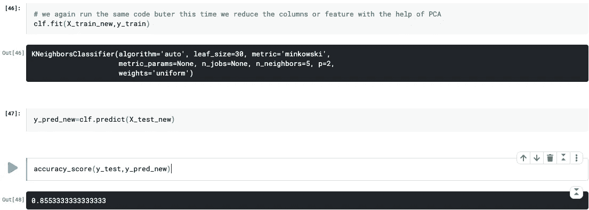

# 使用 Sklearn 实现 PCA。

> 原文：<https://medium.com/analytics-vidhya/implementing-pca-using-sklearn-a88987e5a127?source=collection_archive---------15----------------------->


在这篇文章中，我们尝试使用 sklearn 实现 PCA(主成分分析),并理解 PCA 背后的逻辑。

来自谷歌来源:-

**主成分分析** ( **PCA** )是一种通过抑制变化来显示数据集中强模式的技术。它用于清理数据集，使其易于探索和分析。**主成分分析**的**算法**基于几个数学思想，即:方差和协方差。

******* *第一个问题* **我们要知道我们应该在什么地方使用 PCA，在什么类型的数据集使用 PCA 算法**。所有这些问题都有一个答案，即我们可以在高维数据集中使用 PCA，这意味着我们将在特征或列数非常高的数据集中使用 PCA，如(100 到 1000)列数或更多。

** * *第二个问题* **我们为什么要用 PCA？** 我们将在高维数据中使用 PCA，因为在高维数据中，由于数据的稀疏性，我们基于距离的算法(如 KNN 算法)表现不佳。预测需要更多时间，因为我们有 1000 个列，这需要更多时间和空间**。**

** * *第三个问题***PCA 是如何工作的？** 在 PCA 算法的帮助下我们减少了特征或列的数量。假设在我们的数据集中有 1000 个列，它看起来是这样的，data_old={ c1，c2，c3，c4，c1000 }在主成分分析的帮助下，我们在以前数据的线性组合的基础上创建了一组新的列(即 data_old)。他们选择了能够解释我之前数据的最大方差的列数。 *(这意味着假设有一个名为“年龄”的列，我们看到，仅由于这个“年龄”列，我们的整个数据变化高达 30%到 35%。类似地，由于数据变化 15 %，我们有一些其他列，所以这里我们选择数据中出现最大变化的列)*

现在我们将开始该项目，我们将处理一个图像数据集，其中有 60，000 个图像的数据，每个图像的分辨率为 28*28，即 784 个像素，每个像素位于该特定图像的一列中，因此这里我们的数据形状为(60000，785)，其中有 60000 个图像，每个图像有 784 个像素列+1 个标签列。

我正在写卡格尔笔记本。首先，我们将加载数据:-

```
data=pd.read_csv('/kaggle/input/fashionmnist/fashion-mnist_train.csv')
```

如果你想看数据。
**data.head(5)**



在这里，我们看到第一列标签中有一个类似(2，9，6，0，3……)的数字，这些是我们在数据集中看到的不同布料的标签。这里，我们将该数据训练为 y。这些列 pixel1 到 pixel784 是显示特定图像的 784 个像素的列，其中每列是一个像素。在这个模型中，我们将这个数据训练为 x。

现在是时候从数据集中获取 X 和 y 来训练和测试我们的模型了。其中在 X 中，我们有从索引 1 到 784 的图像像素值。在 y 轴上，我们有一个图像，不管这个图像是衬衫还是裤子，或者是索引为 0 的不同布料的图像。

X=data.iloc[:，1:]。价值观念

y=data.iloc[:，0]。价值观念

在这里，我们将看到我们的数据是怎样的:-
首先，我们导入 matplotlib.pyplot 作为 plt

```
import matplotlib.pyplot as plt
a=X[0].reshape(28,28).   
plt.imshow(a)# Here we grab 1st image from X and reshape into (28,28) because our data is in 28 *28 resolution then we put in plt.imshow(a)
```

结果是这样的



现在我们有了 X 和 y，是时候训练测试分割了，因为我们从 sklearn.model_selection 导入了 **train_test_split**

```
from sklearn.model_selection import train_test_split
X_train,X_test,y_train,y_test=train_test_split(X,y,test_size=0.2)
```

在 train_test_split 之后，现在我们将为此训练我们的模型，我们从 sklearn.neighbors 导入 **KNeighborsClassifier** ，并创建 KNeighborsClassifier 的对象 clf。

```
from sklearn.neighbors import KNeighborsClassifier
clf=KNeighborsClassifier(n_neighbors=5)
```

现在我们将我们的 **X_train** 和 **y_train** 放入 fit 来训练模型

```
clf.fit(X_train,y_train)
```

现在这个时候，我的模型已经训练好了，可以预测了。所以使用 clf 对象的预测函数，我们在其中通过 X_test，结果存储在 y_pred 中。

```
y_pred=clf.predict(X_test)
```

现在是时候测量我们模型的准确性了，因为我们从 sklearn.metrics 导入了 accuracy_score，其中我们通过了 y_test 和 y_pred，其中我们得到了我们模型的预测。

```
from sklearn.metrics import accuracy_score
accuracy_score(y_test,y_pred)
```

现在我们有了大约 85%准确度的准确度分数，但是预测结果需要将近 20 分钟。**现在我们对模型应用 PCA，然后我们看到模型预测模型的和*准确度分数所用的*时间。****

因此，在使用 PCA 之前，我们应该做一件事情，即**特征缩放**，其中我们将把所有训练数据的值转换为 0 到 1 之间的值，之前这些值在 0 到 255 之间。

为此，我们将从 sklearn.preprocessing 包中导入 StandardScaler 类，并创建 standardScaler 类的对象 sc，然后在该对象中传递我们的 X_train 和 X_test。

```
from sklearn.preprocessing import StandardScaler
sc = StandardScaler()
X_train = sc.fit_transform(X_train)
X_test = sc.transform(X_test)
```

这里我们有新的 X_train 和 X_test，其中所有的特征值或列都在 0 和 1 之间。

**现在是应用 PCA 的时候了:-**

为了在我们的模型中应用 pca，我们首先要从 sklearn.decomposition 包中导入 PCA 类，然后创建一个 PCA 类的对象 PCA，在该对象中我们传递 n_components 的值，该值为我们提供了关于您想要使用多少最佳特征或列的信息。

之后，您将创建一个 X_train_new 和 X_test_new，其中我们通过了旧的 X_train 和 X_test。然后，如果我们看到 X_train_new 或 X_test _new，其行数与之前相同，但 X_train_new 和 X_test_new 中的列数等于 n_components(假设 n_components=50，这意味着 PCA 自动选取最佳的 50 列，这**解释了我之前数据的最大方差。(最大方差意味着** *(这意味着假设有一个名为“pixel40”的列，我们看到仅由于这个“pixel-40”列，我们的整个数据变化高达 22%到 23%。类似地，我们有一些其他列，如“pixel60 ”,由于该数据变化 14 %,所以这里我们看到只有这两列可以解释全部数据的 36%。)*

```
from sklearn.decomposition import PCA
pca=PCA(n_components=50) 
X_train_new=pca.fit_transform(X_train)
X_test_new=pca.transform(X_test)
```

如果我们打印出 X_train_new 和 X_train 的形状。你可以理解这里发生了什么

```
print(X_train.shape)
print(X_train_new.shape)(48000, 784)
(48000, 50)
```

如果你认为 PCA 内部发生了什么？那么借助于 explained _ variance _ ratio _ method 就可以看到了。我们在 PCA 对象中使用这个方法

```
pca.explained_variance_ratio_
```

此处输出:-

```
array([0.22056076, 0.14386729, 0.05453896, 0.05120558, 0.04079104,
       0.03015539, 0.02755343, 0.02319117, 0.01699604, 0.01319041,
       0.01164759, 0.00968628, 0.00893679, 0.00855538, 0.00746062,
       0.00730633, 0.00654816, 0.00632012, 0.0062467 , 0.00581158,
       0.00513186, 0.00507826, 0.00472421, 0.00452921, 0.004372  ,
       0.00415789, 0.00397649, 0.00395591, 0.00379696, 0.00374935,
       0.00369472, 0.003553  , 0.00334677, 0.00330491, 0.0032868 ,
       0.00320113, 0.00305559, 0.00293335, 0.00289486, 0.00282557,
       0.00273297, 0.00263301, 0.00255788, 0.00252376, 0.0024603 ,
       0.0024129 , 0.00235778, 0.00226992, 0.0022254 , 0.00216175])
```

在这个数组中，我们看到第一个元素是 0.22056076，这意味着我们的数据集中的任何一列，我们不知道是哪一列，但这个特定的列可以解释整个数据的 22.05 %的方差。如果你同意，那就是 0.14386729，另一栏解释了整个数据的 14.39 %的方差。类似地，这就是为什么我们取 n_components=50，其中我们取前 50 列来解释整个数据的最大方差。

现在我们有了 X_train_new 和 X_test_new，因此为此我们将在 X_train_new 和 y_train 的帮助下训练我们的模型。

```
clf.fit(X_train_new,y_train)
```

现在我们要预测。

```
y_pred_new=clf.predict(X_test_new)
```

现在是时候在应用 PCA 之后测量准确度分数了

```
accuracy_score(y_test,y_pred_new)
```

相信我在我们的模型中应用主成分分析后的预测结果。预测大约需要 45 秒，准确率接近 85%。

所以你意识到在我们的高维数据集中应用主成分分析的重要性，它花费更少的时间，并且准确性几乎与不应用主成分分析相同..

## 不使用五氯苯甲醚:-



## 应用五氯苯甲醚后:-



在未应用 PCA 的两种情况下，我们看到准确率为 85.75%，预测需要 20 分钟**和**，在应用 PCA 后，准确率为 85.56%，预测需要不到 1 分钟。所以我们在高维数据集中使用主成分分析。