# 用 Python 实现感知器学习算法求解与门

> 原文：<https://medium.com/analytics-vidhya/implementing-perceptron-learning-algorithm-to-solve-and-in-python-903516300b2f?source=collection_archive---------2----------------------->

如果你搜索神经网络、深度学习、机器学习或任何与人工智能有关的东西，你可能听说过感知器。Frank Rosenblatt 在 1958 年创建的著名算法是神经网络和深度学习的落地标志，理解它的工作方式(即背后的数学)对于进一步研究更复杂的 IA 模型至关重要，特别是在神经网络中。

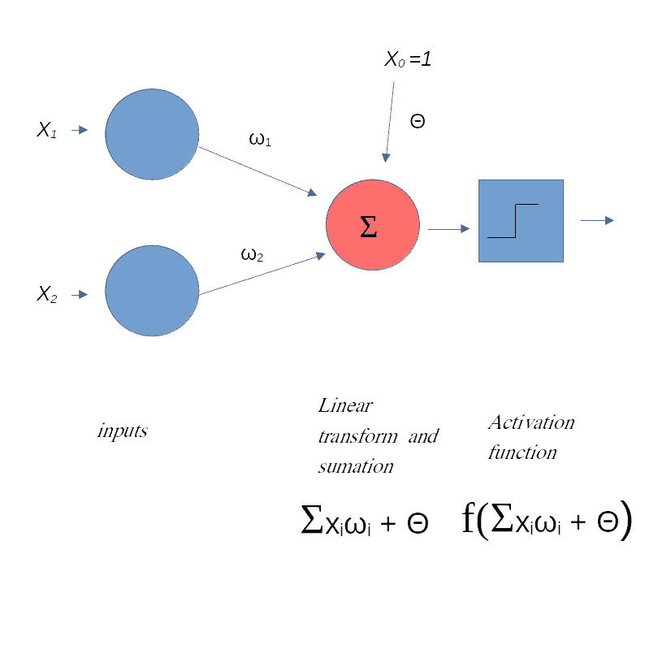

# **与门作为分类问题**

我们可以说，感知机所做的只是在一组输入中应用一些变换(数学函数)，以在空间中以一种有意义的方式表示它们(实际上，这是任何机器学习算法都要做的，但不要告诉别人)。除了转换之外，我们还需要一个步骤来使事情运转起来:学习步骤*。*学习步骤检查我们的转型是否运行良好。为此，我们需要问题的答案来比较我们的实际输出是否正确(或接近正确答案)。为了说明，请看与门的真值表。

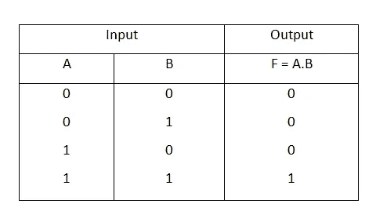

和真值表([http://bit.ly/32GjG1m](http://bit.ly/32GjG1m))中篇:([https://medium . com/better-programming/bit-manipulation-playing-with-the-Truth-part-1-e 4740466 D3 B1](/better-programming/bit-manipulation-playing-with-the-truth-part-1-e4740466d3b1))

我们有一组输入([0，0]，[0，1]，[1，0]，[1，1])和它们各自的输出([0，0，0，1])，我们可以在一个机器学习问题中考虑它们的*标签*。我们可以用几何方法表示与门，用输入作为坐标，用输出作为这些点的特征(如颜色):


和门表示在二维空间中。输出与颜色相关联

对于每个输入，我们在空间中有一个坐标为(x，y)的点，点的颜色代表与门的输出(如果输出= 0，则为蓝色；如果输入= 1，则为红色)。这就给我们带来了一个分类问题(我们有两类点，蓝色和红色(or AND 输出 0 和 1)，我们想用这些类相应地分隔空间，就像这样:

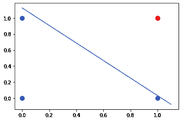

根据不同的等级正确划分空间的线。

# **感知器算法**

我们需要一个算法，为我们找到合适的线，就像已经说过的。如果您仔细观察感知器结构图像，您可以确定搜索该行的步骤:

1.  接收输入
2.  应用线性变换(使用*权重* w_1，w_2，theta)
3.  基于之前的转换生成输出

所应用的变换是输入的实值向量的线性组合，即:

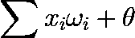

我们将为这个转换得到一个标量输出，然后，我们给它传递一个叫做*激活函数的函数。*特别是，感知器使用单位阶跃函数(也称为亥维赛函数)，定义如下:

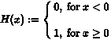

换句话说，它给了我们一个二元的结果。如果我们的线性组合之和大于 0，我们把 1 作为答案，否则，我们得到 0。(与我们在与门中的类完全相同)。

亥维赛的情节看起来像:

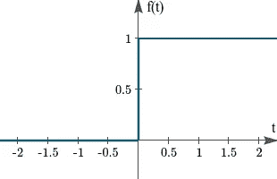

单位阶跃函数的图形表示(此处 H -> f，x -> t，来自上式)

它对我们来说就像一个过滤器。所以，有了感知器，我们就有了从与门接收输入并返回标签的机制！完成线性变换并应用单位阶跃函数后，我们只需与来自与门的实际答案进行比较，并检查我们应用的变换是否正确地给出了相应的输出，或者换句话说，是否正确地分隔了空间！

# 实际实施

让我们建立算法来解决这个问题。我们的分隔线定义了空间中区分蓝点和红点的两个区域。注意，我们在感知器输入中的线性变换实际上定义了一个平面:

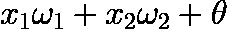

应用于和输入的线性变换

因此，当我们使用 2 坐标输入实现感知器时，我们实际上是在 3d 空间中搜索一个平面，如下所示:

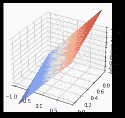

将三维空间分成两个区域的平面

但是，我们知道答案在 x-y 平面上，所以我们简单地把这个平面投影到 x-y 平面上，得到我们想要的直线:

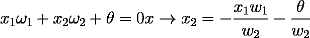

x-y 平面中直线的平面投影

我们关于 AND 端口的问题是找到正确的 w1、w2 和 theta 值，以建立平面中蓝点和红点的分隔线。该算法将从随机权重值(w_1，w_2，θ)开始，并在输入中应用变换的每个周期(也称为*时期)，*与正确的已知答案进行比较。如果我们得到了错误的答案，算法会改变权重值并重复该过程 *s.*

我们从权重 w1、w2 和θ的随机值开始:

```
w = np.random.rand(1,3) * 10w_1 = np.round(w[0][0], 1)
w_2 = np.round(w[0][1], 1)
theta = np.round(w[0][2], 1)
```

我们需要我们的输入和已知的答案:

```
x = [ [0,0], [0,1], [1,0], [1,1]]
x_array = np.asarray(x)# expected outputs (AND port is the product of each entry
out = x_array[:, 1] * x_array[:, 0]
```

然后我们还需要亥维赛函数或阶梯函数:

```
#step function 
def step (net):
    if net >= 0:
        return 1
    else:
        return 0
```

我们可以画出初始化后的线，看看它看起来像什么:

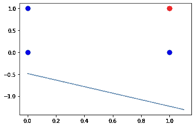

第一次尝试用随机线分隔空间

所以，很明显我们的观点很不一致。感知器算法所做的是调整权重，直到找到更好的线。所有输入的每一步被称为一个“时期”。我们可以通过从输出中减去正确答案来检查我们的输出是否是错误的。我们这样做是为了初始误差:

```
#the error vector 
error = np.array([0,0,0,0])
for i in range(len(x)):
    f_net = step(np.dot(np.asarray([w_1, w_2]) , x[i])  + theta)
    error[i] = out[i] - f_net
E = np.sum(error)
```

该算法将一直运行，直到收敛到正确的线，或者我们运行最大数量的迭代

```
max_it = 1000
t = 1
learning_rate=0.1vals = [[w_1, w_2, theta]]
while t < max_it & E != 0:
    for i in range(len(x)):
        f_net = step(np.dot(np.asarray([w_1, w_2]) , x[i])  + theta)
        error[i] = out[i] - f_net
        w_1 = w_1 + learning_rate * error[i] * x[i][0]
        w_2 = w_2 + learning_rate * error[i] * x[i][1]
        theta = theta + learning_rate*error[i]

    vals.append([w_1, w_2, theta])
    E = np.sum(error)
   # print('sum of errors', E)
    t = t+1
```

学习率参数控制每个参数的校正“大小”,小的值会使算法太慢，大的值会妨碍收敛。我们使用“vals”向量来存储每个新的权重值，因此我们可以生成算法中正在发生的事情的动画。让我们更详细地看看代码

```
for i in range(len(x)):
        f_net = step(np.dot(np.asarray([w_1, w_2]) , x[i])  + theta)
        error[i] = out[i] - f_net
```

或者四个循环负责算法的一个“时期”，特别地，我们有四个不同的输入向量((0，0)，(0，1)，(1，0)，(1，1))，因此我们的循环运行 4 次。“f_net”参数是应用于输入的整个变换，包括阶跃函数滤波。它将永远是 0 或 1，所以当我们计算误差时，我们只得到-1 或 0。

```
w_1 = w_1 + learning_rate * error[i] * x[i][0]
        w_2 = w_2 + learning_rate * error[i] * x[i][1]
        theta = theta + learning_rate*error[i]
```

这是校正步骤。注意，如果 error = 0，我们什么也不做，因为参数是正确的。θ总是得到修正，因为它不依赖于输入值(是我们线的线性系数)。

```
vals.append([w_1, w_2, theta])
    E = np.sum(error)
```

为了完成这个循环，我们保存重量值并对每个误差求和，直到这个和不为零，我们重复这个过程。我们可以在下面的动画中看到正在发生的事情:

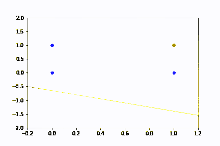

感知器算法演化的可视化

目前为止，我的朋友们，希望它能给人一种基本学习算法是如何工作的感觉。任何问题，关注和批评都是非常受欢迎的，再见！