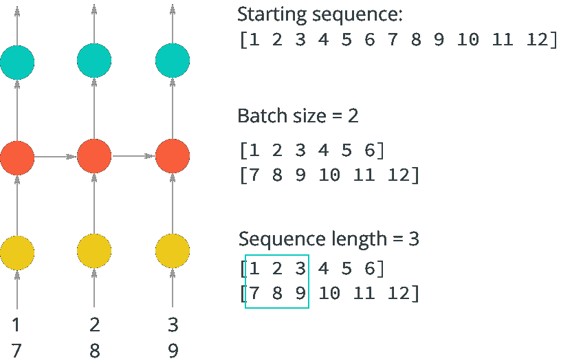
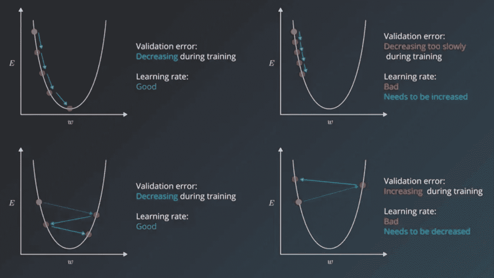
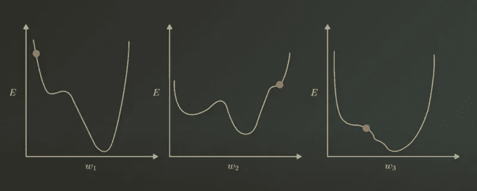
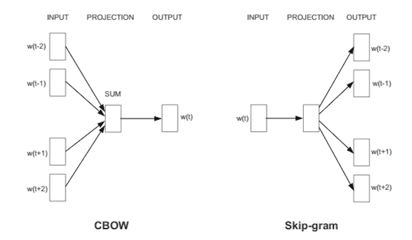

# 实施 RNNs

> 原文：<https://medium.com/analytics-vidhya/implementing-rnns-58e98e5ecd44?source=collection_archive---------21----------------------->

大家好！这是我在一个月内完成*深度学习纳米学位*的旅程中的第十一篇文字！我已经完成了该学位总共六个模块中第四个模块的 51%。今天，我们将讨论如何*将 RNNs 实现成代码。*

## 第 16 天

今天的模块是关于 RNNs，以及在纸上理解它们之后如何实现它们。

# 递归神经网络

快速回顾一下，什么是*rnn*。

> 这些网络为我们提供了一种将*记忆*整合到我们的神经网络中的方法，并将在分析序列数据中发挥关键作用。 *RNN 的*通常与文本处理和文本生成有关，因为句子是由一系列单词组成的！ *CNN* 系统没有任何记忆元素。*rnn*通过在产生当前输出时使用*存储器*(即网络的过去输入)来解决这个非常基本且重要的问题。这些可以*叠加*依赖关系。*记忆*定义为隐含层神经元的输出，在下一个训练步骤中作为网络的附加输入。

这就是在 PyTorch 中实现 RNN 的方法。实际上，RNN 和 LSTMs 在 pytorch 中的实现是相似的，它们有完全相同的语法。

```
#RNN/LSTM Implementation
nn.RNN(input_size, hidden_dim, n_layers, batch_first=T/F)
```

## 顺序分批

这是什么，我们不能把所有的数据输入到模型中，我们需要分割成部分。于是，我们使用 ***序列批处理*** 。据此，我们将数据分成几批，使训练和矩阵运算*更加高效*。

每个批次都包含𝑁×𝑀字符，其中𝑁是批次大小、批次中序列的数量，𝑀是序列长度或序列中时间步长的数量。

```
#Characters in a complete mini batchChars = batch_size * sequence_lengthTo only keep enough characters to make full batches:
array = array[:number_of_batches * (batch_size * sequence_length)]
```



序列分支

## 剪裁渐变

这就是我们可以解决膨胀梯度问题的地方。我们使用这个函数，基本上就是说，如果一个梯度高于某个阈值，就把这个值设置为已经设置好的阈值。这里，' *clip* '是一个值。

```
nn.utils.clip_grad_norm_(net.parameters(), clip)
```

## 超参数

有两种类型的超参数，如下所示:

*   **优化器超级参数，**这些参数与数据的优化和训练更相关。这些包括*学习率*，*小批量*，&历元数量*，*。
*   **模型超参数**:这些是模型结构中包含更多的变量。这些包括*层数*和 *RNNs* 的更多结构超参数。
*   **学习率，**好的起点通常是 0.01 然后你根据你的模型的需要改变它。

> “一个最重要的超参数，你应该始终确保它已经被调整好了”——约舒阿·本吉奥



学习率

现在，让我们更深入地探讨这些问题。

## 学习率衰减

这是当我们卡在比最优值稍大的学习速率上，并在值之间保持振荡时，因此，我们使用该算法来降低学习速率，使其更接近最优值。我们也可以将学习率线性降低一半，这也是一种方法，或者我们可以每次将它乘以 0.1。
但最好的是适应性学习，这意味着我们不仅在需要时减少学习，而且如果这将得到更好的模型，我们还会增加学习。



学习速度困难

## 小批量

随机训练和批量训练的区别可以用一个例子来解释。假设您有一个 3x3 输入要素的表。当我们使用随机批次时，我们一次只取一行，但当我们使用批次训练时，我们使用所有三行。然后我们向前传球。

Minibatch size 本质上是每个训练循环中要考虑的行数。这可以在 1 到 256 之间。最好是 32。对于模型中的矩阵乘法来说，较大的 minibatch 大小可能是有效的，并且允许计算量的增加，但是这样做的代价是使用更多的内存来进行运算。

> 太小的尺寸导致太慢。
> 
> 太大的尺寸会导致更多的内存和更低的精度。
> 
> 32 和 64 是很好的起始值。

## 时代数

选择此选项时要考虑的主要因素是验证错误。只要这种损失减少，就继续训练。
早期停止:训练模型直到验证损失减少，一旦没有减少，就停止训练。但是，一个好的做法是不要立即停止训练过程，而是在 10-20 个周期后，当损失没有减少时，因为损失经常来回变化。

## 隐藏单元/层的数量

隐藏单元的数量是模型学习能力的度量。
如果我们有一个非常复杂的结构，模型会过拟合并记忆训练数据。如果看到过度拟合，请尝试减少隐藏单元的数量。
一般的说法是 ***【越多越好】*** 但是大得多的数字会影响模型的准确性。据说保持隐藏单元的数量多于输入节点通常比其他方式更好，并且 3 层隐藏网络优于 2 层隐藏网络。

> CNN 是个例外，它越深入，效果越好。

> 要执行的功能越复杂，模型需要的学习能力就越强

在这些上下文中，让我们也加入嵌入层。

## 嵌入层

一种将一组字母短语表示成一组数值的模型。映射它们的向量称为嵌入。

当你处理文本中的单词时，你最终会有成千上万的词类需要分析；词汇表中的每个单词一个。试图对这些单词进行一次性编码是非常低效的，因为一次性向量中的大多数值将被设置为零。因此，在一个热点输入向量和第一个隐藏层之间发生的矩阵乘法将导致大部分零值隐藏输出。为了解决这个问题并大大提高我们网络的效率，我们使用了所谓的嵌入技术。嵌入只是一个完全连接的层，就像你之前看到的那样。我们称这一层为嵌入层，权重为嵌入权重。我们跳过嵌入层的乘法，而是直接从权重矩阵中获取隐藏层值。我们可以这样做，因为一个独热编码向量与一个矩阵的乘法运算返回了与输入单元上的*的索引相对应的矩阵行。*

**目的？**它们基本上降低了文本数据的维数。

事情是这样的，当我们将文本数据传递到模型中时，我们将它们转换成向量。大多数向量有数千列，但其中只有一项是 1，其他都是 0，这在计算上是非常低效的。因此，我们使用嵌入层。它的重量也是在训练中学习的。让我们举一个例子来理解这一点，假设我们需要找到“心脏”，我们首先将它转换成数字 958，因此，在将一个热编码层乘以嵌入矩阵之后，我们将得到一个结果矩阵，为了找到 958 的嵌入数据，我们必须到结果向量的第 958 列，这一整行是 958 的数据。嵌入层接受输入并创建查找表。所以，对于每一个可能的嵌入值，表中都会有一行，矩阵的宽度就是我们定义的嵌入维数。该尺寸将是嵌入层输出的大小。

> 嵌入维度是模型将学习的特征的数量。

```
#Embedding Layer Representation
torch.nn.Embedding(num_embeddings, embedding_dim)
```

> 虽然一些任务表现出合理的性能，嵌入大小在 50-200 之间，但看到它上升 500 甚至 1000 并不罕见。


跳格表示法

## Word2Vec 模型

这个例子是一个获取单词语义的模型。例如，嵌入可以学习嵌入和过去时态之间的关系，例如，Walking 到 walked，smimming 到 swam。同样，它也可以发现单词和普通性别之间的关系，如*女人对女王*和*男人对国王*。



这是我一天能走的路。实际上，我正在做这个项目，“T9”生成电视脚本“T10”，相信我，它需要很长时间来训练。不管怎样，下次再见！