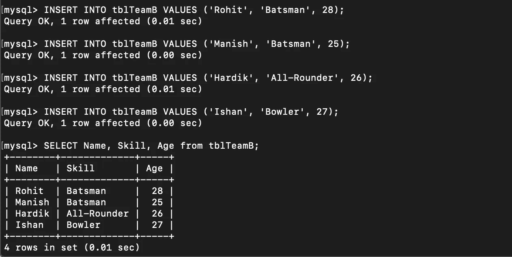

# 在 MySQL 中实现半连接、反连接

> 原文：<https://medium.com/analytics-vidhya/implementing-semi-anti-joins-in-mysql-342dd7f3da43?source=collection_archive---------13----------------------->

SQL 连接用于组合和检索 RDBMS 中多个表的数据。大多数业务目标都可以使用原始连接(Inner、Left、Right、Outer、Cross)来实现，但是有时我们会遇到一些场景，其中一些复杂的操作需要使用连接，比如组合多个表中的数据，但是只从一个表中检索列。在这种情况下，半连接和反连接可以提供帮助。

**左半连接**表示当在右表中找到匹配记录时，从左表返回记录的半连接。即使对于给定的记录，在正确的表中找到多个匹配，结果也只包含该记录一次。

让我们借助一个例子来理解这个概念。

有两个表:*TBL team*和*TBL team*，它们包含了一批玩家的记录，包括他们的姓名、技能和年龄。两个队都可以选一名队员。

创建表格

填充 tblTeamA

填充 tblTeamB

以下是一些使用案例:

1.找出被两个队选中的队员。
2。找出只为 a 队挑选的球员。找出只为 b 队挑选的队员。

此外，结果应该只包含一个玩家一次，没有必要列出同一个玩家两次(两个表中的行)。

> 1.找出被两个队选中的队员。

上述查询中的 EXISTS 子句用于实现左半连接。该查询将左表中的记录与右表中的记录进行比较。如果找到匹配，则返回左表中的行。

> 2.找出只为 a 队挑选的队员。

使用 NOT with EXISTS 子句会排除两个表中的公共记录，因此会返回左表中不存在于右表中的唯一记录。

> 3.找出只为 b 队挑选的队员。

**反连接**也用于在一个表中查找其他表中没有的记录。这里，右连接与 WHERE 子句相结合来实现反连接。

**总结**

Left Semi 或 Left Anti 可能听起来很奇特，但是它们的实现并不复杂。与基本连接不同，半连接或反连接没有自己的语法，但是可以通过基本连接和一些子句的组合来实现。

在这里，我试图保持简单，并希望听到你的意见。

感谢阅读！