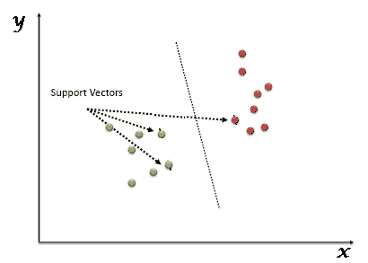

# 在 Python 中实现 SVM 分类和查找精度

> 原文：<https://medium.com/analytics-vidhya/implementing-svm-for-performing-classification-and-finding-accuracy-in-python-using-datasets-wine-e4fef8e804b4?source=collection_archive---------2----------------------->

## 使用数据集——葡萄酒、波士顿和糖尿病

**问题陈述:实现用于执行分类的 SVM，并在给定数据上发现其准确性。(使用 Python)(数据集——葡萄酒、波士顿和糖尿病)**

## 程序和数据集的链接如下

图片来源:- [思创资讯科技](https://thinksproutinfotech.com/)

SVM 代表支持向量机。SVM 是一种受监督的机器学习算法，通常用于分类和回归挑战。SVM 算法的常见应用是入侵检测系统、手写识别、蛋白质结构预测、检测数字图像中的隐写术等。

在 SVM 算法中，每个点被表示为 n 维空间中的一个数据项，其中每个特征的值是特定坐标的值。

标绘后，通过寻找区分两类的平面进行分类。参考下图来理解这个概念。

支持向量机算法主要用于解决分类问题。支持向量只不过是每个数据项的坐标。支持向量机是使用超平面区分两类的前沿。

# 支持向量算法的工作原理

SVM 的工作原理是将数据映射到一个高维特征空间，以便可以对数据点进行分类，即使数据不是线性可分的。找到类别之间的分隔符，然后对数据进行转换，使得分隔符可以绘制为超平面。

支持向量机有一些特殊的数据点，我们称之为“支持向量”，还有一个分离超平面，我们称之为“支持向量机”。所以，从本质上来说，SVM 是最好的阶级隔离的前沿。支持向量是最接近超平面的数据点，即我们的数据集的点，如果移除这些点，将会改变划分超平面的位置。正如我们可以看到的，可以有许多超平面可以分离这两个类，我们将选择的超平面是具有最高余量的超平面。

用于转换的数学函数称为核函数。SVM 支持以下内核类型:

线性

多项式

径向基函数(RBF)

乙状结肠

# SVM 程序，用于对给定数据进行分类并确定其准确性:

**第一步:导入库**

首先，我们将导入程序所需的库。

*   我们从 sklearn 库中导入 svm 和数据集
*   进行有效数学计算的数字
*   **来自 sklearn.metrics 的 accuracy_score** 用于预测模型的准确性，以及来自**sk learn . model _ selection**import**train _ test _ split**用于将数据拆分为训练集和测试集

**第二步:添加数据集，插入所需数量的特征并训练模型**

下面是导入内置数据集的代码。“iris”是我们将在其中加载所需数据集的变量名。

我们还可以将数据集从它在计算机上的存储位置导入到一个新变量中。 **pd.read_csv** 用于读取 csv 文件(数据集文件)。以下代码显示了语法:-

**Iris = PD . read _ CSV(' C:/Users/Kshitij Ved/Desktop/Iris . CSV ')**

在下一步中，X 变量被加载有 **iris.data[:，:2]** ，在这一步中，我们仅将前两个特征作为训练的输入。

而 Y 变量加载的是 iris.target，也就是原始数据的输出。

然后，我们使用 **train_test_split()** 将数组或矩阵分成随机的训练和测试子集。我们提供用作测试集的数据比例，并且我们可以提供参数 **random_state** ，该参数用于确保可重复的结果。 **Test_size** 用于决定为模型测试提供多少数据。

继续，我们现在要定义我们的分类器…

我们将使用 SVC(支持向量分类器)SVM(支持向量机)。我们的核是线性的，C 等于 1。c 是对你想要正确分类或适合所有事物的“有多糟糕”的评估。我们现在坚持使用 1，这是一个很好的默认参数。

**第三步:预测模型的输出和打印精度**

在下一步中，我们使用 **clf.predict(x_test)** ，这是预测测试结果的分类器，然后我们打印准确性得分，在上面的示例中，76.31578947368422 是我们加载 iris 作为数据集时模型的预测值。

**第四步:最终为我们的程序绘制分类器**

在这一步，我们将绘制我们的分类器。这里使用 **np.meshgrid()** 函数从两个给定的一维数组中创建一个矩形网格，表示笛卡尔索引或矩阵索引。

NumPy 在 NumPy 数组对象上提供了 **reshape()** 函数，可用于对数据进行整形。在将一维数组整形为具有一列的二维数组的情况下，元组将是作为第一维的数组的形状，1 表示第二维。

**plt.scatter()** 用于绘制图形上的点， **plt.show()** 显示图形。

我们程序的最终输出

点击[这里](https://github.com/kshitijved/Support_Vector_Machine)下载程序和数据集…