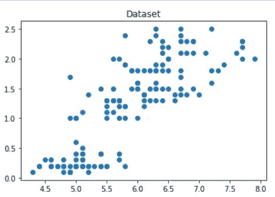

# 使用数据集(虹膜、葡萄酒和乳腺癌)在 Python 中实现 K-Means 聚类算法

> 原文：<https://medium.com/analytics-vidhya/implementing-the-k-means-clustering-algorithm-in-python-using-datasets-iris-wine-and-breast-3c98668de474?source=collection_archive---------5----------------------->

## 问题陈述——实现聚类的 K-Means 算法，在给定的数据上创建一个聚类。(使用 Python)(数据集—虹膜、葡萄酒、乳腺癌)

## 程序和数据集的链接如下

pic Credit:-[think sprout Infotech](https://thinksproutinfotech.com/)

K-Means 聚类是一种无监督的机器学习算法，这基本上意味着我们只会有输入，而不是相应的输出标签。在本文中，我们将看到它的 python 实现。

k 表示聚类试图根据相似性将您的数据聚类成簇。在这个算法中，我们必须指定我们想要将数据分组到的聚类数(这是一个超参数)。超参数是在将值应用于数据集之前需要设置其值的变量。超参数是可调整的参数，您可以选择这些参数来训练执行训练过程本身的模型。

# K-均值算法的工作原理

为了处理学习数据，数据挖掘中的 K-means 算法从第一组随机选择的质心开始，这些质心用作每个聚类的起始点，然后执行迭代(重复)计算以优化质心的位置

当出现以下任一情况时，它会停止创建和优化集群:

*   质心已经稳定，因为聚类成功，所以它们的值没有变化。
*   已达到定义的迭代次数。

# 使用 iris 数据集的 K-均值聚类算法程序；

步骤 1:导入库

首先，我们将导入程序所需的库。

*   可以借助 sklearn.cluster 模块对未标记的数据进行聚类。从这个模块中，我们可以导入 KMeans 包。
*   熊猫用于阅读和书写电子表格
*   用于执行有效计算的数字
*   用于数据可视化的 Matplotlib

步骤 2:为数据集添加数据集、列名和绘图

下面是将数据集从它在计算机上的存储位置导入到一个新变量的代码。“Iris”是我们将在其中加载所需数据集的变量名。

pd.read_csv 用于读取 csv 文件(数据集文件)。上述代码的第一行表示加载数据集的格式。我们还可以使用以下代码导入内置数据集:

**Iris = datasets . load _ Iris()**

为了执行这一行，您必须从 sklearn 导入 datasets 包。为此，只需在导入语句上方添加以下代码行:

**从 sklearn 导入数据集**

下一步是添加我们想要应用集群的列名。所以这里我们取了“萼片长厘米”和“花瓣长厘米”。

然后，这两列分别加载到 X1 和 X2 变量中。这里使用了 np.array，因此列以数组格式存储，这将使我们易于执行集群。

之后， **plt.scatter(x1，x2)** 用于绘制指定列的散点图。 **plt.plot()** 和 **plt.show()** 用于使图形对你可见。

步骤 3:创建一个新的图和数据，应用 kmeans 的内置函数并绘制图表。

在下一步中，numpy zip()方法用于创建一个迭代器，该迭代器将聚合来自两个或更多可迭代对象的元素。然后这些压缩的元素被加载到变量 X 中，这个 X 在 fit()方法中传递。

颜色和标记用于表示数据点的颜色和标记。

然后我们调用 KMeans 函数，传递 n_clusters=3(这里 3 决定了你需要显示的聚类数。之后，我们使用 fit()方法来训练我们的模型。使您的模型符合(即使用。训练数据本质上是建模过程的训练部分。

plt.scatter 用于绘制聚类的质心。我们通过 **kmeans.cluster_centers_** 在图上绘制质心点。

枚举函数允许我们循环遍历一些东西，并拥有一个自动计数器。

下一行 **plt.plot(x1[i]，x2[i]，color=colors[l]，marker=markers[l])** 用于绘制最终的图形，其中成功地形成了质心和聚类。

点击[此处](https://github.com/kshitijved/kmeans_clustering_algorithm)下载程序和数据集…