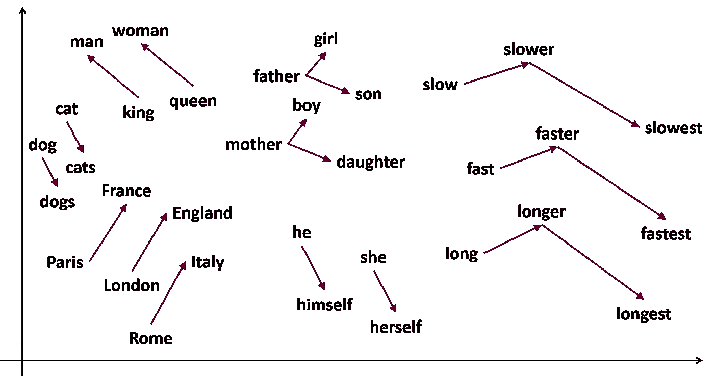
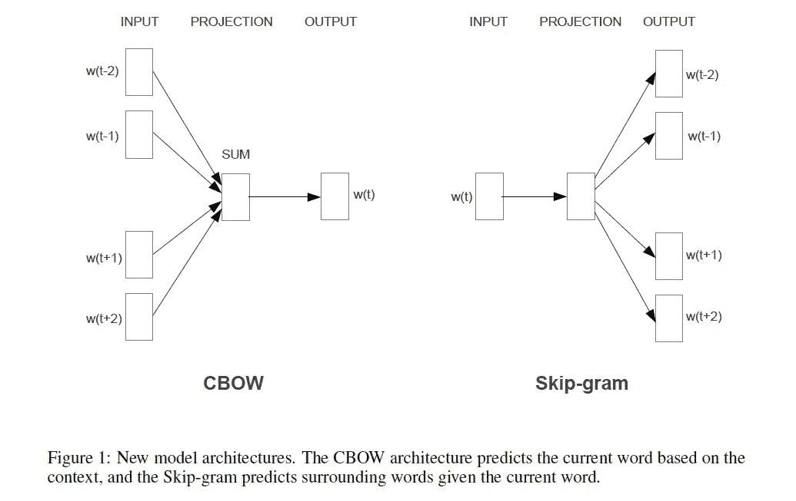
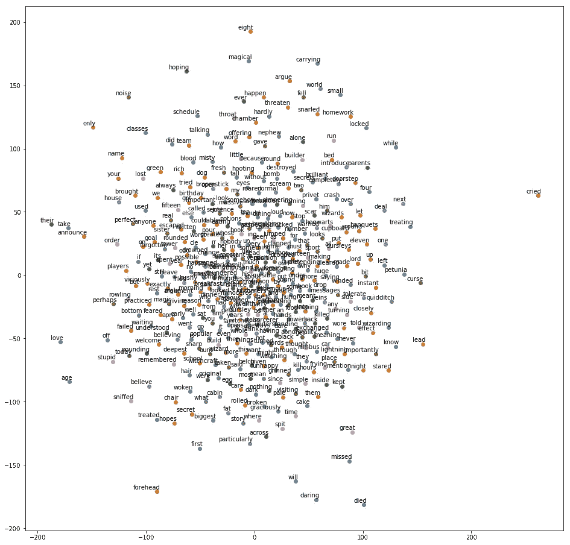

# 在 Tensorflow 中实现 Word2Vec

> 原文：<https://medium.com/analytics-vidhya/implementing-word2vec-in-tensorflow-44f93cf2665f?source=collection_archive---------0----------------------->

根据维基百科的说法，“ **Word2vec** 是一组相关的模型，用于产生[单词嵌入](https://en.wikipedia.org/wiki/Word_embedding)”。Word2vec 是 Google 发布的一个非常强大的模型，用于在保持上下文关系的同时在特征空间中表示单词。

“一个人可以通过他交的朋友来识别”，同样，一个单词可以通过经常使用的一组单词来识别，这就是 Word2Vec 所基于的思想。



这篇文章需要对神经网络有透彻的理解，使用下面的文章快速回顾一下。

## [深度学习和神经网络入门指南](https://www.analyticsvidhya.com/blog/2018/10/introduction-neural-networks-deep-learning/)

## [用 Python 和 R 从零开始理解和编码神经网络](https://www.analyticsvidhya.com/blog/2017/05/neural-network-from-scratch-in-python-and-r/)

## [对单词嵌入的直观理解:从计数向量到 Word2Vec](https://www.analyticsvidhya.com/blog/2017/06/word-embeddings-count-word2veec/)

目录:-

1.  什么是单词嵌入？
2.  连续词袋模型
3.  跳过 Gram 模型
4.  履行
5.  形象化
6.  结论

**什么是单词嵌入？**

任何处理文本数据的算法都需要一些数字形式的单词表示，因为计算机不能直接理解文本(截至目前)。因此，需要将输入的单词转换成算法可以理解的形式，最流行的方法之一是 one hot 编码，其中每个单词都被表示为在词汇表中其位置包含 1 的向量。

例如，假设我们的语料库是一个单句“狐狸太懒了”。我们的词汇是['该'，'狐狸'，'是'，'太'，'懒']。现在最热门的单词编码是，

fox -> [0，1，0，0，0] the -> [1，0，0，0，0] is ->[0，0，1，0，0] too ->[0，0，0，0，1，0] lazy->[0，0，0，0，0，1]

这种编码的问题是它们不能捕捉不同单词之间的关系，因为所有的向量都是独立的。任何两个热编码矢量之间的相似性(余弦)将总是 0。此外，一个热编码可以显著增加数据集的维度，因为词汇表中的每个单词都被视为一个单独的特征。因此，我们需要一种表示法，使得相似的单词有相似的表示法，这就是 Word2Vec 出现的原因。直观地说，Word2Vec 试图根据通常在其附近出现的其他单词来学习每个单词的表示，因此 Word2Vec 能够捕捉单词之间的上下文关系。

著名的国王王后男人的例子——如果我们考虑由 Word2Vec 产生的国王和王后的向量表示的差异，那么产生的向量非常类似于男人和女人的差异，这意味着嵌入包含关于性别的信息。

Word2Vec 有两个变体，一个基于 Skip Gram 模型，另一个基于连续单词包模型。

# **连续单词袋模型**

在连续单词包模型中，我们尝试使用单词周围的单词(上下文单词)来预测单词，模型的输入是窗口大小内的上下文单词的一个热编码向量，窗口大小是一个超参数，指的是任一侧的上下文单词的数量(在当前单词之前和之后出现的单词)。)来预测它。

**窗口大小**

让我们举一个例子。

“狐狸太懒了，什么都不会做。”。假设考虑中的单词是“lazy”，现在对于窗口大小为 2，输入向量将在对应于单词“is”、“too”、“to”和“do”的位置具有 1。

# 跳过 Gram 模型

在 skip gram 模型中，我们试图找出在所考虑的单词的窗口大小内出现的上下文单词。在下一节中，我们将尝试实现 skip gram 模型。

跳过 gram 模型如下进行

1.  实现 3 层神经网络(输入、隐藏和输出)
2.  用于训练的输入数据是所考虑的单词的一个热编码向量，类似地，输出是落入窗口大小内的单词的一个热编码向量。例如，假设我们的语料库是句子，“敏捷的狐狸跳过了懒惰的狗。”。那么跳过 gram 模型的训练向量是

['狐狸'，'快']，['狐狸'，'跳了']，['狐狸'，'该']，['狐狸'，'过']等等。

3.在训练之后，为了获得单词的表示，只需将单词的一个热编码向量作为输入，并且该表示是隐藏层的输出。

相同的模型可以用于训练跳格和连续单词袋模型，只有输入和输出训练向量被交换。



# 履行

首先让我们导入必要的库

```
import numpy as np
import tensorflow as tf
import re
import nltk
import sys
from collections import OrderedDict
from sklearn.manifold import TSNE
import matplotlib.pyplot as plt
%matplotlib inline
```

现在，让我们来阅读作为我们训练语料的文件，这里我们使用了《哈利波特与魔法石》。

```
file = open("J. K. Rowling - Harry Potter 1 - Sorcerer's Stone.txt",'r')
raw_data_1 = file.read()
file.close()
```

现在，我们将把语料库拆分成单词，并执行一些清理步骤来删除数字和标点符号等。

```
words = raw_data_1.split()
words = [ word.lower() for word in words if len(word)>1 and word.isalpha()]
vocab = set(words)
char_to_int = dict((c,i) for i,c in enumerate(vocab))
int_to_char = dict((i,c) for i,c in enumerate(vocab))
```

char_to_int 是一个字典，它将我们词汇表中的每个单词映射到一个唯一的数字，int_to_char 实现了相反的映射。

```
X = []
Y = []
temp_dict = []
window_size = 10
for i in range(len(words)):
    a = i-window_size
    b= i+window_size
    curr_word = words[i]
    for z in range(a,i):
        if z >=0:
            temp_dict.append((curr_word,words[z]))
    for z in range(i+1,b):
        if z<len(vocab):
            temp_dict.append((curr_word,words[z]))for pair in temp_dict:
    tempx = np.zeros(len(vocab))
    tempy = np.zeros(len(vocab))
    tempx[char_to_int[pair[0]]] = 1
    tempy[char_to_int[pair[1]]] = 1
    X.append(tempx)
    Y.append(tempy)
```

X 和 Y 具有我们各自的训练输入和输出向量，X 中的每个向量在所考虑的单词的位置处具有 1，而 Y 在对应于上下文单词的位置处具有 1，window_size 用于调节要使用的上下文单词的数量。

```
embedding_size = 1000
batch_size = 64
epochs = 32 
n_batches = int(len(X)/batch_size)
learning_rate= 0.001x = tf.placeholder(tf.float32,shape = (None,len(vocab)))
y = tf.placeholder(tf.float32,shape = (None,len(vocab)))w1 = tf.Variable(tf.random_normal([len(vocab),embedding_size]),dtype = tf.float32)
b1 = tf.Variable(tf.random_normal([embedding_size]),dtype = tf.float32)
w2 = tf.Variable(tf.random_normal([embedding_size,len(vocab)]),dtype = tf.float32)
b2 = tf.Variable(tf.random_normal([len(vocab)]),dtype = tf.float32)hidden_y = tf.matmul(x,w1) + b1
_y = tf.matmul(hidden_y,w2) + b2#print(b.dtype)#_y = tf.matmul(x,w)cost = tf.reduce_mean(tf.losses.mean_squared_error(_y,y))
optimizer = tf.train.AdamOptimizer(learning_rate).minimize(cost)print(y.shape)
print(_y.shape)init = tf.global_variables_initializer()
init_l = tf.local_variables_initializer()
saver = tf.train.Saver()
gpu_options = tf.GPUOptions(per_process_gpu_memory_fraction = 0.33)
sess = tf.Session(config = tf.ConfigProto(gpu_options = gpu_options))
sess.run(init)
```

我们这里的嵌入长度是 1000，即每个单词将被表示为长度为 1000 的向量。我们用一个隐藏层定义了我们的简单模型。

```
for epoch in range(5):
    avg_cost = 0
    for i in range(n_batches-1):
        batch_x = X[i*batch_size:(i+1)*batch_size]
        batch_y = Y[i*batch_size:(i+1)*batch_size]
        #print(batch_x.shape)
        _,c = sess.run([optimizer,cost],feed_dict = {x:batch_x,y:batch_y})
        #print(test.shape)

        avg_cost += c/n_batches
    print('Epoch',epoch,' - ',avg_cost)
save_path = saver.save(sess,'/home/temp/w2v/word2vec_weights_all.ckpt')
```

该模型被训练 5 个时期，并且相应的权重也被保存。

```
embeddings = dict()
for i in vocab:
    temp_a = np.zeros([1,len(vocab)])
    temp_a[0][char_to_int[i]] = 1
    temp_emb = sess.run([_y],feed_dict = {x:temp_a})
    temp_emb = np.array(temp_emb)
    #print(temp_emb.shape)
    embeddings[i] = temp_emb.reshape([len(vocab)])
    #print(embeddings[i].shape)
```

现在，嵌入字典将词汇表中的每个单词都映射到它的向量表示中。

```
 def closest(word,n):
    distances = dict()
    for w in embeddings.keys():
        distances[w] = cosine_similarity(embeddings[w],embeddings[word])
    d_sorted = OrderedDict(sorted(distances.items(),key = lambda x:x[1] ,reverse = True))
    s_words = d_sorted.keys()
    print(s_words[:n])
```

closest 函数将任意单词和 n 作为输入，查找 n 个最相似的单词。

**可视化**

现在，让我们用 SNE 霸王龙来想象我们的表现。

```
labels = []
tokens = []
for w in embeddings.keys():
    labels.append(w)
    tokens.append(embeddings[w])tsne_model = TSNE(perplexity=40, n_components=2, init='pca', n_iter=2500, random_state=23)new_values = tsne_model.fit_transform(tokens)x = []
y = []
for value in new_values:
    x.append(value[0])
    y.append(value[1])

plt.figure(figsize=(16, 16)) 
for i in range(len(x)):
    plt.scatter(x[i],y[i])
    plt.annotate(labels[i],
                     xy=(x[i], y[i]),
                     xytext=(5, 2),
                     textcoords='offset points',
                     ha='right',
                     va='bottom')
plt.show()
```

这将在特征空间中用它们之间的相应距离来绘制我们的单词。



词汇的 t-SNE 视觉化

**结论**

本文的目的是提供对单词嵌入和用于生成它们的模型的直观理解。我希望你读完这篇文章后理解单词嵌入。您可以使用自己的语料库来创建嵌入长度和窗口大小不同值的嵌入和实验，将它们用于情感分类等任务。

请务必阅读 Word2Vec 论文，并前往 Github repo 获取完整代码。

论文:-【https://arxiv.org/abs/1301.3781】T4