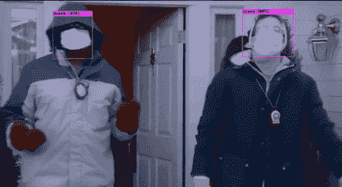
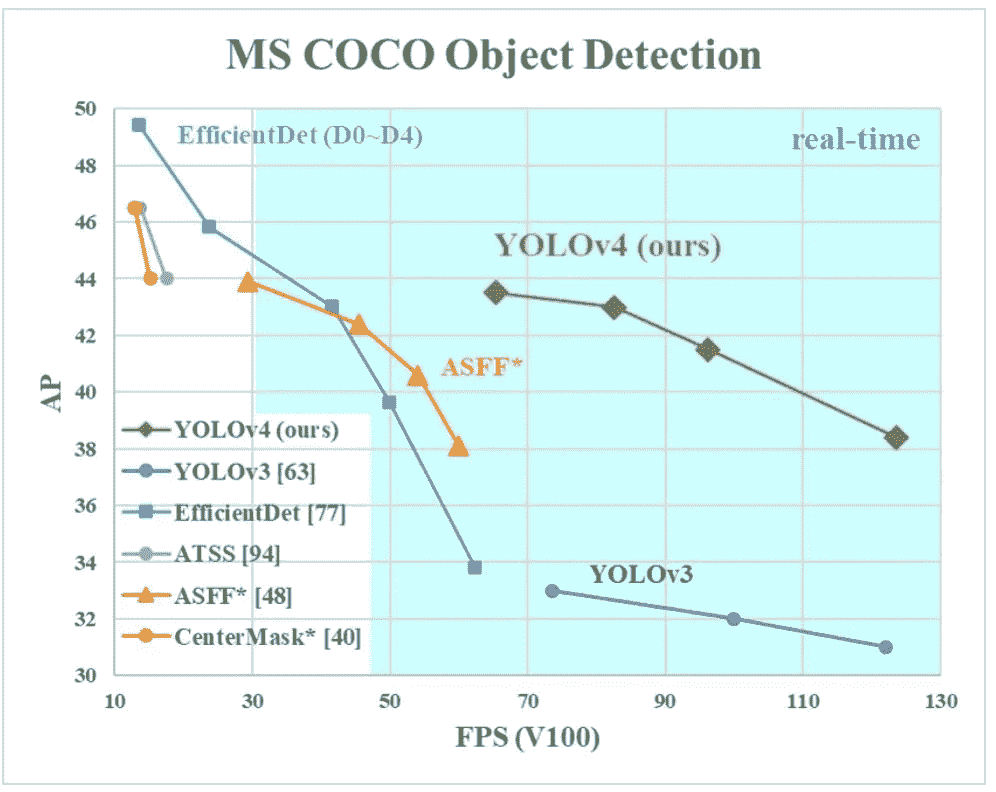
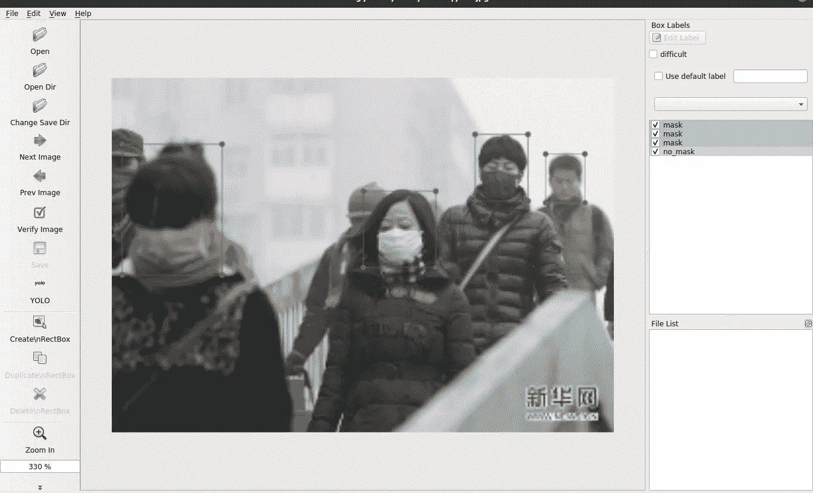
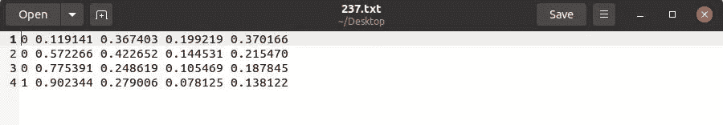
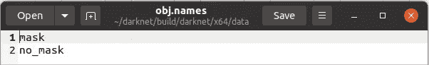

# YOLOv4 实现使用 Google Colab 检测自定义对象

> 原文：<https://medium.com/analytics-vidhya/implementing-yolov4-to-detect-custom-objects-using-google-colab-6691c98b15ff?source=collection_archive---------1----------------------->



演示

我在这段视频中测试了探测器，这段视频来自布鲁克林九九事件中霍尔特和佩拉尔塔患腮腺炎的一集。这部剧的超级粉丝，你一定要看！

因此，在本文中，我将解释如何实现 YOLOv4 来检测定制对象。当我想写这个的时候，我计划使用一个玩具数据集，但是因为这些不幸的时刻，我们所有人都必须戴上面具，我想这个特别的应用会更有用。因此，我决定构建一个对象检测器，它可以识别某人是否戴着面具。

## YOLO 简介…

你只看一次(YOLO)是一个实时对象检测系统，它可以在单帧中精确地检测多个对象。它非常快，根据 Yolo [官方网站](https://pjreddie.com/darknet/yolo/)的说法，它比 R-CNN 快 1000 倍，比快速 R-CNN 快 100 倍。

最新的第四版是由 Alexey Bochkovskiy——Github 上著名的 AlexeyAB，Chien，Hong-Yuan Mark Liao——于上个月发布的。最初的作者停止了开发 YOLO，Joseph Redmon 在推特上说“我停止了简历研究，因为我看到了我的工作产生的影响。我热爱这项工作，但军事应用和隐私问题最终变得不容忽视。”另一方面，阿里·法尔哈迪创建了 xnor.ai 公司，该公司现在被苹果公司收购。

从[的论文](https://arxiv.org/abs/2004.10934)，你可以理解，主要目标是设计一个更快更准确的对象检测器，可以在任何传统的 GPU 上训练和测试，以实现实时、高质量和令人信服的结果。我不打算详细讨论 YOLO 的工作原理，因为这篇文章主要关注实现。



YOLOV4 与最先进的物体探测器的比较[ [来源](https://arxiv.org/abs/2004.10934)

如图所示，YOLOv4 比谷歌开发的 [EfficientDet](https://ai.googleblog.com/2020/04/efficientdet-towards-scalable-and.html) 快 2 倍，性能相当。它在 COCO 数据集上获得了 43.5 的 AP(65.7%ap₅₀)，在 Tesla V100 上也实现了 65 FPS 的实时推理速度。与 YOLOv3 相比，AP 和 FPS 分别提高了 10%和 12%。

## 让我们开始行动吧！

***先决条件*** :

*   CMake >= 3.12
*   CUDA 10.0
*   OpenCV >= 2.4
*   cuDNN >= 7.0，适用于 CUDA 10.0
*   Windows 或 Linux

如果你不想设置 CUDA 的麻烦，cuDNN 然后使用 [Colab](https://colab.research.google.com/) ，并且它也有相当好的 GPU(NVIDIA Tesla K80)。对于这个例子，我使用了**的 Google Colab** 。如果您在本地计算机上运行，请相应地更改下面命令中的路径。

***提示:*** *如果你遇到任何与路径相关的问题，记住路径应该总是相对于暗网文件。*

***面具数据:*** 我开始从谷歌和其他网站搜集数据，但偶然发现了这个真实世界的面具人脸数据集 [(RMFD)](https://github.com/X-zhangyang/Real-World-Masked-Face-Dataset) 。有很多人戴口罩和不戴口罩的图像，我拍了一小部分。因此，我使用的最终数据集包含 600 张图像— 300(mask) & 300(no_mask)。

***标注:*** 现在我们需要对图片进行标注，对于 YOLOv4 来说每张图片都需要有一个对应的。txt 文件放在同一个目录下同名。每个文本文件包含每个对象的类 id 和边界框的坐标，如下所示。

```
<object-class> <x_center> <y_center> <width> <height>
```

*   对象类基本上是一个从 0 到类-1 的整数。在这种情况下，因为有两个类— 0: mask，1: no_mask
*   <x_center><y_center><width><height>是相对于图像宽度和高度的浮点值，它可以等于(0.0-1.0)</height></width></y_center></x_center>



标记图像的示例



的样本。' txt '文件

对于任何标记目的，我总是使用 [labelImg](https://github.com/tzutalin/labelImg) ，它支持 YOLO 和帕斯卡 VOC 格式，GUI 设计有非常好的快捷方式。在标签的最后，确保你有一个相同但不同扩展名的图像的文本文件。例如，我有 600 个图像文件和 600 个文本文件。

***训练数据的步骤:***

1.  ***Darknet build***—我会用 Darknet，它是一个开源的神经网络框架。让我们下载并安装暗网。您可以下载或克隆它。

```
git clone [https://github.com/AlexeyAB/darknet.git](https://github.com/AlexeyAB/darknet.git)
```

之后在 darknet 目录中，打开 *Makefile* ，然后将 GPU、CUDNN 和 OPENCV 设置为 1，这样可以利用 GPU 加速训练。现在运行以下命令来构建 Darknet。如果您使用的是 Windows，请按照这些[步骤](https://github.com/AlexeyAB/darknet#how-to-compile-on-windows-using-cmake)进行编译。([在 Windows 上安装 Darknet 的备用源](/analytics-vidhya/installing-darknet-on-windows-462d84840e5a)

```
os.chdir('darknet')
make
```

要首先验证暗网构建，下载 [Yolo-v4 权重](https://drive.google.com/open?id=1cewMfusmPjYWbrnuJRuKhPMwRe_b9PaT)并将其放在根目录中，然后运行下面的命令。

```
./darknet detector test cfg/coco.data cfg/yolov4.cfg yolov4.weights data/person.jpg -dont_show
```

您可以查看根目录下保存为*predictions.jpg*的预测。如果你在 Windows 下运行，使用`darknet.exe`而不是`./darknet`

现在，如果它成功地工作，因为下载的权重是从训练 COCO 数据集获得的，它对所有的 [80 coco 类](https://gist.github.com/SrikarNamburu/0945de8f9a8714ec245dde3443e9d487)都有效。

2. ***配置*** —根据您的需求选择一个 YOLOv4 配置文件。我选中`yolov4-custom.cfg`，把`cfg/yolov4-custom.cfg` 的内容复制到一个新文件`cfg/yolo-obj.cfg`。相应地调整 batch、subdivisions、steps、max_batches 等参数。有关参数的更多信息，请参考此[链接](https://github.com/AlexeyAB/darknet/wiki/CFG-Parameters-in-the-%5Bnet%5D-section)。

***提示*** *:设置 max_batches 值最小为 2000*类，步数为 max_batches 的 80% - 90%。还有宽度，高度参数应该是 32 的倍数(我用过 416x416)。*

将 *classes* 参数更新为第 *970、1058、1146* 行`yolo-obj.cfg`文件中 3 *yolo* 层的对象数量，因为我们只有 2 个类(mask、no_mask)。现在类似地，在每个 *yolo* 层之前的 3 个*卷积*层中，将 filters 参数更新为 filters=(classes + 5) x 3。在这种情况下，classes = 2 因此，在行 *963、1051、1139* 中将过滤器设置为 21(不要在*中编写过滤器= (classes + 5) x 3)。cfg* 文件)

为了开始培训，我们需要创建以下文件:

用类名在目录`build\darknet\x64\data\`中创建`obj.names`，在本例中是— mask，no_mask。



obj.names 文件示例

现在我们必须在包含图像路径的目录`build\darknet\x64\data\`中创建 *train.txt* 和 *test.txt* 文件。使用以下代码创建文件。

最后，这两个文件应该如下所示:

```
/content/gdrive/My Drive/darknet/build/darknet/x64/data/obj/273.jpg
/content/gdrive/My Drive/darknet/build/darknet/x64/data/obj/294.jpg
/content/gdrive/My Drive/darknet/build/darknet/x64/data/obj/15.jpg
```

把所有的图像文件(。jpg)和标签文件(。txt)放在同一个目录下也就是`build\darknet\x64\data\obj`

之后，在目录`build\darknet\x64\data\`中创建`obj.data`文件，它应该包含类的数量、train.txt、test.txt、obj.names 的路径和权重。

```
classes= 2
train = build/darknet/x64/data/train.txt
valid = build/darknet/x64/data/test.txt
names = build/darknet/x64/data/obj.names
backup = build/darknet/x64/backup/
```

最后一步，下载卷积层的预训练权值并放入目录`build\darknet\x64`。我们正在使用 *yolov4-custom.cfg* 因此，下载 [yolov4.conv.137](https://drive.google.com/open?id=1JKF-bdIklxOOVy-2Cr5qdvjgGpmGfcbp) 对于 Yolo 的其他配置或版本，请相应地下载权重。

***提示:*** 假设您只想检测 COCO 数据中出现的 4 个类别——人、笔记本电脑、冰箱、电视，首先分别编辑配置，然后使用[预训练权重](https://github.com/AlexeyAB/darknet#pre-trained-models)进行训练。由于权重是从由您的 4 个类组成的训练 MS COCO 数据集获得的，您不需要再次收集数据，只需为每个类标注大约 10 张图像并训练它。瞧，目标探测器准备好了！

***3。训练***——现在我们已经有了所有的文件，让我们开始训练吧！

```
./darknet detector train build/darknet/x64/data/obj.data build/darknet/x64/cfg/yolo-obj.cfg build/darknet/x64/yolov4.conv.137 -dont_show
```

训练完成后，每 100 次迭代的权重将保存为`yolo-obj_last.weights`,每 1000 次迭代的权重将保存为`yolo-obj_xxxx.weights`,保存在`build\darknet\x64\backup`目录中

继续训练，直到损失达到一定的阈值。1000 次迭代后我就不再训练了。

***提示:*** *在**`*yolo-obj.cfg*`*文件中把 flag 随机设置为 1，它会通过训练 Yolo 来提高不同分辨率的精度。您可以随时提高网络分辨率以获得更好的性能。(如果遇到内存不足的错误，只需将细分参数增加到更高的值)**

****4。检测—*** 您可以对视频文件或图像运行检测。*

```
*./darknet detector demo build/darknet/x64/data/obj.data build/darknet/x64/cfg/yolo-obj.cfg build/darknet/x64/backup/yolo-obj_1000.weights build/darknet/x64/data/peralta_holt_mumps.mp4 -out_filename result.avi -ext_output -dont_show*
```

*上面的命令是对将要保存为 *result.avi* 的视频执行对象检测。要对图像进行测试，运行下面的命令。你可以在这里看到结果。*

```
*./darknet detector test build/darknet/x64/data/obj.data build/darknet/x64/cfg/yolo-obj.cfg build/darknet/x64/backup/yolo-obj_1000.weights test.jpg -dont_Show*
```

*您还可以为实时提要实现这种检测*

```
*./darknet detector demo build/darknet/x64/data/obj.data build/darknet/x64/cfg/yolo-obj.cfg build/darknet/x64/backup/yolo-obj_1000.weights -c 0*
```

****提示:*** *经过训练提升性能后，将* `*yolo-obj.cfg*` *中的网络分辨率提高到 608x608 或 832 x832——这使得检测小物体成为可能。**

*这个项目可以帮助组织监控人们是否在入口处戴口罩。未来，我计划通过实现一个即使戴着面具也能工作的人脸识别系统来进一步改进这一想法。*

*我很高兴在新冠肺炎造成的这些不幸时期为社会做贡献。如果您在收集数据时遇到任何错误或问题，请联系我，我很乐意帮助您。*

## *参考*

*如果您想深入了解 YOLOv4 的新特性，请参考以下文章。*

1.  *[https://github.com/AlexeyAB/darknet](https://github.com/AlexeyAB/darknet)*
2.  *[https://arxiv.org/abs/2004.10934](https://arxiv.org/abs/2004.10934)*
3.  *[https://medium.com/@jonathan_hui/yolov4-c9901eaa8e61](/@jonathan_hui/yolov4-c9901eaa8e61)*
4.  *[https://towards data science . com/yolo-v4-optimal-speed-accuracy-for-object-detection-79896 ed 47 b 50](https://towardsdatascience.com/yolo-v4-optimal-speed-accuracy-for-object-detection-79896ed47b50)*

## ***关于我:***

*我是新加坡国立大学的研究生，学习人工智能和机器人技术。我喜欢用数据解决日常问题！*