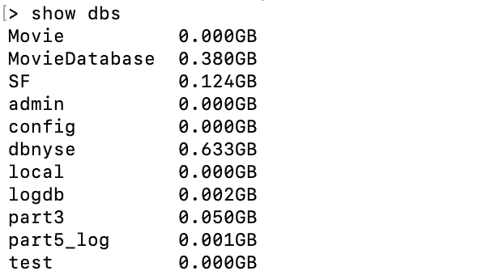
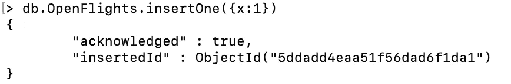
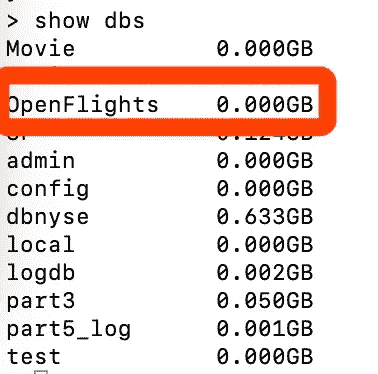
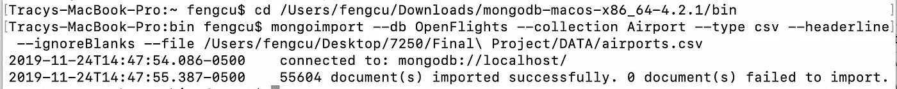
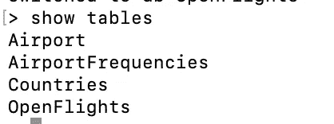
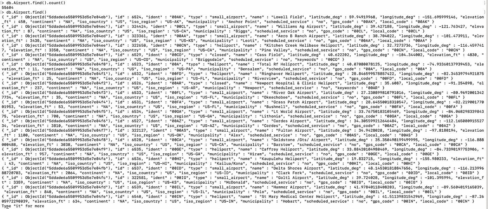
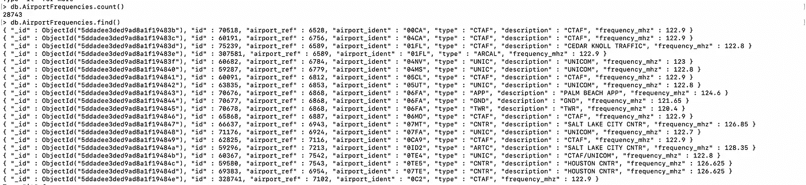

# 进口。CSV 文件导入 MongoDB

> 原文：<https://medium.com/analytics-vidhya/import-csv-file-into-mongodb-9b9b86582f34?source=collection_archive---------1----------------------->

当我们使用大数据数据库存储和分析数据集时，第一步是将数据导入数据库。本文重点介绍使用内置工具“mongoimport”将 CSV 格式数据导入 MongoDB 的详细过程。

由于 mongoimport 工具是官方提供的，所以导入 CSV 格式数据的过程非常简单。它证明了越强大的工具越容易使用。

这些步骤可以通过创建数据库、导入数据、然后查看数据来结束。

# 步骤 1:创建数据库

使用 **show dbs** 呈现所有数据库。

显示数据库

使用**使用 OpenFlights** (新数据库的名称)创建一个新数据库。

使用**插入一个**将一个值插入数据库。

使用 **show dbs** 检查新数据库是否已创建。

# 步骤 2:导入数据

在创建一个新的数据库后，您需要退出 shell 并在 MongoDB 的 bin 目录下导入数据。

使用**mongo import**—db open flights—集合机场—类型 csv — headerline — ignoreBlanks —文件[本地路径]

— db 数据库的名称:定义要将数据导入哪个数据库。

—集合表名称:定义新集合/表的名称。如果省略此参数，则集合的名称将与 CSV 文件的名称相同。

—csv 类型:此文件的类型是 CSV。

—header line:CSV 第一行的内容将是文件名。

— ignoreBlanks:此参数可以忽略文件中的空缺值。

# 步骤 3:查看新数据库

使用**显示数据库**显示所有数据库，然后显示表格/集合。

这是关于该机场数据集的详细信息。

使用 **db.database.find()** 显示详细结果。

这是关于这个国家数据集的详细信息。

如有疑问，请在下方评论。