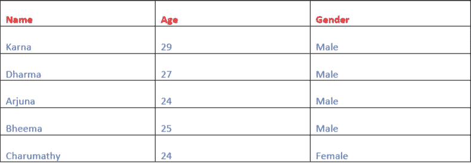
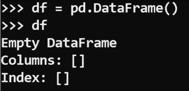
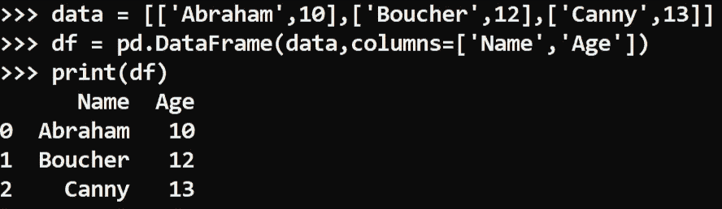
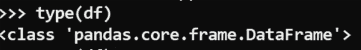
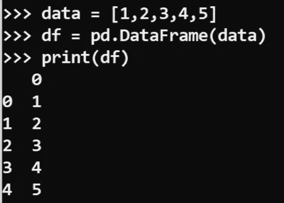

# 进口熊猫作为 pd

> 原文：<https://medium.com/analytics-vidhya/import-pandas-as-pd-26344cd7235e?source=collection_archive---------3----------------------->

## 熊猫的基本常识——适合绝对初学者


法比安·格罗斯在 [Unsplash](https://unsplash.com/s/photos/python-programming?utm_source=unsplash&utm_medium=referral&utm_content=creditCopyText) 上拍摄的照片

在这里，我给你一个绝对初学者的熊猫高层次讲解。在开始学习熊猫之前，最好先了解基本的 python 编程语言。准备好快速浏览。

Pandas 只是一个用于数据操作和分析的 python 库。

> 操纵:操纵这个词用来描述熟练地处理、控制或使用某物。
> 
> 分析:分析就是把一些东西分解成碎片来学习。

我们用熊猫来处理和分析数据。因此，导入数据后，您可以随心所欲地使用熊猫数据。熊猫会像仆人一样为你服务。你只需要知道如何指挥你的仆人。这意味着你应该用你的仆人能理解的语言来命令。现在我希望你对熊猫是如何工作的有一个清楚的概念。

## 进口熊猫

如果你想在你的工作路径中使用熊猫模块。只需用下面的命令导入它。这就像叫你的仆人为你工作。

```
**import pandas as pd**
```

等等，在那之前，确保你已经在你的机器里下载了熊猫。如果没有，使用下面的代码下载这个包(对于 windows)。在叫你的仆人做你的工作之前，指定一个仆人担任那个职位是很重要的，对吗？

```
**pip install pandas**
```

好吧，我们再来看比赛。为什么我们在这里进口熊猫为 ***pd*** ？我解释一下，如果某人的名字很长，我们该怎么称呼？只有一个简短的名字，对吗？事情就是这样的。酷！(*你可以随意使用任何名字*)

```
**import pandas as servant**
```

这个也行，去…

## 什么是 Dataframe？

Dataframe 是二维数据结构(行和列的*组合*)。看看下面。



数据帧

这里没什么好混淆的。想象一个 excel 电子表格。这就是数据框架。

**数据帧的组件**

**系列** : *数据帧中的每一列都是系列*。*系列是一维结构。两个相关系列的组合是一个数据框架。*

*例子:数组。*

**标签:***每一列的标题都是标签。它也被称为变量。姓名、年龄和性别是上述数据帧中相应列的标签。*

现在让我们知道如何在熊猫中构建数据帧。现在你要命令你的仆人为你构建一个数据框架。正如我已经说过的，要做到这一点，你应该用他能理解的语言告诉他。你的仆人不懂英语，但他懂语法。让我们学习他的句法语言。加油…

```
**Pd.DataFrame()**
```

每当你命令做某事时，用一个左右括号。我在这里用一种容易理解的方式解释它实际上是如何工作的。如果你那样做，他会明白你是在请他帮你的忙。他的大脑有一些固有的功能。如果你用括号提到你的工作，他会在他的大脑中搜索这个功能(*你分配去做的工作*)是否是他大脑中固有的。如果有，他知道怎么做，他会为你做的。如果没有，他将抛出一个错误。现在 ***pd*** ( *仆*)会在他的大脑中搜索他大脑中的函数 Dataframe()。是的，它是内置的。所以现在他会用你给定的数据做这项工作，并以你期望的方式呈现。

所以每当你看到函数，想象我上面解释的。

让我们看看它是如何工作的，



空数据帧

我没有给它任何数据，所以它只是创建了一个空的 dataframe。现在让我们试着传递一些数据。



数据帧

现在它创造了一个完美的数据框架。它自动为我们的 dataframe 创建了一个索引 0，1，2…在 dataframe 函数中我们可以使用很多构造函数(选项)。函数是我们分配给熊猫和构造函数的工作，我们也定义了它们如何完成这项工作。

如果我们想查看我们创建的数据帧的数据类型，只需执行以下代码。

```
**type(df)**
```



数据帧的数据类型

现在让我们尝试在数据帧中传递列表。

我们都知道列表是一维的，对吧？

那我们如何在二维数据框架中传递这个呢？

如果我们从列表中创建一个数据帧，数据帧会是什么样的？



使用列表创建的数据帧

在这里，它用默认索引为我们创建了一个单独的列。Pandas 数据框架可以使用各种输入来创建，如列表、字典、系列、数字数组和其他数据框架。

继续在旁边练习。快乐学习！

> 请随时询问您的疑问，写下您的疑问/错误作为回应。如果你想要熊猫的任何特定主题的教程，请提及。跟进更新。