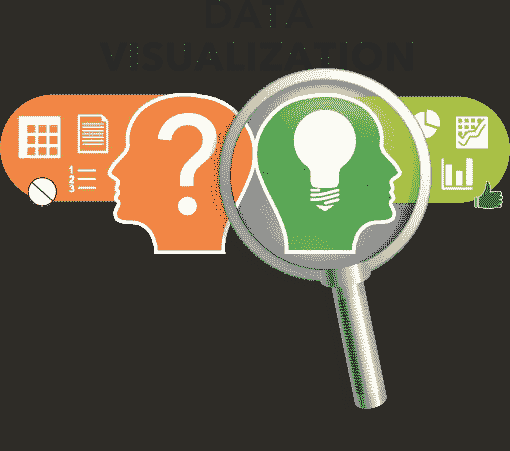
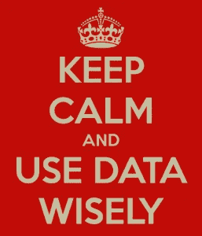

# 数据可视化的重要性！

> 原文：<https://medium.com/analytics-vidhya/importance-of-data-visualization-be16e585ee09?source=collection_archive---------17----------------------->

在数据科学中,“最重要的”技能之一是可视化和理解数据的趋势、分布和复杂性。然而，现在的大部分在线课程主要集中在机器学习和算法如何工作上。

我并不是说知道机器学习不重要，显然，要成为最好的数据科学家，一个人应该熟悉大多数机器学习算法，但是，数据科学并不局限于机器学习，它是一种可以获得的技能，通过获得技能，我的意思是你对该领域的理解程度，你对数据的挖掘程度:捕捉隐藏的见解，并以最好的方式宣扬发现的隐藏的数据宝藏(讲故事)。

照片由[与 Raj](https://unsplash.com/@roadtripwithraj?utm_source=medium&utm_medium=referral) 在 [Unsplash](https://unsplash.com?utm_source=medium&utm_medium=referral) 的公路旅行拍摄

## 什么是数据可视化？

*   数据可视化是获取信息(数据)并将其放入可视化环境(如地图或图表)的方法。
*   主要目标是将大型数据集过滤成可视化图形，以便于理解数据中的复杂关系。

> 正如 UMIACS 的 Ben Schneiderman 教授所说。
> 
> 视觉化给你一些你不知道的问题的答案

照片由 [William Iven](https://unsplash.com/@firmbee?utm_source=medium&utm_medium=referral) 在 [Unsplash](https://unsplash.com?utm_source=medium&utm_medium=referral) 上拍摄

## 为什么数据可视化很重要？

*   数据可视化越来越被视为任何成功的数据驱动分析策略的最后一步。
*   当数据科学家在一个复杂的项目中时，他们需要一种方法来理解正在收集的数据，以便他们可以监控和调整他们的流程，以确保它以应有的方式执行。
*   数据可视化还使检测数据组中的模式、趋势和异常值变得更加容易。
*   引导目标受众关注业务洞察力，以发现需要关注的领域。
*   揭示以前没有注意到的关于数据源的关键点，以帮助决策者撰写数据分析报告。
*   它通过将大量数据转换成易于理解的图片和图形，帮助向风险承担者和其他团队成员提供高质量的信息。

> [**根据**](https://www.tableau.com/learn/articles/data-visualization) **的画面显示，“数据可视化是培养最有用的职业技能之一。你越能直观地传达你的观点，你就能越好地利用这些信息。”**

## 数据可视化的优势-

考虑到数据对业务增长的影响，以下是一些好处:

*   有助于识别最新趋势，以改进产品并增加业务利润。
*   数据可视化使大数据和小数据更容易被人脑理解，从而进行更好的分析。
*   有助于理解故事——人类的大脑不能理解，甚至不能立刻想象大量的数字或文本。它需要一种视觉表现来理解它们，从而将原始数据转化为有形的概念。

有不同的可视化数据的技术，但是没有一种技术是专门针对这个问题的。

讲故事比绘制复杂的图表更重要。查看 [**不同的数据可视化技术**](/@abhigyan.singh282/different-visualization-techniques-a2a461c31dff) 。

喜欢我的文章？请为我鼓掌并分享它，因为这将增强我的信心。此外，我每周日都会发布新文章，所以请保持联系，以了解数据科学和机器学习基础系列的未来文章。

另外，请务必在 linkedIn 上与我联系。

马特·博茨福德在 [Unsplash](https://unsplash.com?utm_source=medium&utm_medium=referral) 上拍摄的照片