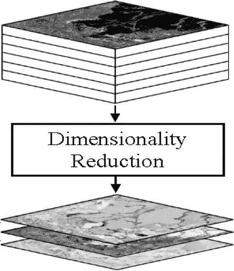

# 降维的重要性！！

> 原文：<https://medium.com/analytics-vidhya/importance-of-dimensionality-reduction-d6a4c7289b92?source=collection_archive---------3----------------------->

在机器学习和统计中，为了建立一个性能良好的模型，我们试图传递数据集中那些彼此重要的特征。

## 换句话说，**降维**是通过获得一组主变量来减少所考虑的随机变量的数量的过程。

## 高维数据的问题？

1.  这可能意味着执行学习的高计算成本。
2.  在学习模型时，它经常导致[过拟合](/analytics-vidhya/over-fitted-and-under-fitted-models-f5c96e9ac581)，这意味着该模型在训练数据上表现良好，但在测试数据上表现不佳。
3.  数据很少在高维空间中随机分布，而是高度相关的，通常带有虚假的相关性。
4.  最近和最远数据点之间的距离在高维空间中可能变得等距，这可能会妨碍一些基于距离的分析工具的准确性。

## 为什么我们需要降维？

*   降维有助于解决这些问题，同时试图保留数据中学习准确预测模型所需的大部分相关信息。
*   做最终预测所依据的因素往往太多。这些因素基本上是称为特征的变量。
*   特征的数量越多，可视化训练集并对其进行处理就越困难。
*   有时，这些特征中的大多数是相关的，因此是多余的。这就是降维算法发挥作用的地方。

## 降维的重要性？

*   它减少了所需的时间和存储空间。
*   它有助于消除多重共线性，从而改善对机器学习模型参数的解释。
*   当数据降低到非常低的维度时，如 2D 或 3D，将变得更容易可视化。
*   它避免了[维数灾难](https://en.wikipedia.org/wiki/Curse_of_dimensionality)。
*   它从数据中移除不相关的要素，因为数据中包含不相关的要素会降低模型的准确性，并使您的模型基于不相关的要素进行学习。

> 在机器学习中，“维度”只是指数据集中的特征/变量的数量。
> 
> 当特征/变量的数量相对于数据集中的观察值数量非常大时，*某些*算法很难训练出有效的模型。这被称为“维数灾难”

## 降维可以分为:

1.  **特征选择-**
    特征选择是机器学习中引入的一种方法，目的是从数据中去除不太重要的特征，从而只针对对预测(因变量)贡献最大的特征来训练模型。
    *类型的特征选择方法有:
    *过滤
    *包装
    *嵌入*
2.  **特征提取-** 特征提取是一个降维的过程，通过这个过程，原始数据的初始集合被减少到更易于管理的组中进行处理。
    该过程通常是对图像和文本数据进行的，其中仅提取重要特征并提前发送进行处理，而不是获取整个数据。
    特征提取可以是无监督的(PCA)或有监督的(LDA)。

**我们将在接下来的文章中看到每种方法和技术！敬请关注。**

**快乐学习！！！！！**

喜欢我的文章？请为我鼓掌并分享它，因为这将增强我的信心。此外，我每周日都会发布新文章，所以请保持联系，以了解数据科学和机器学习基础系列的未来文章。

另外，请务必在 linkedIn 上与我联系。

亚历克斯在 [Unsplash](https://unsplash.com?utm_source=medium&utm_medium=referral) 上的照片