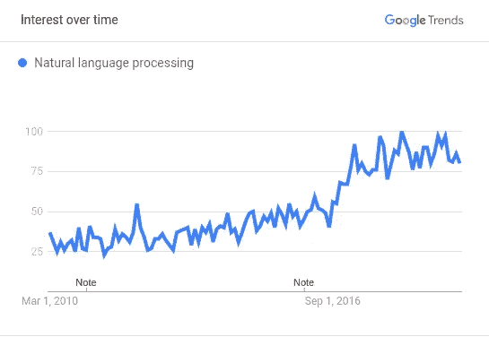

# 你应该知道的重要自然语言处理框架(NLP 信息图)

> 原文：<https://medium.com/analytics-vidhya/important-natural-language-processing-frameworks-you-should-know-nlp-infographic-549680f4d5e7?source=collection_archive---------2----------------------->

你听说过最近发布的最新的[自然语言处理](https://courses.analyticsvidhya.com/courses/natural-language-processing-nlp/?utm_source=blog&utm_medium=complete-list-important-frameworks-nlp)框架吗？

如果您还在追赶一流的 StanfordNLP 库或 PyTorch-Transformers 框架，我不会责怪您！

> 在过去的几年里，自然语言处理领域的研究和突破有了显著的增长。

我可以将最近的这种上升追溯到一篇(地震)论文——谷歌人工智能在 2017 年 6 月发表的“注意力是你所需要的一切”。

这一突破产生了如此多令人兴奋的新 NLP 库，使我们能够以以前仅限于我们想象(或好莱坞)的方式处理文本。

根据过去 5 年在美国的谷歌搜索，以下是对自然语言处理的兴趣:

当我们将搜索范围扩大到全球时，我们可以在[看到类似的模式](https://trends.google.com/trends/explore?cat=1227&date=2010-03-01%202019-08-22&q=%2Fm%2F05flf)！

今天，我们有最先进的方法来进行[语言建模](https://www.analyticsvidhya.com/blog/2019/08/comprehensive-guide-language-model-nlp-python-code/?utm_source=blog&utm_medium=complete-list-important-frameworks-nlp)、[迁移学习](https://www.analyticsvidhya.com/blog/2017/06/transfer-learning-the-art-of-fine-tuning-a-pre-trained-model/?utm_source=blog&utm_medium=complete-list-important-frameworks-nlp)以及许多其他重要和高级的 NLP 任务。其中大部分都涉及到深度学习的应用，尤其是上文中介绍的 Transformer 架构。

所以我们决定在一个地方和一个整洁的时间表中整理所有重要的发展。

*我在下面列出了几个教程来帮助你开始使用这些框架:*

*   [*变形金刚在 NLP 中是如何工作的？*](https://www.analyticsvidhya.com/blog/2019/06/understanding-transformers-nlp-state-of-the-art-models/?utm_source=blog&utm_medium=complete-list-important-frameworks-nlp)
*   [*使用 Python 中的 ULMFiT 和 fastai 库进行文本分类(NLP)的教程*](https://www.analyticsvidhya.com/blog/2018/11/tutorial-text-classification-ulmfit-fastai-library/?utm_source=blog&utm_medium=complete-list-important-frameworks-nlp)
*   [*Stanford NLP 简介:一个令人难以置信的 53 种语言的最先进的 NLP 库*](https://www.analyticsvidhya.com/blog/2019/02/stanfordnlp-nlp-library-python/?utm_source=blog&utm_medium=complete-list-important-frameworks-nlp)
*   [*用 Python 构建自己语言模型的全面指南！*](https://www.analyticsvidhya.com/blog/2019/08/comprehensive-guide-language-model-nlp-python-code/)
*   [*OpenAI 的 GPT-2:用 Python 构建世界上最先进的文本生成器的简单指南*](https://www.analyticsvidhya.com/blog/2019/07/openai-gpt2-text-generator-python/?utm_source=blog&utm_medium=complete-list-important-frameworks-nlp)
*   [*py torch-Transformers 简介:一个不可思议的最新 NLP 库(带 Python 代码)*](https://www.analyticsvidhya.com/blog/2019/07/pytorch-transformers-nlp-python/?utm_source=blog&utm_medium=complete-list-important-frameworks-nlp)
*   [*使用 Python 进行自然语言处理的综合教程*](https://courses.analyticsvidhya.com/courses/natural-language-processing-nlp/?utm_source=blog&utm_medium=complete-list-important-frameworks-nlp)

没有任何进一步的麻烦，这里是它所有的荣耀信息图！如果你想下载高分辨率的 PDF 文件(你真的应该这么做)，请点击这里。

NLP 最新突破

*原载于 2019 年 8 月 28 日*[*https://www.analyticsvidhya.com*](https://www.analyticsvidhya.com/blog/2019/08/complete-list-important-frameworks-nlp/)*。*