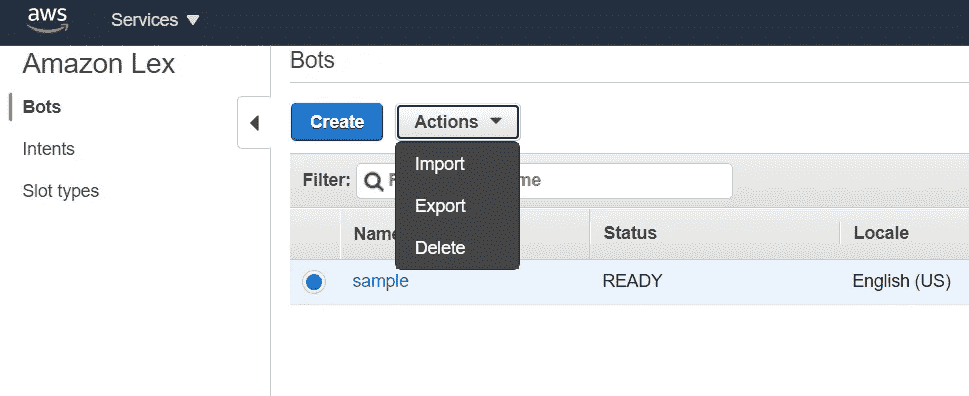
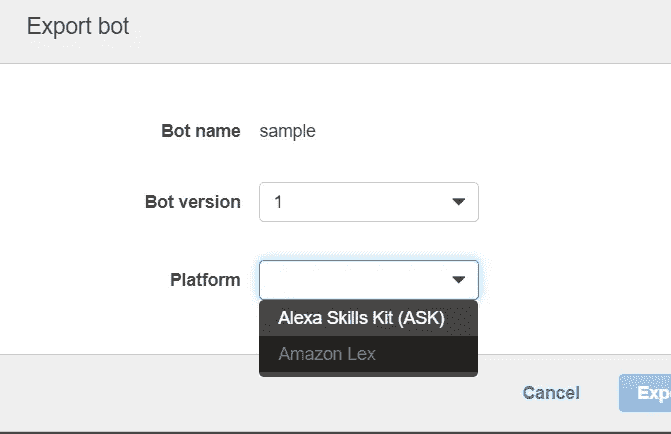
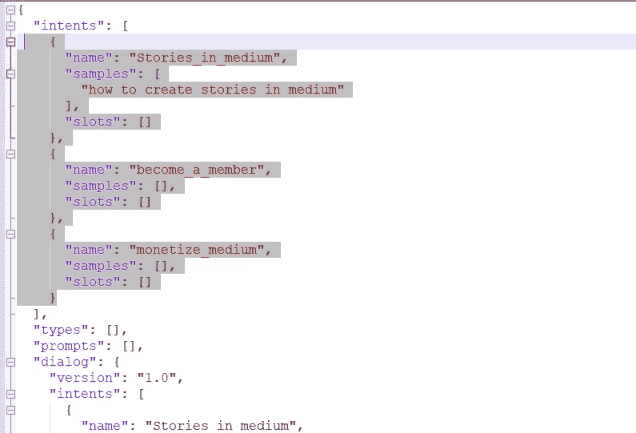
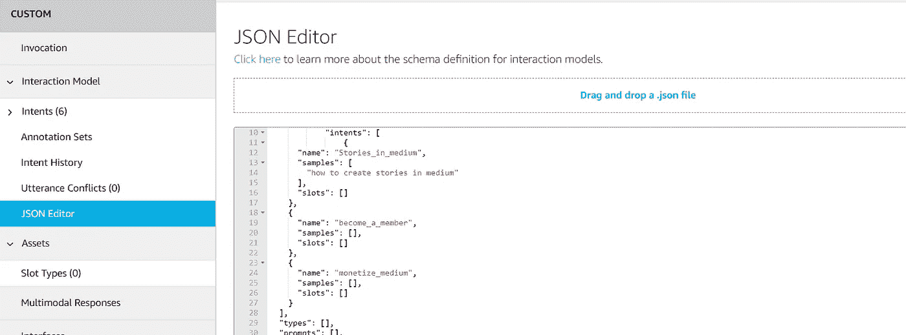
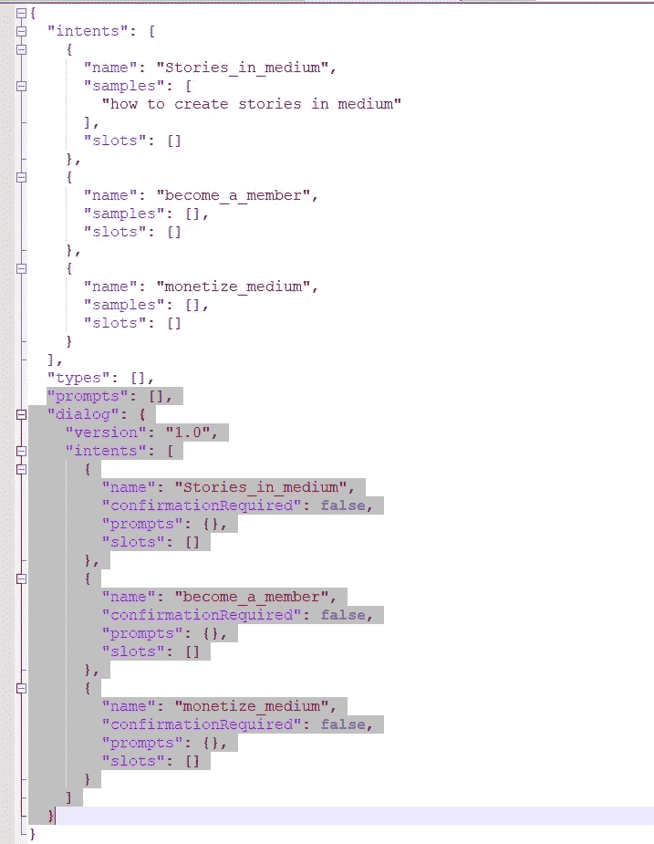
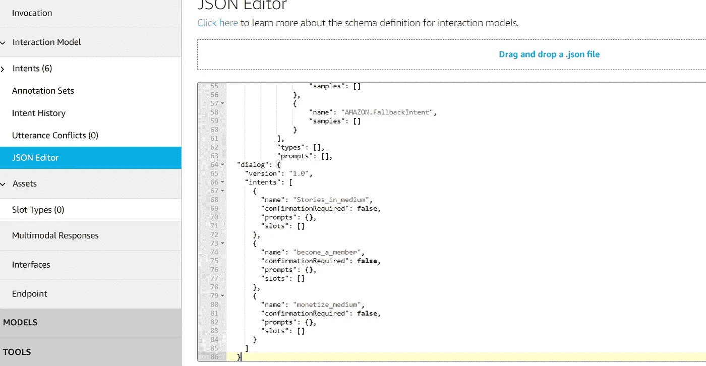
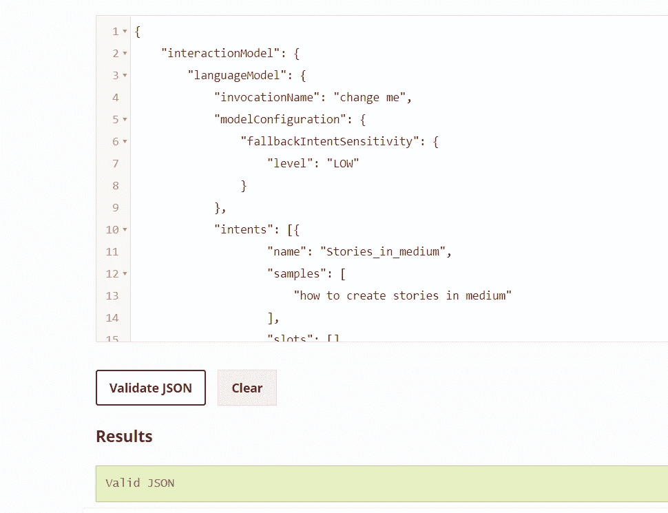
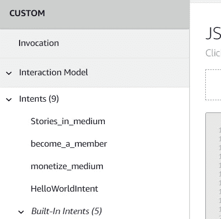

# 从 Lex 导入 bot 并导出到 AWS Alexa

> 原文：<https://medium.com/analytics-vidhya/importing-bot-from-lex-and-exporting-to-aws-alexa-940d5c20cf5f?source=collection_archive---------22----------------------->

1.  从 lex 导出机器人。

2.当输出时选择技能为 Alexa。

3.一个 zip 文件被下载到你的本地，解压后你会发现一个 json 文件。首先只将意图复制粘贴到 Alexa JSON 编辑器的 intent 部分，并在花括号的末尾添加一个逗号。

将它添加到在交互模型中找到的 JSON 编辑器中。保存并构建。

4.复制粘贴从 lex 获得的 JSON 中的提示和对话。

5.如果你的技能是新创造的，现在你会发现类型，只要在它下面添加提示和对话。如果你的 Alexa 技能已经有一些自定义意图，那么它会有一个对话，你可以在那个部分添加这些意图对话。

6.你可以使用 [JSONlint](https://jsonlint.com/?code=) 来检查添加后它是否是一个有效的 JSON。一旦有效，保存并建立你的技能。

7.一旦构建成功，您将会在 intents 部分找到创建的意图。

