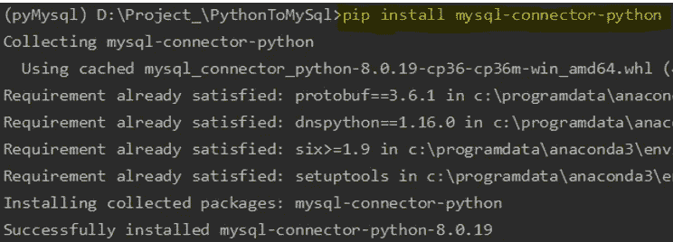
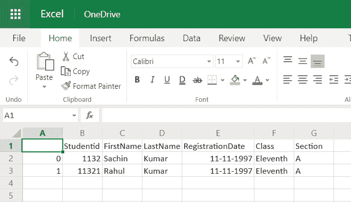

# 将 MySQL 数据库中的数据导入 Pandas 数据框

> 原文：<https://medium.com/analytics-vidhya/importing-data-from-a-mysql-database-into-pandas-data-frame-a06e392d27d7?source=collection_archive---------0----------------------->

本文说明了如何从表中导入数据集的基本操作。数据库取为 MySQL。


数据库是数据科学的必备工具吗？

是的，这是必不可少的东西。没有数据，数据分析和预测就做不起来。对！。数据可以是任何一种格式，可以在 CSV，XLS。考虑销售过去 5 年多种产品的零售组织。公司决定预测未来两年的销售额。

我明白你在想什么？基本上，尝试将数据导出到 CSV 文件。这在熊猫数据框中很容易处理。但是事情并不是这样进行的，因为预测并不依赖于单一的表格。它取决于多个表，如交易、销售、客户评论、5 年产品收入，这些都需要查看以确定预测。最佳方法是将表直接导入到数据框中。这将更容易从各个角度分析数据。

要使用 pandas 连接 MySQL，需要按照下面的命令安装包' mysql-connector-python'。

```
**pip** install mysql-connector-python
```

对于[参考](https://pypi.org/project/mysql-connector-python/)



软件包安装控制台

```
**import** mysql.connector **as** connection
**import** pandas **as** pd**try**:
    mydb = connection.connect(host="localhost", database = 'Student',user="root", passwd="root",use_pure=True)
    query = "Select * from studentdetails;"
    result_dataFrame = pd.read_sql(query,mydb)
    mydb.close() #close the connection**except** Exception **as** e:
    mydb.close()
    print(str(e))
```

**mysql.connector** 使用 python 提供所有的数据库操作。让我们更深入地了解代码逻辑实现。

***connection.connect(主机，数据库，用户，密码，use_pure)***

主机—提供 MySQL 服务器的主机名。通常，如果我们在本地安装我们的机器，那么它被称为“本地主机”。像云/专用第三方服务器这样的情况在那里提供 IP 地址。

database-提供要操作的数据库的名称。

用户名和密码——访问数据库的凭证。通常，所有数据库都设置了凭证，以确保安全访问。

use _ pure 符号化 Python 实现

***pandas.read_sql(sql，con)***

将 SQL 查询或数据库表读入数据帧。

sql-要执行的 SQL 查询或表名。

con——使用 SQLAlchemy 可以使用该库支持的任何数据库。如果是 DBAPI2 对象，则仅支持 sqlite3。用户负责 SQLAlchemy connectable 的发动机处理和连接关闭。

```
result_dataFrame = pd.read_sql(query, mydb)
```

数据框参考保存 SQL 查询的结果。

```
**result_dataFrame**.head()
```


学生表的数据框

**将数据集导出到 CSV**

我们也将表格数据导出为 CSV 格式

```
**result_dataFrame**.to_csv('**Test**.csv')
```

执行该命令后，生成如下 CSV 文件，



导出到 csv 文件

本文将帮助您基本了解如何使用 Pandas 将表导入到数据框中。

快乐编码:)