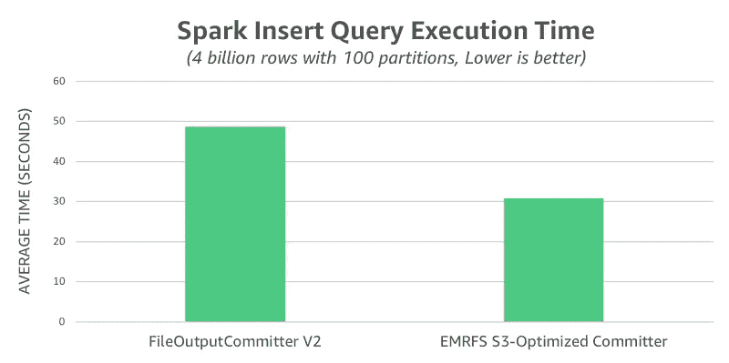
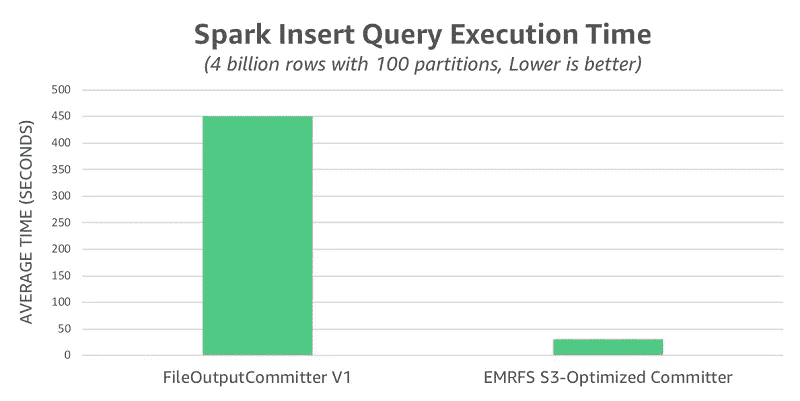
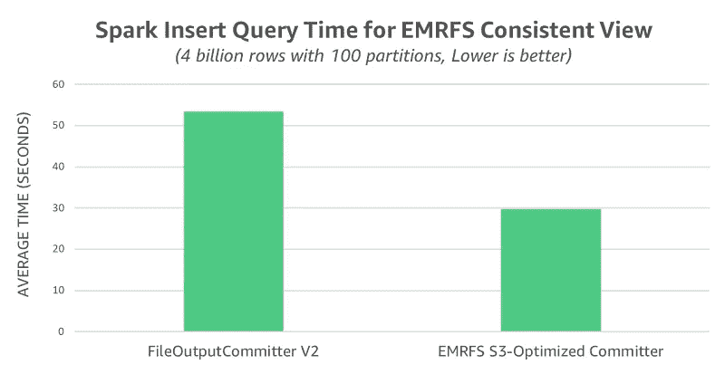

# 提高火花写入性能

> 原文：<https://medium.com/analytics-vidhya/improve-spark-write-performance-d187efb8c8bf?source=collection_archive---------9----------------------->


EMRFS S3 优化提交器是一个新的输出提交器，从 Amazon EMR 5.19.0 开始，可以与 Apache Spark 作业一起使用。当使用 [E](https://docs.aws.amazon.com/emr/latest/ManagementGuide/emr-fs.html) MR 文件系统(EMRFS)将 Apache Parquet 文件写到 [S](https://aws.amazon.com/s3/) 3 时，这个提交器提高了性能。在本文中，我们运行了一个性能基准来比较这个新的优化提交器和现有的提交器算法，即 FileOutputCommitter 算法版本 1 和 2。最后，我们讨论了新提交者的当前限制，并在可能的情况下提供了解决方法。

## 与 FileOutputCommitter 的比较

在亚马逊 EMR 版本 5.19.0 和更早版本中，将拼花写入亚马逊 S3 的 Spark 作业默认使用名为 FileOutputCommitter 的 Hadoop 提交算法。这个算法有两个版本，版本 1 和版本 2。两个版本都依赖于将中间任务输出写入临时位置。它们随后执行重命名操作，使数据在任务或作业完成时可见。

算法版本 1 有两个重命名阶段:一个阶段提交单个任务输出，另一个阶段提交已完成/成功任务的整体作业输出。算法版本 2 更有效，因为任务将重命名文件直接提交到最终输出位置。这消除了第二个重命名阶段，但它使部分数据在作业完成前可见，这不是所有工作负载都能容忍的。

在 Hadoop 分布式文件系统(HDFS)上执行的重命名是快速的纯元数据操作。然而，当输出被写入对象存储(如 Amazon S3)时，重命名是通过将数据复制到目标然后删除源来实现的。这种重命名“损失”随着目录重命名而加剧，这可能发生在 FileOutputCommitter v1 的两个阶段。尽管在 HDFS 上只有单个元数据操作，但提交者必须在 S3 上执行 N 次复制和删除操作。

为了部分缓解这种情况，在 Spark 中使用 emrf 将拼花数据写入 S3 时，Amazon EMR 5.14.0+默认使用 FileOutputCommitter v2。新的 EMRFS S3 优化提交器改进了这项工作，通过使用 Amazon S3 多部分上传的事务属性来完全避免重命名操作。然后，任务可以将其数据直接写入最终输出位置，但是将每个输出文件的完成推迟到任务提交时间。

## 特性试验

当通过执行下面的`INSERT OVERWRITE` Spark SQL 查询来评估不同提交者的写性能时。`SELECT * FROM range(…)`子句在执行时生成数据。这在亚马逊 S3 的 100 个拼花文件中产生了大约 15 GB 的数据。

```
SET rows=4e9; -- 4 Billion 
SET partitions=100;  
INSERT OVERWRITE DIRECTORY ‘s3://${bucket}/perf-test/${trial_id}’ USING PARQUET SELECT * FROM range(0, ${rows}, 1, ${partitions});
```

**注意**:EMR 集群和 S3 `bucket`运行在同一个 AWS 区域。属性使用了一个 UUID 生成器来确保测试运行之间没有冲突。

我们在使用 emr-5.19.0 版本标签创建的 EMR 集群上执行了测试，主组中有一个 m5d.2xlarge 实例，核心组中有八个 m5d.2xlarge 实例。我们使用 Amazon EMR 为这个集群配置设置的默认 Spark 配置属性，包括以下内容:

```
spark.dynamicAllocation.enabled true 
spark.executor.memory 11168M 
spark.executor.cores 4
```

在为每个提交者运行 10 次试验之后，我们在下面的图表中捕获并总结了查询执行时间。FileOutputCommitter v2 平均耗时 49 秒，而 EMRFS S3 优化提交器平均耗时仅为 31 秒，速度提高了 1.6 倍。



如前所述，FileOutputCommitter v2 消除了 FileOutputCommitter v1 使用的一些(但不是全部)重命名操作。为了说明重命名对 S3 的全部性能影响，我们使用 FileOutputCommitter v1 重新运行测试。在这个场景中，我们观察到平均运行时间为 450 秒，比 EMRFS S3 优化提交器慢 14.5 倍。



我们评估的最后一个场景是启用 [EMRFS 一致视图](https://docs.aws.amazon.com/emr/latest/ManagementGuide/emr-plan-consistent-view.html)的情况，这解决了亚马逊 S3 数据一致性模型可能引起的问题。在这种模式下，EMRFS S3 优化的提交器时间不受此更改的影响，仍然平均为 30 秒。另一方面，FileOutputCommitter v2 的平均时间为 53 秒，比关闭一致视图功能时要慢，从而将整体性能差异扩大到 1.8 倍。



# 启用 EMRFS S3 优化提交器

从 Amazon EMR 版本 5.20.0 开始，默认情况下启用 EMRFS S3 优化提交器。在 Amazon EMR 版本 5.19.0 中，您可以通过在 Spark 中或者在创建集群时将`spark.sql.parquet.fs.optimized.committer.optimization-enabled`属性设置为`true`来启用提交器。当您使用 Spark 的内置拼花支持通过 EMRFS 将拼花文件写入亚马逊 S3 时，提交器生效。这包括将 Parquet 数据源与 Spark SQL、DataFrames 或 Datasets 一起使用。然而，在一些用例中，EMRFS S3 优化提交器不起作用，在一些用例中，Spark 完全在提交器之外执行自己的重命名。有关提交器和这些特殊情况的更多信息，请参见*亚马逊 EMR 发布指南*中的[使用 EMRFS S3 优化提交器](https://docs.aws.amazon.com/emr/latest/ReleaseGuide/emr-spark-s3-optimized-committer.html)。

# 摘要

与 FileOutputCommitter 相比，EMRFS S3 优化提交器提高了写入性能。从亚马逊 EMR 版本 5.19.0 开始，可以通过 Spark 内置的拼花支持来使用它。

这篇文章摘自亚马逊网络服务博客。

如果你喜欢这篇文章，请点击👏所以其他人会在媒体上看到它。