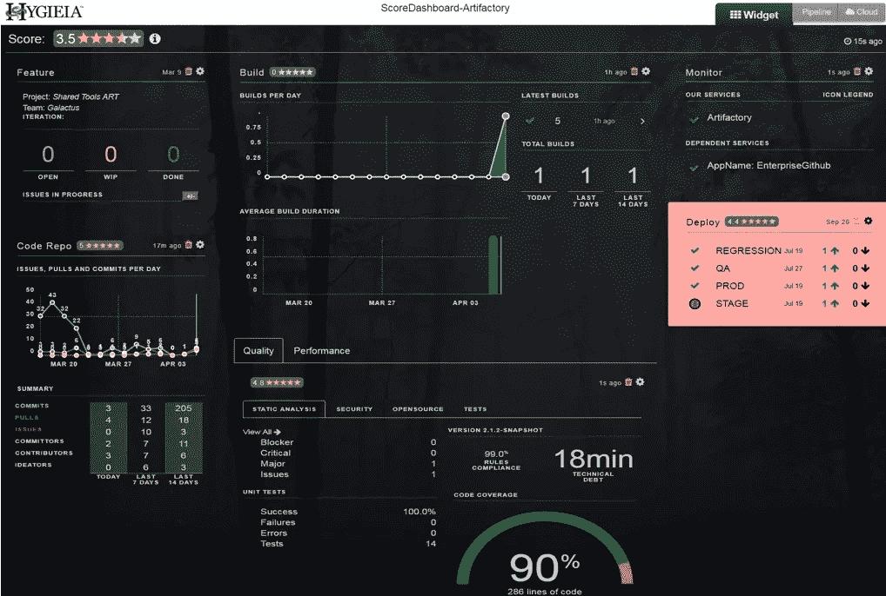
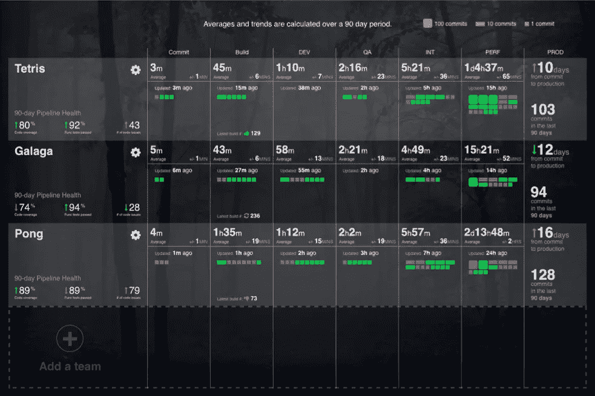
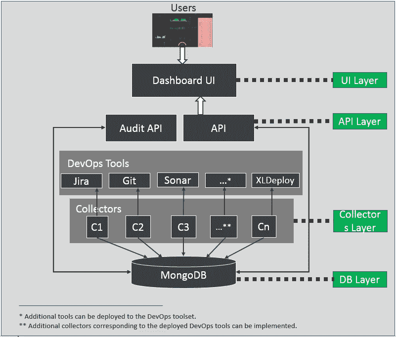

# DevOps-卫生

> 原文：<https://medium.com/analytics-vidhya/improve-the-productivity-with-hygieia-e95ad71c81fd?source=collection_archive---------10----------------------->

信贷-[https://www.softwaresuggest.com](https://www.softwaresuggest.com/blog/best-employee-performance-management-tools/)

有许多 DevOps 工具可用于改进我们的产品交付，包括 Jenkins、Gitlab、TeamCity、SonarQube、吉拉等。源代码管理(SCM)、构建、代码分析、部署、Sprint 进度是上面提到的工具试图专门针对的领域。来自 [CapitalOne](https://www.capitalone.com/tech/solutions/hygieia/) 的 Hygieia 将它们结合起来，在单一窗口的 HTML 上显示适当的结果。

卫生仪表板有助于实现过程透明，因此有助于建立反馈循环，这是精益和 DevOps 的基本概念。它们包含交互式元素，支持向下钻取和链接到连接的工具。

它不是 Gitlab 或 Jenkins 的替代品，而是一个像聚合器一样工作并改进我们产品交付的工具。这对开发商和企业都有好处。

这里有一个来自卫生工具的**团队仪表盘**的截图。

团队仪表板

这张截图你看到了什么？

像组件这样的小部件可以显示产品的整体健康状况。每个部件都有特定的用途。例如，Code Repo 小部件显示了每天发生的提交、发布和拉取的趋势。部署小组件显示最新部署(失败或成功)。构建小部件显示了每天发生的构建数量的趋势。还有其他小部件，如代码分析、性能、日志、管道等，这使得该工具在范围和多样性方面都很丰富。

这是我们在上面的截图中看到的团队仪表板，它还有一个称为**产品仪表板**的仪表板，经理和产品负责人可以使用它来查看他们的团队在每个方面的表现，并采取适当的行动。

这是产品仪表板的样子-

产品仪表板

我们可以清楚地看到，这是通过分别比较每个方面来显示每个团队在单个窗口上的表现。这给了经理和产品所有者一个公平的想法，关于他们的团队进展如何，以及需要采取什么行动来改进每个团队的交付。

## 它是如何工作的？

Hygieia 从 Gitlab、GitHub、TeamCity 等 devOps 工具获取数据，并对这些数据进行计算，以在小部件上显示数据。

卫生建筑

有 4 个不同的层协同工作，在仪表板上显示数据。

***UI 层***

这一层负责在用户指示板上显示数据。

***API 层***

该层负责向 UI 层发送数据，并在仪表板上的配置发生变化时更新数据库。

***吏层***

该层负责从 DevOps 工具(如 Jenkins、gitlab 等)获取数据，并将数据保存到 mongodb 的一个独立数据库中。

***DB 层***

这一层负责存储来自收集器的数据。每当请求时，它就向 API 层提供这些数据。

每个工具都有单独的收集器，并且是开源的。你可以在这里找到它们。如果你愿意，你也可以通过创建新的收藏者来为社区做贡献，这并不难。这些收集器在运行时从配置的端点获取数据，并将这些结果以集合的形式存储在数据库中。

## 结论

尽管我们在市场上有许多 DevOpsTools，但就范围和显示产品的整体健康状况而言，Hygieia 仍以其丰富性脱颖而出。它通过建议需要采取哪些措施来帮助识别缺陷并纠正它们。在产品仪表板的帮助下，它帮助企业查看不同团队的交付，并确定他们需要工作的领域。

关于如何配置 Hygieia，我准备单独写一篇帖子。到那时**快乐阅读！**