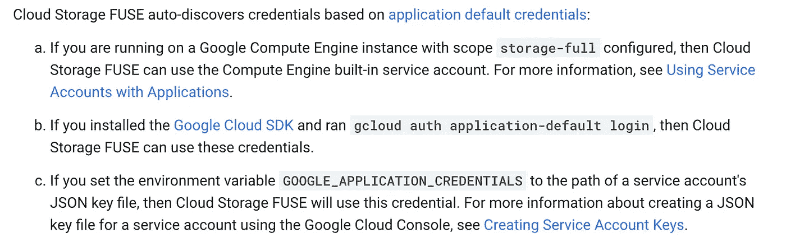

# 使用云存储 FUSE 改进工作流

> 原文：<https://medium.com/analytics-vidhya/improve-workflow-with-cloud-storage-fuse-89b8d76d0886?source=collection_archive---------10----------------------->


我使用云存储 Fuse 已经一年多了，我发现它在自动化/改进数据工程项目工作流方面非常有用。作为开源 FUSE [实现](https://github.com/libfuse/libfuse)的适配器，云存储 FUSE 允许我们挂载一个 GCS 桶作为文件系统。

这使我们的语法保持干净，因为我们可以用本地路径引用我们的文件，而不是通过 GCS 客户端库来读/写多行代码。

下面是设置它的方法:

*注意:* *我在我的计算引擎 VM 中使用的是 Ubuntu 18.04 LTS 镜像；GCS Fuse 目前不支持 Windows (* [*仅适用于 Linux/MacOS*](https://cloud.google.com/storage/docs/gcs-fuse) *)。*

**步骤 0:安装 Google Cloud SDK(如果您尚未安装)**

[https://cloud.google.com/sdk/docs/quickstart-debian-ubuntu](https://cloud.google.com/sdk/docs/quickstart-debian-ubuntu)

**第一步:认证**

首先，我们需要对 GCS Fuse 进行身份验证才能工作。FUSE 将通过以下三种方法中的任何一种自动发现凭据:



出于我们的目的，我们将使用第三个选项设置环境变量:

```
gcloud auth application-default login
```


**第二步:安装云存储保险丝**

认证之后，我们会在我们的 Ubuntu 机器上安装云存储 FUSE。这些信息可以在 Github 上找到，并为其他 Linux 发行版和 Mac OS 提供了指导。

```
export GCSFUSE_REPO=gcsfuse-`lsb_release -c -s`echo "deb http://packages.cloud.google.com/apt $GCSFUSE_REPO main" | sudo tee /etc/apt/sources.list.d/gcsfuse.list
curl https://packages.cloud.google.com/apt/doc/apt-key.gpg | sudo apt-key add -sudo apt-get update
sudo apt-get install gcsfuse
```


安装云存储保险丝

**第三步:安装云存储桶**

现在我们已经在机器上安装了 gcsfuse，我们将把我们的 GCS bucket 挂载为一个文件系统。我使用下面的函数创建了一个默认配置的 bucket，然后上传了两个 csv 文件。

```
gsutil mb gs://test-gcsfuse8592
```


为了挂载云存储 FUSE，我们首先创建一个新的空文件夹，然后运行 gcsfuse 来在该文件夹中挂载我们的 bucket。

```
mkdir test-bucketgcsfuse --implicit-dirs test-gcsfuse8592 test-bucket/
```


注意:*有几个标志可以用来改变 gcsfuse 的工作方式；我个人总是使用 implicit-dirs 标志运行函数，但是这也有一些缺点，尤其是如果您有很多文件并且担心延迟的话。更多信息请访问:*[*https://github . com/Google cloud platform/GCS fuse/blob/master/docs/semantics . MD*](https://github.com/GoogleCloudPlatform/gcsfuse/blob/master/docs/semantics.md)

上面的命令让我们把我们的 bucket 挂载为一个文件系统；我们的 bucket 内容(我们的两个 CSV 文件)现在可以在 test-bucket 文件夹中找到。


**步骤 4:卸载铲斗**

卸载也非常简单，使用以下命令:

```
fusermount -u test-bucket
```

卸载存储桶后，文件夹会保留，但内容会消失。


卸载铲斗

感谢阅读！

— -

这篇文章于 2020 年 8 月 31 日转载到我的个人[博客](https://www.dataarchitecting.com/post/improving-workflow-with-cloud-storage-fuse)上。