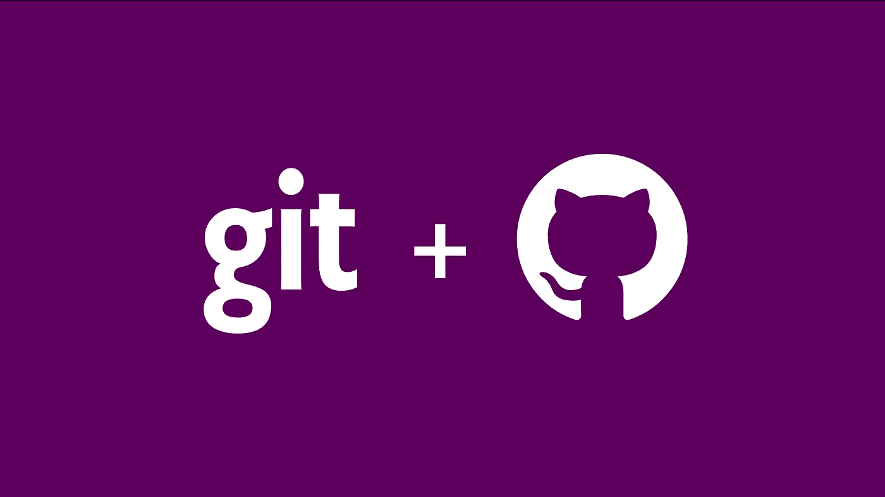
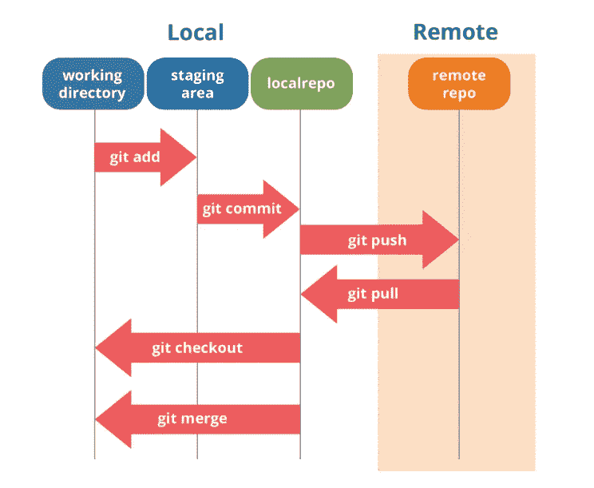

# 提高你的 Git 知识

> 原文：<https://medium.com/analytics-vidhya/improve-your-git-knowledge-df0b73a74a7b?source=collection_archive---------15----------------------->



Git 是一个**分布式版本控制系统**。使用 Git，许多开发人员可以同时对同一个代码库进行更改，而不会遇到像覆盖其他人的更改这样的意外。Git 只会更新文件的不同之处。

编写更小更简单的提交对于改进您的评审过程和整体代码质量有很大的不同。在这一节中，您将看到几个交互式 Git 命令，它们可以帮助您进行提交，以仅包含文件的某些组合和部分。如果您广泛地修改了许多文件，然后决定将这些更改分成几个集中的提交，而不是一个大的混乱的提交，那么这些工具会很有帮助。

## **小犯的好处**:

*   **提交名称更加准确**，可以用来自动生成变更日志。
*   **提交可以在逻辑上分开**，并且可以被与您一起工作的开发人员轻松地审查。
*   **评审更容易**因为小提交是集中提交。

# Git Staging Area 是一个强大的工具

学习如何编写更好、更小的提交的很大一部分是学习如何使用**暂存区**。



[https://www.edureka.co/blog/git-tutorial/](https://www.edureka.co/blog/git-tutorial/)

将您的变更从**工作目录**移动到**暂存区**的典型方法是使用 [git-add](https://git-scm.com/docs/git-add) 命令。有许多参数可以传递给 git-add 命令，并使它以各种方式工作。

> -n |-实际上不添加文件，只显示它们是否存在和/或是否将被忽略
> -v |-verbose 详细。
> -f |-强制允许添加被忽略的文件。
> -I |-交互式将工作树中修改的内容交互式添加到索引中。
> -p | -patch 交互地在索引和工作树之间选择大块的补丁，并将它们添加到索引中。
> -e | -edit 在编辑器中打开 diff vs . index 并让用户编辑它。
> -u | -update 更新索引中已经匹配的条目。
> -一|-全部添加所有文件

在本文中，我们将集中讨论 patch 命令。

## 补丁:

```
git add --patch or git add -p
```

这个命令帮助我们暂存文件的某些**部分**，而不是其余部分。例如，如果我们对您的文件做了两个更改，并且希望暂存其中一个而不暂存另一个，git add -p 将帮助您实现这一点。一旦使用 git add patch，git 会询问您想要部分暂存哪些文件；然后，对于所选文件的每个部分，它将显示文件差异的**大块**，并询问您是否要一个接一个地存放它们:

```
git add --patch
@@ -196,7 +221,6 @@ if __name__ == '__main__':
         else:
             folder_name = year_quarter
-        output_table_path_format = output_base_path + "{file}/"
Stage this hunk [y,n,q,a,d,K,j,J,g,/,e,?]?
```

在这一点上你有很多选择。键入`?`会显示您可以做的事情列表:

> y —暂存此块
> n —不暂存此块
> a —暂存此块和文件中的所有剩余块
> d —不暂存此块和文件中的任何剩余块
> g —选择要转到的块
> / —搜索与给定正则表达式匹配的块
> j —保留此块未决定，查看下一个未决定块
> J —保留此块未决定， 查看下一个区块
> k —将这个区块留为未定，查看上一个未定区块
> K —将这个区块留为未定，查看上一个区块
> s —将当前区块分割成更小的区块
> e —手动编辑当前区块
> ？ —打印帮助

一般来说，如果你想暂存每个块，你可以键入`y`或`n`，但是将它们全部暂存在某些文件中或者跳过一个块的决定直到以后也是有帮助的。

此外，您可以使用补丁模式通过`git reset --patch`命令部分重置文件，通过`git checkout --patch`命令检出部分文件，通过`git stash save --patch`命令隐藏部分文件。

如果你喜欢这篇文章，请点击👏所以其他人会在媒体上看到它。