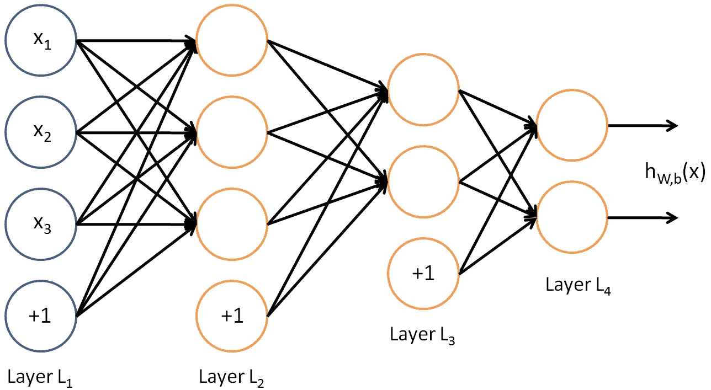
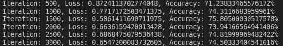
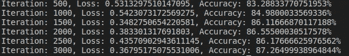
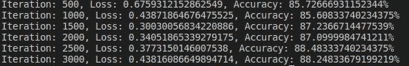
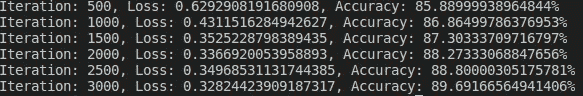
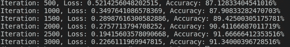
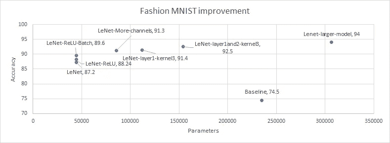

# 使用深度学习提高时尚 MNIST 的准确性

> 原文：<https://medium.com/analytics-vidhya/improving-accuracy-using-deep-learning-for-fashion-mnist-d7a3516af347?source=collection_archive---------4----------------------->

在这篇文章中，我将介绍如何使用深度学习来改善分类任务的结果。

## 深度学习框架

我将使用 [Pytorch](https://pytorch.org/) 库来实现。我们可以使用[康达](https://www.anaconda.com/)按照这个链接安装。

 [## PyTorch

### 选择您的首选项并运行安装命令。稳定代表了当前测试和支持最多的版本…

pytorch.org](https://pytorch.org/get-started/locally/) 

## 玩具数据集

我选择了时尚 MNIST 作为玩具数据集。使用这个数据集，我将尝试从基线改善结果。我们可以从这里得到这个数据集。

 [## 时尚 MNIST

### 一个类似 MNIST 的数据集，包含 70，000 张 28x28 的时尚图片

www.kaggle.com](https://www.kaggle.com/zalando-research/fashionmnist) 

从该链接下载以下内容

 [## 你的数据科学之家

### Kaggle 是世界上最大的数据科学社区，拥有强大的工具和资源来帮助您实现您的数据…

www.kaggle.com](https://www.kaggle.com/zalando-research/fashionmnist/download) 

您将获得一个 archive.zip 文件。从这些文件中，我们需要以下文件

fashion-mnist_train.csv

fashion-mnist_test.csv

下面是数据集【https://github.com/zalandoresearch/fashion-mnist 的解释

这是数据集中的样本图像

时尚 MNIST 数据集

## 基础模型

让我们尝试简单的 3 层神经网络作为我们的基础模型，然后尝试用深度学习的新方法来改进它。

这是一个简单的三层网络示例。

3 —层网络礼遇:[http://deep learning . Stanford . edu/tutorial/supervised/MultiLayerNeuralNetworks/](http://deeplearning.stanford.edu/tutorial/supervised/MultiLayerNeuralNetworks/)

## 加载数据

以下是加载时尚 MNIST 数据集的代码

## 基础模型编码

现在让我们编码一个基本的 3 层神经网络并训练它。

运行此代码后，您将获得如下测试集的准确性

3 层神经网络精度

所以我们的基本模型有 74.5%的准确率。该模型有 235，146 个参数。让我们试着用改进来战胜它。

## LeNet

现在让我们使用名为 [LeNet](https://en.wikipedia.org/wiki/LeNet) 的深度学习模型来提高我们基本模型的性能。这是 LeNet 的基本架构

LeNet 架构

请参考[维基文章](https://en.wikipedia.org/wiki/LeNet)获取解释

这是 LeNet 模型代码

这里只有 44426 个参数，我们得到的准确率是 87.2%！

## 激活单元

现在让我们尝试改进 LeNet 模型。最近的进步是名为 [ReLU](https://en.wikipedia.org/wiki/Rectifier_(neural_networks)) 的新激活单元。让我们用 ReLU 代替 Tanh，看看精度如何提高。

这是代码

我们得到了 88.24%的准确率。这是相当大的进步！

## 批量标准化

[批量规格化](https://en.wikipedia.org/wiki/Batch_normalization)是一种技术，用于在将输入层发送到下一层之前，通过重新定心和重新缩放来规格化输入层。

让我们添加批处理规范化，看看它是否能改善结果。

结果是

太好了！我们将其提高到 89.6%，而没有增加任何参数。

## 做大！！

现在让我们扩大网络，看看它是否能改善结果。

结果是…

酷，我们用 85，918 个参数达到了 91.3%。仍然优于 235，146 个参数的基线。

类似地，模型的一些调整得到了更多的改进。

*   使第 2 层的内核大小从 5 变为 3。112，286 个参数和 91.4%
*   使第 1 层到第 3 层的内核大小从 5。154，270 个参数和 92.5%
*   制作 1 层到 32 层和 2 层到 64 层的输出通道。306，622 个参数和 94.0%

太神奇了！我们利用酷炫的深度学习模型和技术，将准确率从 74.5%提高到 94.0%。

这是参数与精度的关系图

时尚 MNIST 改进

还有更多的参数需要优化，更多的模型需要探索。请调整，让我知道你们能拿出什么。我很好奇！

再见了。