# 使用摘要文本摘要(TextRank 算法)改进客户购买决策

> 原文：<https://medium.com/analytics-vidhya/improving-customer-buying-decision-using-extractivetext-summarization-textrank-algorithm-37e823419b5c?source=collection_archive---------11----------------------->

随着互联网获取信息和获得大量数据的需求不断增长，过滤内容并将丰富的信息转换为捕获关键成分的摘要变得非常重要，这有助于分析和决策。在科技时代，人们通过阅读简短有限的新闻来了解任何一条新闻。

手动分析文本的每个片段并生成摘要既耗时又费力。因此，需要一种自动文本摘要技术来表示最相关的投票回答，以帮助观众吸收信息并节省浏览冗余数据的时间。

网上购物已经成为人类生活的一部分。不同消费者对特定产品的评论摘要可以帮助潜在的购买者识别产品的有用性及其满足消费者需求的能力。使用基于智能计算机的算法的摘要可以帮助捕获文本的基本句法和语义表示。使用这样的系统可以帮助消费者做出购买产品的有效决定。

# 相关著作

***【超诱导话题搜索(点击数)***

超诱导主题搜索算法是由乔恩·克莱因伯格开发的，用于对搜索查询的网页进行排序。同样的算法可以应用于文本摘要，在文本摘要中，我们对文本中的句子进行排序，而不是网页。单词被表示为术语频率-逆文档频率值，并且使用余弦相似度来计算句子相似度。如果给定对之间的相似性度量超过阈值，则可以认为一个句子指向另一个句子。算法中使用的两个分数是权威值和中心值。

**权威值:**对于一个给定的句子，它的权威值是指向它的句子的中心值之和。如果一个句子被其他句子指向，就说这个句子具有权威性[3]。

**Hub 值:**Hub 得分是它所指向的句子的所有权威值之和[3]。

这两个值意味着，如果一个句子被更高中心值的句子所指向，则该句子具有更高的分数。最初，句子的中心值是 1，并且应用权限更新规则和中心更新规则，直到收敛。

**page rank 算法 **

Google 使用 PageRank 算法来确定网页与查询的相关性。当一个网页包含到其他网页的链接时，这个网页就被称为是连接的。PageRank 处理跳转到特定网页的概率[4]。可以模仿类似的系统，使用 PageRank 作为 TextRank。在 textrank 中，标记化的句子将被视为我们的图的节点，权重表示句子相似性得分。使用迭代公式，直到分数收敛到阈值以下。

*PR(A)=(1-d)+d(PR(T1)/C(T1)+…+PR(Tn)/C(Tn))*

***最短路径算法***

在排序的情况下，所选择的句子属于文本的不同部分，并且在生成摘要时有可能突然改变主题。在这种方法中，句子构成节点，权重根据常用词的数量来分配。越是原文中的句子，成本越高。

*Sim(Si，Sj)= | { wk | wk∈Si&wk∈Sj } | log(| Si |)+log(| Sj |)*

其中，wk 代表句子中的单词。

目标是从原始文本的第一句开始，到达最后一句，选择最便宜的路径，丢弃循环路径。

# **拟定工作**

重点研究了基于抽取图的摘要技术。目的是在产品评论/反馈的情况下检验总结的效果。程序和结果在下面讨论。基于提取图的总结分为 5 个步骤:

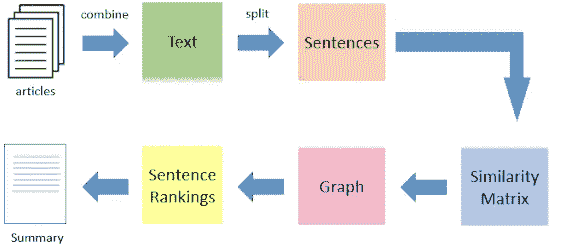

1.  文本处理。
2.  句子评分。
3.  以图表的形式创建句子的中间表示。
4.  查找句子排名。
5.  正在生成摘要[5]。

# 数据集选择

在我们提议的网络中，我们将使用亚马逊产品评论数据集，该数据集包含总共 5000 名客户对 23 种不同产品的评论。下图显示了 5 种产品的每种产品的客户评论。

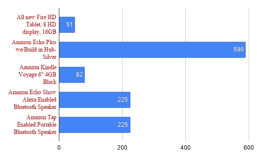

图 1:每个产品的评论(只有 5 个产品)

# **文本处理和表示**

***分组点评***

第一步是根据顾客购买的产品对他们进行分组，从而将所有顾客的评论串联起来。这将为我们提供大量的评论文本，可以用来生成摘要。我们可以使用 pandas group by 和 concatenate 函数来这样做。

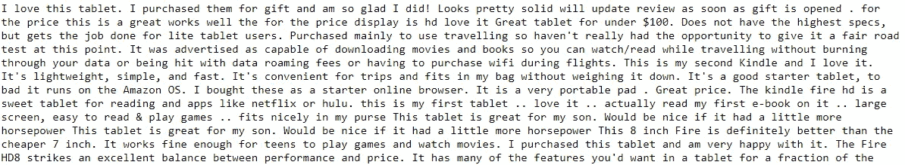

图 2:同一产品的串联评论的快照。

***分句***

对于生成的文本，我们将文本分割成句子。句子分割是为了存储每一篇评论并对其进行索引，以便在进一步处理和文本排序后，我们可以提取出在句法上有意义的原始表示。以 csv 格式存储句子。

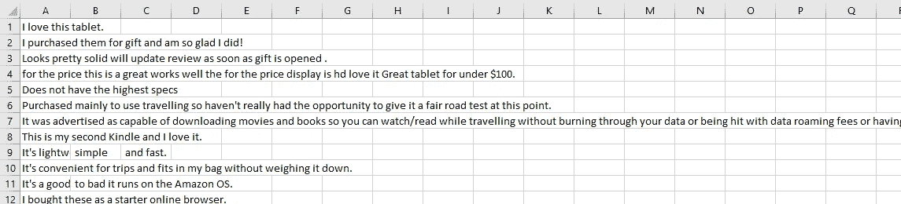

图 3:句子分割

***解收缩***

评论通常使用单词的简短形式或两个单词的组合来写。例如，一些消费者可能会写“产品没有达到我的期望”，而其他人可能会写“产品没有达到我的期望”。为了避免相同的句子被识别为不同的句子，所有的缩略词都被转换为它们的扩展形式。

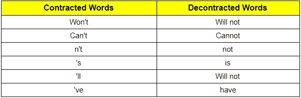

图 4:解压缩单词列表

***不想要的单词清除***

在大量的评论中，包含标点符号、多余的分隔符、括号和多个空格是很常见的。这些额外的特殊字符可能是由于人为错误或作为一个目的来支持这个想法。它们对摘要的形成没有任何贡献，因此被删除。

***拼写校正器***

无论是对一大段文本的评论，人类似乎在写作时经常犯拼写错误。本文利用彼得-诺维格的拼写校正器逻辑。

第一步是通过删除字母、替换字母、交换字母或插入字母来编辑单词。我们将创建一个所有编辑的列表。编辑列表中每个单词的概率被计算为相对于大文档中所有单词的频率的相对频率。根据概率值，我们按照优先级顺序产生可能替换单词的候选词。

1.  原词，如果已知。
2.  一个距离的单词列表。
3.  距离为 2 的单词列表。
4.  原词，即使不为人知[6]。

## **文字清理**

上述过程列表被应用于以 csv 格式存储的句子，如图(3)所示。输出是原始句子的清晰而准确的表示，如下所示。

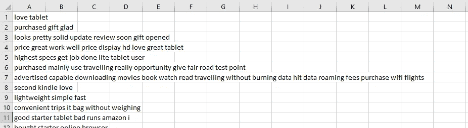

图 5:处理后的句子

# 句子相似度

***Synsets***

在计算生成的文本中所有句子的相似性之前，有必要找到单词的同义词。在不同的句子中，相同的描述可以用不同的词来表达。比如“plant”可以命名为“flora”或“plant_life”。为了在生成摘要时获得更好的结果，我们还必须在计算句子相似度时考虑单词的同义词。这些同义词被称为同义词集。

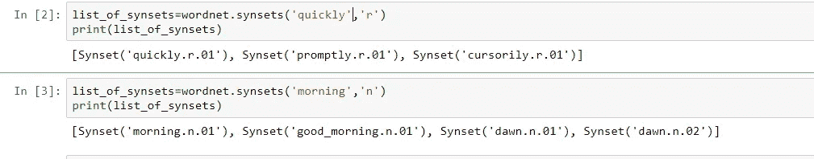

图 6: Synset 示例

***相似度计算***

为了在两个句子 s1 和 s2 之间进行计算，首先生成两个句子中所有单词的单独列表。找到所有单词的同义词集，并将其添加到两个不同的列表 synset1 和 synset2 中。为了计算每两个句子之间的相似度，下面提到了算法

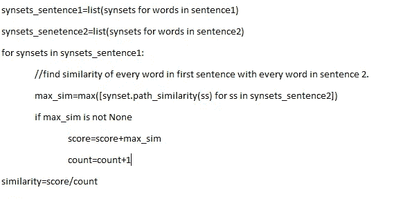

图 7:计算相似性

如果我们有 n 个句子，那么相似度矩阵将有 n×n 个维度。将相似性矩阵存储在. csv 文件中。

# PageRank as TextRank

在 textrank 中，顶点是标记化的句子。使用相似性值将权重分配给连接节点的边。使用任意初始值，对每个节点运行迭代公式，直到收敛到指定阈值以下[9]。textrank 的计算考虑了两个顶点之间的边权重以及句子与其连接的节点之间的所有边的权重。

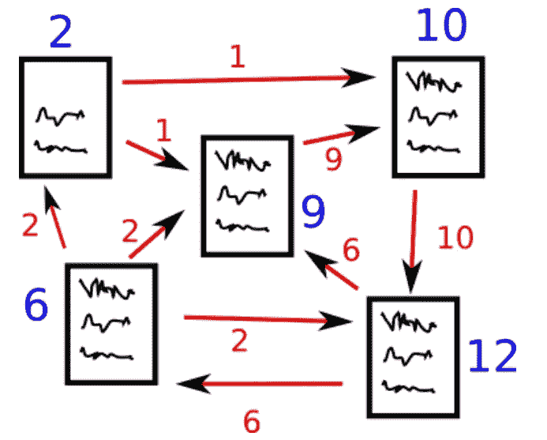

图 8: PageRank 表示。

textrank 方法采用三个输入参数，即**相似性矩阵**、**ε**的值和**阻尼因子(d)** 。每个句子都被认为是一个悬空的网页。所以从一句话到其他任何一句话的概率都是相等的。

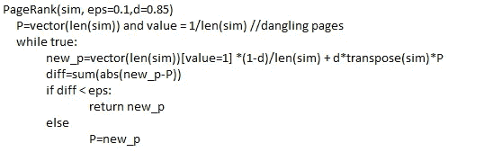

图 9:将 PageRank 应用为 TextRank

阻尼因子——当访问一个网页时，它包含一些参考链接。在网页上冲浪的人将链接到参考链接上的概率等于 d。用户将停留在特定网页上的概率是(1-d)。同样的逻辑也适用于句子。

***汇总生成***

textrank 算法的输出是句子的排序。根据我们的要求，我们将选择前 n 个句子。我们将获得句子的原始索引，并在摘要中使用原始句子。将这些句子连接起来将会生成摘要。

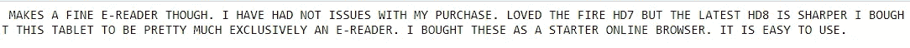

图 10:为如图 2 所示的评论生成的概要

该项目的 GitHub 实现可从[https://GitHub . com/anuj 200199/Autotext-summarying-for-improving-customer-buying-decision](https://github.com/anuj200199/Autotext-Summarization-for-improving-customer-buying-decision)获得

# 参考

1.  方昌建，穆德军，邓，吴志昂，“自动文摘的词-句相关排序”。
2.  Khusboo S Thakkar，R. V. Dharaskar 博士，M.B. Chandak，“基于图的文本摘要算法”，第 1–3 页。
3.  法德赫勒·哈迪安、肖菲亚和莫奇。自动文本摘要中使用 TextRank 和 HITS 加权方法的文档索引图的比较。
4.  阿尔比·多德，西尔威斯特·哈萨尼《PageRank 算法》。
5.  杰·普拉卡什·维尔马和阿图尔·帕特尔“对基于无监督学习的提取文本摘要技术的评估，用于大规模评论和反馈数据”
6.  哈什特·潘德“使用字符神经嵌入进行拼写纠正的有效搜索空间缩减”
7.  Rafael Ferreira，Gabriel Silva，Fred Freitas，Rinaldo Lima，Steven J. Simske，“评估摘录文本摘要的句子评分技术”，来自 ELSEVIER。
8.  贾·普拉卡什·维尔马“火花框架和建筑”。
9.  Federico Barrios，Luis Agrerich，Rosita Waxhenchauzer，“用于自动摘要的 TextRank 的相似性函数的变化”。