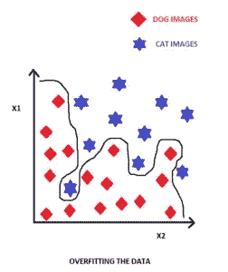
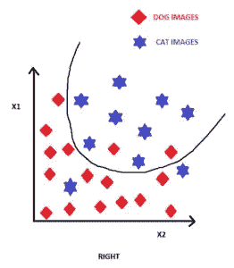
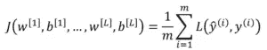
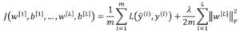

# 通过正则化改进深度神经网络

> 原文：<https://medium.com/analytics-vidhya/improving-deep-neural-networks-by-regularization-6a8bbe7054d6?source=collection_archive---------23----------------------->

# 介绍

建立模型并不总是深度学习领域的目标。该模型可能工作得很好，但仍可以通过提高训练集和测试集的准确性来改进。这也可以包括加速模型。正则化、批量归一化和超参数调整等一些功能可以帮助我们以更高的精度和速度改进深度学习网络。

让我们看看如何正则化，这是这些特征之一，是用来改善我们的神经网络。

# 正规化

在迈向什么是正则化之前，我们应该知道为什么我们的深层神经网络要正则化？

通常，在为我们的神经网络确定假设时，我们最终会得到一个在训练集上表现良好的非常好的神经网络。但是它在测试集上表现很差。这个问题叫做过拟合。过度拟合可以由分类器的给定图形来描述，其中我们想要分离两个类别，比如说猫和狗的图像。

过度拟合

正好

这表明该模型太符合数据，因为每个单独的例子都是分开的。当引入测试数据时，这会导致精确度降低。因此，这个问题需要在我们的模型中解决，以使它更加准确。为此，正则化开始发挥作用，这有助于减少过拟合。虽然，获得更多的数据也有助于减少过拟合，但有时很难获得更多的数据。在深度神经网络中，可以使用 L1 和 L2 正则化，但在这种情况下，将使用 L2 正则化。还记得深度学习中最小化的代价函数吗？

价值函数

在 L2 正则化中，我们添加一个 [Frobenius 范数](https://en.wikipedia.org/wiki/Matrix_norm#Frobenius_norm)部分作为

正则化成本函数

这里，λ是正则化参数。通过将正则化部分添加到成本函数中，它可以被最小化，因为权重的影响可以通过正则化参数和平方范数的乘积来减小。

通过减少权重的影响，函数 Z(也称为假设)也将变得不那么复杂。这将导致消除数据的过度拟合。