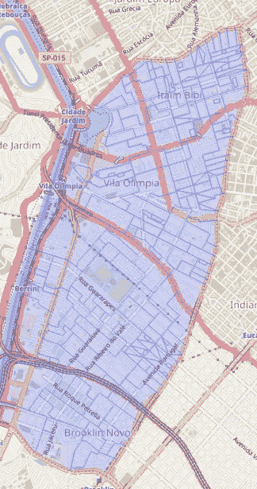

# 利用巴西全国人口普查改进地理数据

> 原文：<https://medium.com/analytics-vidhya/improving-geographic-data-using-the-brazilian-national-census-495c8107a3e0?source=collection_archive---------21----------------------->


由[阿道夫·费利克斯](https://unsplash.com/@adolfofelix?utm_source=medium&utm_medium=referral)在 [Unsplash](https://unsplash.com?utm_source=medium&utm_medium=referral) 拍摄的照片

地理定位是不同领域中的一个重要主题。递送服务、保险公司和特许经销商都对深入了解一个地区非常感兴趣。

由于 Creditas 提供房屋净值贷款，位置是一个重要因素，直接影响抵押品的价值，从而影响可以借出的金额。

在数据科学的背景下，知道邮政编码、社区、城市和州是不够的。最重要的是找到其他更通用的信息，传达指定位置的特征。

假设使用一个功能来训练机器学习模型，该功能仅从仅包含圣保罗州内的示例的数据集中接收邻域名称。如果该模型接收来自里约热内卢的客户端作为输入进行预测，它将不知道如何处理邻域值“Ipanema ”,并可能导致错误或错误的预测。

另一方面，如果模型接收来自同一社区的 18 至 60 岁之间的居民人数，这将概括地理位置因素，因为许多其他地方可能会有该人数。

因此，例如，总是尽量使用诸如`average_income_per_capita`或`thefts_per_100_inhabitants`之类的特征，而不是街区或城市的名称。

“但是从哪里获得这些数据呢？”你扪心自问。有一些开放的数据源，如圣保罗市的 Geosampa，但在全国范围内，最好使用的是巴西地理统计局的全国人口普查。根据你关注的地理位置，你获取这些信息的地方可能会有所不同；然而，这就是我为巴西所做的。

# 关于巴西地理统计局的全国人口普查

每 10 年，巴西地理统计局的全国人口普查是对巴西人口进行的主要统计研究，最近一次是在 2010 年。在里面，你可以找到识字率、年龄、城市基础设施等信息。

收集的数据是基于最小的领土单位，称为**人口普查部门**。在巴西 2010 年的人口普查中，大约有 314，000 个普查部门。每个人口普查部门都有一个格式为`<UF><MMMMM><DD><SD><SSSS`的唯一 id，其中:

```
UF – Unidade da Federação (Federation Unit)
MMMMM – Município (Municipality)
DD – Distrito (District)
SD – Subdistrito (Subdistrict)
SSSS – Setor (Sector)
```



圣保罗市 Itaim Bibi(浅蓝色)的普查部门组织示例。深蓝色的线作为每个扇区之间的边界。来自 https://censo2010.ibge.gov.br/sinopseporsetores/(葡萄牙语)

2010 年巴西地理统计局编制的数据库可通过以下路径在[此处](https://www.ibge.gov.br/estatisticas-novoportal/downloads-estatisticas.html)找到:

```
Censos
  ├── Censo_Demografico_2010
       ├── Resultados_do_Universo
            ├── Agregados_por_Setores_Censitarios
                  ├── <bases_de_dados>
```

数据文件有`iso8859_15`编码和用作分隔符的`;`。

# 说得够多了，让我们言归正传

事不宜迟，让我们看一个关于 Creditas 地址的例子:

上述数据帧的格式化示例

我们的目标是将人口普查变量提取到这个地址。当您打开人口普查数据库时，您会看到类似于下表的内容:

`Cod_setor`是普查部门的代码，`V001`、`V002`和`V003`是遇到的变量的例子。他们的解释可以在人口普查文件(葡萄牙语)以及数据库链接中找到。

因此，挑战将是把地址字符串转换成`355030835000017`代码来提取变量。这两者之间的连接将使用一个名为 Shapefile ( `.shp`)的地理空间文件来完成，这是一个包含地理特征的数据框，其格式如下:

对我们很重要的两列是`CD_GEOCODI`和`geometry`，前者是人口普查代码，后者包含一个`POLYGON`对象，该对象具有被映射扇区的地理坐标(分别是经度和纬度)。

这个过程的总体思路是将地址转换成经度和纬度，以便使用 Shapefile 得到码扇区。

人口普查形状文件。shp 文件可通过以下链接获得:

 [## 的索引

### 编辑描述

geoftp.ibge.gov.br](http://geoftp.ibge.gov.br/organizacao_do_territorio/malhas_territoriais/malhas_de_setores_censitarios__divisoes_intramunicipais/censo_2010/setores_censitarios_shp/) 

# 将地址转换为经度和纬度

有各种各样的服务允许将地址转换成纬度和经度。在这个例子中，我们将结合使用 Google Maps API、[地理编码](https://developers.google.com/maps/documentation/geocoding/intro)和`[googlemaps](https://github.com/googlemaps/google-maps-services-python)`库。

要使用这个 API，需要一个认证密钥。你可以在这里免费得到一个。

# 使用地址码获取普查部门的代码

现在我们已经有了坐标位置，我们需要找出它位于哪个人口普查部门。下一步是将坐标字符串转换为 Point 对象，以便 Shapefile 理解它正在处理地理位置。我们将使用 Python 的`shapely`库来完成这项工作。

现在，使用`geopandas`库上传人口普查部门的 Shapefile，将位置与部门的多边形匹配起来。

最后，最后一步是将我们的数据集与包含人口普查变量的数据集合并。

最后一步看起来像这样:

提醒:`V001`、`V002`和`V003`变量的含义可在人口普查的[文档中找到(葡萄牙语)。](https://www.ibge.gov.br/estatisticas/downloads-estatisticas.html)

很好！您刚刚用更多有趣的地址特征丰富了您的数据库。请记住，您可以随时搜索其他数据源并应用相同的概念，这样，利用地理因素，您可以在任何地方执行分析和预测=D

有兴趣与我们合作吗？我们一直在寻找热爱技术的人加入我们的团队！你可以在这里查看我们的[](https://boards.greenhouse.io/creditas?utm_campaign=Tripula%C3%A7%C3%A3o%20Creditas%20&utm_source=hs_email&utm_medium=email&utm_content=82174845&_hsenc=p2ANqtz-9-OYzs0SUjlA6UZmlUBnP51GM3Cc1GMrFiTlor6yRw1DAajjYhJyiAuXBTdT7NBZI4xXjuRSkLnff6kH-T4m4G84jj55eFBq12j2FNEvnsZ3C4rG0&_hsmi=82174845)**。**