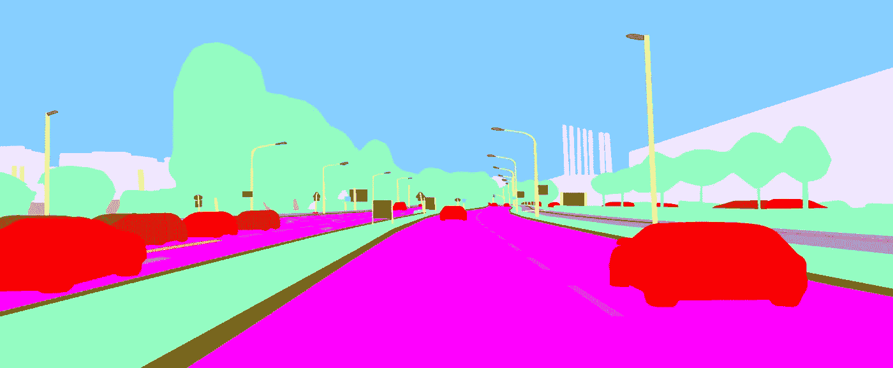
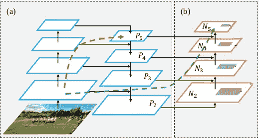
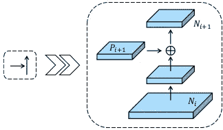
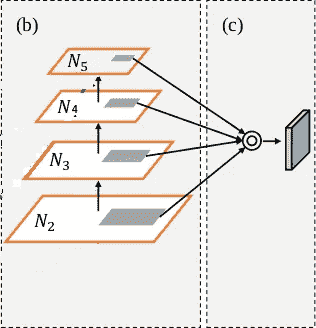
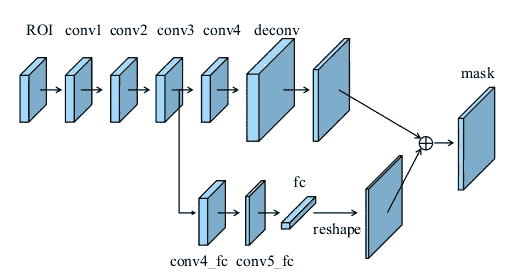
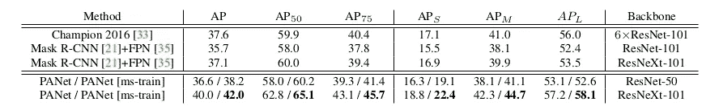
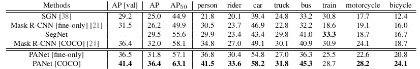

# 利用路径聚合网络改进实例分割

> 原文：<https://medium.com/analytics-vidhya/improving-instance-segmentation-using-path-aggregation-network-a89588f3d630?source=collection_archive---------3----------------------->

(来源:[https://AEV-autonomous-driving-dataset . S3 . eu-central-1 . Amazon AWS . com/a2 D2-preview . tar](https://aev-autonomous-driving-dataset.s3.eu-central-1.amazonaws.com/a2d2-preview.tar))

实例分割是一项复杂的计算机视觉任务，涉及识别图像中不同的对象实例并绘制它们的像素级掩模。任何用于实例分割的方法除了识别属于那些实例的每个像素之外，还需要(隐式或显式地)检测、分类和定位图像中的各种对象实例。

每当需要实例分割时，Mask-RCNN 通常会出现在列表中。它在实例分割任务上提供了良好的结果，并优于包括 COCO 2016 挑战赛获胜者在内的众多模型。除此之外，它在 GitHub 上有许多很好的实现，这使它成为一个很好的候选对象。

(来源:【https://imgflip.com/memetemplate/184072400/Im-still-worthy )

导致 Mask-RCNN 产生良好分割结果的一些主要亮点包括:

*   **FPN** 提供短信息传播路径
*   用 **ROIAlign** 替换 **ROIPool**
*   增加一个**独立分支**用于预测掩码

然而，在本文中，我将讨论**路径聚合网络**——Mask-RCNN 的扩展，它对其前身进行了一些改进。 **PANet** 试图进一步增强 Mask-RCNN 的功能，建议通过以下方式改进上述功能:

*   添加一个**自底向上** **路径**来扩充 FPN 中自顶向下的路径
*   使用**自适应特征池**从所有级别获取信息
*   用微小的**全连接层**增加掩模预测

# 1.自底向上路径增强

图一。PANet 中使用的主干插图。(a)用于 MASK-RCNN 的 FPN 骨架。(b)自下而上的路径增强

随着图像通过网络，连续层**中特征的**复杂度**增加**，从描绘边缘和纹理等低级特征到编码眼睛和鼻子等整个对象部分。然而，特征图**的**空间分辨率**降低**，这是由于图 1(a)的左侧部分**所示的各种交错卷积和汇集层。**这导致空间信息的丢失，从而使这些高级特征不适合预测像素级掩模。

Mask-RCNN 中使用的特征金字塔网络采用自上而下的路径来将来自高级层的语义丰富的特征与位于较低层的较高分辨率特征图中的精确定位信息相结合。它使用上采样层与来自原始主干中的特征图的横向连接相结合，以产生保留空间信息的语义丰富的特征。

除了 FPN 使用的自上而下的路径之外，PANet 还提出了一个自下而上的路径(图 1)。Mask-RCNN 使用来自更高层的特征(例如图 1(a)中的 P₅)来产生大物体的掩模。然而，空间信息从低层传播到高层的路径(图 1(a)中的红线)相当长，可能由 100 层以上的层组成。为此，PANet 使用了一条较短的路径，从低层到高层有清晰的横向连接。这导致了一个*’****快捷方式****’*连接(由图 1 中的绿线描绘)，其由从原始主干中的低层到新的高层(例如 N₅)的少于 10 层组成，从而允许信息容易流动。

## **增强的自下而上结构:**

图二。自底向上路径增强的构建块。

主干网络被分成不同的阶段，每个阶段包含产生具有相同空间大小的特征地图的层。例如，图 1 中的 P2 和 N2 属于同一阶段，即 2。(P 用于表示从 FPN 生成的特征地图，N 用于表示从自下而上路径生成的特征地图)。属于自下而上路径中的第 I 阶段的特征图是使用先前特征图的 3×3 步长(2x)卷积，继之以来自 FCN 的相同阶段特征图的逐元素相加来生成的。对结果执行另一个 3×3 卷积以产生最终特征。

# **2。自适应特征池**

以前，Mask-RCNN 使用单个阶段(P2、P3、P4 或 P5)的特征进行预测。如果感兴趣区域很大，则使用更高级的特征图(如 P4 或 P5)通过 ROI Align 池提取特征。尽管简单有效，但它仍然可能产生非最佳结果。例如，具有 10 个像素差异的两个建议可以被分配到不同的级别，而事实上这两个建议非常相似。

此外，高级特征捕获更丰富的上下文信息。允许小型提案使用这些功能对网络有益。

考虑到这一点，PANet 融合了所有阶段{N2、N3、N4、N5 }的特征，并让网络决定使用哪些特征。

图 3。自适应特征池

它执行 ROI 对准以从每个特征图中提取对象的特征。这些对齐的特征地图被允许独立地通过一个参数层。接下来是融合操作，以使网络能够适应特征。测试了三种不同类型的融合操作，其中基于元素的最大值操作产生了最好的结果。

# **3。全连接融合**

掩膜 RCNN 使用小型全卷积网络(FCN)从汇集的特征中预测掩膜。使用卷积层代替完全连接的层，除了减少参数数量之外，还保留了空间结构。然而，这种方法中的一个问题是，由于参数对于所有空间位置是共享的，因此网络在进行预测时不学习使用像素的位置。例如，道路通常出现在图像的底部，天空出现在图像的顶部。

另一方面，完全连接的层是 ***位置敏感的*** ，因为在输入中有对应于不同位置的不同参数。所以它们有能力适应不同的空间位置。此外，使用来自该提议的整个特征地图的信息来进行每个位置的预测。

PANet 使用来自这两层的信息，在做出决策时为网络提供更加多样化的视图。

图 4。具有全连接融合的掩模预测分支。

为此，PANet 使用了 conv 3 层的功能，如上图 4 所示。在进入全连接层之前，这些信号经过两个 3×3 卷积层。第二卷积层用于将信道数量缩减一半，以减少计算开销。此外，完全连接的层仅预测描绘前景和背景的二元遮罩。图 1 中需要注意的另一个有趣的事情是使用了仅 1 个完全连接的 (fc)层。这可确保要素的隐藏空间结构保持完整。来自全连接层的预测被整形为与来自卷积分支的预测相同的形状，然后被添加到来自 FCN 的每个类别的掩码
中，以产生最终输出。

# 结果

表 1。COCO 2016 实例分割挑战赛冠军 PANet 与 COCO test-dev 子集上 Mask R-CNN 在 Mask AP 方面的比较，其中后两者为基线。

从表 1 中可以看出，PANet 与 **ResNet-50** 在多尺度图像上训练并在单尺度图像上测试已经超过了 Mask R-CNN 和 2016 年的 Champion，后者使用了更大的模型集合和测试技巧。并且，在没有大批量训练的情况下，获得了 2017 年 COCO 实例分割挑战赛，物体检测任务排名第二。

表二。关于 Cityscapes val 子集的结果，表示为 AP [val]，以及关于 city scape 测试子集的结果，表示为 AP。

即使在 Cityscapes 数据集上，PANet 也始终优于 Mask-RCNN。在 COCO 上预先训练，该模型能够比具有相同设置的 Mask R-CNN 高出 4.4 个点。

# 参考

*   [**面具 RCNN**](http://openaccess.thecvf.com/content_iccv_2017/html/He_Mask_R-CNN_ICCV_2017_paper.html) **，** ICCV 2017
*   [**FPN:** 用于物体检测的特征金字塔网络](http://openaccess.thecvf.com/content_cvpr_2017/html/Lin_Feature_Pyramid_Networks_CVPR_2017_paper.html) **，** CVPR 2017
*   [**PANet:** 路径聚合网络实例分割](http://openaccess.thecvf.com/content_cvpr_2018/html/Liu_Path_Aggregation_Network_CVPR_2018_paper.html)，CVPR 2018

> (如果未明确提及来源，所有图片均来自 PANet 论文)