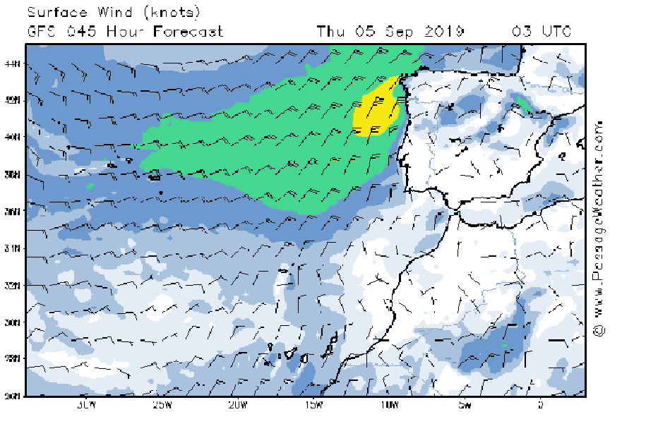
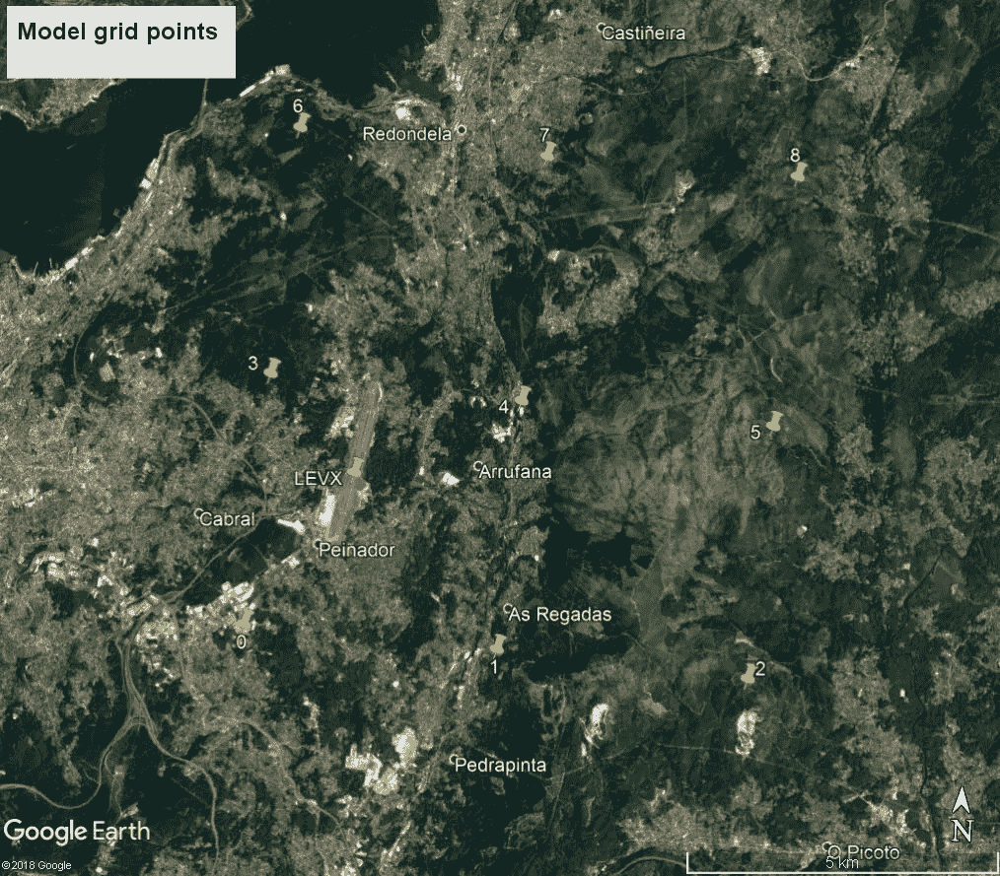

# 用机器学习改进气象和海洋模型

> 原文：<https://medium.com/analytics-vidhya/improving-meteorological-and-ocean-models-with-machine-learning-part-0-set-up-a-data-frame-4abd3744ec75?source=collection_archive---------2----------------------->

## 第 0 部分:设置数据框

气象和海洋模型是获取气象变量(如风强度、气温、云量、雨强度、浪高等)未来行为的基本工具。每个人都可以享受显示气象和海洋信息的各种应用程序和网页。

气象模型是数学表示。该模型计算了几个时间间隔和几个地点的气象或海洋变量的值。让我们看一个例子。



上图描绘了 GFS 模型的结果。气象变量是风速和风向。该模型采用初始条件(2019 年 9 月 03 日星期二 06 时)并尝试计算 45 小时后(2019 年 9 月 05 日星期四 03 时)的风力。模型只预测某些地方的气象变量的值。地点形成一个模型网格。图中显示了模型网格和 Vigo(西班牙)机场位置



从 0 到 8 命名的点是气象模型定义预测变量的值的点。气象站在维哥机场(OACI 指示性的征收)。我们的目标是建立一个机器学习模型，其中的输入是气象模型的输出。气象模型预测未来不同时间点 0 至 8 的所有气象变量。

首先，当行是日期，列是观测变量(来自气象站)和预测变量(来自气象模型)时，我们需要建立一个数据库。

我用来建立数据库的气象模型由 [Meteogalicia](https://www.meteogalicia.gal/web/inicio.action) (一个公共气象服务)维护。Meteogalicia 提供了一个应用于加利西亚地区(西班牙西北部)的 WRF 模型。他们使用主题实时环境分布式数据服务，这是科学数据提供者和最终用户之间的连接工具。我们可以从[气象局 WRF](http://mandeo.meteogalicia.es/thredds/catalogos/DATOS/ARCHIVE/WRF/WRF_hist.html) 档案馆得到一个历史模型。

实际气象数据是从维哥机场气象站获得的。爱荷华州立大学提供了气象机场报告的数据库，查看这个[链接](https://mesonet.agron.iastate.edu/request/download.phtml?network=ES__ASOS)。

你可以从我在 Github 的存储库中获得数据帧。代码应该是:

```
import pandas as pd
#from Github link 
url=["https://raw.githubusercontent.com/granantuin/LEVX_class/master/maestro.csv](https://raw.githubusercontent.com/granantuin/LEVX_class/master/maestro.csv)"
master=pd.read_csv(url,index_col=”datetime”,parse_dates=True)
```

您可以通过以下方式可视化数据框:

```
import pandas_profilingpandas_profiling.ProfileReport(master)
```

数据框有 33 个要素(列)和 61256 个观测值(行次)

这些列被命名为:

```
[‘dir_o’, ‘wind_gust_o’, ‘skyc1_o’, ‘skyc2_o’, ‘skyc3_o’, ‘skyc4_o’, ‘wxcodes_o’, ‘metar_o’, ‘dir_p’, ‘lhflx_p’, ‘mod_p’, ‘prec_p’, ‘rh_p’, ‘visibility_p’, ‘wind_gust_p’, ‘mslp_p’, ‘temp_p’, ‘cape_p’, ‘cfl_p’, ‘cfm_p’, ‘cin_p’, ‘conv_prec_p’, ‘mslp_o’, ‘temp_o’, ‘dwp_o’, ‘rh_o’, ‘visibility_o’, ‘mod_o’, ‘skyl1_o’, ‘skyl2_o’, ‘skyl3_o’, ‘skyl4_o’]
```

带“_o”的栏为气象站观测数据。带“_p”的列是当时模型预测的变量。我使用的模型预测从 0 到 72 小时。数据框中的日期是 24 到 48 小时的预报。

我们可以用以下公式得到指数:

```
master.index
```

我们得到了:

```
DatetimeIndex([‘2011–08–22 20:00:00’, ‘2011–08–22 21:00:00’, ‘2011–08–22 22:00:00’, ‘2011–08–22 23:00:00’, ‘2011–08–23 00:00:00’, ‘2011–08–23 01:00:00’, ‘2011–08–23 02:00:00’, ‘2011–08–23 03:00:00’, ‘2011–08–23 04:00:00’, ‘2011–08–23 05:00:00’, … ‘2019–05–29 14:00:00’, ‘2019–05–29 15:00:00’, ‘2019–05–29 16:00:00’, ‘2019–05–29 17:00:00’, ‘2019–05–29 18:00:00’, ‘2019–05–29 19:00:00’, ‘2019–05–29 20:00:00’, ‘2019–05–29 21:00:00’, ‘2019–05–29 22:00:00’, ‘2019–05–29 23:00:00’]
```

行是日期时间类型。时间以 UTC 为单位。例如，第一行(索引)2011–08–22 20:00:00 表示模型预测的 2011–08–22 20:00:00 的变量来自时间分析 2011–08–21 00:00:00 发布的模型。这意味着我们看到了 H+45 的预报。数据框仅包含从 24 小时到 48 小时的间隔预测。时间为 00:00:00 的行是 H+24 预测，时间为 23:00:00 的行是 H+48 预测。我从上图中选择空间点 3。距离机场气象站约 5 公里。

现在我们解释每个变量的含义和单位。让我们从观察到的变量开始(扩展名为“_o”)。

**metar _ o**:Vigo 站每 30 分钟发布的原始气象报告。我们不使用半小时，因为模型不报告半小时。你可以在这里看到更多关于 METAR 报告[的信息。](https://en.wikipedia.org/wiki/METAR)

**dir_o** :观察到的风向。从北方顺时针方向。单位是度。-1 表示可变方向。

**mod_o** :风力强度。单位是米每秒。所有的风速测量都是在 10 米高的地方进行的

**风 _ 阵风 _o** :阵风。单位是米每秒。-1 表示没有报告阵风。

**能见度 _o** :以米为单位的能见度。最低能见度报告为 48.280319 米。最大能见度报告为 9994.026301(全能见度)。抱歉小数点。这是一个多次改变单位的问题。

**wxcodes_o** :当前天气代码(空格分隔)。查看关于气象报告的链接以获取当前的天气代码

**skyc1_o，skyc2_o，skyc3_o，skyc4_o** :是几个级别的天空级别覆盖。粗略地说，云量。分类数据。m 表示没有云覆盖。

**Sky 1 _ o，skyl2 _ o，skyl3 _ o，Sky 4 _ o**:云层在几个层次上的天空高度，单位为米。-一表示没有云层覆盖

**temp _ o**:2 米处的空气温度，单位为开尔文

在 2 米处的露点温度，单位为开尔文单位

**rho**:相对湿度

mslp_o :海平面压力，单位为帕斯卡

扩展名为“_p”的列是模型预测的变量。你可以在这里获得更多关于 WRF 模型[预测变量的信息。让我们描述一下出现在数据框中的每一项:](http://mandeo.meteogalicia.es/thredds/dodsC/modelos/WRF_HIST/d02/2015/08/wrf_arw_det_history_d02_20150829_0000.nc4.html)

**lhflx_p: S** 地表向下潜热通量。单位，瓦特每平方米

**dir_p** :预测风向。从北方顺时针方向。单位是度。与 dir_o 不同，没有预测可变风(第 1 个值)

**mod_p:** 风力强度预报。单位是米每秒

**prec_p:** 各模式输出之间的累计总降雨量。在我们的情况下，每小时。单位千克每平方米。

**相对湿度:相对湿度**

**能见度 _p:** 空气中的能见度。单位米。最小能见度 26.028316 米。最大能见度 24235.000000

**风 _ 阵风 _p:** 阵风。单位是米每秒。不像 wind_gust_o 总是预测(1 号值)

**mslp_p:** 海平面压力(帕斯卡)

**temp _ p:**2 米处的空气温度，单位为开尔文

**cape_p:** 对流有效位能。单位:每千克朱尔斯。更多信息请查看此[链接](https://en.wikipedia.org/wiki/Convective_available_potential_energy)

**cin_p:** 对流抑制。点击[此处](https://en.wikipedia.org/wiki/Convective_inhibition)了解更多信息。单位朱尔斯每千克

低层大气云面积分数。我找到了 1251 个值大于 1 的样本。或许，我们不会那么信任这个功能。

中层大气层云面积分数。另外，我发现 37 个样本的值大于 1。

**conv_prec_p:** 各模式输出之间的累计对流降雨总量。对我们来说是每小时。

使用此数据框架，我们将构建分类和回归问题，其中独立变量是扩展名为“_p”的变量，这些变量是气象模型的输出。因变量或目标变量将是带有“_o”扩展名的变量，即该站的观察变量。

我们将评估气象模型。我们将应用我们用来评估机器学习模型的相同指标。有时要打败气象模型是很有挑战性的。例如，观察到的和预测的变量压力之间的相关性大于 0.9。

## 结论和展望

该数据库是评估气象模型并创建机器学习模型以提高其准确性的起点。下一篇文章，我将从可变可见度开始。希望能有很多人对这个科学领域感兴趣。请随意提交您的意见。感谢您阅读帖子！