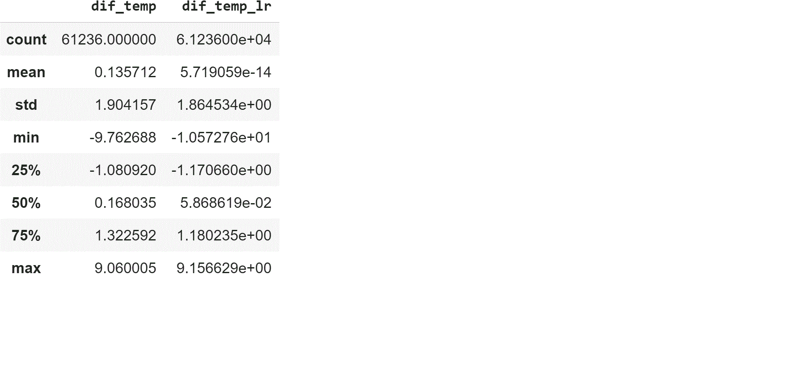

# 用机器学习改进气象和海洋模式(第一部分:评估气象模式)

> 原文：<https://medium.com/analytics-vidhya/improving-meteorological-and-ocean-models-with-machine-learning-part-1-assessing-the-4c309851a81e?source=collection_archive---------9----------------------->

在最后一部分[(第 0 部分)](/analytics-vidhya/improving-meteorological-and-ocean-models-with-machine-learning-part-0-set-up-a-data-frame-4abd3744ec75)，我们定义了一个数据框，其中的列是气象变量。气象站观测的变量(“_o”扩展)和数学模型预测的变量(“_p”扩展)。行是每小时可变的日期类型。

首先，我们获取数据框并导入一些库来绘制结果:

```
import pandas as pd
import seaborn as sns
import matplotlib.pyplot as plt#from Github link 
url=”[https://raw.githubusercontent.com/granantuin/LEVX_class/master/maestro.csv](https://raw.githubusercontent.com/granantuin/LEVX_class/master/maestro.csv)"
master=pd.read_csv(url,index_col=”datetime”,parse_dates=True)
```

变量 *dir_o，mod_o，wind_gust_o，mslp_o，temp_o，rh_o，visibility_o，*有其对应的预测变量( *dir_p，mod_p* 等等)。

让我们从温度变量开始，展示一个观察温度和预测温度的散点图。类型:

```
sns.scatterplot(x=”temp_o”, y=”temp_p”, data=master)
```

我们得到了:


预测温度(temp_p)与观察温度(temp_o)

哎呀！在上中心位置有明显的异常值。我们应该过滤数据帧:

```
master_f=master[master.temp_o < 310].copy()
```

相关性看起来很好，大约为 0.948029

下面的代码比较了观察到的温度(temp_o)与模型本身预测的温度(temp_p)之间的差异，以及一个新的预测变量(temp_p_lr)。预测的新变量是通过将观察和预测的温度调整到线性回归而获得的

```
from sklearn.linear_model import LinearRegression
reg = LinearRegression().fit(master_f[“temp_p”].values.reshape(-1, 1), master_f[“temp_o”].values.reshape(-1, 1))master_f[“temp_p_lr”]=reg.predict(master_f[“temp_p”].values.reshape(-1, 1))master_f[“dif_temp”]=master_f[“temp_o”]-master_f[“temp_p”]
master_f[“dif_temp_lr”]=master_f[“temp_o”]-master_f[“temp_p_lr”]
master_f[[“dif_temp”,”dif_temp_lr”]].plot(kind=”box”,grid=True, figsize=(8,8))
```

使用 describe()方法的分析结果是:



和箱线图显示


我们可以说该模型表现良好。观测温度和预测温度之间的平均温差几乎为零(0.1357)，标准偏差为 1.9。线性回归可以用来提高平均值几乎为 0 和标准差相似。

下一个表现良好的变量是海平面的减压。相关系数 0.98。难以提高！！我们可以用 Seaborn 库显示结果。也有一个异常值。要过滤异常值，请使用:

```
master_f=master[master.mslp_o>90000].copy()
```

使用 Seaborn:


调整到线性回归并在 10 个箱中聚集点。我们得到:


获得上述图的代码是:

```
sns.regplot(x=master_f.mslp_o/100, y=master_f.mslp_p/100, x_bins=10, data=master_f)
```

我们除以 100 得到一个友好变量，毫巴。看起来这个模型表现很好，我们不需要任何机器学习算法来改进它。

现在我们要看看这个模型在其他变量上是否表现良好。让我们来看看风向、风力、相对湿度和能见度。代码应该是:

```
sns.scatterplot(x=”dir_p”, y=”dir_o”, data=master[master.dir_o!=-1])sns.scatterplot(x=”mod_p”, y=”mod_o”, data=master)sns.scatterplot(x=”rh_p”, y=”rh_o”, data=master)sns.scatterplot(x=”visibility_p”, y=”visibility_o”, data=master[master.visibility_p<10000])
```

我们在 dir_o(编码为-1)中过滤可变风向，并在能见度变量中设置 10000 米的阈值，因为是机场站报告的最大能见度。

所有变量的散点图如下:


观察到的风向与预测的风向


观测的风力强度与预测的风力强度


观测能见度与预测能见度


观测湿度与预测湿度

相关指数为:

*   风力强度(mod 变量):0.63
*   风向(方向可变):0.33
*   相对湿度(相对湿度可变):0.76
*   能见度(能见度变量):0.36

## 结论和展望

该模型在压力和温度变化时表现良好。高精度压力变量(相关系数为 0.98)。相关指数为 0.95 的温度可以使用一个变量的线性回归稍微改善。

其他预测变量，如风速、方向或能见度，需要大量的机器学习算法，因为模型获得的结果很乱。可变的相对湿度在中间，也许我们可以只用一个线性回归来改进预测。

好消息是，该模型在四个变量上表现不佳，我们可以通过应用各种机器学习技术来增强它。我们可以建立二元分类模型来检测危险阈值，如大风强度或低能见度。

此外，分类问题只预测主要方向的风向，如北、东北、东等。另一类问题是应用于各种连续变量的回归问题。我们必须直接选择模型中的一些预测变量，或者使用主成分分析对这些变量进行变换。

下一篇文章，我将尝试使用深度学习来预测可见性阈值。我忘记了这个坏消息。感谢你阅读我！