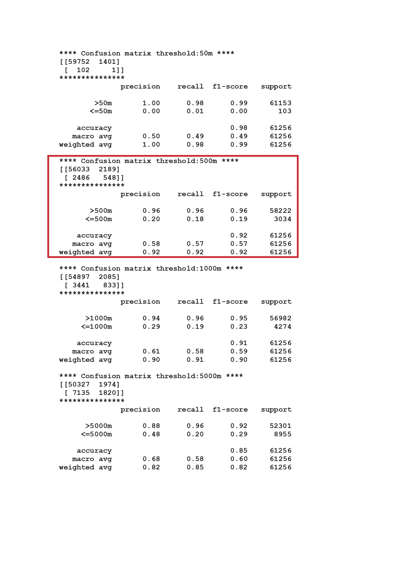

# 用机器学习改进气象和海洋模型

> 原文：<https://medium.com/analytics-vidhya/improving-meteorological-and-ocean-models-with-machine-learning-part-2-applying-deep-learning-to-239883b4815e?source=collection_archive---------14----------------------->

## 第二部分:应用深度学习增强气象模型预测的能见度变量

我们在上一篇文章 [part 1](/@robinat539/improving-meteorological-and-ocean-models-with-machine-learning-part-1-assessing-the-4c309851a81e) 中可以看到，visibility 这个变量的模型性能是低劣的。我们将评估模型的性能，并尝试用深度学习来改进它。

我们可以从我的 Github 帐户开始定义数据框:

```
**import pandas as pd
#from Github link 
url=”**[**https://raw.githubusercontent.com/granantuin/LEVX_class/master/maestro.csv**](https://raw.githubusercontent.com/granantuin/LEVX_class/master/maestro.csv)**"
master=pd.read_csv(url,index_col=”datetime”,parse_dates=True)**
```

数据帧的变量在文章[第 0 部分](/@robinat539/improving-meteorological-and-ocean-models-with-machine-learning-part-0-set-up-a-data-frame-4abd3744ec75)中有解释。我们的自变量将是“visibility_o”，自变量将是由带有扩展名“_p”的模型预测的变量。因此:

```
**master_f=master[[‘dir_p’, ‘lhflx_p’, ‘mod_p’, ‘prec_p’, ‘rh_p’, ‘visibility_p’,
 ‘mslp_p’, ‘temp_p’, ‘cape_p’, ‘cfl_p’, ‘cfm_p’, ‘cin_p’,
 ‘conv_prec_p’,”visibility_o”]]**
```

master_f 只包含我们感兴趣的变量。我们可以使用 Seaborn 库绘制相关性矩阵:

```
**import seaborn as sns
sns.set(rc={‘figure.figsize’:(11.7,8.27)})
sns.heatmap(master_f.corr(),annot=True,linewidths=.5)**
```

结果是:


观察到的能见度和预测的能见度之间的相关性很弱。我们可以评估定义相同参数的气象模型来评估机器学习算法。预测能见度何时低于阈值至关重要。可以解决二元分类问题。我们的目标是找到能见度小于阈值的时间。首先，我们定义以下阈值:50，500，1000，5000 米，并评估模型容量以预测它们。

```
**for threshold in [50,500,1000,5000]:
 master_f[“visibility_o_”+str(threshold)]=[True if c<=threshold else False 
 for c in master_f.visibility_o]
 master_f[“visibility_p_”+str(threshold)]=[True if c<=threshold else False 
 for c in master_f.visibility_p]
 print(“**** Confusion matrix threshold:”+str(threshold)+”m”+” ****”)
 print(confusion_matrix(master_f[“visibility_o_”+str(threshold)],
 master_f[“visibility_p_”+str(threshold)],
 labels=[False,True]))
 print(“***************”)
 target_names = [“>”+str(threshold)+”m”,”<=”+str(threshold)+”m” ]
 print(classification_report(master_f[“visibility_o_”+str(threshold)],
 master_f[“visibility_p_”+str(threshold)],
 target_names=target_names))**
```

结果是:



从上面的数据我们可以看到不同的变量来评估气象模型的性能。例如，如果我们观察支柱支撑处的阈值 500 米(能见度小于 500 米):能见度小于 500 米时为 3034 小时，能见度大于 500 米时为 58222 小时。查看混淆矩阵，气象模型正确 548 次。它预测 2189 能见度小于 500 米错误。还有，有 2486 个小时的实际能见度低于 500 米的错误预报。

我将结果绘制在 ROC 中，并获得 AUC 来评估几个阈值(可见性范围)的模型结果。

```
**from itertools import cycle
import matplotlib.pyplot as plt
from sklearn import metrics
from sklearn.metrics import roc_curve, auc****#ROC model one figure
ranges=[50,500,1000,5000]
fprl=[]
tprl=[]
thresholdsl=[]
roc_aucl=[]****for vis_range in ranges:
 y_data=[False if c<=vis_range else True for c in master_f.visibility_o]
 y_pred=master_f.visibility_p
 fpr, tpr, thresholds = metrics.roc_curve(y_data,y_pred)
 roc_auc = auc(fpr, tpr)
 fprl.append(fpr)
 tprl.append(tpr)
 thresholdsl.append(thresholds)
 roc_aucl.append(roc_auc)****plt.figure(figsize=[12,10])
n_ranges=len(ranges)
colors = cycle([‘aqua’, ‘darkorange’, ‘cornflowerblue’,”red”])****for i, color in zip(range(n_ranges), colors):
 plt.plot(fprl[i], tprl[i], color=color, lw=2,
 label=’ROC curve of range {0} (area = {1:0.2f})’
 .format(ranges[i],roc_aucl[i]))****plt.plot([0, 1], [0, 1], color=’navy’, lw=2, linestyle=’ — ‘)
plt.xlim([0.0, 1.0])
plt.ylim([0.0, 1.05])
plt.xlabel(‘False Positive Rate’)
plt.ylabel(‘True Positive Rate’)
plt.title(“ROC range:”)
plt.legend(loc=”lower right”)
plt.show()**
```


我们可以建立一个神经网络来增强结果。我们定义因变量和自变量。观察到的因变量可见度和自变量，模型预测的变量。让我们开始吧:

```
**threshold1=500
y_data=pd.DataFrame({“datetime”:master_f.index,
 “visibility_o”:[1 if c<=threshold1 else 0 for c in 
 master_f[“visibility_o”]]}).set_index(“datetime”)****x_data=master_f[[‘dir_p’, ‘lhflx_p’, ‘mod_p’, ‘prec_p’, ‘rh_p’, ‘visibility_p’,
 ‘mslp_p’, ‘temp_p’, ‘cape_p’, ‘cfl_p’, ‘cfm_p’, ‘cin_p’,
 ‘conv_prec_p’]]**
```

我们建立一个神经网络并显示结果:

```
**import numpy as np
#neural network
from sklearn.model_selection import train_test_split
from sklearn.metrics import confusion_matrix ,classification_report 
from sklearn.model_selection import cross_val_score,cross_validate
import tensorflow as tf
from tensorflow.keras import optimizers
from tensorflow.keras.models import Model, load_model, Sequential
from tensorflow.keras.layers import Input, Dense, Dropout, AlphaDropout
from tensorflow.keras.callbacks import ModelCheckpoint, TensorBoard
from sklearn.preprocessing import StandardScaler, MinMaxScaler, RobustScaler****scaler = MinMaxScaler()****#transform x_data or pca_vectors
scaled_df = scaler.fit_transform(x_data)****x_train, x_test, y_train, y_test = train_test_split(scaled_df,y_data.visibility_o, test_size=0.2,)****class_weight = {0: (sum(y_train == 1)/len(y_train)), 1: (sum(y_train == 0)/len(y_train))}****mlp = Sequential()
mlp.add(Input(shape=(x_train.shape[1], )))
mlp.add(Dense(24, activation=’relu’))
mlp.add(Dropout(0.5))
mlp.add(Dense(24, activation=’relu’))
mlp.add(Dropout(0.5))
mlp.add(Dense(1, activation=’sigmoid’))
mlp.summary()
mlp.compile(optimizer=tf.keras.optimizers.Adam(lr=0.0001),
 loss=’binary_crossentropy’,
 metrics=[‘accuracy’,tf.keras.metrics.Recall()]
 )****history = mlp.fit(x=x_train,
 y=y_train,
 batch_size=128,
 epochs=50,
 validation_data=(x_test, y_test),
 class_weight=class_weight,
 verbose=1).history
pd.DataFrame(history).plot(grid=True,figsize=(12,12),yticks=np.linspace(0.0, 1.0, num=11))
y_pred=mlp.predict(x_test)**
```


看来神经网络表现良好。验证损失在下降，验证召回在上升。现在我们要绘制两个箱线图。一个描述了当 y 测试是一个意味着能见度低于阈值(在我们的例子中是 500 米)时由神经网络获得的值。另一个表示 y 检验为零(能见度大于 500 米)时神经网络得到的值。理想的结果应该是，在第一种情况下，神经网络预测的高值接近 1，而在第二种情况下，值接近 0。代码是:

```
**result=pd.DataFrame({“y_test”:y_test.values,”y_pred”:y_pred.reshape(1,-1)[0],
 “datatime”:y_test.index}).set_index(“datatime”)
pd.DataFrame({“y_pred test==1”:result[“y_pred”][result.y_test==1],
 “y_pred test==0”:result[“y_pred”][result.y_test==0]}).plot(kind=”box”)**
```


我们正在寻找一个区分 1 和 0 的阈值。根据上图的指示，我选择 0.55。如果神经网络预测值小于 0.55，则意味着能见度大于 500 米，反之亦然。代码:

```
**#select threhold_nor
threshold_nor=0.55
y_pred_nor =[0 if c<=threshold_nor else 1 for c in result.y_pred]
target_names = [“>”+str(threshold1)+”m”,”<=”+str(threshold1)+”m” ]
print(classification_report(y_test.values,y_pred_nor , target_names=target_names)
print(“**** Confusion matrix ****”)
print(confusion_matrix(y_test,y_pred_nor))**
```

我们得到:


似乎参数比气象模型略好。最后，我们绘制 ROC 曲线并计算曲线下面积(AUC):

```
**#ROC model 
fpr, tpr, thresholds = metrics.roc_curve(y_test,y_pred)
roc_auc = auc(fpr, tpr)
plt.figure()
lw = 2
plt.plot(fpr, tpr, color=’darkorange’,
 lw=lw, label=’ROC curve (area = %0.2f)’ % roc_auc)
plt.plot([0, 1], [0, 1], color=’navy’, lw=lw, linestyle=’ — ‘)
plt.xlim([0.0, 1.0])
plt.ylim([0.0, 1.05])
plt.xlabel(‘False Positive Rate’)
plt.ylabel(‘True Positive Rate’)
plt.title(“ROC “)
plt.legend(loc=”lower right”)
plt.show()**
```

并获得:


## 结论

也许是用深度学习算法改进气象模型的一步…

谢谢大家！