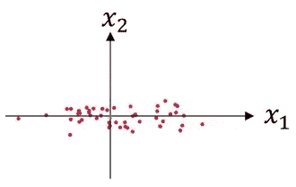
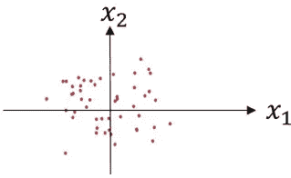
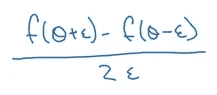
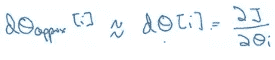
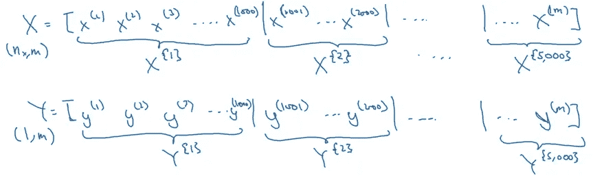
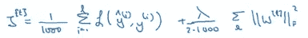
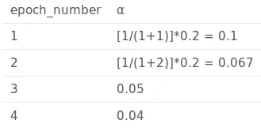

# 改进神经网络——超参数调整、正则化等(deeplearning.ai 课程#2)

> 原文：<https://medium.com/analytics-vidhya/improving-neural-networks-hyperparameter-tuning-regularization-and-more-deeplearning-ai-7621fca60c1?source=collection_archive---------0----------------------->

建立第一个模型——这不正是我们在深度学习领域努力的方向吗？当我们看到我们的模型成功运行时，那种兴奋的感觉是无与伦比的。但是责任并不止于此。

如何才能提高模型的准确性？有什么方法可以加快训练进度？无论你是在黑客马拉松环境中还是在做客户项目，这些都是需要问的关键问题。当你建立了一个深度神经网络时，这些方面会变得更加突出。


像超参数调整、正则化、批量归一化等功能。在这个过程中脱颖而出。这是由伟大的[吴恩达](https://medium.com/u/592ce2a67248?source=post_page-----7621fca60c1--------------------------------)教授的 deeplearning.ai 课程(深度学习专业化)的第二部分。我们在第 1 部分中看到了神经网络的[基础知识以及如何实现它们，如果你需要快速复习，我建议你浏览一下。](https://www.analyticsvidhya.com/blog/2018/10/introduction-neural-networks-deep-learning/)

在本文中，我们将探索这些神经网络的内部工作方式，包括研究如何提高它们的性能并减少总的训练时间。这些技术已经帮助数据科学家登上了机器学习竞赛排行榜(以及其他)，并赢得了最高荣誉。是的，这些概念是无价的！

# 目录

1.  课程结构
2.  课程 2:改进深度神经网络:超参数调整，正则化和优化
    1。模块 1:深度学习的实践方面
    a .设置你的机器学习应用
    b .正则化你的神经网络
    c .设置你的优化问题
3.  模块 2:优化算法
4.  模块 3:超参数调优、批处理规范化和编程框架
    a .超参数调优
    b .批处理规范化
    c .多类分类
    d .编程框架介绍

# 1.课程结构

本系列的第 1 部分涵盖了浅层和深层神经网络如何工作、如何在单个和多个训练示例上实现前向和后向传播等概念。现在的问题是，如何调整这些神经网络，以便从中提取最大的准确性。

我们将在本文中看到的课程 2 包括三个模块:

1.  在模块 1 中，我们将涉及**深度学习的实践方面**。我们将看到如何从给定的数据中分离出训练集、验证集和测试集。我们还将涉及正规化、辍学、正常化等主题。这有助于我们提高模型的效率。
2.  在模块 2 中，我们将讨论小批量梯度下降的概念以及更多优化器，如 Momentum、RMSprop 和 ADAM。
3.  在最后一个模块中，我们将了解如何调整不同的超参数来提高模型的效率。我们还将介绍批处理规范化的概念，以及如何解决多类分类问题。

# 课程 2:改进深度神经网络:超参数调整、正则化和优化

既然我们已经知道了这篇综合文章将要涵盖的内容，那就让我们开始吧！

# 模块 1:深度学习的实践方面

以下几点总结了我们对本模块的期望:

*   回想不同类型的初始化会导致不同的结果
*   认识到复杂神经网络中初始化的重要性
*   认识训练/验证/测试集之间的差异
*   诊断模型中的偏差和方差问题
*   学习何时以及如何使用正则化方法，如辍学或 L2 正则化
*   理解深度学习中的实验问题，例如消失或爆炸梯度以及如何处理它们
*   使用梯度检验来验证反向传播实现的正确性

本模块相当全面，因此进一步分为三个部分:

*   第 1 部分:设置机器学习应用程序
*   第二部分:调整你的神经网络
*   第三部分:设置您的优化问题

让我们详细了解每一部分。

# 第 1 部分:设置机器学习应用程序

# 培训/开发/测试设备

在训练深度神经网络时，我们需要对以下超参数做出许多决定:

1.  网络中的隐藏层数
2.  每个隐藏层的隐藏单元数
3.  学习率
4.  不同层的激活功能等。

没有指定或预定义的方法来选择这些超参数。以下是我们通常遵循的内容:

1.  以一个**想法**开始，即以一定的隐层数、一定的学习率等开始。
2.  试试这个想法通过**编码**吧
3.  **实验**这个主意效果如何
4.  提炼这个想法并重复这个过程

现在我们如何确定这个想法是否可行？这就是培训/开发/测试集发挥作用的地方。假设我们有整个数据集:


我们可以将该数据集分为三个不同的集合，如下所示:


1.  **训练集:**我们在训练数据上训练模型。
2.  **开发集:**在训练模型之后，我们检查它在开发集上的表现如何。
3.  **测试集:**当我们有了最终模型(即，在训练集和开发集上都表现良好的模型)时，我们在测试集上对其进行评估，以便获得我们的算法表现如何的无偏估计。

这之后还有一个问题— **这些培训、开发和测试集的长度应该是多少？**这实际上是任何机器学习项目的一个非常关键的方面，最终将在决定模型表现如何方面发挥重要作用。让我们来看看专家们在决定每组长度时遵循的一些传统准则:

*   在以前的时代，当我们有小数据集时，不同数据集的分布是:


或者只是:


*   随着近年来数据可用性的增加，我们可以使用大量数据来训练模型:


这当然是决定这些不同组的长度的一种方式。这在大多数情况下工作正常，但是请允许我考虑以下场景:

*假设我们从不同的网站上搜集了多张猫的图片，并用自己的相机点击了几张。这两种类型图像的分布是不同的，对吗？现在，我们以这样一种方式分割数据，即训练集包含所有抓取的图像，而开发和测试集包含所有相机图像。在这种情况下，训练集的分布将不同于开发和测试集，因此，我们很有可能得不到好的结果。*

在这种情况下(不同的发行版)，我们可以遵循以下准则:

1.  划分训练集、开发集和测试集，使它们的分布相似
2.  跳过测试集，只使用开发集来验证模型

我们还可以使用这些集合来查看模型的偏差和方差，这有助于我们确定模型的拟合和执行情况。

# 偏差/方差

考虑一个数据集，它给出了下图:


如果我们用一条直线把这些点分成不同的类，会发生什么？该模型将欠拟合并且具有高偏差。另一方面，如果我们完美地拟合数据，即，将所有点分类到它们各自的类中，我们将具有高方差(和过度拟合)。合适的模型通常位于这两个极端之间:


我们希望我们的模型恰到好处，这意味着具有低偏差和低方差。我们可以通过检查训练集和偏差集误差来决定模型应该具有高偏差还是高方差。一般来说，我们可以将其定义为:


*   如果开发集误差比训练集误差大得多，则模型是过度拟合的，并且具有高方差
*   当训练集和开发集误差都很高时，模型拟合不足，偏差很大
*   如果训练集误差很高，而偏差集误差甚至更差，则模型具有高偏差和高方差
*   当训练集和开发集误差都很小时，模型合理地拟合数据，具有低偏差和低方差

# 机器学习的基本方法

我有一个非常简单的方法来处理我在机器学习中面临的某些问题。问一系列问题，然后逐一找出答案。事实证明，它在我的旅程中对我非常有帮助，并且通常会提高模型的性能。这些问题列举如下:

**问题 1:模型是否有较高的偏倚？**

**解决方案**:我们可以通过查看训练集误差来判断模型是否存在高偏差。高训练误差导致高偏差。在这种情况下，我们可以**尝试更大的网络**、**训练更长时间的模型**，或者**尝试不同的神经网络架构**。

**问题 2:模型方差高吗？**

**解:**如果 dev 集误差高，我们可以说模型方差高。为了减少方差，我们可以**获得更多数据**，**使用正则化，**或**尝试不同的神经网络架构**。

减少方差最流行的技术之一叫做正则化。让我们在第二部分看看这个概念以及它如何应用于神经网络。

# 第二部分:调整你的神经网络

我们可以通过增加数据量来减少方差。但那真的是每次都可行的选择吗？也许没有其他可用的数据，即使有，对您的项目来说也太贵了。这是一个相当普遍的问题。这就是为什么正则化的概念在防止过度拟合中起着重要的作用。

# 正规化

让我们以逻辑回归为例。我们试图最小化损失函数:


现在，如果我们将正则化添加到这个成本函数中，它将看起来像:


这就是所谓的 **L2 正规化**。ƛ是我们在训练模型时可以调整的正则化参数。现在，让我们看看如何为神经网络使用正则化。神经网络的成本函数可以写成:


我们可以在这个成本函数中添加一个正则项(就像我们在逻辑回归方程中所做的一样):


最后，让我们看看正则化是如何为梯度下降算法工作的:

*   没有正则化更新方程由下式给出:


*   这些更新方程的正则化形式将是:


正如您可以从上面的等式中推测的那样，在正则化的情况下，权重的减少会更多(因为我们从权重中添加了更高的量)。这就是 L2 正则化也被称为权重衰减的原因。

在这一点上，你一定想知道正则化是如何防止模型过度拟合的？下一节我们来试着理解一下。

# 正则化如何减少过拟合？

过度拟合发生的主要原因是因为模型学习了数据中存在的即使是最微小的细节。因此，在学习了它可以找到的所有可能的模式之后，该模型往往在训练集上表现得非常好，但在开发和测试集上却无法产生好的结果。当面对以前看不见的数据时，它就崩溃了。

防止过度拟合的一种方法是降低模型的复杂性。这正是正规化所做的！如果我们将正则化参数(ƛ)设置为较大的值，则在梯度下降更新期间权重的衰减将会更多。因此，大多数隐藏单元的权重将接近于零。

因为权重可以忽略不计，所以模型不会从这些单元中学习太多。这将最终使网络更简单，从而减少过度拟合:


我们再通过一个例子来理解这个概念。假设我们使用 *tanh* 激活函数:


现在，如果我们把ƛ设置成一个大的值，单位 w[l]的重量会变小。为了计算 z[l]值，我们将使用以下公式:

z[l]= w[l]a[l-1]+ b[l]

因此，z 值会更小。如果我们使用 *tanh* 激活函数，z[l]的这些低值将位于原点附近:


这里我们只使用了*双曲正切*函数的线性区域。这将使网络中的每一层大致呈线性，即，我们将获得分隔数据的线性边界，从而防止过度拟合。

# 辍学正规化

还有一种技术可以用来执行正则化。假设您正在构建如下所示的神经网络:


这个神经网络对训练数据过度拟合。假设我们给所有这些图像加上 0.5 的漏失。该模型将从每层中随机移除 50%的单元，我们最终得到一个更简单的网络:


这已被证明是一种非常有效的正则化技术。怎么才能自己落实呢？我们去看看吧！

我们将致力于这个例子，我们有三个隐藏层。现在，我们将考虑第三层，l=3。第三隐藏层的丢失向量 d 可以写成:

```
d3= np.random.rand(a3.shape[0], a3.shape[1]) < keep_prob
```

这里， *keep_prob* 是保持一个单位的概率。现在，我们将计算所选设备的激活量:

```
a3= np.multiply(a3,d3)
```

这个 a3 值将减少(1-keep_probs)倍。为了得到 a3 的期望值，我们将该值除以:

```
a3/= keep_dims
```

让我们用一个例子来理解辍学的概念:

```
Number of units in the layer = 50 keep_prob = 0.8
```

因此，20%的总单位(即 10)将被随机关闭。

在每次训练迭代中，不同组的隐藏层被随机丢弃。请注意，退出仅在训练模型时进行(而不是在测试阶段)。这样做的原因是因为:

*   我们不希望我们的输出是随机的
*   丢失给预测增加了噪声

# 其他正则化方法

除了 L2 正则化和剔除，还有一些其他技术可以用来减少过拟合。

1.  **数据扩充:**假设我们正在建立一个图像分类模型，由于各种原因缺少必要的数据。在这种情况下，我们可以使用数据增强，即应用一些更改，如翻转图像、随机裁剪图像、随机旋转图像等。这些可以潜在地帮助我们获得更多的训练数据，从而减少过度拟合。
2.  **提前停止:**为了理解这一点，考虑下面的例子:


这里，训练误差相对于时间不断减小。另一方面，dev set 误差在几次迭代后增加之前先减小。我们可以在 dev set 误差开始增加时停止训练。简单地说，这就是所谓的提前停止。

就正则化技术而言，这是一个总结！

# 第三部分:设置您的优化问题

在本模块中，我们将讨论可用于加快培训过程的不同技术。

# 标准化输入

假设我们有 2 个输入要素，它们的散点图如下所示:


这就是我们将输入表示为向量的方式:


我们将遵循以下步骤来规范化输入:

1.  从输入要素中减去平均值:


这将使散点图从上图所示变为(请注意，该图中变量的方差更大):



2.接下来，我们将方差归一化:


我们用方差来划分特征。这将使输入看起来像:



需要注意的一个关键点是，我们也使用相同的均值和方差来标准化测试集。我们应该这样做，因为我们希望在训练和测试数据上发生相同的转换。

但是**为什么归一化数据会让算法更快呢？**

在非标准化数据的情况下，特征的规模会变化，因此每个特征的学习参数会有变化。这将使成本函数不对称:


然而，在归一化数据的情况下，尺度将是相同的，并且成本函数也将是对称的:


归一化输入使得成本函数对称。这使得梯度下降算法更容易更快地找到全局最小值。这反过来使得算法运行得更快。

# 消失/爆炸渐变

在训练深度神经网络时，有时导数(斜率)可能变得非常大或非常小。这会使训练阶段变得相当困难。这就是消失/爆炸渐变的问题。假设我们使用具有两个输入特征的“l”层的神经网络，并且我们初始化了大的权重:


第*1*层的最终输出将是(假设我们使用的是线性激活函数):


对于更深的网络，L 会很大，使得梯度非常大，学习过程很慢。同样，使用小权重会使梯度变得非常小，结果是学习会很慢。为了减少训练时间，我们必须处理这个问题。那么**权重应该如何初始化呢？**

# 深度网络的权重初始化

这个问题的一个潜在解决方案是随机初始化。考虑如下所示的单个神经元:


对于本例，我们可以将权重初始化为:


随机初始化权重的主要原因是为了打破对称性。我们希望确保不同的隐藏单元学习不同的模式。还有一种技术可以帮助确保我们的实现是正确的，并且可以快速运行。

# 梯度检查

梯度检查用于发现反向传播实现中的缺陷(如果有的话)。考虑下图:


函数 w.r .对θ的导数最好表示为:



其中，ε是我们向θ左右移动的小步。确保上面计算的导数几乎等于函数的实际导数。以下是我们进行梯度检查的步骤:

*   取 W[1]，b[1]，…。，w[L]，b[L]并将其重塑为一个大向量θ:


*   我们还计算 dW[1]，db[1]，…，dw[L]，db[L]并将其整形为一个大向量 dθ
*   最后，我们检查 dθ是否是 J(θ)的梯度

对于每个 I，我们计算:



我们使用欧几里德距离(ε)来衡量这两项是否相等:


我们希望这个值尽可能小。因此，如果ε是 10–7，我们说这是一个很好的近似值，如果ε是 10–5，这是可以接受的，如果ε在 10–3 的范围内，我们必须改变近似值并重新计算权重。

模块 1 到此结束！

# 模块 2:优化算法

本模块的目标是:

*   学习不同的优化方法，如(随机)梯度下降、动量、RMSProp 和 Adam
*   使用随机小批量加速收敛和改善优化
*   了解学习率衰减的好处，并将其应用于优化

# 小批量梯度下降

我们在课程 1 中看到了矢量化如何帮助我们有效地处理“m”训练示例。我们可以去掉显式 for 循环，使训练阶段更快。因此，我们将训练示例视为:


其中 X 是矢量化输入，Y 是相应的输出。但是如果我们有一个大的训练集，比如说 m = 5，000，000，会发生什么呢？如果我们在每个训练迭代中处理所有这些训练示例，梯度下降更新将花费大量时间。相反，我们可以使用小批量的训练样本，并基于它们更新权重。

假设我们做一个小批量，每个包含 1000 个样品。这意味着我们有 5000 个批次，训练集将如下所示:



这里，X{t}，Y{t}表示第*个第*个小批量输入和输出。现在，让我们看看如何实现小批量梯度下降:

```
for t = 1:No_of_batches                 # this is called an epoch
    A[L], Z[L] = forward_prop(X{t}, Y{t})
    cost = compute_cost(A[L], Y{t})
    grads = backward_prop(A[L], caches)
    update_parameters(grads)
```

这相当于 1 个时期(1 个时期=单次通过训练集)。注意，小批量的成本函数如下所示:



其中 1000 是我们在上面的例子中看到的小批量的数量。让我们更深入地了解小批量梯度下降的细节。

# 了解小批量梯度下降

在批量梯度下降中，我们的成本函数应该在每次迭代中减少:


在小批量梯度下降的情况下，我们只使用一组指定的训练样本。结果，对于一些迭代，成本函数可以降低:


**我们如何选择小批量？**让我们看看各种情况:

1.  如果 mini-batch size = m:
    这是一个批次梯度下降，其中所有的训练样本都在每次迭代中使用。每次迭代花费太多时间。
2.  如果小批量= 1:
    称为随机梯度下降，其中每个训练样本都是自己的小批量。因为在每一次迭代中，我们只取一个例子，它会变得非常嘈杂，需要更多的时间来达到全局最小值。
3.  如果小批量大小在 1 到 m:
    之间，则为小批量梯度下降。小批量的大小不应该太大或太小。

以下是在决定小批量时要记住的一些一般准则:

1.  如果训练集很小，我们可以选择 m<2000
2.  For a larger training set, typical mini-batch sizes are: 64, 128, 256, 512
3.  Make sure that the mini-batch size fits your CPU/GPU memory

# Exponentially weighted averages

Below is a sample of hypothetical temperature data collected for an entire year:

```
Θ1 = 40 F
Θ2 = 49 F
Θ3 = 45 F
.
.
Θ180 = 60 F
Θ181 = 56 F
.
.
```

The below plot neatly summarizes this temperature data for us:


Exponentially weighted average, or exponentially weighted moving average, computes the trends. We will first initialize a term as 0:

V0 = 0

Now, all the further terms will be calculated as the weighted sum of V0 and the temperature of that day:

V1 = 0.9 * V0 + 0.1 * Θ1

V2 = 0.9 * V1 + 0.1 * Θ2

And so on. A more generalized form of exponentially weighted average can be written as:

***Vt =β* V(t-1)+(1—β)*θt***的小批量

使用这个趋势方程，数据将被概括为:


本例中的β值为 0.9，这意味着 Vt 是 1/(1-β)天平均值的近似值，即 1/(1–0.9)= 10 天温度。增加β值将导致更多天的近似值，即取更多天的平均温度。如果β值很小，即我们仅使用 1 天的数据进行近似，预测会变得更加嘈杂:


这里，绿线是β = 0.98 时的近似值(使用 50 天)，黄线是β = 0.5 时的近似值(使用 2 天)。可以看出，使用小β会导致有噪声的预测。

指数加权平均值的公式如下:

***Vt =β* V(t-1)+(1—β)*θt***

让我们看看如何实现这一点:

```
Initialize VΘ = 0
Repeat
{
get next Θt
VΘ = β * VΘ + (1 - β) * Θt
}
```

这一步占用的内存要少得多，因为我们正在覆盖以前的值。因此，这是一个计算性的和内存高效的过程。

# 指数加权平均值中的偏差校正

我们初始化 V0 = 0，因此在计算 V1 值时，它将只等于(1—β)*θ1。它不能很好地概括实际值。我们需要使用偏差校正来克服这一挑战。

代替使用前面的等式，即，

***Vt =β* V(t-1)+(1—β)*θt***

我们包括一个偏差校正项:

***Vt =[β* V(t-1)+(1—β)*θt]/(1—βt)***

当 t 较小时，βt 会较大，导致(1-βt)的值较小。这将使 Vt 值更大，确保我们的预测是准确的。

# 动量梯度下降

具有动量的梯度下降的基本思想是计算梯度的指数加权平均值，并使用它们来更新权重。假设我们有一个成本函数，其轮廓如下所示:


红点是全局最小值，我们想要到达那个点。使用梯度下降，更新将如下所示:


另一种方法是使用更大的学习率。但这可能导致大的升级步骤，我们可能无法达到全局最小值。此外，学习率太小会使梯度下降更慢。**我们希望在垂直方向上进行较慢的学习，在水平方向上进行较快的学习，这将帮助我们更快地达到全局最小值。**

让我们看看如何利用动力实现它:

```
On iteration t:
*Compute dW, dB on current mini-batch using momentum*
VdW = β * VdW + (1 - β) * dW
Vdb = β * Vdb + (1 - β) * db
*Update weights*
W = W - α * VdW
b = b - α * Vdb
```

这里，我们有两个超参数，即α和β。上式中 dW 和 db 的作用是提供动量，VdW 和 Vdb 提供速度，β作为摩擦力，防止超速。考虑一个滚落的球——VdW 和 Vdb 为球提供速度，使它移动得更快。我们不希望我们的球加速太快，以至于错过了全局最小值，因此β作为摩擦力。

再给大家介绍几个优化算法。

# RMSprop

考虑简单梯度下降的例子:


假设我们有两个参数 w 和 b，如下所示:


看上面显示的轮廓和参数图。我们要减缓 b 方向即垂直方向的学习，加快 w 方向即水平方向的学习。RMSprop 中遵循的步骤可以总结为:

```
On iteration t:
*Compute dW, dB on current mini-batch*
SdW = β2 * SdW + (1 - β2) * dW2
Vdb = β2 * Sdb + (1 - β2) * db2

*Update weights*
W = W - α * (dW/SdW)
b = b - α * (db/Sdb)
```

The slope in the vertical direction (db in our case) is steeper, resulting in a large value of Sdb. As we want slow learning in the vertical direction, dividing db with *Sdbin* update step will result in a smaller change in b. Hence, learning in the vertical direction will be less. Similarly, a small value of SdW will result in faster learning in the horizontal direction, thus making the algorithm faster.

# Adam optimization algorithm

Adam is essentially a combination of momentum and RMSprop. Let’s see how we can implement it:

```
VdW = 0, SdW = 0, Vdb = 0, Sdb = 0
On iteration t:
*Compute dW, dB on current mini-batch using momentum and RMSprop*
VdW = β1 * VdW + (1 - β1) * dW
Vdb = β1 * Vdb + (1 - β1) * db

SdW = β2 * SdW + (1 - β2) * dW2
Sdb = β2 * Sdb + (1 - β2) * db2

*Apply bias correction*
VdWcorrected = VdW / (1 - β1t)
Vdbcorrected = Vdb / (1 - β1t)

SdWcorrected = SdW / (1 - β2t)
Sdbcorrected = Sdb / (1 - β2t)

*Update weights*
W = W - α * (VdWcorrected / SdWcorrected + ε)
b = b - α * (Vdbcorrected / Sdbcorrected + ε)
```

There are a range of hyperparameters used in Adam and some of the common ones are:

*   **Learning rate α:** needs to be tuned
*   **Momentum term β1:** common choice is 0.9
*   **RMSprop term β2:** common choice is 0.999
*   **ε:** 10–8

Adam helps to train a neural network model much more quickly than the techniques we have seen earlier.

# Learning Rate Decay

If we slowly reduce the learning rate over time, we might speed up the learning process. This process is called learning rate decay.

Initially, when the learning rate is not very small, training will be faster. If we slowly reduce the learning rate, there is a higher chance of coming close to the global minima.

Learning rate decay can be given as:

α = [1 / (1 + decay_rate * epoch_number)] * α0

Let’s understand it with an example. Consider:

*   α0 = 0.2
*   decay_rate = 1



This is how, after each epoch, there is a decay in the learning rate which helps us reach the global minima much more quickly. There are a few more learning rate decay methods:

1.  **Exponential decay:** α = (0.95)epoch_number * α0
2.  α = k / epochnumber1/2* α0
3.  α = k / t1/2* α0

Here, t is the mini-batch number.

This was all about optimization algorithms and module 2! Take a deep breath, we are about to enter the final module of this article.

# Module 3: Hyperparameter tuning, Batch Normalization and Programming Frameworks

The primary objectives of module 3 are:

*   To master the process of hyperparameter tuning
*   To familiarize yourself with the concept of Batch Normalization

Much like the first module, this is further divided into three sections:

*   Part I: Hyperparameter tuning
*   Part II: Batch Normalization
*   Part III: Multi-class classification

# Part I: Hyperparameter tuning

# Tuning process

Hyperparameters. We see this term popularly being bandied about in data science competitions and hackathons. But how important is it in the overall scheme of things?

Tuning these hyperparameters effectively can lead to a massive improvement in your position on the leaderboard. Following are a few common hyperparameters we frequently work with in a deep neural network:

*   Learning rate — α
*   Momentum — β
*   Adam’s hyperparameter — β1, β2, ε
*   Number of hidden layers
*   Number of hidden units for different layers
*   Learning rate decay
*   Mini-batch size

学习速度通常被证明是上述因素中最重要的。其次是隐单元数、动量、小批量、隐层数，然后是学习率衰减。

现在，假设我们有两个超参数。我们对网格中的点进行采样，然后系统地探索这些值。考虑一个 5x 5 的网格:


我们检查所有 25 个值，并选择最佳超参数。除了使用这些网格，我们还可以尝试随机值。为什么？因为我们不知道哪个超参数值可能是重要的，并且在网格中我们只定义特定的值。


本小节的主要内容是使用随机抽样和充分搜索。

# 使用合适的标度选择超参数

为了理解这一点，考虑隐藏单元的数量超参数。我们感兴趣的范围是从 50 到 100。我们可以使用包含 50 到 100 之间的值的网格，并使用该网格来查找最佳值:


现在考虑范围在 0.0001 和 1 之间的学习率。如果我们用这些极值画一条数线，并随机均匀地采样这些值，大约 90%的值将落在 0.1 到 1 之间。换句话说，我们使用 90%的资源来搜索 0.1 到 1 之间的值，只使用 10%的资源来搜索 0.0001 到 0.1 之间的值。这看起来不正确！相反，我们可以使用对数标度来选择值:


接下来，我们将学习一种技术，这种技术使我们的神经网络对超参数的选择更加稳健，并且使训练阶段更加快速。

# 第二部分:批处理规范化

# 标准化网络中的激活

让我们回忆一下逻辑回归是什么样子的:


我们已经看到了在这种情况下规范化输入是如何加快学习过程的。在深度神经网络的情况下，我们有许多隐藏层，这导致许多激活:


**如果我们能把这些激活(a[2])的均值和方差归一化，以便让 w[3]，b[3]的训练更有效，岂不是很棒？**批量标准化就是这样工作的。我们将隐藏层的激活标准化，以便下一层的权重可以更快地更新。从技术上讲，我们将 z[2]的值归一化，然后使用归一化值的激活函数。下面是我们实现批处理规范化的方法:

给定 NN Z(1)中的一些中间值，…，Z(米):


这里，ɣ和β是可学习的参数。

# 将批量定额拟合到神经网络中

考虑如下所示的神经网络:


神经网络的每个单元计算两件事。它首先计算 Z，然后在 Z 上应用激活函数来计算 a。如果我们在每一层应用批范数，计算将如下所示:


计算 Z 值后，我们应用批量范数，然后在其上应用激活函数。这种情况下的参数是:


最后，让我们看看如何使用批量范数应用梯度下降:

```
For t=1, ….., number of batches:
    Compute forward propagation on X{t}
    In each hidden layer, use batch normalization
    Use backpropagation to compute dW[l], db[l], dβ[l] and dƔ[l]
    Update the parameters:
    W[l] = W[l] - α*dW[l]
    β[l] = β[l] - α*dβ[l]
```

注意，这也适用于 momentum、RMSprop 和 Adam。

# 批量定额是如何工作的？

在逻辑回归的情况下，我们现在知道标准化输入如何有助于加速学习。批处理规范的工作方式大致相同。让我们再举一个用例来更好地理解它。考虑二进制分类问题的训练集:


但是当我们试图将其推广到具有不同分布的数据集时，比如说:


两种情况下的决策界限可能是相同的:


但是模型将不能发现这个绿色决策边界。因此，随着输入分布的变化，我们可能需要再次训练模型。考虑一个深度神经网络:


而且我们只考虑第三层的学习。它将来自第二层的激活作为其输入:


第三个隐藏层的目的是获取这些激活并将它们映射到输出。这些激活随着先前层的参数的改变而改变。因此，我们看到激活值有很大的变化。批量定额减少了这些隐藏单元值的分布的移动量。

此外，批处理规范也有正则化效果:

*   每个小批量使用仅在该小批量上计算的平均值/方差进行标准化
*   这给小批量中的 z[l]值增加了一些噪声，类似于丢失的影响
*   因此，这也有轻微的正则化效果

需要注意的一点是，在进行预测时，我们使用批处理规范化的方式略有不同。

# 测试时的批量定额

在对测试数据进行预测时，我们需要一次处理一个例子。在训练期内，批量定额的步骤可以写成:


我们首先计算该小批量的平均值和方差，并使用它来归一化 z 值。我们将使用整个小批量来计算平均值和标准差。我们分别处理每幅图像，因此取单幅图像的平均值和标准差是没有意义的。

我们使用指数加权平均值来计算不同小批量的平均值和方差。最后，我们使用这些值来调整测试数据。

# 第三部分:多类分类

# Softmax 回归

二元分类意味着处理两个类。但是当我们在一个问题中有两个以上的类时，那就叫做多类分类。假设我们必须在一组图像中识别猫、狗和老虎。有多少种类型的课程？4 —猫、狗、老虎，一个都没有。如果你说三，那就再想想！

为了解决这类问题，我们使用 softmax 回归。在输出层，不是只有一个单元，而是有等于类总数的单元(在我们的例子中是 4 个)。每个单元告诉我们图像落在不同类别的概率。因为它告诉概率，来自每个单元的值的总和总是等于 1。


这就是用于多类分类的神经网络的样子。因此，对于层 L，输出将是:

Z[L] = W[L]*a[L-1] + b[L]

激活功能将是:


我们用一个例子来理解这个。考虑最后一个隐藏层的输出:


然后，我们使用上面给出的公式计算 t:


最后，我们计算激活量:


这就是我们如何使用 softmax 激活函数解决多类分类问题。课程 2 到此结束！

# 结束注释

恭喜你！我们已经完成了深度学习专业化的第二个课程。写这篇文章是一项相当紧张的工作，在这个过程中，它确实有助于巩固我自己的概念。总结一下我们在这里讨论的内容:

*   我们现在知道如何使用各种技术来提高神经网络的性能
*   我们首先看到了决定培训/开发/测试分割如何帮助我们决定哪一个模型表现最好
*   然后我们看到了正则化是如何帮助我们处理过度拟合的
*   我们讲述了如何设置一个优化问题
*   我们还研究了各种优化算法，如 momentum、RMSprop、Adam，它们帮助我们更快地达到成本函数的全局最小值，从而减少学习时间
*   我们学习了如何调整神经网络模型中的各种超参数，以及缩放如何帮助我们实现这一点
*   最后，我们介绍了批处理规范化技术，我们可以用它来进一步加快训练时间

如果您对本文有任何反馈或有任何疑问/问题，请在下面的评论区分享。

*原载于 2018 年 11 月 12 日*[*【www.analyticsvidhya.com】*](https://www.analyticsvidhya.com/blog/2018/11/neural-networks-hyperparameter-tuning-regularization-deeplearning/)*。*