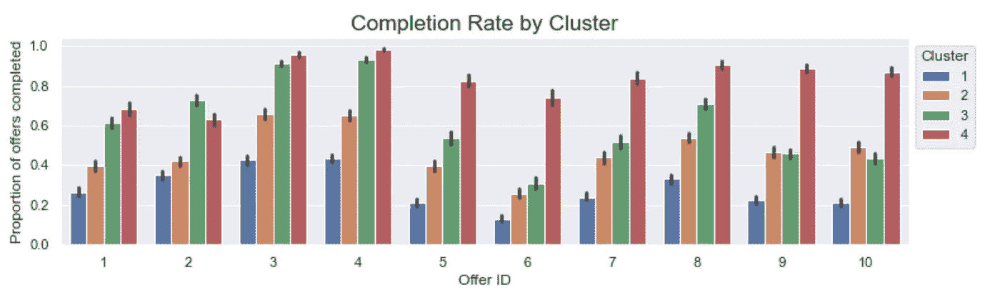

# 利用星巴克改善广告定位

> 原文：<https://medium.com/analytics-vidhya/improving-starbucks-ad-targeting-91833dff3e94?source=collection_archive---------13----------------------->

## 发现星巴克移动应用用户对优惠的反应

汉斯·维维克在 [Unsplash](https://unsplash.com?utm_source=medium&utm_medium=referral) 上拍摄的照片

# 一.导言

## 1.背景

作为消费者，从电子邮件到社交媒体，我们在数字生活的每个渠道都不断受到广告的轰炸。正如你可能已经注意到的，这些优惠中有很多与我们高度相关，而其他的则完全没有。公司每年在广告上花费数百万美元，而这些失误并没有有效地利用这些钱。

这是一个广告定位的客户细分问题。由于客户对不同类型的优惠有不同的反应，所以没有一种优惠类型对所有客户都是最好的。

在本文中，我们将分析星巴克的移动应用数据，以发现用户对不同优惠的反应，并相应地对他们进行细分。有了对顾客行为的更好理解，星巴克将能够改进向顾客发送广告的方式。

## 2.概观

这里的目的是改善广告定位，所以我提出一个两部分的解决方案:

1.  **根据人口统计数据和移动应用程序上的行为对客户进行细分—** 这些细分将让我们直观地了解对优惠有反应或无反应的客户
2.  **构建一个分类器，预测用户是否会对某个要约做出回应—** 这个分类器将帮助我们确定是否应该向特定用户发送要约

您可以跟随我的 [Github 库](https://github.com/tri-bui/starbucks-segmentation)中的 Jupyter 笔记本。考虑到解决方案，我们的工作流程顺序如下:

1.  **探索性数据分析** —预处理原始数据，探索数据中不同的优惠和用户
2.  **客户细分**—使用分位数分析和 k 均值聚类
3.  **预测建模** —采用逻辑回归、k 近邻(KNN)、支持向量机(SVM)、决策树、随机森林和光照梯度推进机(LightGBM)

这是一个二元分类器，预测用户是否会完成某个要约。基于预测准确性和 F1 分数来评估模型。我们的最终分类器将是具有最佳性能的模型。

## 3.数据

我们正在查看的数据集包含 1 个月的模拟数据，模拟了星巴克奖励移动应用程序上的客户行为。这是真实星巴克应用程序的简化版本，因为底层模拟器只有一种产品，而星巴克实际上销售几十种产品。

每隔几天，星巴克就会向手机应用用户发出优惠信息。某些用户在某些周内可能收不到任何优惠，并且并非所有用户都收到相同的优惠。有 3 种类型的优惠:

*   `BOGO`(买一送一)——在优惠到期前消费*一次*的`A`金额，获得与`A`等值的`R`
*   `Discount` —在优惠到期前，在*中消费金额`A`一次或多次*购买，即可获得与`A`等值或更低的折扣`D`(有效期内的所有购买累计达到所需金额`A`)
*   `Informational` —仅提供产品信息

对于折扣和 BOGO 优惠，所需的消费金额、奖励和有效期各不相同。至于信息优惠，没有规定消费金额，也没有奖励，但还是有有效期的。在这些情况下，假设客户在此期间感受到了优惠的影响。

顾客不会选择他们收到的报价。换句话说，用户可以收到要约，但实际上从未查看过要约，仍然可以完成要约。虽然这些报价被记录为已完成，但它们实际上对客户没有影响，因为它们没有被查看。

有 3 个相关的数据集:

1.  `**Porfolio**` (10 个报价 x 6 个字段)—每个报价的元数据

> `id` —优惠 ID
> `offer_type` — BOGO、折扣或信息性
> `difficulty` —完成优惠所需的消费金额
> `reward` —完成优惠的奖励
> `duration` —以天为单位的有效期(优惠在此期限后到期)
> `channels` —网络、电子邮件、手机、社交

2.`**Profile**` (17，000 个用户 x 5 个字段)—每个用户的人口统计数据

> `age` —缺失值编码为 118
> `became_member_on` —客户开户日期
> `gender`—“M”代表男性，“F”代表女性，“O”代表其他
> `id` —客户 ID
> `income` —客户年收入

3.`**Transcript**` (306，534 个事件 x 4 个字段)—该月发生的事件的记录

> `event` —交易、已收到报价、已查看报价或已完成报价
> `person` —客户 ID
> `time` —测试开始后的小时数(从时间 t=0 开始)
> `value` —事件详情(报价相关事件的报价元数据和交易金额)

现在你已经理解了手头的问题和我们将要使用的数据，让我们开始吧！

# 二。探索性数据分析

## 1.数据预处理

在执行任何分析之前，我们必须确保数据是可用的格式。首先，这是原始数据的样子。

**图 1** : ( **A** )左边设置的 **`profile`** 包含了 17000 个用户的人口统计数据。( **B** )右边设置的**`抄本`**包含该月发生的事件的 306，534 条记录。

这里有几件事情需要解决:

1.  2，175 名用户在`**profile**`集合中遗漏了所有人口统计信息。由于人口统计是我们想要分析的很大一部分，这些用户和他们的所有活动都被删除了。
2.  在`**transcript**`集合中有 374 个重复事件，所有这些事件都被丢弃了。
3.  `**portfolio**`集合的`channels`特征(**图 2A** )被扩展为 3 个二进制特征，指示要约是否通过该渠道发送— `web`、`mobile`和`social`。
4.  `**transcript**`集合的`value`特征(**图 1B** )也被扩展成 3 个附加特征——报价相关事件的`offer_id`和`reward`以及交易事件的`amount`。
5.  优惠 id 和客户 id 被存储为长而无意义的散列字符串，所以让我们通过将它们映射到整数来简化我们的生活:
    -客户 id 按照它们出现的顺序被映射到整数
    -优惠按照整体难度的顺序被映射到整数(**图 2B** )

**图 2** : ( **A** )左侧的原始 **`portfolio`** 集合包含该月发出的 10 个不同报价。( **B** )右边设置的转换后的` **portfolio`** 显示了整体难度的顺序，从信息到折扣再到 BOGO 优惠。在每种类型中，报价按照“难度”递增和“持续时间”递减的顺序排列。

## 2.探索优惠

> A.查看和/或完成了多少报价？

在第 1 天、第 8 天、第 15 天、第 18 天、第 22 天和第 25 天，共发出了 66，501 份要约，总数略多于 11，000 份。10 个不同的报价中，每个报价的数量相对平衡，从 6576 到 6726 不等。

当客户收到报价时，有 4 种可能性，我们将用它们对报价进行分组(**图 3** ):

1.  **第 1 组** (9，296 份报价)—既未查看也未完成的报价
2.  **第 2 组** (17，866 份报价)—已查看但未完成的报价
3.  **第 3 组** (11，497 项优惠)—完成后查看或根本未查看的优惠(无论哪种情况，客户都不知道该优惠，但还是进行了购买)
4.  **第 4 组** (27，842 个报价)—已查看并完成的报价

**图 3** :优惠组 1(下)和 3(上)为蓝色。优惠组 2(底部)和 4(顶部)为红色。

在发出去的 66k 报价中，我们可以看到差不多完成了 40k(**图 3** )，还不错。但我们也看到，那些已完成的优惠(第 3 组)中有 11k 被浪费在了那些甚至不知道有优惠并不管不顾地花了钱的客户身上。

> B.每个报价完成了多少？

暂时将第 3 组报价放在一边，让我们来分解报价完成情况。折扣优惠的完成率最高和最低(**图 4** )。

**图 4** :全部 10 个 offers 的完成率。请注意，收到的报价数量在 10 个报价中各不相同，因为第 3 组报价已被忽略。

在预测客户是否会完成报价时，`reward`似乎不是像`difficulty`或`duration`那样重要的因素。

您可能还注意到，前 2 个折扣优惠在`duration`中的天数与在`difficulty`中的金额相同，而后 2 个折扣优惠的天数较少。你可能会说，给客户 1 天的时间来完成折扣优惠是公平的。

## **3。探索用户**

> A.已完成和未完成优惠的用户统计数据

**图 5** :已完成优惠(第 3 组和第 4 组)的用户统计数据为绿色，未完成优惠(第 1 组和第 2 组)的用户统计数据为红色。

这里有一些不同之处(**图 5** ):

*   不完整报价的男性顾客是女性顾客的两倍，而完整报价的男性顾客与女性顾客几乎相等。女性顾客更有可能完成报价吗？
*   40 岁以下的`age`用户中，不完全优惠的用户比完全优惠的用户多。年轻客户完成报价的可能性低吗？
*   在不完全优惠的情况下，低收入者的数量更多，高收入者的数量更少，这是有道理的，因为`income`与支出正相关。
*   对于完整的报价，从 2017 年到 2018 年，注册人数急剧下降，但不完整报价的情况并非如此。这可能是因为 2018 年的用户是该应用的新用户，所以他们不太倾向于在不熟悉的领域花钱。

> B.用户消费模式

`Age`和`income`都被分组为 5 个分位数，以显示它们与消费习惯的关系。分位数 1 最低，5 最高。

**图 6** :左侧为按年龄划分的消费总额，右侧为按收入划分的消费总额。两者都显示了性别之间的差异。组 1 是底部分位数，组 5 是顶部分位数。

支出随着`income`的增加而增加，但有趣的是，支出只增加到`age`第 3 组(大约 50 岁)，然后与第 4 组和第 5 组保持不变(**图 6** )。

另一件事是，在每个年龄组和五分之四的收入组中，女性顾客比男性顾客花费更多的钱。这可能解释了为什么我们看到完成报价的女性用户比例高于未完成报价的女性用户比例(**图 5** )。

# 三。客户细分

现在，我们将尝试使用两种不同的方法对客户进行细分，以帮助我们更好地了解客户对优惠的反应。

## 1.分位数分析-频率、货币价值、保有权(FMT)

这是对流行的 RFM ( `recency`、`frequency`、`monetary`值)的一种分析。但是因为我们只查看 1 个月的数据，`recency`没有用，所以我们将查看`tenure`。对于每个客户，我们将计算:

- `Frequency` —用户进行交易的频率
- `Monetary`值——用户花了多少钱
- `Tenure` —用户使用该应用的时间

**片段 1** :使用``**transcript**` **`** 和``**profile**` **`** 集合创建 FMT 片段的代码。

`Frequency`被分组为 6 个分位数，`monetary`值 8 个分位数，`tenure` 3 个分位数(**片段 1** )。这类似于任意分配特征权重，但其思想是`monetary`值是最重要的，其次是`frequency`和`tenure`。

**图 7**:FMT 细分的客户层级。

这 3 个特征都有一个分位数“分数”，将所有 3 个特征相加将得到客户的总分。然后，根据总得分将客户分为三类(**图 7** ):

**图 8** :按客户层级划分的每个报价的完成率。

1.`Bronze`等级—总分在 3 和 7 之间
2。`Silver` tier —总分在 8 和 12 之间
3。`Gold`等级—总分在 13 和 17 之间

不出所料，`bronze`客户完成的报价不多，`gold`客户完成的报价最多(**图 8** )。即使是最简单的优惠(折扣优惠 3 和 4) `bronze` tier 的完成率低于 40%,而`gold` tier 的完成率高达 97%!

**图 9** :每个客户层的用户统计数据。

从`bronze`到`silver`再到`gold`，我们可以看到女性用户的比例增加，40 岁以下的用户数量减少，低收入者减少，高收入者增加。

## 2.k 均值聚类

在本节中，我们将使用用户的`gender`、`age`、`income`、`frequency`、`monetary`值和`tenure`使用 k 均值聚类对客户进行细分。以前的方法只考虑了应用程序上的用户行为，但现在我们将人口统计学融入其中。

**片段 2** :使用之前创建的 FMT 数据创建集群段的代码。

我把`gender`简化成一个二元特征，表示用户是否是`male`。换句话说，女性和其他性别的用户被分组在一起，因为`male`是数据中的大多数性别。

由于这在技术上仍然是一个分类特征，我们将使用 PCA(主成分分析)来创建连续成分，以捕捉数据中的方差。这确实使分析更难解释，但我们可以通过查看特征系数来了解每个组件是如何构建的(**图 10A** )。

**图 10**:(**A**)5 个 PCA 组件的特征加载见左侧。( **B** )右图显示了与前 2 个 PCA 成分相关的 4 个聚类的分离。

虽然降维不是我的本意，但我只创建了 5 个组件，这仍然解释了 6 个原始特征中几乎 95%的变化。这些组件随后被用于创建 4 个集群(**图 10B** )。如前所述，主成分分析确实使解释聚类变得更加复杂，所以让我们检查每个聚类的 6 个原始特征。

**图 11** :蛇图参考实际平均值聚类汇总。

**图 12** :蛇形图显示了每个聚类的人口统计学和 FMT 特征的标准化平均值。

平均值(**图 11** )可能不能代表整个集群，但我们可以用它来给出每个集群的一般描述:

*   `**Cluster 1**`客户完全是`male`，低于平均水平`age`和`income`。他们是最新的用户，花钱最少。
*   `**Cluster 2**`顾客几乎都是女性，也有少数其他性别的(无`male`)。他们的`age`和`income`都高于平均水平，但他们的花费也相对较少。
*   `**Cluster 3**`客户在很大程度上是最年轻的群体，但使用该应用程序的时间最长。这就是有趣的地方。他们有最低的`income`，然而最高的支出`frequency`和平均支出`amount`，这意味着他们可能经常购买小额商品。
*   `**Cluster 4**`顾客是最大的支出者，差距很大(在`amount`，而不是`frequency`)。这个细分市场的女性顾客比`male`多。他们的`age`和`income`都远高于平均水平。

让我们来看看每个集群是如何响应报价的。

**图 13** :集群每次报价完成率。对于大多数产品，完成率随着我们按顺序浏览集群而增加。

因为聚类是按照平均支出的升序排列的，所以我们可以推断，客户的支出习惯是我们预测目标中最重要的因素之一。

## **3。建议**

由于来自两种细分方法的细分市场共享相似的要约-完成概况，因此可以为每一对相似的细分市场提供建议:

- `Bronze`层和集群 1
- `Silver`层和集群 2/3
- `Gold`层和集群 4

> 由于用户不会花很多钱，他们不太可能对报价做出回应，所以停止向他们发送报价或者只向他们发送容易完成的报价将是一个好主意。
> 
> 用户确实比`bronze`用户花费更多，所以向他们发送优惠信息是值得的。他们完成了折扣优惠 3 和 4 的很大一部分，因此专注于较容易的优惠或降低较难的优惠的难度可能会增加他们完成优惠的比率。
> 
> `Gold`用户的要约完成率一直很高，因此增加向这些用户发送要约的难度实际上对星巴克有利。由于他们极有可能对报价做出回应，因此更高的难度可能会增加这些客户的消费金额。

同样，这些建议是针对 FMT 层细分市场的，但同样适用于其集群对应部分。

# 四。预测建模

现在，我们将构建一个分类器来预测用户是否会对要约做出回应。这个分类器将帮助我们决定是否应该给用户发送一个特定的报价。

该分类器的输入包括要约的元数据和用户的人口统计和行为特征。它将产生一个二进制输出，预测用户是否会完成要约。

## 1.预处理

在创建任何模型之前，还有一点预处理要做。我们首先提取将进入模型的数据:从`**transcript**`集合中收到的 66，501 个报价。

接下来，我们使用一键编码将分类特征`offer_type`扩展成 3 个二进制数字特征— `info_offer`、`disc_offer`和`bogo_offer`。然后，我们按照定义创建二进制目标标签:`1`如果报价被查看并完成，否则为`0`。

**图 14** :特征间的皮尔逊相关性。

我们最终的特征集中有 15 个特征:`reward`、`difficulty`、`duration`、`mobile`、`social`、`web`、`age`、`income`、`frequency`、`monetary`、`tenure`、`info_offer`、`disc_offer`、`bogo_offer`、`male`

如相关热图所示(**图 14** )，存在高度多重共线性，特征如下:`duration`、`mobile`、`info_offer`、`disc_offer`、`bogo_offer`。

由于线性模型具有非多重共线性的假设，因此在运行逻辑回归时，我们将从特征集中删除这 5 个。

最后，我们对训练集、验证集和测试集进行了 60–20–20 数据分割，并对所有 3 个集中的特征进行了标准化。现在我们准备开始构建模型了！

## 2.建模

为了给出一个概述，我训练了 6 种不同的机器学习模型——逻辑回归、k 近邻(KNN)、支持向量机(SVM)、决策树、随机森林和 LightGBM。

前 5 个模型的超参数使用网格搜索进行调整。由于 LightGBM 有更多的超参数需要优化，执行网格搜索是不可行的，所以我选择了 Optuna，它使用贝叶斯优化来优化超参数。

机器学习算法和超参数调优过程的细节不在本文的范围之内，但是如果你感兴趣，我会在我的 [Github 资源库](https://github.com/tri-bui/starbucks-segmentation)的上一个笔记本中详细讨论。

> 逻辑回归、k-最近邻和支持向量机

**图 15** :验证集上逻辑回归的分类报告。

逻辑回归将是我们预测性能的基线模型。在网格搜索之后，我们得到了一个逻辑回归模型，它对 F1 值为 0.70 的验证集进行了预测(**图 15** )。

如果我们检查系数，`monetary`价值、`frequency`支出和`social`媒体(表明要约是否通过社交媒体发送)在逻辑回归中具有最大的预测能力。我们还没有研究渠道在其中如何发挥作用，但也许客户对通过社交媒体发送的报价反应更大。

基线建立后，让我们看看是否可以用 k 近邻(KNN)和支持向量机(SVM)做得更好。

**图 16** : ( **A** )左侧为 KNN 的分类报告。SVM 的分类报告在右边。

KNN 和 SVM 的表现都比逻辑回归要好几个百分点。但是我们可以看到 SVM 的预测是不平衡的。让我们仔细看看这些预测。

**图 17**:SVM 对训练集(左)和验证集(右)预测的混淆矩阵。

假阳性以大约 3 比 2 的比例超过假阴性(**图 17** )。

在这种情况下，偏向积极类是可以容忍的，因为(1)这不是一个巨大的差异，以及(2)我们宁愿向不响应的客户发送报价，也不愿错过向响应的客户发送报价。

> 基于树的分类器

接下来，我们将查看决策树和 LightGBM 的结果。

**图 18** : ( **A** )左侧为决策树分类报告。(**B**)light bgm 的分类报告在右边。

LightGBM 是唯一一个使用 Optuna 来调整其超参数的，但令人惊讶的是，尽管在超参数调整过程中进行了贝叶斯优化，并且在算法本身中进行了梯度提升优化，但它实际上比决策树做得更差。

不幸的是，无论是决策树还是 LightGBM 都不能比 SVM 做得更好。所以让我们来讨论一下有哪些更好的预测。

## 3.最终分类器

我们最后的分类器是…随机森林。最终的参数(**片段 3** )是网格搜索大量试错的结果。

**片段 3** :最终随机森林分类器。

随机森林分类器对 F1 值为 0.74 的验证集和 F1 值为 0.75 的测试集进行预测(**图 19A** )。

**图 19** : ( **A** )左边，验证集上的随机森林预测分类报告在上面，测试集在下面。( **B** )在右边，验证集上随机森林预测的混淆矩阵在左边，测试集在右边。

兰登森林在预测类别中也有类似的不平衡，如 SVM ( **图 19B** )，但没有那么明显。如前所述，在这种情况下，稍微偏向积极的一类并不是一件坏事。

查看特征重要性，我们发现与逻辑回归中相同的前 3 个特征— `monetary`、`frequency`和`social`。因此，我们可以得出结论，客户的消费习惯和发送要约的渠道是预测客户是否会完成要约的最重要因素。

# 动词 （verb 的缩写）结论

## 1.摘要

在本文中，我们对星巴克的模拟移动应用数据进行了深入分析，以发现客户对不同优惠的反应。

我们的目标是(1)根据人口统计和行为对客户进行细分，以及(2)建立一个分类器，预测用户是否会对报价做出反应。我们成功地完成了这两项工作，在此过程中，我们发现了一些关于数据的关键见解:

> -通过社交媒体发送的优惠信息得到了客户更好的回应
> 
> -用户使用该应用的时间越长，他们花钱就越放心
> 
> -女性顾客往往比男性顾客花更多的钱，因为她们属于同一个`age`组或`income`组
> 
> -年轻客户倾向于频繁进行小额交易
> 
> -随着`age`的增加，两个`genders`的平均`income`和平均支出显示出非常相似的模式:增加到大约`age` 50，然后高年龄组没有变化
> 
> -随着`income`的增加，支出也会增加
> 
> -顾客消费越多，就越有可能对优惠做出反应

通过细分分析，我们发现通常有 3 类客户——下层、中层和上层客户，我分别称之为`bronze`、`silver`和`gold`客户。重申我对改进广告定位的建议:

> - `Bronze`用户不太可能对报价做出回应，因此停止向他们发送报价或只向他们发送易于完成的报价将是一个好主意。
> 
> - `Silver`用户完成了许多较容易的报价，因此关注较容易的报价或降低较难报价的难度可能会改善他们的反应。
> 
> - `Gold`用户的要约完成率一直很高，因此增加向这些用户发送要约的难度实际上会让星巴克受益。

## **2。扩展项目**

虽然这是一个非常深入的分析，但仍有很大的改进空间。如果你想进一步挖掘数据，这里有一些想法:

*   探索渠道—了解不同的渠道如何影响客户对优惠的回应方式，以及在特定渠道做出回应的客户的人口统计数据。
*   分析尝试的报价——有很多情况下，客户在收到报价后查看了报价并进行购买，但最终未能完成报价。这些案例可以让我们更深入地了解如何重新定位或重组优惠。
*   训练不同的分类器——XG boost 或神经网络可能会给出更好的结果。

你可以在我的 [Github 库](https://github.com/tri-bui/starbucks-segmentation)找到完整的代码。我希望这是一个有见地的阅读！