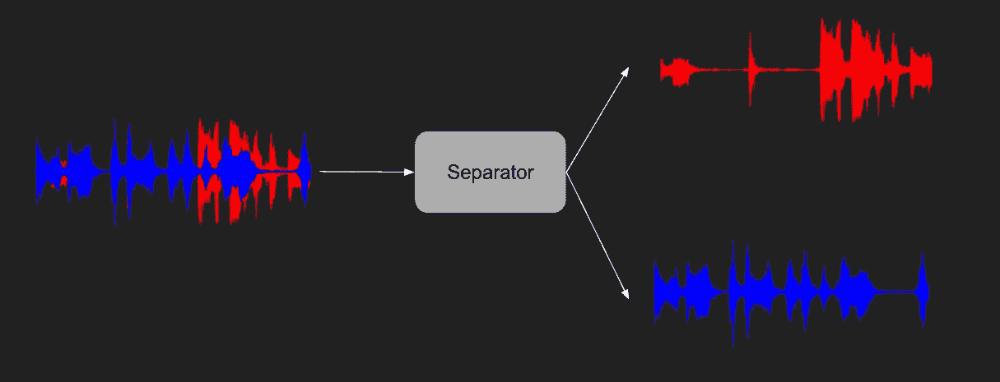
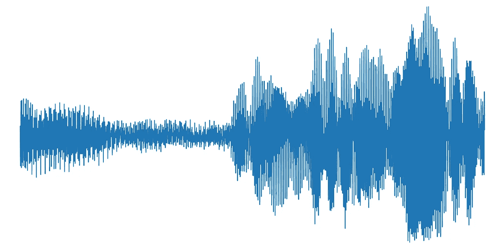
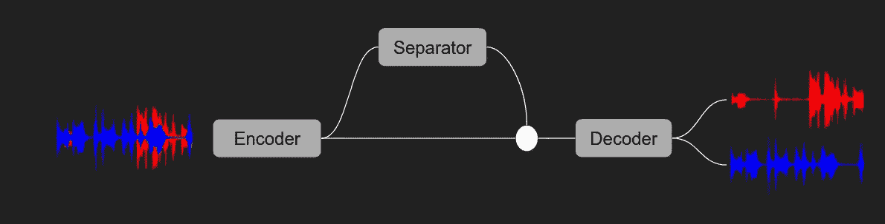
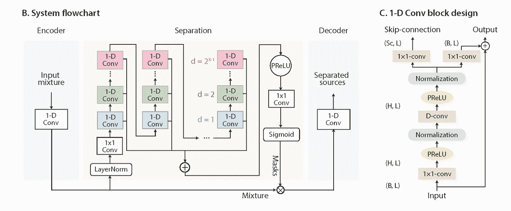
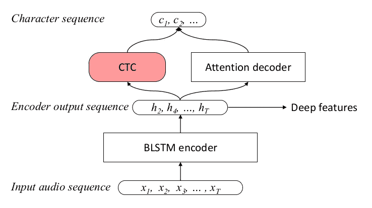
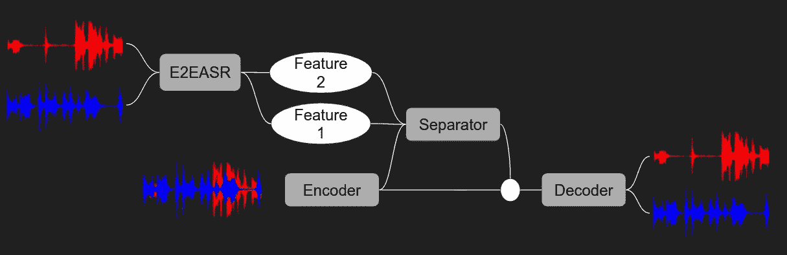
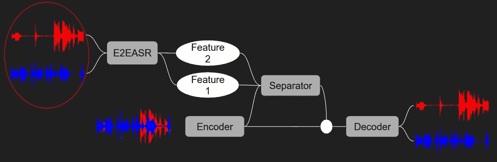
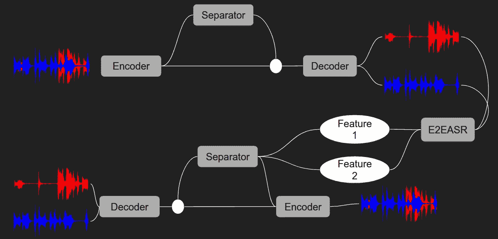
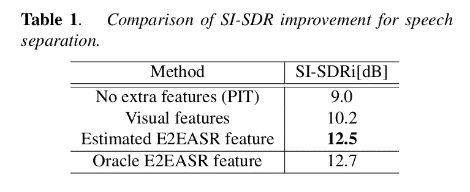

# 通过结合端到端语音识别改进语音分离

> 原文：<https://medium.com/analytics-vidhya/improving-voice-separation-by-incorporating-end-to-end-speech-recognition-c3dd57d80206?source=collection_archive---------16----------------------->

分离 2 个扬声器外壳的单声道音频

这是一篇解释论文[通过整合端到端语音识别](https://ieeexplore.ieee.org/document/9053845)改进语音分离的文章。

作者——Naoya Takahashi，Mayank Kumar Singh，Sakya Basak，Parthasaarathy Sudarsanam，Sriram Ganapathy，Yuki Mitsufuji

# 了解语音分离

从其他源中分离语音的问题，例如语音分离(分离多个重叠的语音信号)和歌唱语音分离(从其他乐器声音中分离人声)已经被积极地研究了几十年。

让我给你一个简短的背景，我们正在努力实现语音/音乐分离。

语音/音乐可以表示为压力值的时间序列。它们具有波形属性，当生成两个重叠声部时，波形值会相加。语音分离的任务是将这个单一的时间序列分离成两个或多个具有单独语音源的时间序列数据。

单声道(单通道)音频、压力和时间的表示

查看时间序列数据的特定索引，问题非常类似于对于两个扬声器的情况，给定 *a + b* ，找到 *a* 和 *b* 。这个问题有无穷多个解，因此乍一看不可能解决。但是，如果我们考虑整个时间序列，并考虑到人类的声音或音乐被限制在一个低维空间，这个问题就变得可以解决。

# 介绍

在文献中，通常的做法是通过采用 STFT(短时傅立叶变换)来预处理音频样本，然后应用语音分离技术。最近[conv-塔斯奈特:超越语音分离的理想时间-频率幅度掩蔽](https://arxiv.org/abs/1809.07454v3)取消了这一预处理步骤，声称学习基础表示法优于 STFT，并在 WSJ 数据集上实现了语音分离的最先进结果。

ConvTasNet 的基本工作。编码器是一维卷积滤波器，分离器是时间卷积的堆栈，解码器是一维转置卷积滤波器。

ConvTasNet 模型的详细架构

端到端自动语音识别(E2EASR)系统旨在将 ASR 系统中的所有子模块(如声学模型、发音模型和语言模型)结合起来。因此，它们被设计成模拟更长的相关性，因此，与通常接受几帧作为输入的传统声学模型相比，E2EASR 特征被期望包含更长的语言信息。用于端到端语音识别的[混合 CTC/注意力架构](https://ieeexplore.ieee.org/document/8068205)是一个 E2EASR 模型，它利用 CTC(连接主义者时间分类)以及注意力机制来改进语音识别。

用于端到端语音识别的混合 CTC/Attention 体系结构

感兴趣的论文的**贡献(通过结合端到端语音识别改进语音分离)总结如下:**

*   他们提出了一种基于迁移学习的方法来结合语音的语音和语言特性以进行语音分离。为此，他们提出了 E2EASR 特性。
*   他们使用 AVSpeech 和 Audio-Set 数据集在同步语音分离和增强任务上评估了所提出的方法，这些数据集的音频是在非受控环境中记录的，并且表明
    所提出的方法与没有使用 E2EASR 特征训练的模型和使用视觉特征训练的模型相比，显著提高了分离精度。
*   他们进一步表明，尽管 E2EASR 是在标准语音上训练的，但它对于具有有限数据量的歌唱声音分离任务来说是鲁棒地转移的。

# 提议的方法

该论文提出将 E2EASR 特征/视觉特征结合到 ConvTasNet 网络中，以进一步提高分离 Si-SNR(尺度不变-信噪比)。在 [AVSpeech](https://arxiv.org/abs/1804.03619) 数据集上训练和评估语音分离模型。

Oracle 系统:在 ConvTasNet 框架中整合 E2EASR 特性。这些特征是从 E2EASR 模型的编码器输出中提取的，并在分离器模型之前连接

对于这两种方法，E2EASR 特征和视觉特征，采用迁移学习方法，并且从预训练的特征提取器模型中提取特征。视觉特征提取器模型基本上是一个去掉了解码器部分的自动编码器。在不同的数据集(LibriSpeech)上训练 E2EASR 特征提取器模型。为每个说话人提取的特征在分离器中连接，并且在冻结特征提取器模型参数的同时训练 ConvTasNet 模型。使用 E2EASR 特性的模型称为 oracle 模型。

视觉特征提取器模型像自动编码器一样在 AVSpeech 数据集中可用的每帧视频的单个嘴唇裁剪上进行训练。添加视觉特征使 SI-SNR 比纯音频模型提高了 1.2dB。

# Oracle 模型的局限性

尽管在分离 Si-SNR 值上给出了很大的改进(参见结果表)，但是结合了 E2EASR 特征的模型没有实际应用，因为它假设分离的语音是预先可用的。

为了计算 E2EASR 特征，需要事先分离语音。

# 克服 Oracle 模型的局限性

代替使用目标分离语音作为 E2EASR 模型的输入，本文提出使用两级网络，通过使用基本 ConvTasNet 模型来获得中间分离语音，并使用这些来提取进一步增强分离 Si-SNR 的特征。

估计的 E2EASR 特征系统:使用基本的 ConvTasNet 模型，计算中间分离语音。这些被馈送到 E2EASR 模型，以提取馈送到 oracle 模型的深层特征。

需要注意的一些要点是

*   第一阶段(基本 ConvTasNet 模型)在 AVSpeech 数据集上进行预训练，其权重保持固定。
*   E2EASR 模型在 LibriSpeech 数据集上进行预训练，其权重保持固定。
*   假设 oracle 中间语音分离，对第二阶段模型进行预训练。其权重在估计的 E2EASR 特征系统中保持固定。

# 结果

# 结论

他们提出了一种迁移学习方法来利用 E2EASR 模型进行语音分离。在同步语音分离和增强任务上的实验结果表明，所提出的 E2EASR 特征相对于包括使用视觉线索的模型的基线提供了显著的改进。他们进一步表明，E2EASR 功能提高了歌唱声音分离的性能，证明了其对有限数据可用性和域不匹配的鲁棒性。