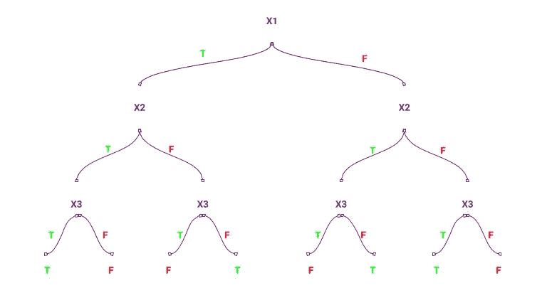

# 赶时间！分类和回归树:六个简单的步骤

> 原文：<https://medium.com/analytics-vidhya/in-a-hurry-classification-and-regression-tree-six-easy-steps-ec343c3f6b2f?source=collection_archive---------16----------------------->

## CART 中发生了什么——以及建立模型的六个简单步骤。

分类和回归树是决策树算法的一部分。

使用 3 个属性进行异或运算—hackearth.com

决策树基于一种算法方法，该方法根据条件确定拆分数据的方法。(添加图片)

决策树是基于自上而下的贪婪方法。

ID3 算法使用信息增益，而 C4.5 使用增益比进行拆分。

CART 是备用的，用于回归和分类。CART 使用基尼指数进行拆分。

CART 如何计算每个变量的基尼系数，

沃洛季米尔·赫里先科在 [Unsplash](https://unsplash.com?utm_source=medium&utm_medium=referral) 上的照片

举个例子，

可变温度= {热，温和，冷，冷，冷，温和，热，温和}和目标= {是，是，不，不，是，是，不，是}

现在要计算临时(整体)基尼系数，首先我们需要计算

基尼系数(总体热点)是=1 否= 1 因此，1- (1/2) — (1/2) = 0.5

基尼系数(总体温和)是=3，否= 0，因此，1- (3/3) — (0/3) = 0

基尼系数(总体寒冷)是= 1 否= 2 因此，1 — (1/3) — (2/3 = 0.46

总体基尼系数=(2/8)* 0.5+(3/8)* 0+(3/8)* 0.46 = 0.297

同样，我们可以计算其他变量的基尼系数，如风速、天气等。

在计算所有变量的基尼系数后，CART 选择基尼系数较小的变量来分割数据，分割后的数据变得纯净。

拆分后，父节点获得 2 个或更多子节点(基于变量类)。并且对于进一步的子节点分裂算法使用相同的循环。

以下是在 R 中执行 CART 的六个简单快捷的步骤，

**Step1:** CART 监督技术我们使用库(rpart)和库(rpart.plot)

**第二步:**借助 rpart.control()函数设置控制参数——设置 minbucket(终端节点)和 minsplit(最小观测值必须存在于要拆分的节点中)

**注意:**降低 minsplit 和 minbucket，增大树。现在，不能把 minbucket = 1，也就是说只有 1 个属性，这个模型给出的准确率最高。因此该模型是过度拟合的，并且不能在看不见的数据集上给出相同的精度。

**第三步:**使用 rpart()函数建立模型。

**步骤 4:** 基于复杂参数(CP)表和 xerror 修剪树。

**步骤 5:** 使用 fancyRpartplot()函数创建一个图表。

**第六步:**使用 predict()函数预测未知数据集的类别。

关于实际应用以及如何将回归树应用于汽车价格预测案例研究— [**点击此处**](https://github.com/RutvijBhutaiya/Machine-Hack-Predict-Used-Car-Price) 。

 [## rutvijbhutaya/机器预测二手车价格

### 基于给定数据集预测二手车价格。这个项目是关于预测二手车价格的汽车…

github.com](https://github.com/RutvijBhutaiya/Machine-Hack-Predict-Used-Car-Price)