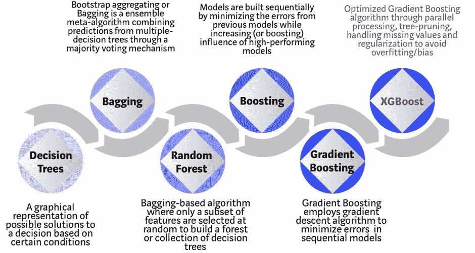

# 赶时间！XGBoost:六个简单的步骤

> 原文：<https://medium.com/analytics-vidhya/in-a-hurry-xgboost-six-easy-steps-b410b56ef85b?source=collection_archive---------7----------------------->

## 极端梯度提升会发生什么——它如何提高性能

贾斯汀·坎贝尔在 [Unsplash](https://unsplash.com?utm_source=medium&utm_medium=referral) 上的照片

XGBoost 是一个基于决策树的集成机器学习，它使用一个 boosting 框架。

我们已经在文章中解释了决策树和 CART 技术。请阅读它以了解决策树如何识别分割特征的方法— [点击此处](/analytics-vidhya/in-a-hurry-classification-and-regression-tree-six-easy-steps-ec343c3f6b2f)

什么是助推？

*   在 boosting 中，每个模型都是建立在一个序列上的。
*   基于训练数据集，两种技术都创建 n 个分类器(随机的新数据集)。
*   表示基于数据集 1 构建模型 1。然后，模型 2 基于模型 1 构建(先前分类器成功-基于权重),但使用数据集 2。这最大限度地减少了以前模型的误差，并增加了高性能模型的影响。
*   小心，这会增加过度拟合。
*   提升使用某些权重到下一个分类阶段。

决策树的演变:

从决策树进化出 XGBoost 算法

XGBoost 工作于并行处理，例如有两个循环，一个是内部循环，另一个是外部循环。现在，如果外部循环逐个创建叶节点。并且内部循环计算特征。现在，在内循环完成之前，不能启动外循环。因此，XGBoost 中的并行化解决了这一限制，在 XGBoost 中，为了提高运行时间，循环的顺序是可以互换的。此开关提高了算法性能。

与 CART 类似，我们也使用 max_depth 参数来设置修剪树的标准。

XGBoost 关注以下内置算法增强:

*   正规化，以克服过度拟合通过 L1 拉索斯和 L2 岭。
*   稀疏特征允许，比如，缺失值，零值，一键编码。
*   权重五分草图，以有效地在数据库中找到一个最佳分裂。
*   内置交叉验证

**在 R 中构建 XGBoost 模型的六个简单步骤:**

**第一步:**安装库，xgboost，margrittr，Matrix

**步骤 2:** 使用 xgb 为训练和测试数据集创建一个矩阵。DMatrix()函数

**步骤 3:** 为参数和观察列表设置参数

**第四步:**使用 xgb.train()函数构建模型

**第五步:**使用 xgb.importance()函数进行特征分析

**第六步:**使用 predict()函数进行预测

关于实际应用以及如何将 XGBoost 应用于“汽车司机接受/拒绝报价”预测案例研究— [点击此处](https://github.com/RutvijBhutaiya/McKinsey-Big-Data-Hackathon)

 [## rutvijbhutaya/麦肯锡大数据黑客马拉松

### 人群分析(CAX) -麦肯锡大数据黑客马拉松，预测要约被某个…

github.com](https://github.com/RutvijBhutaiya/McKinsey-Big-Data-Hackathon)