# 从数学上深入解释神经网络中的前馈

> 原文：<https://medium.com/analytics-vidhya/in-depth-explanation-of-feedforward-in-neural-network-mathematically-448092216b63?source=collection_archive---------5----------------------->

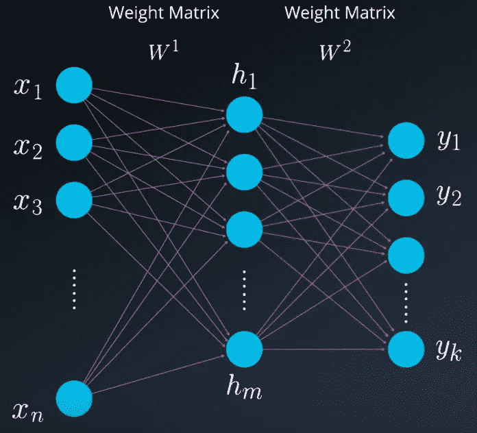

为了解释前馈过程，让我们看一下人工神经网络的基本模型，其中我们只有一个隐藏层。输入分别连接到隐藏层中的神经元，隐藏层中的神经元分别连接到输出层中的神经元，其中每个神经元代表单个输出。我们可以把它看作是数学函数的集合。每个输入通过一组我们需要修改的权重在数学上连接到一个隐层神经元，每个隐层神经元以类似的方式连接到输出层。

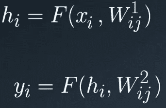

输入的数量、层中隐藏神经元的数量和输出的数量没有限制。这些数字之间也没有任何关联，所以我们可以有 n 个输入，m 个隐藏神经元和 k 个输出。在更近、甚至更简单的观察中，我们可以看到每个输入都乘以相应的权重，并在下一层的神经元上加上一个偏差。偏差是神经元的外部参数，可以通过添加外部固定值输入来建模。整个求和过程通常会通过激活函数到达下一层或输出端。

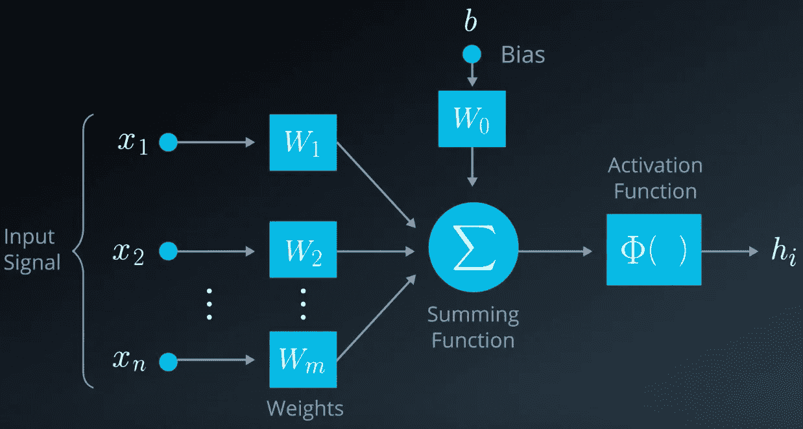

我们的目标是以这样一种方式设计一个系统，它将为我们提供特定输入 x 的正确输出 y。本质上，我们真正想要的是找到将输入连接到隐藏层的最优权重集以及将隐藏层连接到输出的最优权重集。

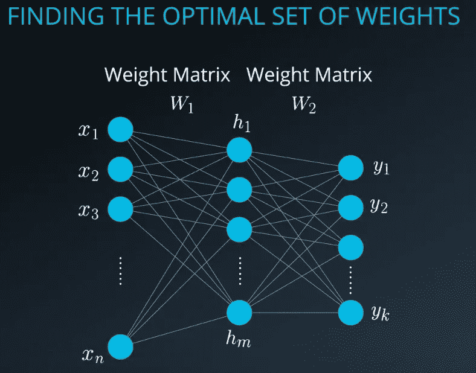

为此，我们需要开始训练阶段，为我们的系统找到最佳的砝码组。这个阶段将包括两个步骤:前馈和反向传播。在前馈部分，我们将计算系统的输出。输出将与正确的输出进行比较，给出错误的指示。在反向传播部分，我们将改变权重，以尽量减少误差。并再次启动前馈，直到我们找到系统的最佳权重集。

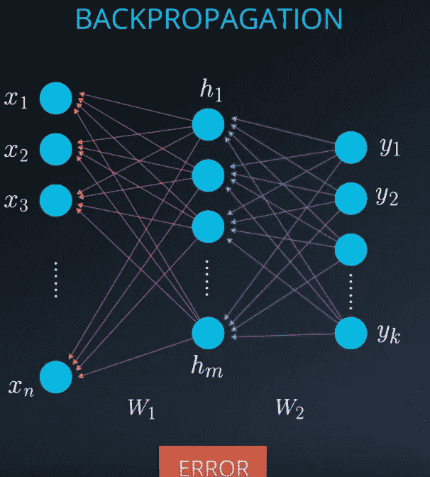

# 前馈过程的数学解释

## 计算隐藏状态的值

为了使计算更容易，我们将决定有 n 个输入，单个隐藏层中的 3 个神经元和两个输出。实际上，我们可以在一个隐藏层中拥有数千个神经元。我们将使用 W_1 作为从 x 到 h 的一组权重，W_2 作为从 h 到 y 的一组权重。由于我们只有一个隐藏层，所以我们在每个前馈循环中将只有两个步骤。

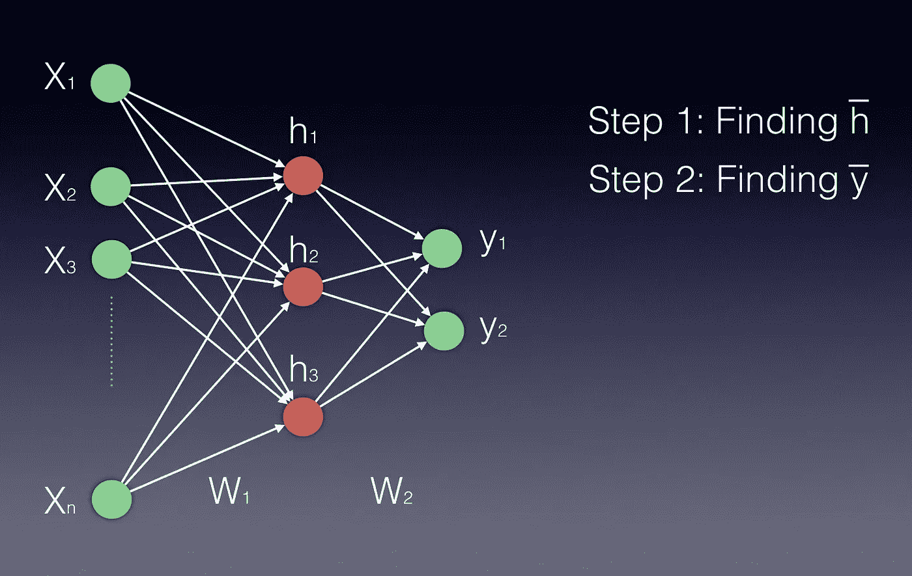

请注意，隐藏层和输出层都显示为向量，因为它们都由多个神经元表示。

除了使用非线性激活函数之外，所有计算都涉及输入和权重的线性组合。换句话说，我们将使用矩阵乘法。用于[线性组合](http://linear.ups.edu/html/section-LC.html)和[矩阵乘法](https://en.wikipedia.org/wiki/Matrix_multiplication)的链接。

## 步骤 1(找到 h)

如果我们在一个隐藏层中有一个以上的神经元，h 实际上是一个向量。每个输入是一个向量，连接到隐层中的每个神经元。隐藏层的向量 h’将通过将输入向量乘以权重矩阵 W1 *W* 1 来计算，如下所示:

*h*′=(*x*W1)

使用向量乘矩阵乘法，我们可以用下面的方式来看这个计算

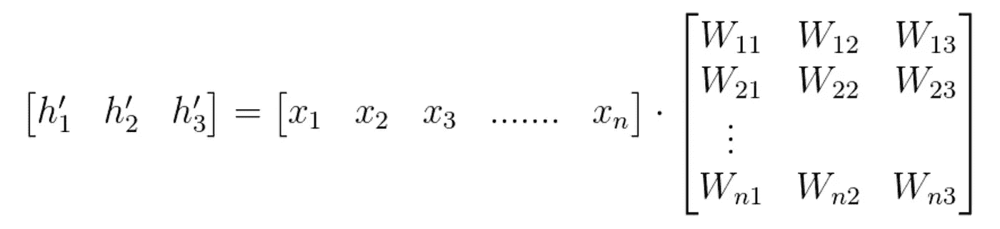

等式 1

在找到 h’之后，为了确保 h 的值不会爆炸和增加太多，我们需要一个激活函数(φ)来完成隐藏层值的计算。该激活函数可以是双曲正切、Sigmoid 或 ReLU 函数。

我们可以使用下面两个等式来表示最终的隐藏向量 h:

h =φ(x W1)

或者

h =φ(h′)

由于 Wij 表示权重矩阵中的权重分量，将神经元 **i** 从输入连接到隐藏层中的神经元 **j** ，我们也可以用以下方式编写这些计算:(注意，在这个例子中，我们有 *n* 个输入，只有 3 个隐藏神经元)

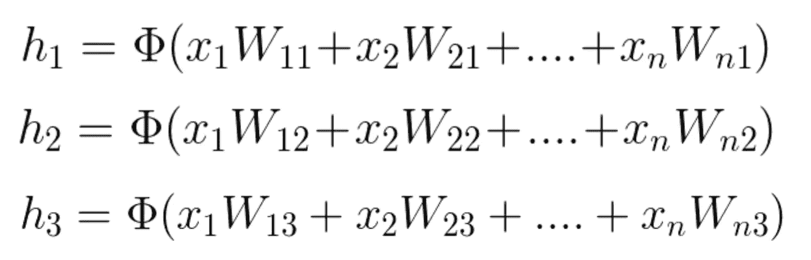

等式 2

关于激活功能以及如何使用它们的更多信息可以在[这里](https://github.com/Kulbear/deep-learning-nano-foundation/wiki/ReLU-and-Softmax-Activation-Functions)找到。

## 第二步(寻找 y)

计算输出向量的过程在数学上类似于计算隐藏层向量的过程。我们再一次使用一个向量乘以矩阵，然后是一个激活函数。向量是新计算的隐藏层，矩阵是连接隐藏层和输出的矩阵。

本质上，神经网络中的每个新层是通过矩阵乘法由向量计算的，其中向量表示新层的输入，而矩阵是将这些新输入连接到下一层的矩阵。

在我们的例子中，输入向量是 h，矩阵是 W2，因此 y =h W2。在某些应用中，使用 softmax 函数可能是有益的(如果我们希望所有输出值介于 0 和 1 之间，并且它们的总和为 1)。

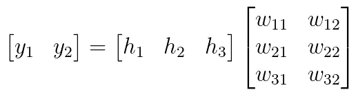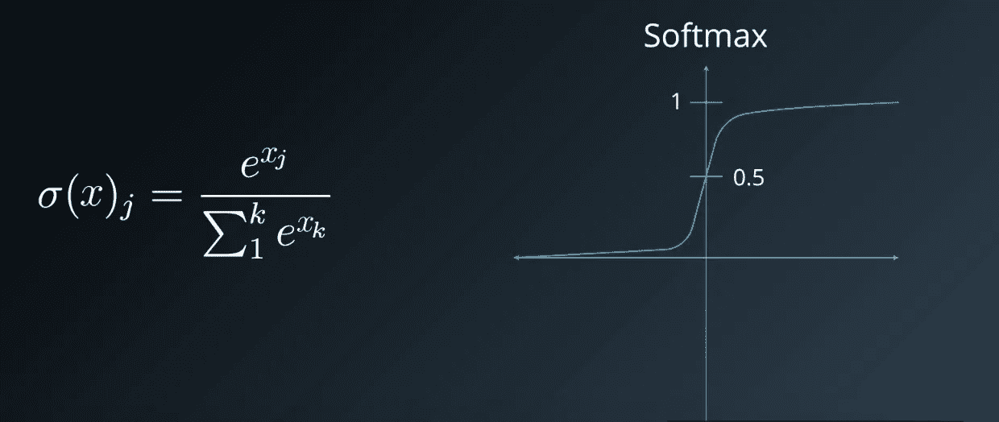

Softmax 函数

为了很好地逼近输出 y，我们需要不止一层的隐藏层，甚至可以有几千层。本质上，你可以把这些神经元看作是可以堆叠的积木。

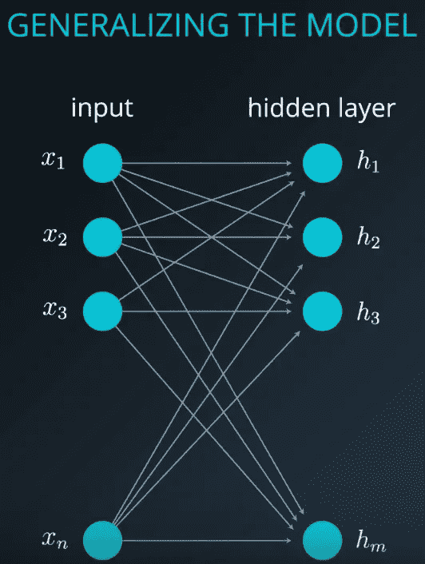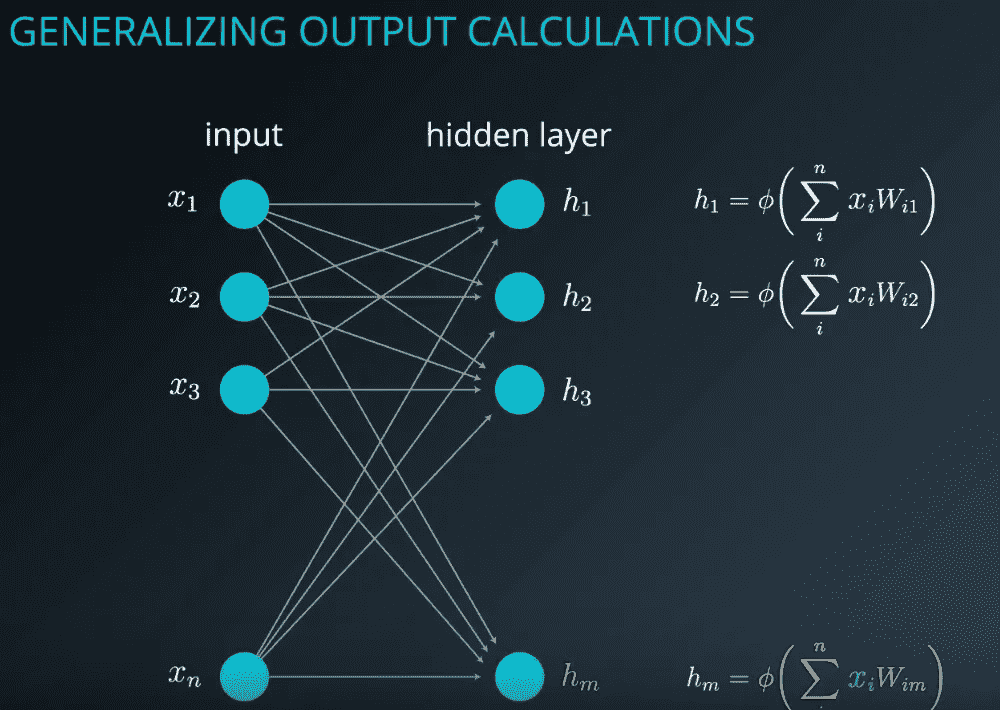

这里，我们没有强调偏置输入。偏见不会改变这些计算。简单地认为它是一个恒定的输入，通常是一个，它也通过一个权重连接到隐藏层的每个神经元。bias 与任何其它输入之间的唯一区别是，当其它输入改变时，它保持不变。就像所有其他输入一样，连接到下一层的权重也会更新。

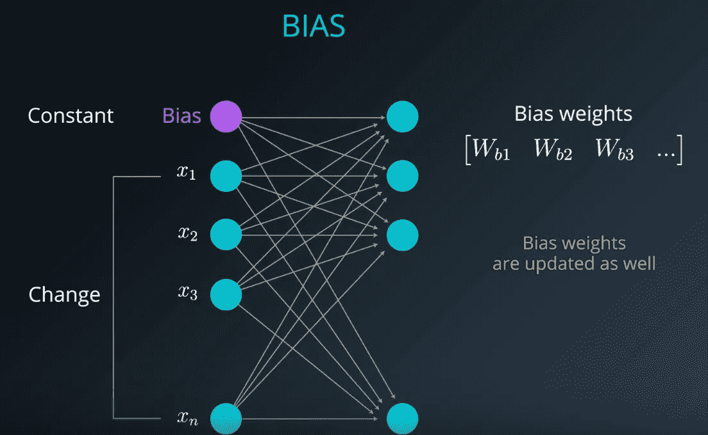

我们的目标是找到最佳的权重集，为我们提供特定输入的期望输出。在训练阶段，我们实际上知道给定输入的输出。我们计算系统的输出，以便调整权重。我们通过找出错误并努力将其最小化来做到这一点。训练阶段的每一次迭代都会减少一点误差，直到我们最终确定误差足够小。

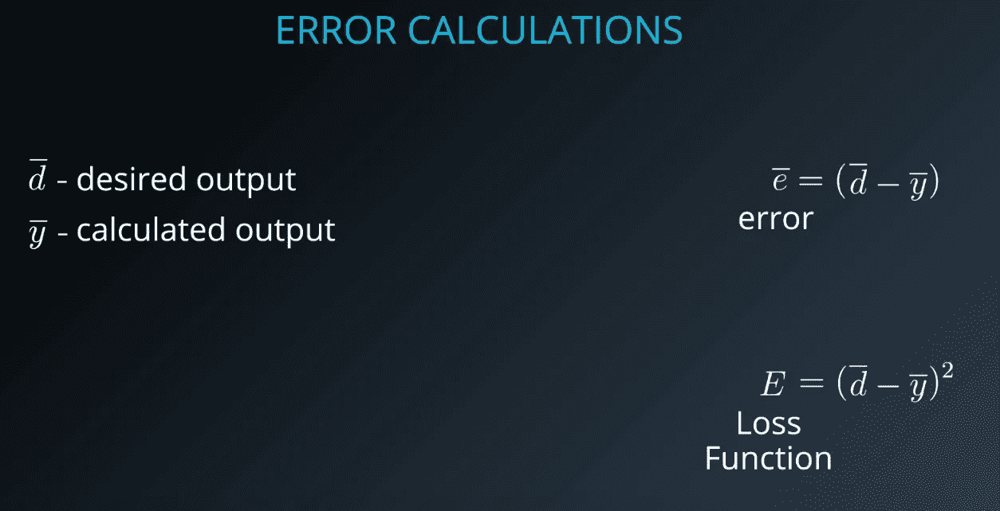

最常用的两个误差函数是[均方误差(MSE)](https://en.wikipedia.org/wiki/Mean_squared_error) (通常用于回归问题)和[交叉熵](https://www.ics.uci.edu/~pjsadows/notes.pdf)(通常用于分类问题)。

在上述计算中，我们使用了 MSE 的变化。

接下来的文章将关注反向传播过程，或者我们也称之为使用链式法则的随机梯度下降。

反向传播的深入解释链接可以在[这里](/@aungkyawmyint_26195/deep-dive-into-back-propagation-part-i-e1a92b6dbdb9)找到。

内容鸣谢:Udacity 深度学习计划