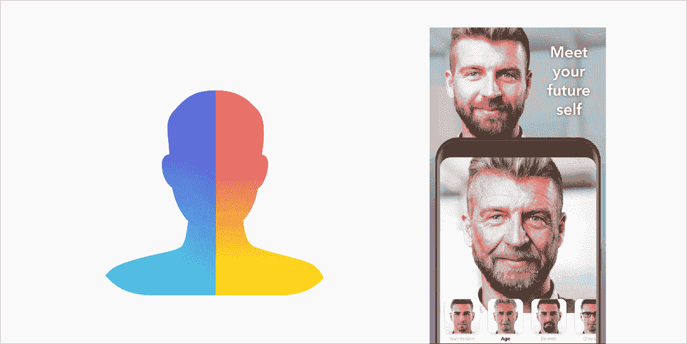

# 深入 Faceapp

> 原文：<https://medium.com/analytics-vidhya/in-depth-of-faceapp-a08be9fe86f6?source=collection_archive---------9----------------------->

技术趋势

**_ _ _ _ _ _**

**作者德博约蒂·查克拉博蒂**

# 介绍

我们都在使用各种社交媒体，比如脸书、Instagram 和 Twitter。最近，当你打开这些应用程序时，你可能会在你的朋友、追随者甚至一些名人的个人资料中看到许多老年人。

你可能已经注意到，在那些照片中，他们看起来比实际年龄要老。你没有吗？

这并不是说他们都进入了时间机器，或者吃了什么让他们变得 50 多岁的东西——这是人工智能变脸应用 FaceApp 的一个令人兴奋的功能

听起来很惊讶？想知道这个应用程序如何提供旧版本的真实图片吗？

找个舒服的座位，开始阅读。

**本 app 的由来和特点**

FaceApp 于 2017 年推出，是一款由俄罗斯公司 Wireless Lab 设计的 iPhone 和 Android 设备变脸应用。该应用程序基于**人工智能**和**神经网络**技术来生成高度逼真的人脸变换。

该应用程序提供了大约 28 种滤镜，让用户可以尝试看到他们面部滑稽、怪异、怪异和有趣的变化。

一些年龄过滤器功能是**年龄过滤器，微笑过滤器，发型过滤器，性别交换过滤器，肤色闪电过滤器等。**

# 神经网络和机器学习的基本介绍(为了更好地理解 faceapp 的工作)

# 机器学习背后的基本思想

那么，机器学习在哪里出现呢？它是做什么的？这是什么？

简单地说，一台计算机在没有被明确编程的情况下，仅仅通过看到数据和它的标签来自己学习东西，这被称为机器学习。你给一个大的数据集，给它贴上标签，然后把它提供给一个 ML 应用程序，现在它可以自己学习如何识别和分离数据。

***人工神经网络***

神经网络最简单的定义，更恰当地称为“人工”神经网络(ANN ),是由第一台神经计算机的发明者 Robert Hecht-Nielsen 博士提供的。他将神经网络定义为:

“……由许多简单、高度互联的处理元件组成的计算系统，这些元件通过对外部输入的动态响应来处理信息。

人工智能专家 Maureen Caudill 于 1989 年 2 月发表的“神经网络初级读本:第一部分”

## 神经网络的基础

神经网络通常是分层组织的。层由许多包含“激活功能”的互连“节点”组成。模式通过“输入层”呈现给网络，输入层与一个或多个“隐藏层”通信，在隐藏层中，实际处理通过加权“连接”系统完成。然后隐藏层链接到一个“输出层”,输出答案，如下图所示。

# 用于 Faceapp 的编程语言

1.Swift 和 Java/Kotlin

当谈到前端开发时，预计这种改变面貌的应用程序将依赖 Swift 在 iOS 平台上的存在，以及 Java 或 Kotlin 在 Android 平台上的存在。

2.计算机编程语言

由于该应用程序基于人工智能，因此顶级编程语言之一 Python 也有望用于服务器端开发。

3.OpenGL 或 OpenCV

这两个库都被认为是 FaceApp 技术堆栈的一部分，因为事实上实时处理是在图片上进行的。

# 使用 face App——让你看起来很老的应用

FaceApp 利用“深度生成卷积神经网络”让你的照片变得令人敬畏。也叫 GAN(生成对抗网络)。

那么，当我们在 FaceApp 上应用过滤器时，会发生什么呢？

简单来说，FaceApp 就是把一张脸的特征，应用到另一张脸上。因此，它有一个数据库，其中有大量的面部照片，它从你的脸上提取特征，并应用一些变化，使你的脸看起来不同，但与众不同的特征仍然存在，使你能够识别自己。所以现在你可以改变照片的性别，让自己老上几十年，做一些不那么逼真的事情。

所以 FaceApp 所做的是使用人工智能开源库，如 TensorFlow，从你的脸上找到特征，然后应用过滤器，或者说添加让你看起来老的特征，或者你选择的任何东西。

如果您连续对单个图像运行过滤器，您将看到通常与神经网络的隐藏层相关联的原始特征。在图像中可以清楚地看到隐藏图层存储的功能:

甘是什么？

基本上，这些都是神经网络技术，可以用来创建新的，伪造的数据，看起来像任何真正的数据。

例如，它可以创造新的面孔，新的绘画，看起来像其他任何东西，但实际上并不存在，而是由你的机器制作的。看，机器实际上在学习。

根据定义，生成对抗网络(GANs)是由两个网络组成的深度神经网络架构，一个对抗另一个(因此是“对抗的”)。

现在你知道了人工授精是如何创造新的面孔的，所以考虑从一张脸上提取特征并应用到另一张脸上，或者说从你的脸上提取特征并应用到使你看起来更老的特征上，可能会更容易。

它主要使用 cycleGan*和 DiscoGan*在人脸上执行此类操作。

两个 gan 都有一个主要目标

这样 Faceapp 就用 GAN 让你老了。

这个应用程序展示了人工智能和机器学习的强大力量。

**定义——图像滤镜是什么意思？**

**图像滤镜是一种改变图像大小、颜色、阴影和其他特征的技术。**

**结论**

Faceapp 很好地利用了 ml 和 ai。希望在不久的将来，我们能看到更多革命性的新产品和 ml 的应用。

# 我使用的资源:

1.“FaceApp:神经网络如何创造奇迹”作者 Harsh Aryan[https://link.medium.com/TMH7veydFY](https://link.medium.com/TMH7veydFY)

2.[https://appinventiv . com/blog/everything-you-need-know-on-face app/](https://appinventiv.com/blog/everything-you-need-to-know-about-faceapp/)

3.[https://www . Reddit . com/r/machine learning/comments/67 umwt/d _ how _ does _ face app _ work/？UTM _ medium = Android _ app&UTM _ source = share](https://www.reddit.com/r/MachineLearning/comments/67umwt/d_how_does_faceapp_work/?utm_medium=android_app&utm_source=share)

4.[http://pages.cs.wisc.edu/~bolo/shipyard/neural/local.html](http://pages.cs.wisc.edu/~bolo/shipyard/neural/local.html)

5.[https://cdn-images-1 . medium . com/max/2000/1 * bhfifrath 9 djkqmbteqg 5a . gif](https://cdn-images-1.medium.com/max/2000/1*bhFifratH9DjKqMBTeQG5A.gif)

6.[https://www . tensor flow . org/beta/tutorials/generative/cycle gan](https://www.tensorflow.org/beta/tutorials/generative/cyclegan)

cycleGan:使用条件 Gan 的不成对图像到图像转换，如使用循环一致的对抗网络的不成对图像到图像转换中所述，也称为 CycleGAN。