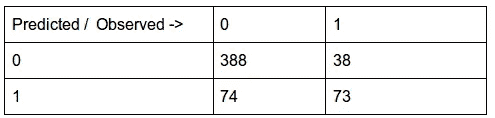

# VGG 人脸网络在自定义数据集上性能的深度统计分析

> 原文：<https://medium.com/analytics-vidhya/in-depth-statistical-analysis-of-vgg-face-networks-performance-on-custom-data-set-ef4b72bc15b9?source=collection_archive---------8----------------------->

布兰登·莫温克尔在 [Unsplash](https://unsplash.com?utm_source=medium&utm_medium=referral) 上的照片

VGG 脸是一个非常深刻的 CNN 架构，它学习了数百万名人的图像。它被用作特征提取器来提取全连接层的激活向量。我浏览了很多博客，这些博客解释了在你的自定义数据集上进行人脸验证和识别。我只提到其中的几个。希望你也会发现它们有用。

*   【Keras 的 VGG 脸模特
*   [如何进行人脸识别](https://machinelearningmastery.com/how-to-perform-face-recognition-with-vggface2-convolutional-neural-network-in-keras/)
*   [活体人脸检测](https://www.dlology.com/blog/live-face-identification-with-pre-trained-vggface2-model/)

在这篇文章中，我将讨论如何提出一个最适合你自己数据的相似性指数阈值(特别是余弦相似性分数)。根据不同的用例，你可能需要修改它(或者让它自动修改自己！)随着你开始收集更多的数据。

让我从搭建舞台开始-

首先，我收集了 5 个人的大约 200 张脸用于实验。然后，我准备了 pandas 数据帧，对每个组内以及组间的图像进行成对比较。

假设有 k 个类别或组。每组由一个人多个面部图像组成。

n₁ =第 1 组中的图像数量，n₂ =第 2 组中的图像数量，依此类推。

那么组内唯一成对比较的数量可以使用以下公式计算:

因为有 k 个群，所以有 kC₂唯一对群。组间比较的总数将是，

总而言之:

为了让生活简单一点，我从每组中抽取 10%的配对样本(没有替换)，从每组组间配对中抽取 10%。所以我只剩下大约 2000 对图像。

在执行 2000 次成对比较并将结果附加到 pandas 数据框后，数据集看起来如图所示:

**数据描述:**

Img1:图像 1 的路径

Img2:图像 2 的路径

is_match:两张脸是否属于同一个人的真值

ε:余弦相似性得分

true_class:人员的姓名

在数据生成过程中，我确保数据集中没有插入缺失值。

**探索性数据分析**

A.比较频率分布

**主要观察结果:**

*   “似乎”这两种方法是不同的。
*   对于负类，很容易看出分布近似正态。
*   如果图像是相同的，平均值倾向于向 0 移动。
*   类中有一些标为“True”的异常值。(我们不希望高ε值被贴上真实的标签)

让我们探索一下系统对于不同的群体是如何表现的。(当图像相同时)

**重点观察**:

*   因为 C 和 D 的平均值几乎相等。
*   对于所有被识别为相同的人脸，余弦值小于 0.4
*   问题—这是否意味着 0.4 应该是阈值参数的最佳值？让我们更详细地探讨一下。

我们仍然需要了解样本间观察到的差异是仅仅意味着由于抽样变异还是由于总体均值的真实差异？

因此，在进入模型构建步骤之前，我们还想回答以下问题。

*   正类和负类的 epsilon 值之间的差异有统计学意义吗？
*   系统是否偏向某个特定的阶层？

**方差分析**

单向方差分析(ANOVA)用于比较几个平均值。这种方法通常用于科学或医学实验中，比较治疗方法、过程、材料或产品。

比较组均值和中位数:

很明显，我们有一个对称的群体分布。所以第一个假设满足了。

也证明了组标准偏差非常相似。这些结果与上面给出的箱线图一起表明每组的分布是对称的。因此，我们可以进行方差分析。由于缺少数据点，我有意删除了包含 F 类的行。

**方差分析表**

根据我们的结果，我们可以说，有强有力的证据表明，平均ε值随组而变化。至少有一个群体的平均值是不相等的。

**Tukey HSD 测试:**

Tukey HSD 检验表明，A、B 和 C 类之间的差异在 95%的置信水平下是显著的。然而，对于所有其他组对，ε得分的平均值之间没有显著差异。这意味着在某些情况下，VGG 网络可能无法正确识别这些群体中的人脸。可能是因为图像质量差或者闪电条件？这需要进一步调查。我们不会期望 CNN 偏袒某一群人。

**训练和测试数据集**

生成的数据集分为训练数据集和测试数据集，比例为 70:30。正类和负类的分布在两个数据集中得到验证，并确保其在容许范围内。

**建模—逻辑模型**

以下是我的物流模型的输出:

费希尔评分迭代次数= 6，AIC : 1075

很明显，ε在确定两个面是否相同时非常重要。

下图描述了较低的ε分数有助于较高的匹配概率。

**ROC 曲线**

ROC 曲线是在各种阈值设置下对分类问题的性能测量。该模型在阈值为 0.2 时获得的曲线下面积为 0.8349。AUC 越高，该模型在区分相同和不同人脸方面就越好。

那么到底有多好呢？如何确定阈值对您的模型是好的？让我们仔细探索一下。

**混乱矩阵**

**(** 阈值= 0.3 **)**

总体准确率:(338+73)/(338+73+74+38) = 78%

现在事情变得有点棘手了。

我们应该接受这种模式并将其部署到我们的生产系统中吗？

此时，您应该首先仔细分析和理解您的系统的目的，并为其添加一些业务背景。对你来说什么更重要——给人脸贴上完全相同的标签，因为它们实际上完全相同，而且准确度很高？如果不是真的匹配，你能容忍给脸贴上匹配的标签吗？

例如，如果一对人脸实际上在 91%的情况下是不相似的，那么上面的模型将它们标记为假的。这对于特定的用例来说可能是好的。

有了上面的统计理解，现在你可以根据小时的要求微调你的阈值。这种统计建模技术允许您建立性能标准，根据需要为各种群体定制您的面部检测模型，或者只是监视真实世界场景中的性能。