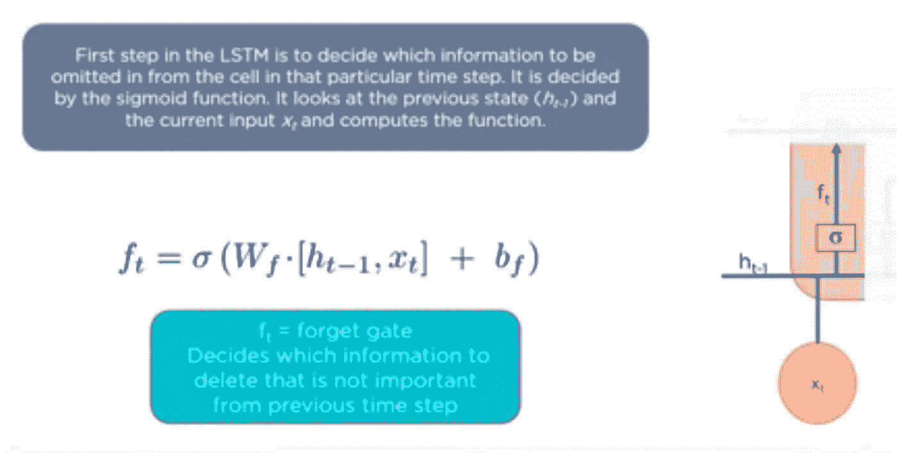

# 递归神经网络(RNN)和长短期记忆(LSTM)网络的深度教程

> 原文：<https://medium.com/analytics-vidhya/in-depth-tutorial-of-recurrent-neural-network-rnn-and-long-short-term-memory-lstm-networks-3a782712a09f?source=collection_archive---------5----------------------->

虽然，研究论文是了解任何尖端技术的最佳途径，但是，理解它们并不容易。它有许多数学方程式和术语，需要大量的努力。

artpal.com

因此，我会尽我最大的努力以非常结构化的格式解释 RNN，但是如果你遇到任何困难，请在最后的评论框中写下，让我知道。那么，你准备好了吗！，我们开始吧！

facebook.com

# 什么是 RNN？？？

RNN 是一类强大的神经网络，用于对时序或自然语言等序列数据进行建模。基本上，这个架构背后主要思想是使用顺序信息。

**你知道谷歌的自动完成功能是如何工作的吗？？？**

基本上，收集大量最频繁出现的连续单词输入= = = = = = > >**【RNN 网】**= = = = = = = =>>它通过找到频繁出现的单词序列来分析数据，并建立模型来预测句子中的下一个单词。

所以，你看到 RNN 在我们日常生活中的重要性了吧。其实已经让我们变懒了！

我们在生活中已经有这么多的问题，现在为什么要通过引入一个新的网络(RNN)来使它变得更复杂，当我们已经有了前馈神经网络的时候？

在前向神经网络中，信息只从输入节点通过隐含层流向输出节点。网络中没有循环或环路。

对两个输出进行分类的前馈神经网络。

***前馈神经网络中的问题:-***

1.  不能处理顺序数据。
2.  仅考虑电流输入。
3.  记不住之前的输入。

RNN 的基本建筑

因此，从上图可以清楚地看出，RNN 是一种特殊类型的前馈神经网络。如图所示，在 RNN，任何层的输出不仅取决于当前输入，还取决于之前输入的集合。这一特性使它比其他神经网络具有更大的优势，因为它可以利用以前获得的输入来预测以后阶段的输出。

显示 RNN 基本方程的图像(http://cs231n.stanford.edu)

# **RNN 的申请:——**

1.  图像字幕—用于通过分析图像中的活动来为图像添加字幕。

图像字幕示例

2.时间序列预测

3.自然语言处理—文本挖掘和情感分析

4.机器翻译——通过接受一种语言的输入，RNN 可以用来将其翻译成不同的语言作为输出。

将英语作为输入并将其转换成不同的语言

# **RNN 建筑类型:——**

基本 RNN 建筑(斯坦福 cs231 讲座)

1.  一对一:它也被称为香草神经网络。它用于基本的机器学习问题。
2.  一对多:—它有单个输入和多个输出。应用:用于图像标题，就像我们以前在狗在空中接球中看到的那样。
3.  多对一:—它有许多输入和一个输出。这基本上用于分析情感，我们给出一个句子作为输入，情感作为输出。
4.  多对多:—它接受一系列输入并生成一系列输出。应用:机器翻译

# 训练 RNN 时的问题:—

1.  消失梯度问题
2.  爆炸梯度问题

当梯度反向传播回到初始层时，在深度神经网络的训练期间出现问题。因为由于链式法则，梯度必须经历连续的矩阵乘法。因此，如果它们的值很小(<1) they shrink exponentially till the time they vanish and this is called **消失梯度问题**)。这导致信息随时间丢失。此外，如果梯度值很大(> 1)，它们会变得更大，最终会破坏模型，这被称为**爆炸梯度问题。**

***问题由于这些问题:***

1.  训练时间长
2.  性能差
3.  精确度差

***让我们用更实际的方式来理解这一点:——***

考虑下面两个例子来理解序列中的下一个单词应该是什么:

图片:SimpliLearn

为了理解序列中下一个单词是什么，RNN 必须记住**之前的上下文**无论主语是单数名词还是复数名词。

反向传播

但是，有时可能很难将错误反向传播到序列的开头，以预测输出应该是什么。

**现在，让我们试着用更统计学的方法来理解上述问题:**

不要看到标题就害怕。我会尽力用简单的方式解释所有深入的概念。

假设，我们有一个架构，它接受一个英语句子并给出法语句子作为输出。因此，为了实现这一点，架构必须在其隐藏的激活中存储尽可能多的信息。

这个句子可能有 20 个单词长，这表明从它看到一个输入到它使用这个输入进行预测之间有一个很长的时间间隔。学习异地恋是非常艰难的。因此，为了基于第一输入调整输入-隐藏权重，需要误差信号通过整个路径反向传播。

***现在问题来了，为什么这个梯度问题在向前传球的时候不会发生？？？***

实际上，在正向传递中，每一步的激活都通过一个非线性激活函数，该函数通常会压缩值，防止它们爆炸。因为向后传递完全是线性的，没有什么可以阻止导数爆炸。

让我们试着用 RNN 计算的函数来解释这个问题:

正如我们所知，每一层计算机都是当前输入和先前隐藏激活的函数

RNN 的基本方程

通过递归展开，我们得到—

这是迭代函数(迭代多次的函数)。

现在让我们以一个简单的二次函数为例来理解上面的概念:—

简单二次方程

如果我们多次迭代，我们会得到一些复杂的行为，如下图 2 所示:

通过一个单调的例子使它变得更简单:

在[0，1]上单调

现在，视觉上理解它的重复行为

红线表示函数迭代的轨迹

最终，迭代要么射向无穷远，要么在一个固定点结束，即 x = f(x)的点，这里 x 的图形与虚线相交。

定点有两种类型:—

1.  来源:排斥迭代(上图中的 0.82)。它的导数 f'(x) > 1。
2.  Sinks/ Attractors:吸引迭代(上图中的 0.17)。它有导数 f'(x) < 1.

Phase plot explaining source and sink in a single plot

Because of the source point we have gradient exploding issue and due to sink point we face gradient vanishing issue.

# **对梯度爆炸和消失梯度问题的解:——**

1.  **渐变裁剪:**

它有助于通过重新缩放梯度来防止梯度膨胀，因此它们的范数至多是一个特定值η，即，如果‖g‖> η，其中 g 是梯度，我们设置

通过这样做，我们在训练过程中引入了偏差，因为结果值实际上不是成本函数的梯度。下图显示了一个带有悬崖和狭窄山谷的示例；如果你碰巧落在悬崖的表面，你会迈出一大步，把你推到好的区域之外。使用渐变剪辑，您可以停留在山谷中。

该图显示了裁剪如何有助于防止渐变爆炸。

2.**输入反转:**

在开始时，我们了解到，网络很难了解远距离依赖性。因此，这影响了建筑的学习能力。这可以通过颠倒输入句子中单词的顺序来解决，通过分析下图可以清楚地理解这一点:

输入反转

在上面的图表中，我们可以看到在第一个单词被读取和需要它的时候只有一个时间间隔。这允许网络学习第一个单词之间的关系。一旦它学会了这一点，它可以被进一步训练，以学习句子中更难的单词之间的依赖关系。

**3。身份初始化:**

除了可以多次迭代的恒等函数 f(x) = x 之外，其他迭代函数可能具有复杂和混沌的行为。因此，如果网络计算单位函数，梯度计算将是完全稳定的，因为雅可比矩阵仅仅是单位矩阵。

在恒等 RNN 架构中，所有的激活函数都是 RELU，权重被初始化为恒等矩阵。此外，RELU 激活函数将激活剪辑为非负的，但是对于非负的激活，它相当于身份函数。

**4。长期短期记忆(LSTM):**

LSTM 是一种特殊的 RNN，主要用于学习长期依赖关系。这个名字是指网络的激活对应于短期记忆，而权重对应于长期记忆。如果激活可以远距离保存信息，这就使它们成为长期短期记忆。

LSTM 的基本建筑

**我们来做一下 LSTM 的操作，了解一下它是如何运作的:——**

基本上，LSTM 分三步走:

***第一步——决定应该记住多少过去的事情***

上述步骤的示例:

上一期输出 h(t-1):爱丽丝物理不错。另一方面，约翰擅长化学。

当前输入 x(t):约翰足球踢得很好。他昨天在电话里告诉我，他担任了足球队的队长。

a.在遇到第一个句号后，遗忘门意识到上下文可能会发生变化。

b.在 x(t)处与当前输入句子进行比较。

c.下一句说的是约翰，所以删除了爱丽丝的信息。

d.主语的位置空出来，分配给约翰。

***第二步——决定这个单位应该给当前状态增加多少。***

上述步骤的示例:

当前输入 x(t):约翰足球踢得很好。他昨天在电话里告诉我，他担任了足球队的队长。

输入门分析上述句子的重要性为:

[约翰踢足球，他是他足球队的队长] ( *比*更重要)【他在电话里告诉我】(*不太重要，因此被遗忘了*

***第三步——决定当前单元格的哪一部分输出。***

本示例将尝试预测句子中的下一个单词:

约翰在与对手的比赛中表现出色，赢得了他的球队。勇敢的 ___________ 因其对团队的贡献被授予最佳球员。

对人类来说，决定什么应该来这里是非常容易的，然而，对机器来说却不是这样。空白空间可以有多种选择。

所以，在这一步系统首先检查什么是 brave == >形容词(描述一个名词)

因此，经过一系列步骤后，它决定 John 应该是这里的最佳选择。

因此，我们讨论了与 RNNs 相关的各种事情，如它是什么，我们为什么需要它，它的应用，RNN 面临的问题以及解决它的各种方法，包括 LSTM 的细节。这是一个有点长的博客，但它是值得的，因为在写之前，我确信我想写一个关于 RNN 的详细博客，它涵盖了它的大部分。读完所有这些东西后，我发现自己已经有足够的装备去打一场仗，我的意思是拿着数据集，把我所有的知识应用到它上面。我对你有同感，因此，我将写下一篇关于 RNN 实际应用的系列博客。所以，如果你喜欢这个博客，请通过鼓掌和评论让我知道，如果你对此有任何疑问。

#机器学习#深度学习#神经网络# RNN # LSTM #递归神经网络#人工智能