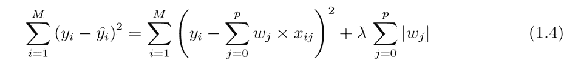

# 通俗地说，什么是套索和岭回归？

> 原文：<https://medium.com/analytics-vidhya/in-laymans-terms-what-is-lasso-and-ridge-regression-54f9d6827b13?source=collection_archive---------9----------------------->

套索和岭回归的目标是减少过度拟合。本质上，我们可以把我们的数据点分成两部分—

**模式+随机噪声**

例如，如果你要对人口的总体健康状况进行建模，但只调查了医生候诊室里的病人。这种系统性错误(一遍又一遍地调查生病的人)会产生一个完全偏离目标的统计数据。健康的变化是噪音。

再比如，考虑开车。给定一条具有特定曲率的曲线，就有一个最佳的转向方向和最佳的速度。当你在那条曲线上观察 100 名司机时，他们中的大多数都接近最佳转向角度和速度。但是它们不会有完全相同的转向角度和速度。因此，道路的曲率会影响转向角和速度的模式，而且噪声会导致偏离最佳值。

**现在机器学习的目标是对模式建模，忽略噪音。任何时候，如果一个算法试图拟合除了模式之外的噪声，它就是过度拟合。**

**线性模型**是使用输入特征的线性函数来预测输出的最简单方法之一。下面我们展示了基于 n 个特征的线性模型:

**线性模型**

上式中**w【0】，w【1】**等。是系数值， **b** 是截距。线性回归寻找优化 w 和 b，使得它最小化成本函数。上述模型的成本函数可以写成:

线性模型的成本函数

一旦我们通过将数据集划分为训练集和测试集来对数据集使用线性回归，计算它在训练集和测试集上的分数，我们就可以大致了解我们的模型是过度拟合还是欠拟合。当模型过于简单(由太少的特征提供信息或太多的正则化信息)时，会发生欠拟合，这使得它在从数据集学习时不灵活。另一方面，如果我们有大量的特征，并且测试分数比训练分数相对较差，那么这就是过度概括或过度拟合的问题。 **Lasso 和 Ridge regression 是通过惩罚简单线性模型可能存在的预测系数来降低模型复杂性和防止过度拟合的一些技术。**

> **岭回归**

在岭回归中，通过添加一个相当于系数大小平方的惩罚项来改变线性回归的成本函数，如下图所示:

岭回归的成本函数

我们这里的主要目的是最小化等式 1.2 中的成本函数。岭回归对系数(w)施加约束。惩罚项(λ)调整系数，使得如果它们取大值，它通过惩罚优化函数来缩小它们。通过收缩系数岭回归降低了模型的复杂性和多重共线性。

在上面的等式 1.3 中，如果λ →0，成本函数变得类似于线性回归，因为在上面的等式中罚项变为零。我们用一个图像来解释一下:

不同λ值的岭回归

让我们来理解上图。这里的 **X 轴**是代表数据集中可用的 13 个预测因子的**系数指数**，而 **Y 轴**是所有这些预测因子变量的系数大小。对于较低的α值(0.01)，当系数限制较少时，所有变量的系数大小几乎与线性回归一样。对于较高的α值(100 ),我们可以从上面看到，与线性回归相比，许多变量的系数幅度值要小得多。这证明了岭回归缩小了不同α值的系数幅度。

> **套索回归**

Lasso 回归的成本函数可以写成:

套索回归的成本函数

与成本函数中的岭回归相同，如果λ = 0，则上述方程简化为线性回归。这里，Lasso 和 Ridge 回归之间的区别是不考虑系数的平方，而是考虑大小。

Lasso 回归可以将预测值的系数值缩小到零，即某些特征完全从模型中移除，因此它有助于减少模型中的过拟合，也有助于特征选择。我们用一个图像来解释一下:

不同α值的套索回归

让我们来理解上图。

1.  对于缺省值α (=1)，在 30 个特征中，仅选择了 4 个(其系数值为非零),而对于其余变量，系数值已缩减为零。
2.  通过将α减小到 0.01，从 30 个特征中仅选择 10 个特征(其系数值为非零)，而对于其余变量，系数值已经收缩到零。
3.  上图的左面显示了两个不同α值的系数大小的比较。对于α= 1，我们可以看到大部分系数为零或接近零，而α= 0.01 则不是这样。
4.  进一步减少α =0.0001，已经选择了 22 个非零特征，并且它们的系数值类似于基本线性回归。
5.  在右图中，当α = 0.0001 时，套索回归和线性回归的系数非常相似。

> 【Lasso 和岭回归如何做特征选择？

套索和岭回归如何选择要素

让我们解释一下 lasso 和岭回归是如何进行特征选择的:

1.  岭回归只减少接近零的系数，而不是零
2.  在上图中，椭圆轮廓是线性回归的成本函数。现在，如果我们放宽了系数的条件，那么约束区域会变得更大，最终它们会到达椭圆的中心。这就是它类似于线性回归的地方。
3.  另外，两种方法都通过找到椭圆轮廓与约束区域相遇的第一个点来确定系数。
4.  菱形回归(即套索回归)在轴上有角，与岭回归不同，每当椭圆区域遇到这样的点时，其中一个特征就会完全消失！
5.  即使要素数量大于数据数量，也可以应用套索回归。
6.  Lasso 忽略了不重要的变量，尽管这些变量可能是有趣或重要的。
7.  套索不遵循等级原则。