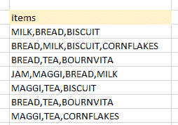
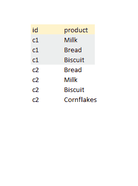
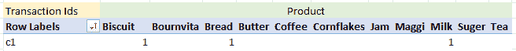
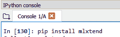
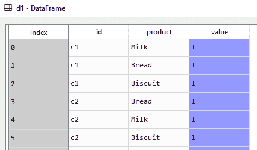
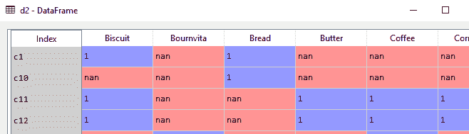
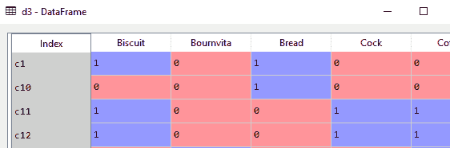
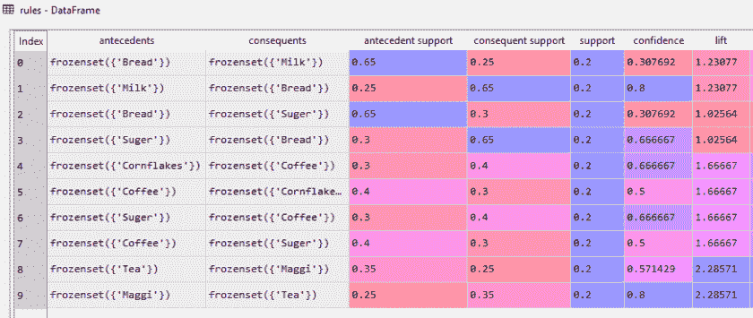
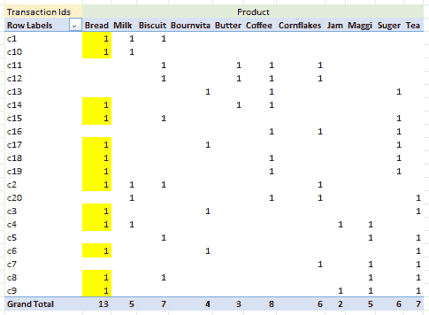
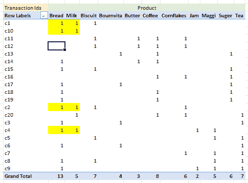

# Python 中使用 Apriori 算法的购物篮分析

> 原文：<https://medium.com/analytics-vidhya/in-technical-terms-apriori-used-in-the-market-basket-analysis-tries-to-find-out-which-items-are-78287911a4df?source=collection_archive---------2----------------------->

在技术术语中，Apriori(用于购物篮分析)试图找出哪些项目是一起购买的。因此，可以通过将他们安排在附近或建议用户上零售商网站来增强客户体验，基本上是为了让客户购买更多。(还记得网购网站上那些“这些物品一起买”的建议吗？)

但是它是如何工作的呢？当然，有一些相关的理论，但我们会在编码时研究。所以我们首先需要的是数据，我将使用来自 Kaggle 的数据。可以在这里找到([https://www . ka ggle . com/shazadudwadia/supermarket # grocerystoredataset . CSV](https://www.kaggle.com/shazadudwadia/supermarket#GroceryStoreDataSet.csv))。这是一个关于从一些商店购买的一些早餐项目的小型数据集。

1.  **数据预处理**:这是最重要的一步。我在在线教程中观察到的一件事是，他们从这种形式的数据开始(类似于我们正在使用的数据)



我担心的是，这不是任何记录事务的传统应用程序的输出，也不是我们编写 SQL 时的输出。所以我们需要把它改造成下面的形式



这可以在 python 中通过这里解释的方法实现[https://medium . com/@ sureshssarda/pandas-splitting-explosing-a-column-into-multi-rows-B1 B1 d 59 ea 12 e](/@sureshssarda/pandas-splitting-exploding-a-column-into-multiple-rows-b1b1d59ea12e)

**步骤 1** :我们需要做的是拆分每一行，并为一个产品分配一个交易 id。为简单起见，您也可以在 excel 中这样做

对于先验，我们需要以下形式的数据，以便 Algo 可以轻松地提取信息。因此，一列事务 id 和不同的产品列。1 表示该产品是该事务的一部分。在上图中，c1 包括牛奶、面包和饼干。同样的情况在下面用“1”表示。



为了实现这一点，我们需要编写一个小的 python 代码。我发现 Pivot 函数非常有用。但是首先我们需要一些库在代码下面运行。我用的是 Spyder ( Python 3.7)。在代码下运行

`##Import Libraries
import pandas as pd
from mlxtend.frequent_patterns import apriori
from mlxtend.frequent_patterns import association_rules`

如果您之前没有使用过 Apriori，请在控制台中运行 **"pip install mlxtend"** ,然后再次运行上述命令



我们都准备好了。将数据加载到 python 中。您需要将我们在步骤 1 中准备的 excel 文件以 csv 格式保存为 mydata.csv，并运行以下命令

`"##Load Data in python "
d1 = pd.read_csv("mydata.csv")`

现在您需要在我们的数据框架中插入一列。该列将显示在一次交易中按值“1”购买的物品。在命令下运行

`"#add new column with constant value 1"
d1['value'] = d1.apply(lambda x: 1, axis=1)`

python 中的数据框应如下所示



我们需要重新塑造这个看起来像图 1**。我们将使用 Python pivot 函数。在代码下运行**

`"#Reshape data to pivot form"
d2=pd.pivot_table(d1,index='id',columns='product',values='value')`

您的数据框应该如下所示



“不适用于”表示特定项目不属于交易的一部分。例:“Bournvita”在 c1 中没有，所以用“nan”表示。我们需要去掉这些，用零来代替。在代码下运行

`"#remove 'nan' and replace it by 0"
d3=d2.fillna(0)`



```
**2\. Running Algo:**
```

是时候对该数据帧运行先验算法了。在代码下运行

`"#run apriori algo"
frequent_itemsets = apriori(d3, min_support=0.2, use_colnames=True)
rules = association_rules(frequent_itemsets, metric="lift", min_threshold=1)`

我稍后会解释这些参数(支撑和提升)。输出数据帧应该如下所示



```
**3\. Theory and Interpretation:**
```

A.有两部分 **a .前因 b .后果**。根据我们的数据，如果一个人购买面包(前因)，那么在同一时间同一笔交易中，同一个人可以购买牛奶(后果)

B.**支持** : ***支持=项目发生/总交易*** 。所以前因支持就是支持面包。它可以使用上面的等式和下面的数据中枢(为便于理解，准备在 excel 中)进行计算



你能计算一下面包和牛奶的支持度吗？为了更好地理解，我突出显示了这些单元格。请注意，高亮显示的单元格是成对的，表示它们是一起购买的。



您现在可能已经理解了我们在先验算法(`frequent_itemsets = apriori(d3, **min_support=0.2**, use_colnames=True)`)中输入的支持阈值。基本上我们过滤掉了其他不太频繁的交易。

C.**置信度:**这个数字告诉你，相对于单次购买，有多少物品被一起购买。因此，如果一起购买的项目总和少于单次，那么发生可能是微不足道的。因此，与单一商品相比，更高的信心值意味着一起购买的几率更高。**置信度=(支持一起购买的商品)/(支持分开购买的商品**

例如:根据我们之前的计算，一起购买牛奶和面包的可信度= 0.2/0.6，即根据我们在图 2 中**输出的代码，可信度为 0.30769**

D. **Lift :** 表示任何规则的强度，即我们认为牛奶和面包是一起买的，但这种关联有多强？电梯号告诉我们这一点。 **Lift =(支持一起买的物品)** / **(支持一件物品)*(支持另一件物品)**。请注意，在保密情况下，我们将联合收割机支架划分为任意一个**项目支架**。在这里，我们正在划分两个项目的乘法支持。

Ex Lift(牛奶面包)=支持牛奶面包(0.25) /(支持面包(0.65 ))*(支持牛奶(0.25)) = 1.23077 与我们的 python 输出相同

因此，Lift 越高，一起购买这些商品的可能性就越大。很少有其他参数来分析这些结果，但**支持、信心和提升**是最重要和最有解释力的。还要注意，Apriori 将为您提供所有这些数字，如上面的输出所示，但我们还需要了解如何解释这些数字。这就是为什么我试图用解释来详细解释这些

下面是完整的代码供您参考

`"##Import Libraries "
import pandas as pd
from mlxtend.frequent_patterns import apriori
from mlxtend.frequent_patterns import association_rules`

`"##Load Data in python "
d1 = pd.read_csv("mydata.csv")`

`"#add new column with constant value 1"
d1['value'] = d1.apply(lambda x: 1, axis=1)`

`"#Reshape data to pivot form"
d2=pd.pivot_table(d1,index='id',columns='product',values='value')
"#remove 'nan' and replace it by 0"
d3=d2.fillna(0)`

`"#run apriori algo"
frequent_itemsets = apriori(d3, min_support=0.2, use_colnames=True)
rules = association_rules(frequent_itemsets, metric="lift", min_threshold=1)`

我觉得同样的算法可以用来做类似客户反馈(这两个词是放在一起说的)这样的文本分析。你怎么想呢?。

让我知道你的建议和反馈。乐意帮忙。