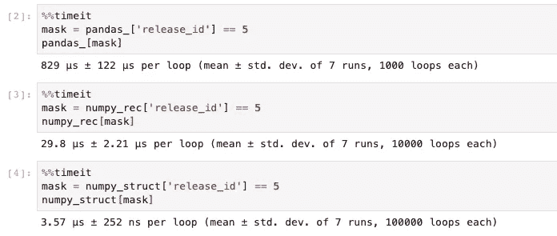
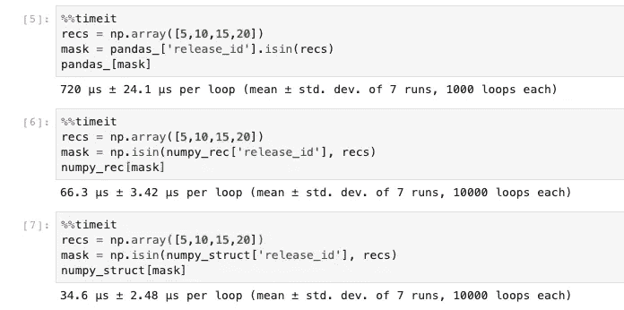

# 增量收益:第 1 集—优化熊猫代码

> 原文：<https://medium.com/analytics-vidhya/incremental-gains-episode-1-optimizing-pandas-code-76788db49e8a?source=collection_archive---------11----------------------->


所以我目前正在开发一个音乐推荐系统，它建立在 [Discogs](https://www.discogs.com/) 数据库之上。在基本层面上，它对数千名 Discogs 用户的[需求列表](https://www.discogs.com/wantlist?user=tosker)和[收藏](https://www.discogs.com/user/tosker/collection?header=1&sort_by=artists_sort)使用 ALS 矩阵分解，为音乐爱好者和黑胶唱片收藏家等提供新的音乐推荐。在 Medium 上有很多关于协同过滤和其他推荐系统如何工作的优秀文章，其中很多是我在最初创建项目时参考的。相反，这一系列的帖子不是重复已经说得很好的内容，而是旨在记录我在使代码库&管道更适合生产的过程中所经历的考验和磨难。和我一起把这个 Jupyter 笔记本原型带到野外吧！

# 框定问题:

在 Discogs 上，每个相册都有一个对应的**release_id**——因此，对于我拥有个人资料信息的每个用户，我都有一个与他们的 Wantlist &集合中的 release _ id 相对应的数组。在将这些用户-专辑交互的大型稀疏矩阵输入矩阵分解模型后，我只需使用 [Ben Frederickson](https://www.benfrederickson.com/blog/) 的惊人的[隐式](https://github.com/benfred/implicit)库，就能为每个用户获得前 N 个推荐专辑。

基本隐式工作流

为了尽可能减少实时推荐，我选择在模型合适时为每个用户生成前 2000 个推荐，并将它们全部存储到 Mongo 数据库中。这样，如果用户已经在系统中，很容易快速获取他们的推荐。2000 张专辑可能太多了——但我宁愿要太多也不要太少。

这里有一个问题，每个用户的 2000 个推荐只是一个*类别代码*对应一个 **release_id** 。它只是我们稀疏矩阵中一个专辑的 release_id 的项目索引。因此，这里的任务是:

1.  将推荐*类别代码*，我称之为 **release_idx** ，映射到专辑的 **release_id** 。
2.  提取所有相关的专辑元数据— *艺术家、标题、唱片公司、流派等。* —并合并到每个建议中。(因为用户仅仅从一个 **release_id** 中获得的价值很小，咄。)
3.  提取用户已经交互过的相册的所有相册元数据。这主要用于自定义用户过滤，即，如果用户想要隐藏他们已经知道或已经与之交互的艺术家或标签的推荐项目。
4.  将每个用户的推荐和 previous_interactions 存储到 Mongo。
5.  做得**快**。

用户推荐的 JSON 输出示例

**第五步——动作要快——**是这里的关键，因为理想情况下，我想每晚都改装一下模型。我让抓取器不断抓取新的用户资料，所以推荐会根据新信息略有变化。但更重要的是，我希望能够根据用户与 web 应用程序的在线交互来修改模型参数和测试，例如，考虑到随后添加到用户需求列表甚至购买的推荐的验证方案。

> 简而言之，*我如何尽可能快地为所有用户收集并存储 2000 条带有元数据的推荐* ***？***

> TL；DR —借助 smarter Pandas 代码，我能够将每用户处理时间从标准偏差为 0.7 秒的约 1.8 秒降至标准偏差为约 150 毫秒的约 500 毫秒。

# 基线

我最初的设计计划是相当快速和肮脏的。我在一个 bootcamp 项目周期中，在这个阶段更专注于设置一个基本的 Flask 应用程序。由于必须建立数据库基础设施，我的脑袋已经在 SQL 领域了，所以我想为什么不让 Postgres 来处理获取元数据的工作呢？对于几千名用户来说，这是一个不错的方案:

基线方法—主要显示在 user references . get _ rec _ metadata()中

基线流程的要点是:

1.  遍历每个用户
2.  在 Postgres 数据库中查询每个推荐专辑的元数据(4 个连接)
3.  在 Postgres 数据库中查询用户需求列表和集合的元数据
4.  将元数据格式化为 JSON 并作为文档存储到 Mongo

## 结果

这不是*可怕的*表现。它的一个好处是非常节省内存，因为大部分工作都是在 SQL 中完成的。但是你能发现问题吗？

```
# for 1000 Users // GCP n2-highmem-16 (16 cores/128GB RAM)
# time in seconds
mean        1.7690
std         0.7683
min         1.4863
25%         1.5930
50%         1.6309
75%         1.6871
max        14.5993Total Time
w/  1 core :  29min 29sec // around 3GB of memory consumption
*w/ 16 cores: 4min 50sec // tops out around 10GB memory-consumption
(multiprocessing evaluation done now in retrospect - see end of V2)
```

## 问题

*   许多用户会有重叠的推荐— **为每个用户执行一个查询会对相同的元数据产生大量冗余请求。**
*   每个推荐上限为 2000 张专辑，但需求列表和收藏可以扩大几个数量级——一些用户的需求列表中有 100，000 多张专辑。所以这些超级用户会比其他人花更长的时间。同样，与上面的处理相同——许多冗余的查询。
*   与最后一点相关:除了每个查询本身的处理时间之外，首先还有进行数据库调用的 I/O 开销。对于可能已经查询过的数据，每个用户有两个 Postgres **。那是一些不必要的等待。**

当时我只需要存储几千名用户来演示应用程序的基本功能，所以我让它运行了几个小时，然后就让它去了。不过，现在我必须拥有 20，000 名用户，所以肯定还有改进的空间。再来看下一个版本。

# 版本 2.0

我已经暗示过，我们可以减少对 Postgres 数据库的冗余查询。方便的是，我们已经通过创建我们的原始`sparse_item_user`矩阵创建了一组我们的用户已经交互过的所有独特的相册。任何被推荐的专辑实际上都是该集合的成员，就像用户想要的列表或收藏中的任何专辑一样。

> 为什么不将元数据合并到这个主列表中，并为每个用户过滤这个大表呢？

这一过程的要点是:

1.  创建一个大的数据帧，包含所有用于训练模型的专辑以及相关的元数据，在代码中命名为`all_interactions`。
2.  为用户的 Wantlist &集合过滤`all_interactions`，以获取先前交互的关联元数据。
3.  对用户推荐的专辑进行过滤`all_interactions`，以获得这些推荐的相关元数据。
4.  将元数据格式化为 JSON 并作为文档存储到 Mongo

## 结果

不是一个很好的开始…

在尝试修改以 SQL 为中心的框架的逻辑时，我移植了大量低效使用 Pandas 的操作。

```
# for 1000 Users // GCP n2-highmem-16 (16 cores/128GB RAM)
# time in seconds
mean        7.909150
std         0.323563
min         7.090000
25%         7.860000
50%         7.970000
75%         8.080000
max        10.760000Total Time
w/  1 core :    2hr 12min  // around 10GB of memory consumption
w/ 16 cores: 22 min 48sec // tops out around 70GB memory-consumption
```

## 注意:大约有 2 分钟的开销不包括在构建元数据的大数据帧所需的总时间内，但是该操作只需要发生一次。

## 问题

*   在第 172 行合并数据帧是一个缓慢的操作，特别是因为我的相册有重复的行，我实际上并不需要这些行，它们将在下一行中删除。
*   在 Pandas/NumPy 中，布尔屏蔽通常很快，但是我在第 107 & 110 行设置为复合条件*的方式使它变慢了。在`'username'`列中搜索用户不需要发生两次——我可以只为用户选择`raw_interactions`数据帧的子集，然后只在`'score'`列上设置掩码。*
*   内存使用的膨胀是因为大表需要被复制到独立内核上的每个工作线程。可能有一种我还没有发现的方法可以解决这个问题…

这似乎是一个悲惨的失败，但是需要注意的是加工时间的标准偏差下降了。并且所用的最大时间也减少了。汇总统计数据向我表明，处理更加一致。这给了我希望，如果我能收紧代码，我可以保持这种更紧密的分布，并进一步降低所有时间。

此时，我应该注意到我开始集成一个**多处理**选项，因为这是一个非常适合并行化的任务。使用 concurrent.futures 模块，这是一个非常简单的代码添加:

这将取代 v2.py 中的第 230–233 行

# 版本 2.5

在上面的 2.0 版本中，我在*问题*下列出的许多见解，当时对我来说并不完全明显，所以在这一点上，我开始寻找其他并行处理的替代方案。GPU 包装器、NumPy 加速器、底层编译器等。也许我可以用 [cuDF](https://github.com/rapidsai/cudf) ，或者 [Numba](https://github.com/numba/numba) ，或者 Cython…

> 我在寻找一些更好的、更重要的工具，它们可以神奇地修复我的问题，而不是面对不可避免的事情，一行一行地完善我对代码需要什么的理解。

然而，我无法让 cuDF 的最新版本在 Ubuntu 上正确运行——所以那是不可能的。

如果我可以将我的 Pandas 数据结构转换成 NumPy 对象，Numba 似乎是一个不错的选择。我想，你知道，也许头顶上的熊猫才是罪魁祸首！🤔

将我的数据帧转换成 [*数组*](https://jakevdp.github.io/PythonDataScienceHandbook/02.09-structured-data-numpy.html) 并不太难:这些数组可以处理列之间的多种数据类型，并支持命名字段。在我的专辑元数据的大数据帧上使用这种方法需要更改代码:

```
pd.DataFrame.to_records(column_dtypes=specify_dtypes_here)
```

以及用 Numpy 等价物替代其他熊猫功能:`np.concatenate`、`np.isin`等。

通过大量非正式的`%%timeit`测试，看起来几乎所有的操作都要快得多。



简单布尔掩码



多个值的布尔掩码

我在匆忙中没有考虑到的是，这些行动在 magnitude⁴.的不同等级是如何扩展的我天真的理解是 Pandas 是建立在 NumPy 之上的，因此所有基本的 NumPy 函数都应该更快，对吗？

事实并非如此。要了解熊猫和熊猫在规模上的差异，请看这里。主要的发现是，在大约 50 万到 1 百万的记录之后，熊猫实际上在很多操作上表现得更好一点。

我将省去这个中间实验的全部代码，只强调结果。

## 结果

OMG 这么糟糕👎

160 秒，仅 10 个用户。我迫不及待地想要测试更大的样本量。

## 问题

*   对于基本的索引和屏蔽来说，1 兆以上记录的 NumPy 数组有点慢。
*   不知何故，将 Psycopg 光标直接放入 NumPy 比直接将 SQL 查询读入 Pandas 要慢得多。所以不管怎样，我都浪费了时间将查询导入 Pandas，然后转换成 recarray。
*   json.dump 不接受 NumPy 数据类型，所以需要进行额外的转换。

# 版本 3 —我们现在所处的位置

尽管遇到了一点挫折，与 NumPy 的相处教会了我一些关于熊猫更好表现的有用的东西。我也开始意识到:

> 定义明确的数据帧索引的索引速度很快

> *定义明确，我特别指的是*唯一的、不重复的*键。与访问列的元素相比，您实际上是在引用一个* [*散列表*](https://en.wikipedia.org/wiki/Hash_table)*——后者的功能更像一个 list⁵.*

这最后一点是成功的关键，因为我意识到在我的`all_interactions`数据框架中，每张专辑的`'release_idx'`相当于 index⁶.的数据框架出于存储目的，我将删除任何重复的行，在这些行中，SQL 查询可能为一个专辑获取了多个艺术家。所以我真的可以利用这些快速散列查找来过滤`all_interactions`数据帧。

现在，获取每个用户的完整推荐列表变得更加简单和高效:

*   在前面的步骤中:对行进行重复数据删除，并将`all_interactions`数据帧的索引设置为`['release_idx']`列。这个数据帧将被称为`all_interactions_dedupe`。
*   将用户的一系列建议传递给`all_interactions.loc[recommendations_array]`
*   将用户的交互数组传递给`all_interactions.loc[wantlist&collection]`。筛选唯一的艺术家和标签。
*   格式化为 JSON 并存储到 Mongo。

代码如下所示。我将逻辑模块化到两个文件中——一个用于类和函数(store.py ),另一个用于实际运行批处理(v3.py)。这更好地将业务逻辑与后台逻辑分离开来:

类别和功能

运行批处理函数的脚本

## 结果

```
# for 1000 Users // GCP n2-highmem-16 (16 cores/128GB RAM)
# time in seconds
mean        0.4825
std         0.1610
min         0.2925
25%         0.4132
50%         0.4559
75%         0.5237
max         4.1009Total Time
w/  1 core :   8min  2sec  // around 11GB of memory consumption
w/ 16 cores:   1min 42sec // tops out around 80GB memory-consumption
```

好多了！与蹩脚的 Pandas 代码相比，速度提高了 16 倍，与 SQL 相比，速度提高了 3.5 倍，行为更加一致。内存激增意味着我确实需要一台稍微贵一点的 GCP 机型，但节省时间是值得的，尤其是当我扩大用户群的时候。

现在，我可以在半小时多一点的时间内完成我当前的用户量(大约 20，000)，此外，**我每月节省大约 20 美元**。这不是一个疯狂的成本降低，但考虑到它的规模每一块。我仍然可以在另一个数量级或两个数量级上实现相对及时和经济高效的处理。

# 结论

希望这是这个小应用程序迭代生命周期中的一次信息之旅。**我认为下一步是将 Mongo 写操作削减到一个更大的批量操作，并减少一些 I/O 时间。** [摩丁](https://github.com/modin-project/modin)看起来也是一条有趣的往下走的大道。但是现在，我很满足。

## 吸取的教训:

*   如果您有唯一的键，或者甚至有一个排序的数组，可以通过在列上设置索引来利用筛选数据帧。
*   对于较小的数据集，NumPy 重排列可以很快，但会受到 50 万到 100 万条记录的影响。
*   复合布尔屏蔽还会降低某些操作的速度。试试 [pd。DataFrame.query()](https://jakevdp.github.io/PythonDataScienceHandbook/03.12-performance-eval-and-query.html) 如果有多个条件要匹配。
*   在盲目信任%%timeit stats 之前，请彻底考虑您的使用案例！

更多的帖子将会出现，请稍后回来查看 web 应用程序本身的链接！评论你发现的任何改进，或者你是否喜欢这样做！

也可以联系:

[github](https://github.com/otosky)

[领英](https://www.linkedin.com/in/olivertosky/)


熊猫成功后的我

[1]这个库怎么推荐都不够(哈)。大部分是用 Cython 编写的，支持多处理，**和** GPU CUDA 集成。

[2] implicit 通过将 recalculate_user 参数集成到 ALS 模型类的 recommend 方法中，使这变得稍微方便一些

[3]我在这里掩饰一个技术细节。模型推荐的一些项目将不会出现在用户的最终推荐列表中，如果它们太新，以至于我还没有获得最近发布的专辑的元数据——查询数据库时的内部合并将丢弃该专辑。Discogs 每月都会对他们的整个档案进行数据库转储，所以在最坏的情况下，我只落后一个月。

[4]你可以看到我在第 5-6 行只用了 100 个样本。

[5]一些关于熊猫索引复杂性的好的 StackOverflow 帖子:[这里](https://stackoverflow.com/questions/45240803/pandas-dataframe-search-is-linear-time-or-constant-time)，[这里](https://stackoverflow.com/questions/27238066/what-is-the-point-of-indexing-in-pandas)，[这里](https://stackoverflow.com/questions/16626058/what-is-the-performance-impact-of-non-unique-indexes-in-pandas)，这里[这里](https://stackoverflow.com/questions/50779617/pandas-pd-series-isin-performance-with-set-versus-array)。

[6]注意:在我对 release _ ids 进行重复数据删除后。对 Postgres 数据库的原始查询以获取专辑元数据有时会导致某些专辑的重复条目，如果它们有不止一个艺术家的话。例如，[Goldie&Doc Scott 的这个分割 EP](https://www.discogs.com/Doc-Scott-Goldie-Unreleased-Metal/master/680310) 会有两个 artist _ ids，因此合并会复制发布的行。