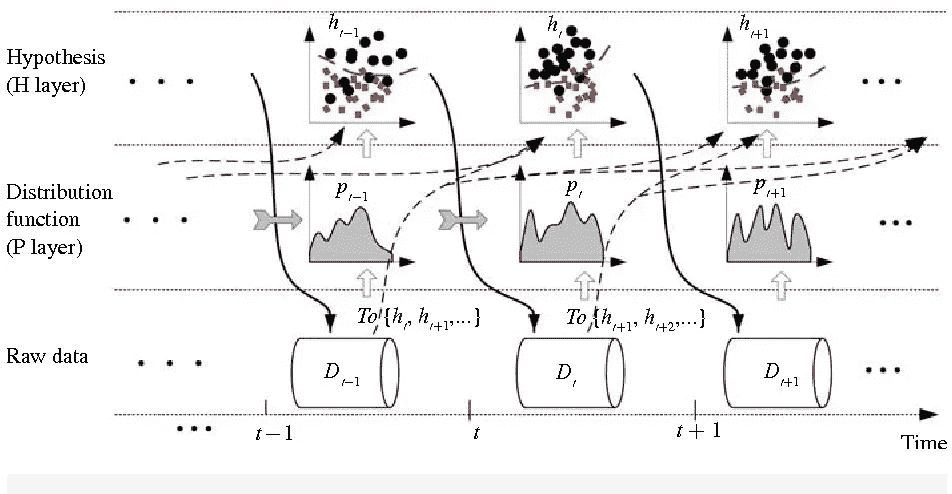
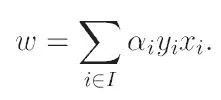

# 支持向量机的增量学习(ISVM)

> 原文：<https://medium.com/analytics-vidhya/incremental-learning-with-support-vector-machines-isvm-7d1c41a394bc?source=collection_archive---------2----------------------->

支持向量机是一种用于学习大量高维数据的流行工具。然而，有时从以前的 SVM 结果进行增量学习可能更好，因为计算 SVM 在时间和内存消耗方面非常昂贵，或者因为 SVM 可能用于在线学习设置。本文提出了一种基于支持向量机的增量学习方法，改进了现有的方法。实验证明，这种方法可以有效地处理增量学习设置导致的目标概念的变化。

我继续开发在线增量学习的主题，正如我在关于[“在线机器学习介绍](/danny-butvinik/https-medium-com-dannybutvinik-online-machine-learning-842b1e999880?source=friends_link&sk=b4c6815d2fe95263dd4f80aeea1ea258)”的文章中提到的从批量数据中增量学习的能力是一个重要的特性，它使得学习算法更适用于现实世界的问题。增量学习可用于将学习算法的内存和时间消耗保持在可管理的水平，或者因为需要在整个数据尚不可用时进行预测(在线设置)。增量学习的最重要的问题是，目标概念是否可能在学习步骤之间改变或者被假定为恒定的。第一种情况叫做概念漂移，第二种情况是真正的增量学习。这两种学习之间的实际区别是，在概念漂移设置中，旧的例子可能会误导，因为它们是旧的目标概念的例子，可能与人们试图学习的概念完全不同。在真正的增量学习的情况下，所有的例子都包含关于目标概念的相同信息。因此，人们可以简单地通过将增量学习算法的结果与作为黄金标准同时训练所有数据的学习算法的结果进行比较来判断增量学习算法的性能。本文将讨论增量学习。

支持向量机已经成功地用于学习大型和高维数据集。这是因为 SVM 的泛化属性不依赖于所有的训练数据，而仅仅依赖于其子集，即所谓的支持向量。不幸的是，支持向量机本身的训练非常耗时，尤其是在处理噪声数据时。由于与训练样本的数量相比，支持向量的数量通常非常小，因此通过将先前批次的数据压缩到其支持向量，支持向量机有望成为增量学习的有效工具。这种使用支持向量机进行增量学习的方法已经得到研究，并且已经表明，增量训练的支持向量机与其非增量训练的支持向量机相比表现非常好。

增量支持向量机学习中的漂移概念的问题已经得到解决，并且已经通过实验验证了在学习步骤期间结果的稳定性标准、训练过程中预测精度的提高以及从漂移概念导致的错误中的可恢复性方面，SVMs 很好地处理了漂移概念。处理漂移概念的另一种方法是使用性能估计器来检测基本概念是否发生漂移，此时旧数据被丢弃，而训练只在新数据上进行。

支持向量机
支持向量机(SVM)基于 Vladimir Vapnik 在统计学习理论方面的工作。统计学习理论处理的问题是，如何从一类函数中找到一个函数，使预期风险最小化

关于损失函数 L，当样本 P(x)和它们的分类 P(y|x)的分布未知并且必须从有限多个样本中估计时。

SVM 算法通过最小化正则化风险来解决这个问题，正则化风险是关于数据的经验风险和复杂性项的加权和

在它们的基本公式中，SVM 找到一个线性决策函数 y = f(x) = sign(w*x+b ),该函数既最小化了训练集的预测误差，又保证了最佳的泛化性能。给定示例(x1，y1)，…，(xn，yn)，这是通过解决以下优化问题来实现的:

使遭受

超平面向量 w 具有根据训练示例(xi，Yi)和它们的拉格朗日乘数(α_ I)的表示，这是在优化过程期间计算的:

手头学习问题的最佳常数 *C* 通常由某种模型选择技术确定，例如交叉验证。

# 新的增量学习算法

如上所述，SV-增量算法存在这样的问题，即支持向量不能描述整个数据集，而只能描述由数据集导出的决策函数。为了弥补增量学习算法中的这个问题，需要使旧支持向量(表示旧学习集)上的错误比新样本上的错误代价更高。幸运的是，这在支持向量算法中很容易实现。设(xi，易)是旧的支持向量，而(x’I，y’I)是新的样本。然后

SVM 问题的这种修正可以看作是训练 SVM 关于一个新的损失函数。对 *L* 的一个自然选择是让 *L* 是前一批中的样本数除以支持向量数。

这来自于通过仅在支持向量上的平均误差来近似任意决策函数的平均误差的想法。换句话说:每个支持向量代表所有例子的一个常数部分。该算法将被称为 SV-L-增量算法。