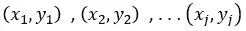

# 增量在线学习

> 原文：<https://medium.com/analytics-vidhya/incremental-online-learning-9868861db880?source=collection_archive---------1----------------------->

照片由 [Rei Kim](https://unsplash.com/@reigraphy?utm_source=medium&utm_medium=referral) 在 [Unsplash](https://unsplash.com?utm_source=medium&utm_medium=referral) 上拍摄

**摘要**

近年来，与完全数据可用性的传统假设相比，增量式和在线机器学习受到越来越多的关注，特别是在从实时数据流中学习的情况下。虽然有各种不同的方法可用，但通常仍然不清楚哪种方法适合于具体的任务，以及它们之间的比较表现如何。本文回顾了代表不同算法类的八种流行的增量方法。

**简介**

在我的[上一篇文章](/danny-butvinik/https-medium-com-dannybutvinik-online-machine-learning-842b1e999880?source=friends_link&sk=b4c6815d2fe95263dd4f80aeea1ea258)里，我讲的是在线机器学习入门。在这篇文章中，我将概述一些在线增量学习算法(或基于实例的增量学习)，也就是说，模型在每个实例到来时都进行学习。传统的批处理机器学习方法是同时访问所有数据，这种方法无法满足在给定时间内处理海量数据的要求，导致越来越多的累积数据无法处理。此外，它们不会不断地将新信息集成到已经构建好的模型中，而是有规律地从头开始重建新模型。这不仅非常耗时，而且可能导致模型过时。

要克服这种状况，需要在流式方案中实现向顺序数据处理的范式转变。这不仅允许我们在信息可用时立即使用信息，从而得到最新的模型，而且还降低了数据存储和维护的成本。

增量和在线算法自然适合这种方案，因为它们不断地将信息合并到它们的模型中，并且传统上以最小化处理时间和空间为目标。由于其连续大规模和实时处理的能力，它们最近获得了更多的关注，特别是在数据流的情况下。

增量算法也非常适合生产阶段以外的学习，这使得设备能够适应个别客户的习惯和环境。这对于金融机构来说尤其有趣，因为欺诈检测是金融犯罪的中心目的之一。 **NICE Actimize** —全球领先的犯罪监控、管理和预防公司，致力于实时检测欺诈行为。这是一个有数据流的时间序列环境。处理这样的任务是非常困难的，尤其是当你有高度不平衡的数据和与事实不符的问题时。只有极小比例的数据被认为是欺诈性的。其余的被认为是合法的，但不能保证合法数据中没有欺诈。这就是为什么试图用在线增量方法解决这个问题会改变这个领域的游戏规则。

这里的主要挑战不是大规模处理，而是从少量数据中进行连续有效的学习。尽管在这种情况下，增量学习可以被云中的重复批量学习所取代，但这种解决方案有着严重的缺陷。需要与云的永久连接来提供随时模型，这并不总是可行的。此外，由于隐私原因，客户可能不愿意提供关于他们日常生活的数据。因此，以有效的方式在设备上直接学习仍然是非常可取的。文献中关于增量学习和在线学习的定义有很多模糊之处。一些作者将它们互换使用，而另一些作者以不同的方式区分它们。额外的术语，如终身学习或进化学习，也被用作同义词。我们将增量学习算法定义为在给定的训练数据流上生成的算法

一系列模型

在我们的例子中，

和

一个模型函数仅仅依赖于

还有最近的 ***p*** 的例子

其中 ***p*** 受到严格限制。我们将在线学习算法指定为增量学习算法，其在模型复杂性和运行时间方面额外受限，能够在具有有限资源的设备上进行无止境/终身学习。

增量学习算法面临以下挑战:

*   该模型必须逐渐适应，即在没有完全再训练的基础上构建。
*   保存先前获得的知识，并且没有**灾难性遗忘**的影响。
*   只允许维护有限数量的 p 训练示例。

我们明确地假设数据被标记，但并不关注从未标记或部分标记的数据流中学习的关键场景。监督增量学习的设置可以应用于大多数预测场景。在这些情况下，在系统已经做出预测之后，真实的标签通常可以在一些延迟后被推断出来。

必须根据给定任务的前提条件来选择算法，因为不可能存在在每种情况下都最佳执行的方法。到目前为止，已经发表了不同的有趣的增量学习算法，它们具有各种优点和缺点。然而，只有少数来源提供了关于它们的信息，因为基本上没有比较性的深入研究，根据最相关的标准对最流行的方法进行实验比较。文献中的广泛研究通常会导致所考虑的算法的原始出版物。在本文中，我分析了一些在线增量方法的核心特性。

我的重点在于在线增量算法的监督学习下的分类。我主要在静态数据集上执行评估(即假设流

是独立同分布的)。然而，我在概念漂移的背景下对这些方法进行了简单的评估和讨论。

**算法**

**增量支持向量机(ISVM)** 是 SVM 最流行的精确增量版本，于([参见我在这里写的关于 ISVM 的文章](/danny-butvinik/incremental-learning-with-support-vector-machines-isvm-7d1c41a394bc?source=friends_link&sk=61fbda25a485031e53ac1c0c7b6b31e8))推出。此外，对于该组支持向量，维护有限数量的示例，即所谓的“候选向量”。这些示例可以根据将来的示例提升为支持向量。候选向量集越小，丢失潜在支持向量的概率越高。如果候选向量集包含所有之前看到的数据，ISVM 是一种无损算法，它会生成与相应的批处理算法相同的模型。

LASVM 是一个在线近似 SVM 解算器，在中提出。在另一种方式中，它检查当前处理的例子是否是支持向量，然后移除过时的支持向量。对于这两个步骤，它大量利用顺序方向搜索，因为它也是在顺序最小优化(SMO)算法中完成的。与 ISVM 相反，它不维护一组候选向量，而是仅将当前示例视为可能的支持向量。这导致一个近似的解决方案，但大大减少了训练时间。

**在线随机森林(ORF)** 是随机森林算法的增量版本。每当在一片叶子内收集到足够的样本时，通过添加分裂，预定数量的树就连续增长。不是计算局部最优分裂，而是根据极端随机树的方案测试预定数量的随机值。选择最能优化基尼系数的分割值。树集成由于其高准确性、简单性和并行化能力而非常受欢迎。此外，它们对特征缩放不敏感，并且可以容易地在实践中应用。

**增量学习矢量量化(ILVQ)** 是静态广义学习矢量量化(GLVQ)对动态增长模型的适应，在必要时插入新的原型。插入率由错误分类样本的数量决定。我们使用其中引入了原型放置策略的版本，该策略最小化了最近样本的滑动窗口上的损失。度量学习，如[38，39]中所述，也可用于进一步扩展分类能力。

**Learn++ (LPPCART)** 以预定义的大小分块处理传入的样本。对于每个组块，训练基本分类器的集合，并通过加权多数投票组合成“集合的集合”。与 AdaBoost [41]算法类似，每个分类器都使用根据分布绘制的块样本子集进行训练，确保误分类输入的样本概率更高。LPP 是一种与模型无关的算法，几种不同的基分类器如 SVM、分类回归树(CART)和多层感知器已经被作者成功地应用。作为原作者，我们使用流行的 CART 作为基本分类器。基于块的训练模型固有地结合了取决于块大小的自适应延迟。这种算法最近被使用。

**增量极限学习机(IELM)** 将批量 ELM 最小二乘解重构为顺序方案。作为批处理版本，它通过随机化输入权重大大降低了训练的复杂性。网络是静态的，隐藏神经元的数量必须预先确定。这种方法能够逐个或分块处理数据，从而显著减少了总的处理时间。然而，输出权重的有效初始化需要至少与所使用的隐藏神经元的数量一样多的例子。

**朴素贝叶斯(NBGauss)** 拟合每个类别的一个轴平行高斯分布，并将其用作朴素贝叶斯算法中的似然估计。稀疏模型允许在处理时间和存储器需求方面非常有效的学习。该算法从少量训练样本中高效学习，并已成功应用于现实世界中，如垃圾邮件过滤和文档分类。这种无损算法的主要缺点是特征的独立性假设以及它不能处理多模态分布。

**随机梯度下降(SGDLin)** 是一种通过最小化损失函数(如铰链损失或逻辑损失)来学习判别模型的有效优化方法。我们使用 SGD 通过最小化铰链损失函数来学习线性模型。最近在大规模学习的背景下复兴的 SGD 与线性模型相结合，对于在文本分类或自然语言处理领域中经常遇到的稀疏、高维数据表现得特别好。然而，每当需要非线性类边界时，线性模型就不适合，对于低维数据尤其如此。

尽管不断有新版本的算法被提出，我们认为所选择的方法反映了各自家族的一般性质。因此，本文的结论普遍适用于相应算法的当前和未来的变化。这一点在两种支持向量机中表现得尤为突出，两种支持向量机的性能非常相似，不同之处在于 LASVM 由于其近似的特性而能够处理稍大的数据集。然而，这两种方法在大数据集或噪声数据集方面都有相同的缺点。最近在中提出的 LASVM 版本也有这些缺点，尽管程度稍弱，因为引入了减少支持向量数量的机制。已经提出了 LPP 和 IELM 算法的各种扩展。他们中的大多数都是通过引入遗忘机制来处理非平稳环境。然而，本文的主要焦点是静态环境中的增量学习，在静态环境中，遗忘是相当有害的，并且会降低性能。

此外，算法的基本原理和相应的优缺点仍然存在。在 LPP 的例子中，一方面是任意基本分类器的灵活性，另一方面是跨组块的有限知识集成。加速 SGD 收敛的方法见。然而，在我们的实验中，SGD 算法获得的结果并不是因为 SGD 算法收敛缓慢，而是突出了线性模型的一般优势和局限性，例如模型复杂度低和线性类边界。

图 1:离线模式下评估批处理算法的经典方案

监督分类的学习目标是预测目标变量 y ∈ {1，.。。，c}给定一组特征。我们考虑两个 different 评估设置，它们允许关于算法性能的 different 方面的推断，并且一起提供甚至更深的洞察力。

**Offline 设定**

在 offline 设置中，批处理算法基于训练集生成模型 ***h***

在随后的测试阶段，该模型被应用于另一组

其标签是隐藏的。图 1 描述了这个过程。该模型预测一个标签

对于测试集中的每个点以及每个点的 0–1 损失

是计算出来的。测试集上的平均准确度使得能够根据对看不见的例子的概括能力进行分析。

图 2:在 off-line 环境中测试增量算法的过程。值得注意的是，只有最后构建的模型用于预测。训练集中使用的所有数据都是从 D 训练集中获得的。

在这种设置下，增量算法的评估是 different，如图 2 所示。它不是一次性访问所有训练数据，而是按照预先定义的顺序依次处理。该算法生成元组序列

相应的模型序列

因此，一个模型

完全基于先前构建的模型和有限数量的 ***p*** 最近元组

只有最后一个模型 ***hj*** 被应用于测试集以确定 offline 精度ξ

图 3:在线学习计划。数据没有分成训练集和测试集。相反，每个模型随后预测一个示例，该示例随后用于构建下一个模型。

因此，该设置只允许推断最后一个模型的泛化能力，而忽略所有前面的模型。这种评估在数据流方案中非常有用，例如，在数据流方案中，有大量的训练数据可用于持续地构建尽可能准确的模型。

**在线设置**

数据流分类通常在在线设置中进行评估，如图 3 所示。潜在的无限序列

元组的数量

一个接一个到达。由于 ***t*** 代表当前时间戳，学习的目的是预测相应的标签

对于给定的输入

这应该是未知的。预测

是根据先前学习的模型完成的

后来，真正的标签被揭露和丢失

下定决心。到当前时间 ***t*** 的序列的在线精度由下式给出

对先前设置的主要 difference 是所有中间模型都被考虑用于性能评估，但是它们中的每一个都只预测下面的例子。此外，用于训练和测试的数据不是严格分离的，而是每个实例最初用于模型测试，然后用于适应。

对于非平稳数据，高的在线精度不一定意味着模型的高泛化能力。例如，在标签的强自相关的情况下，简单地预测前一标签的算法实现了准确的结果，而无需学习数据中的任何结构。然而，对于 i.i.d .数据，增量算法的在线精度通常与所有构建模型的平均概括能力相关。在线准确度是一个合理的评估标准，用于需要即时预测的任务，即使在少量训练样本之后。

off-和在线两种精度的组合使得能够得出关于学习曲线的结论:在两个 different 模型 *A* 、**bt5】具有相同的 offline 精度，但是 ***A*** 具有更高的在线精度的情况下，意味着*平均比 ***B*** 收敛得更快，反之亦然。***

*因为这篇文章是对在线增量学习最流行的方法的一种概述，所以下一个系列的文章将更多地关注特定选择的算法。*

*参考*

*[1] Viktor Losing 等人，2018《增量在线学习:最先进算法的回顾与比较》。*

*[2] R. Ade 等人艾尔。，2013“增量学习方法:调查，国际。*

*[3] R .埃尔韦尔等人艾尔。，2011“非稳定环境中概念漂移的增量学习”。*

*[4] G. Ditzler 等人，2013“从流不平衡数据中增量学习概念漂移。*

*[5] Y. Ye 等，2013《在线顺序极限学习机*

*在不稳定的环境中。*

*[6] H. He 等，2011“流数据的增量学习。*