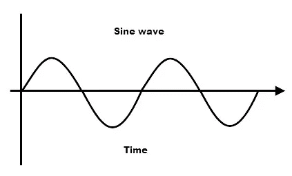
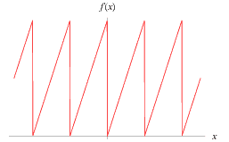
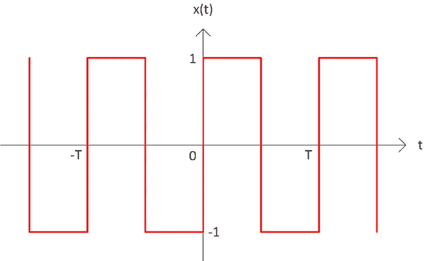
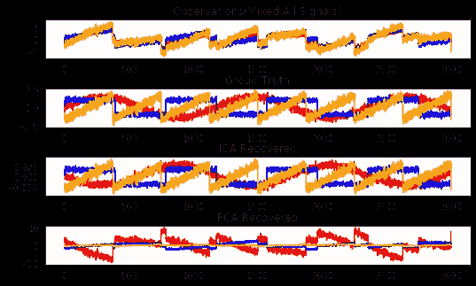

# 用于信号分解的独立分量分析

> 原文：<https://medium.com/analytics-vidhya/independent-component-analysis-for-signal-decomposition-3db954ffe8aa?source=collection_archive---------5----------------------->


独立分量分析是一种计算技术，用于将多元信号分解成可加的子分量。该方法的主要假设是所有信号源在统计上是独立的，并且不遵循高斯曲线。ICA 是盲源分离方法的一个特例。著名的“鸡尾酒会问题”之一——在嘈杂的房间里听到特定的一个人的声音，是一个常见的例子，被称为 ICA 算法的应用。

# **数学定义**

如果我们取统计上独立的信号源 **Sₖ** 其中 **k = { 1，2，3，…，n}** 和混合基向量 Aᵢₖ其中 i = {1，2，3，…，m}那么观察到的混合信号可以表示为 **Xᵢₖ = ∑ SₖAᵢₖ**

现在我将展示如何使用 Python 来生成信号，混合信号，然后分解它们。

首先，我们将主要引入**Numpy**(Python 的数学库) **Matplotlib** (用于显示图形) **Scikit-learn** (充实了机器学习工具和算法) **Scipy** (统计库)。

```
**import** **numpy** **as** **np**
**import** **matplotlib.pyplot** **as** **plt** 
**from** **sklearn.decomposition** **import** FastICA, PCA
**from** **scipy** **import** signalnp.random.seed(123)
n_samples = 3000                  *## for x axis* 
time = np.linspace(0,8,n_samples)  *## for y axis*
```

random.seed 有助于每次生成相同的随机样本。现在我们取 3000 个样本，用 numpy 的 linespace 函数在 Y 轴上绘制时间图。

现在我将使用内置函数生成三种不同类型的波。在这里，我选择了正弦波，方波和锯齿波进行实验。



正弦波



锯齿波



方波

我生成了三种信号 s1，s2，s3。

```
*## Generating Different Types of Signals* 

s1 = np.sin(2*time)                              *## Sinusoidal Wave* 
s2 = np.sign(np.sin(3*time))                        #*# Square Wave*
s3 = signal.sawtooth(2 * np.pi * time)             *## Saw tooth Wave*
```

现在，我将混合这些信号，并添加随机噪声，这在本质上是可加性的，遵循高斯分布。

```
S = np.c_[s1, s2, s3]  ## Mixing of Signals ( Ground Truth )
S += 0.2 * np.random.normal(size=S.shape) *# Adding Noise* 
```

现在将标准化数据并取一个基向量，该基向量将决定信号彼此混合的比例。将使用基向量 A 和信号混合物 S 的点积来产生观察混合物

```
*## Standardize the data* S /= S.std(axis=0)
*## Mixing the Data* 

A = np.array([[1,1,1],[0.5,2,1.0],[1.5,1.0,2.0]])   *## Mixing Matrix* *# Create the Observation Data for ICA* 

X = np.dot(S,A.T)
```

这里我使用 [FastICA](https://en.wikipedia.org/wiki/FastICA) 算法作为 ICA 模型。在拟合变换之后使用该模型将能够分别分解混合矩阵和信号混合物 A_ 和 S_

```
ica = FastICA(n_components=3)
S_ = ica.fit_transform(X)   *## Get Estimated Signals*

A_ = ica.mixing_
```

为了交叉验证，我现在将断言我们得到的结果与地面真相。我将让我的观众通过运行整个代码来分析结果。

```
*## Assertion for Proving that ICA Signals unmixing and Reverting*

**assert** np.allclose(X, np.dot(S_,A_.T)+ica.mean_)
```

我们还使用主成分分析计算了结果，以直观地显示 ICA 如何在混合信号的分解中表现得更好。

```
*## Computing PCA for Comparison*
pca = PCA(n_components=3)
H = pca.fit_transform(X)
```

为了直观地观察算法的工作结果，我用观察数据、地面实况、ICA、PCA 结果绘制了图表。

```
*## Plotting the results* 

plt.figure()
models = [X, S,S_,H]

names= ['Observations(Mixed All Signals)', 
        'Groud Truth','ICA Recovered', 'PCA Recovered']
colors = ['red', 'blue', 'orange']
**for** i, (model,name) **in** enumerate(zip(models,names), 1):
    plt.subplot(4,1,i)
    plt.title(name)
    **for** sig ,color **in** zip(model.T,colors):
        plt.plot(sig,color=color)

plt.subplots_adjust(0.39,0.54,1.5,1.5,1,0.76)
plt.show()
```



从直观的结果我们可以得出结论，独立分量分析是信号分解的最佳选择。因此，我们可以在音频信号降噪、图像降噪中使用这种技术，并从图像的叠加中分解不同的分量。

今天到此为止。！！！！！！！！！

我保证我会拿出这种小信息算法和技术作为我的读者的快速指南。要获取更新，请关注我。

非常感谢你的时间。