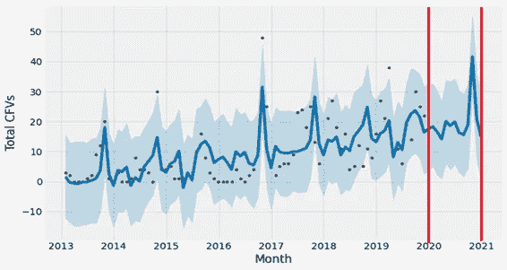
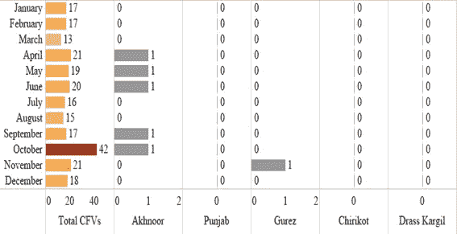

# 印度可以部署机器学习来扑灭违反停火协议的行为

> 原文：<https://medium.com/analytics-vidhya/india-can-deploy-machine-learning-to-douse-ceasefire-violations-7063050437ed?source=collection_archive---------33----------------------->

以下是研究数据将如何告诉你 cfv 不是零星的！

来自*indopakconflictmonitor.org*的画廊

当在控制线和国际边界沿线发生违反停火事件时，这种事件被认为只是零星的，违反了两国之间的书面协议。在我们的研究中，我们旨在通过对印巴控制线沿线 cfv 数量的预测来弥补知识缺口，使用 python 来识别最佳模型(SARIMA vs Prophet ),使用 Tableau 等数据可视化工具来识别易受影响的区域。我们的研究对印度军事专家来说是有用的，他们可以提前更好地准备应对即将到来的大规模杀伤性武器。我们的模型可以用来设计防御策略。

**图一。这张地图描绘了争议地区查谟&克什米尔，包括印度和巴基斯坦之间的控制线和国际边界。**

**如果你对深入研究代码感兴趣，请访问下面的链接**

## [https://github.com/jatinkataria94/Ceasefire-Violations](https://github.com/jatinkataria94/Ceasefire-Violations)

# 数据来源

该研究依赖于印巴冲突监测中心(*indopakconflictmonitor.org*)的日期(具体日期)数据。我们运行 SQL 查询来按月分组相同的数据。

# 钻研数据

indopakconflictmonitor.org 网站仅从媒体报道中收集数据。然而，作为媒体来源的国防部不提供日期和部门数据，因为它只提供年度累计数字。即使这项研究是基于有限的数据，我们的模型对任何给定的数据都是有效的。我们从 2013 年开始考虑 cfv，因为从那时起它们的总数急剧增加。

**图二。**2013 年 1 月至 2019 年 12 月期间发生的违反停火事件总数。

2016 年 10 月，违反停火事件出现异常激增(**图 2** )。这可能是对印度在 2016 年 9 月进行的外科手术式打击的回应。另一个有趣的观察结果是，10 月份是 2013 年、2014 年、2016 年和 2019 年 cfv 数量最多的时候，在夏季(4 月、5 月、6 月和 7 月)可以看到数量下降。这些观察让我们相信，违规是有规律的，而不是完全随机的。

# 构建预测模型

分析时间序列是一种统计方法，通过检测任何潜在的模式，并根据过去的观察预测时间范围内的值，同时考虑到发现的趋势，来了解时间索引数据。预测任何时间序列数据的先决条件是它应该是一个平稳序列。在平稳的时间序列中，均值和方差等参数保持不变。它们不随时间变化。因此，如果时间序列不是平稳的，那么就有必要将其转换成平稳的时间序列，以便用模型来拟合它。两个时间序列模型——季节性自回归综合移动平均(SARIMA)和脸书的 Prophet 用于拟合 CFVs 数据。对给定数据集(2013 年 1 月-2019 年 12 月)进行了模型验证，以确定两个模型中哪一个最适合。请注意，实际数据集以 80:20 的比例分开，分别作为训练和测试。

# 萨里玛模型

SARIMA 模型用于研究任何包含季节性成分的时间序列。它克服了 ARIMA 的局限性，除了时间序列数据中的趋势分量之外，还明确地考虑了额外的季节分量。SARIMA 模型的常用符号是 SARIMA(p，D，q)(P，D，Q)[S]，其中 P，D，Q，P，D，Q，S 都是模型的超参数，可以对其进行调整以获得最优解。“s”对应于季节性周期，“D”和“D”分别对应于趋势和季节性分量的差分顺序(用于使时间序列平稳)。p(自回归)和 q(移动平均)分别对应于趋势分量的滞后序列和预测误差项。“p 和 Q”类似于“p 和 Q”，除了它们是季节性成分。

SARIMA 建模是用 Python 编程语言完成的。采用 Box-Jenkins 方法建立模型，该模型有一个给定的步骤:

(1)检验时间序列的平稳性；

(2)建立试验模型；

(3)估计试验模型的参数；

(4)评估模型的有效性，否则，执行步骤 2；

(5)使用构建的模型进行预测。

# 平稳性测试

使用 Dickey-Fuller 检验的平稳性检验:在这个统计检验中，零假设是序列是非平稳的。为了使零假设为真，**测试统计量**的有符号值必须大于为不同置信水平计算的**临界值**的有符号值。

**图三。**原始时间序列的平稳性检验。

***迪基-富勒试验结果:***

测试统计-4.925127

p 值 0.000031

#使用的滞后数为 0.000000

使用的观察次数 83.000000

临界值(1%) -3.511712

临界值(5%) -2.897048

临界值(10%) -2.585713

结果汇总显示，**‘检验统计量’<‘临界值’(1%)。因此，我们可以拒绝零假设，时间序列可以被认为是平稳的。因此，不需要差分。**

**图四。**原始时间序列分解图。

从分解的序列中我们可以看到，12 个月有明显的季节性，至于趋势，没有一致的积极趋势，因此不需要差异(d=0)。我们可以看到趋势和季节性从数据中分离出来，现在我们可以检查残差的平稳性:

**图五。**残差的平稳性检验。

***迪基-富勒试验结果:***

测试统计-4.642600

p 值 0.000108

使用的滞后数 11.000000

使用的观察次数 60.000000

临界值(1%) -3.544369

临界值(5%) -2.911073

临界值(10%) -2.593190

**检验统计< 1%临界值**。所以，这个残差序列可以被认为是平稳的。

**图 6。**萨里玛模型诊断。

模型诊断图表明了残差接近正态分布的事实，在去除趋势和季节性后确实应该是这种情况。

## 模型评估

在我们的研究中，使用 ACF/PACF 和分解图选择了一系列值作为 SARIMA 参数。

**图 7。** ACF/PACF 图寻找萨里玛参数。

从分解图中，我们可以看到趋势并不完全恒定，因此我们可以预期非零趋势顺序(p，q)项。从 ACF 和 PACF 图中也可以看出这一点，p=q=(0，1)。

采用网格搜索法寻找最佳参数值，并使用赤池信息准则(AIC)仔细检查模型。AIC 是一种选择最佳模型的方法，可以平衡过度拟合和欠拟合的缺点。

在获得优化的模型后，将其拟合到训练数据集。随后，使用均方根误差(RMSE)和平均绝对误差(MAE)指标对测试数据进行验证。

该模型的最佳参数为:([(1，0，1)，(1，1，1)[12]]，AIC-432.688)。具有最低 AIC 值的 SARIMA (1，0，1) (1，1，1) [12]被选为最佳拟合模型。使用上述参数，在测试数据集上验证模型(**图 8** )。

**图 8。**该图显示了实际违反停火情况与测试数据滚动预测之间的对比，以验证 SARIMA 模型。

# 先知模型

Prophet 建模是用 Python 编程语言完成的。

Prophet 使用以下等式来表示任何给定的时间序列数据:

y(t)=g(t)+s(t)+h(t)+εt

在任何给定的时间序列数据中，该模型将其分为四个部分:

(1) g(t)是识别非周期性变化的增长函数；

(2) s(t)代表季节性(例如，每周、每年、季节性等。);

(3) h(t)指定由节假日等触发的波动。；

(4) εt 表示随机噪声。

## 模型评估

一旦建立了 Prophet 模型，就用它来拟合训练数据。随后，使用均方根误差(RMSE)和平均绝对误差(MAE)指标对测试数据进行验证(**图 9** )。

**图九。**该图显示了实际违反停火情况与测试数据预测之间的对比，以验证 Prophet 模型(黑点代表实际数据，而蓝色实线代表预测数据)。

**图十。**这描述了原始时间序列的总体趋势和季节性(每年)。

# 萨里玛和先知的模型比较

一旦这两个模型用于训练和测试数据集，就可以将推导出的预测值与实际值进行比较(**表 1** )。为了选择最适合的模型，训练和测试数据的误差度量应该很低，并且彼此尽可能接近(表示可以很好地预测样本数据的一般化模型)。

***表 1。*** 先知和萨里玛模特的表现。

因此，**表 1** 表明 Prophet 模型在我们的数据集上比 SARIMA 表现得更好。SARIMA 模型的测试误差明显高于训练误差，表明模型过度拟合。

# 使用 Prophet 预测总 cfv

一旦模型得到验证，它就被用于预测未来 12 个月(2020 年 1 月-2020 年 12 月)可能发生的 cfv(**图 11** )。阴影(蓝色)区域表示 95%的置信区间。

**图 11。**使用训练好的 Prophet 模型预测未来 12 个月(2020 年 1 月-2020 年 12 月)的违反停火事件。垂直红线代表预测范围。

***表二。*** 未来 12 个月(2020 年 1 月-2020 年 12 月)可能发生的违反停火事件总数。

从**图 11** 和**表 2** 中可以观察到，10 月期间违反停火的可能性最高(显著增加)。

# 使用 Prophet 预测行业 cfv

为了制定防御策略，我们需要更深入地挖掘，使用 Tableau ( **图 12** )查看实际的行业数据。11 个区在过去的某个时候出现过集体暴力事件，即 Poonch、Rajouri、Jammu、Kupwara、uri、Kathua、Akhnoor、Punjab、Gurez、Chirikot 和 Drass-Kargil。

**图 12。**所有部门每月报告的 cfv 数量(2013 年 1 月至 2019 年 12 月)。

从**图 12** ，根据 2013 年 1 月至 2019 年 12 月期间报告的违反停火事件，可以看到六大热点地区，即 Poonch、Rajouri、Jammu、Kupwara、uri 和 Kathua 区。Poonch 部门是所有部门中最容易发生的，因为它几乎每个月都报告最大数量的 cfv。Poonch 之后是 Rajouri，以第二的位置作为热点。这是从 2013 年 1 月到 2019 年 12 月的过去七年中观察到的一致特征。Poonch 区在 9 月和 10 月的 cfv 最高，Rajouri 区在 2 月和 3 月，Jammu IB 区在 10 月，Kupwara 区在 8 月和 7 月，Kathua 区在 10 月。

**图十三*。*** 违反停火的热点地区(见图 12)。*来源-https://mapme . com*

**图 12 和图 13** 仅显示了过去的扇形数据可视化。为了制定战略，对未来 12 个月(2020 年 1 月-2020 年 12 月)的行业 cfv 进行了预测。使用 Prophet 模型将部门 cfv 建模为并行运行的多个单变量时间序列。

这是拉久里区的一个例子。要查看其他部分，请向下滚动到本文的底部。

然后使用 Tableau 可视化每个部门的预测值。

**图 14。**所有行业(2020 年 1 月至 2020 年 12 月)每月预测的 cfv 数量。

从图 14 中，确定了六大热点地区，即 Poonch、Rajouri、Jammu、Kupwara、uri 和 Kathua 区。请注意，即使在报告的 cfv 中，这也是一个一致的特征，其中相同的六个扇区是热点(**图 12** )。

根据预测数据，Poonch 和 Rajouri 似乎是所有部门中最脆弱的。Poonch 在 10 月的 cfv 最高，而 Rajouri 在 11 月，Jammu IB 在 10 月，Kupwara 在 10 月，uri 在 8 月，Kathua 在 10 月。这一预测的有趣特征似乎是，几乎所有六大行业在 10 月份都出现了不同寻常的飙升。此外，在所有预测月份中，旁遮普、古雷兹、奇里科特和德拉斯卡尔吉尔地区几乎没有观察到 cfv。因此，**图 12** 中报告的 cfv 似乎是这些行业中的孤立事件。

# 地图设计你自己的防御策略

作为我们建立的模型和数据分析的结果，我们创建了一个地图，可用于构建任何给定时间点的明智防御策略。

尽管目前的研究只验证了小样本规模的违反停火行为，但所采用的模型适用于任何样本规模。由于在 LoC 定期进行几项 cfv，时间序列数据除了提供基于季节性的信息外，还描绘了一幅年复一年重复出现的可预测变化的清晰画面。我们的观察指出了 cfv 的一种特定模式，它们并不像所认为的那样是零星的，因此我们可以建立如下防御策略:

例如，让我们考虑 2020 年 10 月(42 个预测的 cfv)和 2020 年 11 月(21 个预测的 cfv)。如果说 Poonch、Jammu 和 Rajouri 地区在 10 月份出现了高峰，那么 11 月份 Rajouri 和 Poonch 地区也出现了高峰(**图 14** )。

为了在恐怖袭击频繁的日子里战胜渗透，我们的军事专家可以加强他们的战略，加强对边境的警戒，监视那些被认为容易渗透和难以进入的地区。另一方面，观察孤立情况的部门，如旁遮普、古雷兹、奇里科特和德拉斯卡尔吉尔，可以优化人力资源，使用无人机作为主要的监视武器。在巡逻队人数最多的日子里，人工巡逻将有助于挫败渗透企图。

**行业预测图**

# 在你走之前

***感谢*** *的阅读！如果你有任何困难或疑问，请在下面评论。非常感谢你的支持。如果你想和我联系，打 jatin.kataria94@gmail.com 找我。*